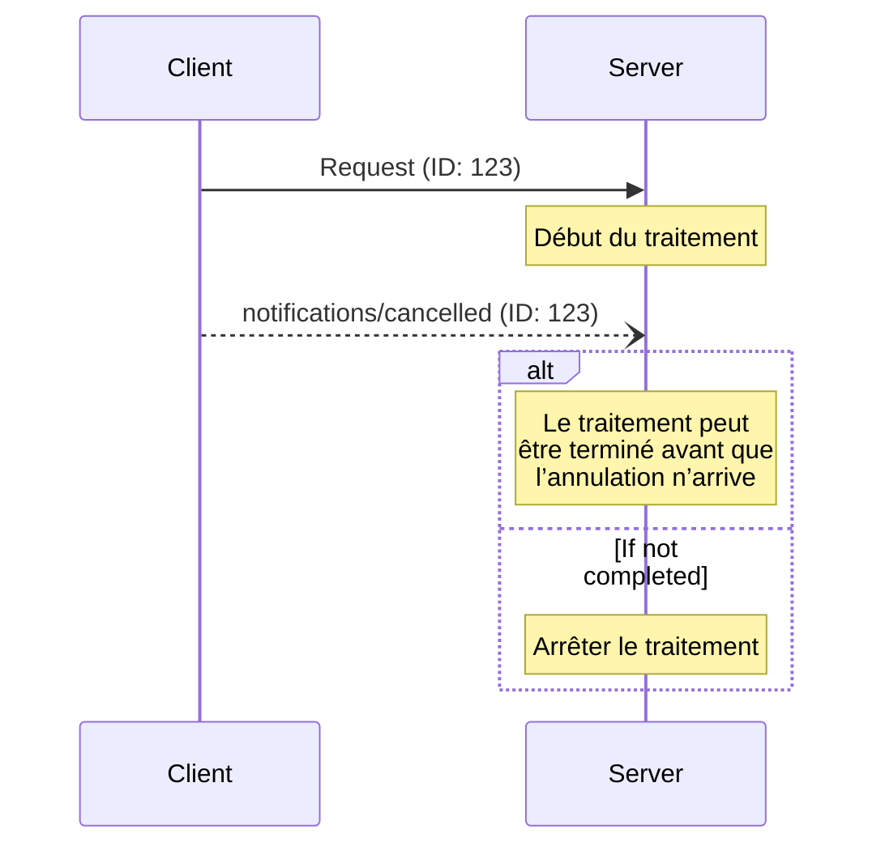

<div id="enable-section-numbers" />

<Info>**Révision du protocole** : brouillon</Info>

Le Protocole de contexte de modèle (MCP) prend en charge l’annulation optionnelle des requêtes en cours au moyen de messages de notification. L’une ou l’autre des parties peut envoyer une notification d’annulation pour indiquer qu’une requête précédemment émise doit être interrompue.

<div id="cancellation-flow">
  ## Flux d’annulation
</div>

Lorsqu’une partie souhaite annuler une requête en cours, elle envoie une notification `notifications/cancelled`
contenant :

- L’ID de la requête à annuler
- Une chaîne facultative indiquant la raison, qui peut être consignée ou affichée

```json
{
  "jsonrpc": "2.0",
  "method": "notifications/cancelled",
  "params": {
    "requestId": "123",
    "reason": "Annulation demandée par l’utilisateur"
  }
}
```

<div id="behavior-requirements">
  ## Exigences de comportement
</div>

1. Les notifications d’annulation **DOIVENT** uniquement faire référence à des requêtes qui :
   - Ont été précédemment émises dans la même direction
   - Sont présumées toujours en cours
2. La requête `initialize` **NE DOIT PAS** être annulée par les clients
3. Les destinataires des notifications d’annulation **DEVRAIENT** :
   - Arrêter le traitement de la requête annulée
   - Libérer les ressources associées
   - Ne pas envoyer de réponse pour la requête annulée
4. Les destinataires **PEUVENT** ignorer les notifications d’annulation si :
   - La requête référencée est inconnue
   - Le traitement est déjà terminé
   - La requête ne peut pas être annulée
5. L’expéditeur de la notification d’annulation **DEVRAIT** ignorer toute réponse à la
   requête qui arriverait par la suite

<div id="timing-considerations">
  ## Considérations de temporisation
</div>

En raison de la latence réseau, les avis d’annulation peuvent arriver après la fin du traitement
de la requête et, potentiellement, après qu’une réponse a déjà été envoyée.

Les deux parties **DOIVENT** gérer ces conditions de course avec souplesse :



<div id="implementation-notes">
  ## Notes d’implémentation
</div>

- Les deux parties **DEVRAIENT** consigner les motifs d’annulation à des fins de débogage
- L’interface utilisateur de l’application **DEVRAIT** indiquer lorsqu’une annulation est demandée

<div id="error-handling">
  ## Gestion des erreurs
</div>

Les notifications d’annulation invalides **DEVRAIENT** être ignorées :

- Identifiants de requête inconnus
- Requêtes déjà terminées
- Notifications mal formées

Cela préserve le caractère « feu et à oublier » des notifications tout en gérant les conditions de course dans la communication asynchrone.