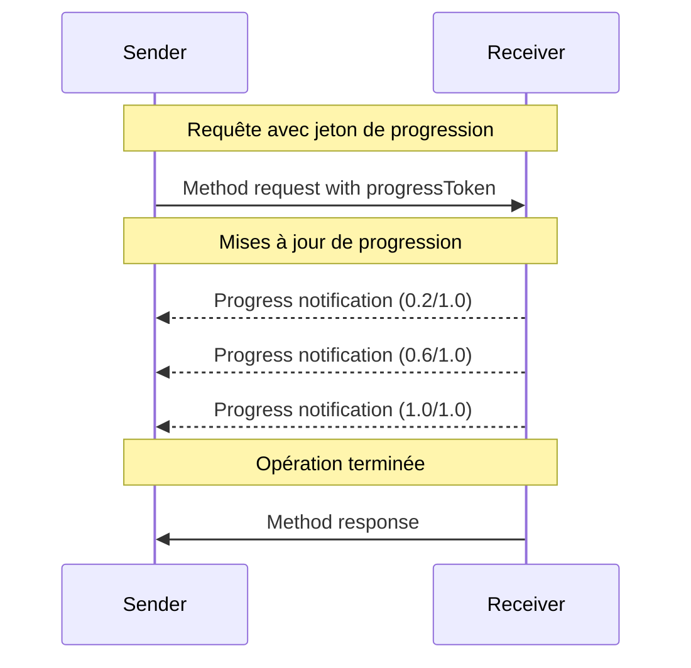

<div id="enable-section-numbers" />

<Info>**Révision du protocole** : brouillon</Info>

Le Protocole de contexte de modèle (MCP) prend en charge le suivi de progression facultatif pour les opérations de longue durée au moyen de messages de notification. Chaque côté peut envoyer des notifications de progression afin de fournir des mises à jour sur l’état de l’opération.

<div id="progress-flow">
  ## Flux de progression
</div>

Lorsqu’une partie souhaite _recevoir_ des mises à jour d’avancement pour une requête, elle inclut un `progressToken` dans les métadonnées de la requête.

- Les jetons de progression **DOIVENT** être une valeur de type chaîne de caractères ou entier
- Les jetons de progression peuvent être choisis par l’expéditeur par n’importe quel moyen, mais **DOIVENT** être uniques
  pour l’ensemble des requêtes actives.

```json
{
  "jsonrpc": "2.0",
  "id": 1,
  "method": "some_method",
  "params": {
    "_meta": {
      "progressToken": "abc123"
    }
  }
}
```

Le destinataire **PEUT** ensuite envoyer des notifications d’avancement contenant :

- Le jeton de progression d’origine
- La valeur d’avancement actuelle
- Une valeur « total » optionnelle
- Une valeur « message » optionnelle

```json
{
  "jsonrpc": "2.0",
  "method": "notifications/progress",
  "params": {
    "progressToken": "abc123",
    "progress": 50,
    "total": 100,
    "message": "Reticulating splines..."
  }
}
```

- La valeur `progress` **DOIT** augmenter à chaque notification, même si le total est inconnu.
- Les valeurs `progress` et `total` **PEUVENT** être en virgule flottante.
- Le champ `message` **DEVRAIT** fournir des informations pertinentes et lisibles par l’humain sur l’avancement.

<div id="behavior-requirements">
  ## Exigences relatives au comportement
</div>

1. Les notifications de progression **DOIVENT** uniquement faire référence à des jetons qui :
   - Ont été fournis dans une requête active
   - Sont associés à une opération en cours

2. Les destinataires des requêtes de progression **PEUVENT** :
   - Choisir de ne pas envoyer de notifications de progression
   - Envoyer des notifications à la fréquence qu’ils jugent appropriée
   - Omettre la valeur totale si elle est inconnue



<div id="implementation-notes">
  ## Notes d’implémentation
</div>

- Les expéditeurs et les récepteurs **DEVRAIENT** suivre les jetons de progression actifs
- Les deux parties **DEVRAIENT** mettre en place une limitation du débit pour éviter la saturation
- Les notifications de progression **DOIVENT** cesser une fois l’opération terminée