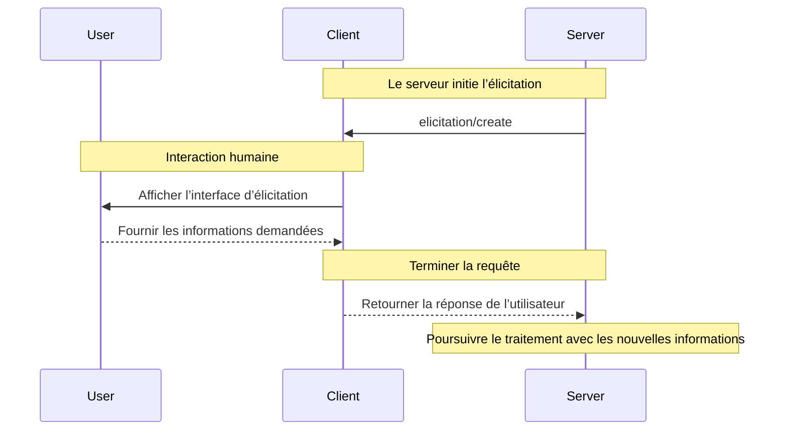

<div id="enable-section-numbers" />

<Info>**Révision du protocole** : brouillon</Info>

<Note>
  L’élicitation est nouvellement introduite dans cette version de la spécification du Protocole de contexte de modèle (MCP) et sa conception pourrait évoluer dans de futures versions du protocole.
</Note>

Le Protocole de contexte de modèle (MCP) fournit une façon normalisée pour les serveurs de demander, par l’entremise du client, des renseignements supplémentaires aux utilisateurs durant les interactions. Ce déroulement permet aux clients de conserver le contrôle des interactions avec l’utilisateur et du partage des données, tout en permettant aux serveurs de recueillir dynamiquement les renseignements nécessaires.
Les serveurs demandent des données structurées aux utilisateurs à l’aide de schémas JSON afin de valider les réponses.

<div id="user-interaction-model">
  ## Modèle d’interaction utilisateur
</div>

L’Élicitation dans le MCP permet aux serveurs de mettre en place des flux de travail interactifs en autorisant des demandes de saisie utilisateur *imbriquées* dans d’autres fonctionnalités de Serveur MCP.

Les implémentations sont libres d’exposer l’Élicitation selon tout modèle d’interface qui répond à leurs besoins — le protocole lui-même n’impose aucun modèle d’interaction utilisateur particulier.

<Warning>
  Pour des raisons de confiance, de sûreté et de sécurité :

  * Les serveurs **NE DOIVENT PAS** utiliser l’Élicitation pour demander des renseignements sensibles.

  Les applications **DEVRAIENT** :

  * Offrir une interface qui indique clairement quel serveur demande des renseignements
  * Permettre aux utilisateurs de revoir et de modifier leurs réponses avant l’envoi
  * Respecter la vie privée des utilisateurs et offrir des options claires pour refuser et annuler
</Warning>

<div id="capabilities">
  ## Capacités
</div>

Les clients qui prennent en charge l’élicitation **DOIVENT** déclarer la capacité `elicitation` lors de
[l’initialisation](/fr-CA/specification/draft/basic/lifecycle#initialization) :

```json
{
  "capabilities": {
    "elicitation": {}
  }
}
```

<div id="protocol-messages">
  ## Messages du protocole
</div>

<div id="creating-elicitation-requests">
  ### Création de demandes d’élicitation
</div>

Pour demander des informations à un utilisateur, les serveurs envoient une requête `elicitation/create` :

<div id="simple-text-request">
  #### Requête de texte simple
</div>

**Requête :**

```json
{
  "jsonrpc": "2.0",
  "id": 1,
  "method": "elicitation/create",
  "params": {
    "message": "Veuillez indiquer votre nom d’utilisateur GitHub",
    "requestedSchema": {
      "type": "object",
      "properties": {
        "name": {
          "type": "string"
        }
      },
      "required": ["name"]
    }
  }
}
```

**Réponse :**

```json
{
  "jsonrpc": "2.0",
  "id": 1,
  "result": {
    "action": "accept",
    "content": {
      "name": "octocat"
    }
  }
}
```

<div id="structured-data-request">
  #### Demande de données structurées
</div>

**Demande :**

```json
{
  "jsonrpc": "2.0",
  "id": 2,
  "method": "elicitation/create",
  "params": {
    "message": "Veuillez fournir vos coordonnées",
    "requestedSchema": {
      "type": "object",
      "properties": {
        "name": {
          "type": "string",
          "description": "Votre nom complet"
        },
        "email": {
          "type": "string",
          "format": "email",
          "description": "Votre adresse courriel"
        },
        "age": {
          "type": "number",
          "minimum": 18,
          "description": "Votre âge"
        }
      },
      "required": ["name", "email"]
    }
  }
}
```

**Réponse :**

```json
{
  "jsonrpc": "2.0",
  "id": 2,
  "result": {
    "action": "accept",
    "content": {
      "name": "Monalisa Octocat",
      "email": "octocat@github.com",
      "age": 30
    }
  }
}
```

**Exemple de réponse — refus :**

```json
{
  "jsonrpc": "2.0",
  "id": 2,
  "result": {
    "action": "decline"
  }
}
```

**Exemple de réponse — annulation :**

```json
{
  "jsonrpc": "2.0",
  "id": 2,
  "result": {
    "action": "cancel"
  }
}
```

<div id="message-flow">
  ## Flux de messages
</div>



<div id="request-schema">
  ## Schéma de requête
</div>

Le champ `requestedSchema` permet aux serveurs de définir la structure de la réponse attendue au moyen d’un sous-ensemble restreint de JSON Schema. Pour simplifier l’expérience utilisateur du côté client, les schémas d’élicitation se limitent à des objets plats ne contenant que des propriétés primitives :

```json
"requestedSchema": {
  "type": "object",
  "properties": {
    "propertyName": {
      "type": "string",
      "title": "Nom d’affichage",
      "description": "Description de la propriété"
    },
    "anotherProperty": {
      "type": "number",
      "minimum": 0,
      "maximum": 100
    }
  },
  "required": ["propertyName"]
}
```

<div id="supported-schema-types">
  ### Types de schémas pris en charge
</div>

Le schéma est limité aux types primitifs suivants :

1. **Schéma de chaîne**

   ```json
   {
     "type": "string",
     "title": "Display Name",
     "description": "Description text",
     "minLength": 3,
     "maxLength": 50,
     "pattern": "^[A-Za-z]+$",
     "format": "email",
     "default": "user@example.com"
   }
   ```

   Formats pris en charge : `email`, `uri`, `date`, `date-time`

2. **Schéma numérique**

   ```json
   {
     "type": "number", // or "integer"
     "title": "Display Name",
     "description": "Description text",
     "minimum": 0,
     "maximum": 100,
     "default": 50
   }
   ```

3. **Schéma booléen**

   ```json
   {
     "type": "boolean",
     "title": "Display Name",
     "description": "Description text",
     "default": false
   }
   ```

4. **Schéma d’énumération**
   ```json
   {
     "type": "string",
     "title": "Display Name",
     "description": "Description text",
     "enum": ["option1", "option2", "option3"],
     "enumNames": ["Option 1", "Option 2", "Option 3"],
     "default": "option1"
   }
   ```

Les clients peuvent utiliser ce schéma pour :

1. Générer des formulaires de saisie adaptés
2. Valider les entrées des utilisateurs avant l’envoi
3. Fournir de meilleures indications aux utilisateurs

Tous les types primitifs prennent en charge des valeurs par défaut optionnelles pour offrir des points de départ pertinents. Les clients qui prennent en charge les valeurs par défaut DEVRAIENT préremplir les champs de formulaire avec ces valeurs.

À noter : les structures imbriquées complexes, les tableaux d’objets et d’autres fonctionnalités avancées de JSON Schema ne sont délibérément pas pris en charge afin de simplifier l’expérience utilisateur côté client.

<div id="response-actions">
  ## Actions de réponse
</div>

Les réponses d’Élicitation utilisent un modèle à trois actions pour distinguer clairement les différentes actions de l’utilisateur :

```json
{
  "jsonrpc": "2.0",
  "id": 1,
  "result": {
    "action": "accept", // ou "decline" ou "cancel"
    "content": {
      "propertyName": "value",
      "anotherProperty": 42
    }
  }
}
```

Les trois actions de réponse sont :

1. **Accept** (`action: "accept"`) : L’utilisateur a explicitement approuvé et soumis des données
   * Le champ `content` contient les données soumises correspondant au schéma demandé
   * Exemple : l’utilisateur a cliqué sur « Submit », « OK », « Confirm », etc.

2. **Decline** (`action: "decline"`) : L’utilisateur a explicitement refusé la demande
   * Le champ `content` est généralement omis
   * Exemple : l’utilisateur a cliqué sur « Reject », « Decline », « No », etc.

3. **Cancel** (`action: "cancel"`) : L’utilisateur a fermé ou quitté sans faire de choix explicite
   * Le champ `content` est généralement omis
   * Exemple : l’utilisateur a fermé la boîte de dialogue, a cliqué à l’extérieur, a appuyé sur Échap, etc.

Les serveurs MCP devraient gérer chaque état de façon appropriée :

* **Accept** : Traiter les données soumises
* **Decline** : Gérer le refus explicite (p. ex., proposer des alternatives)
* **Cancel** : Gérer l’annulation (p. ex., relancer plus tard)

<div id="security-considerations">
  ## Considérations de sécurité
</div>

1. Les serveurs **NE DOIVENT PAS** demander des renseignements sensibles par l’entremise de l’élicitation
2. Les clients **DEVRAIENT** mettre en place des contrôles d’approbation par l’utilisateur
3. Les deux parties **DEVRAIENT** valider le contenu d’élicitation par rapport au schéma fourni
4. Les clients **DEVRAIENT** indiquer clairement quel serveur demande des renseignements
5. Les clients **DEVRAIENT** permettre aux utilisateurs de refuser les demandes d’élicitation en tout temps
6. Les clients **DEVRAIENT** mettre en place une limitation du débit
7. Les clients **DEVRAIENT** présenter les demandes d’élicitation de façon à préciser quels renseignements sont demandés et pourquoi