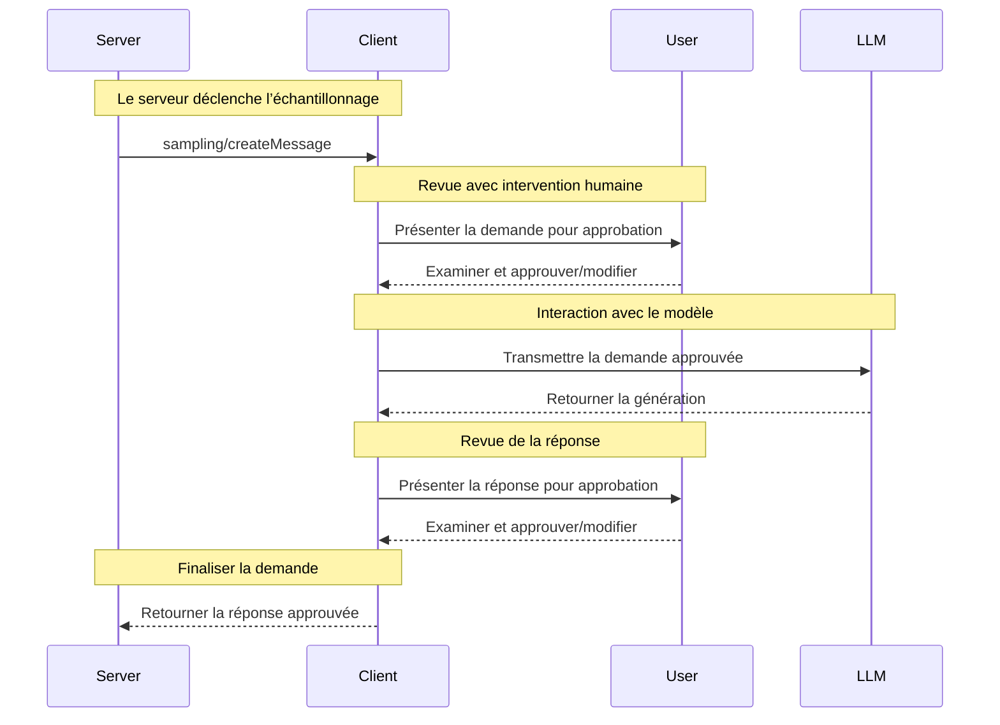

<div id="enable-section-numbers" />

<Info>**Révision du protocole** : ébauche</Info>

Le Protocole de contexte de modèle (MCP) fournit une méthode normalisée permettant aux serveurs de demander l’échantillonnage (« complétions » ou « générations ») auprès de modèles linguistiques via des clients. Ce processus permet aux clients de conserver le contrôle sur l’accès aux modèles, leur sélection et les autorisations, tout en permettant aux serveurs de tirer parti des capacités de l’IA — sans clés d’API côté serveur. Les serveurs peuvent demander des interactions en texte, en audio ou en image et, au besoin, inclure du contexte provenant des serveurs MCP dans leurs invites.

<div id="user-interaction-model">
  ## Modèle d’interaction utilisateur
</div>

L’Échantillonnage dans le MCP permet aux serveurs de mettre en œuvre des comportements d’agent, en autorisant les appels LLM à se produire de façon *imbriquée* à l’intérieur d’autres fonctionnalités de Serveur MCP.

Les implémentations sont libres d’exposer l’Échantillonnage via tout modèle d’interface qui convient à leurs besoins—le protocole lui-même n’impose aucun modèle d’interaction utilisateur précis.

<Warning>
  Pour des raisons de confiance et de sécurité, il **FAUT** toujours
  qu’une personne soit dans la boucle avec la possibilité de refuser les demandes d’Échantillonnage.

  Les applications **DEVRAIENT** :

  * Fournir une interface qui facilite et rend intuitif l’examen des demandes d’Échantillonnage
  * Permettre aux utilisateurs d’afficher et de modifier les Invites avant l’envoi
  * Présenter les réponses générées pour examen avant la livraison
</Warning>

<div id="capabilities">
  ## Capacités
</div>

Les clients qui prennent en charge l’Échantillonnage **DOIVENT** déclarer la capacité `sampling` lors de
[l’initialisation](/fr-CA/specification/draft/basic/lifecycle#initialization) :

```json
{
  "capabilities": {
    "sampling": {}
  }
}
```

<div id="protocol-messages">
  ## Messages du protocole
</div>

<div id="creating-messages">
  ### Création de messages
</div>

Pour demander une génération à un modèle de langue, les serveurs envoient une requête `sampling/createMessage` :

**Requête :**

```json
{
  "jsonrpc": "2.0",
  "id": 1,
  "method": "sampling/createMessage",
  "params": {
    "messages": [
      {
        "role": "user",
        "content": {
          "type": "text",
          "text": "What is the capital of France?"
        }
      }
    ],
    "modelPreferences": {
      "hints": [
        {
          "name": "claude-3-sonnet"
        }
      ],
      "intelligencePriority": 0.8,
      "speedPriority": 0.5
    },
    "systemPrompt": "You are a helpful assistant.",
    "maxTokens": 100
  }
}
```

**Réponse :**

```json
{
  "jsonrpc": "2.0",
  "id": 1,
  "result": {
    "role": "assistant",
    "content": {
      "type": "text",
      "text": "The capital of France is Paris."
    },
    "model": "claude-3-sonnet-20240307",
    "stopReason": "endTurn"
  }
}
```

<div id="message-flow">
  ## Flux des messages
</div>



<div id="data-types">
  ## Types de données
</div>

<div id="messages">
  ### Messages
</div>

Les messages d’échantillonnage peuvent contenir :

<div id="text-content">
  #### Contenu du texte
</div>

```json
{
  "type": "text",
  "text": "Le contenu du message"
}
```

<div id="image-content">
  #### Contenu de l’image
</div>

```json
{
  "type": "image",
  "data": "base64-encoded-image-data",
  "mimeType": "image/jpeg"
}
```

<div id="audio-content">
  #### Contenu audio
</div>

```json
{
  "type": "audio",
  "data": "données-audio-encodées-en-base64",
  "mimeType": "audio/wav"
}
```

<div id="model-preferences">
  ### Préférences de modèle
</div>

La sélection de modèles dans le MCP requiert une abstraction soignée, car les serveurs et les clients peuvent utiliser
différents fournisseurs d’IA offrant des gammes de modèles distinctes. Un serveur ne peut pas simplement demander un
modèle précis par son nom, car le client pourrait ne pas avoir accès à ce modèle exact ou préférer utiliser l’équivalent
proposé par un autre fournisseur.

Pour y parvenir, le MCP met en place un système de préférences qui combine des priorités de capacités
abstraites avec des indications facultatives sur les modèles :

<div id="capability-priorities">
  #### Priorités de capacités
</div>

Les serveurs expriment leurs besoins au moyen de trois valeurs de priorité normalisées (0 à 1) :

* `costPriority` : Quelle est l’importance de minimiser les coûts? Des valeurs plus élevées privilégient les modèles moins coûteux.
* `speedPriority` : Quelle est l’importance d’une faible latence? Des valeurs plus élevées privilégient les modèles plus rapides.
* `intelligencePriority` : Quelle est l’importance des capacités avancées? Des valeurs plus élevées privilégient
  des modèles plus performants.

<div id="model-hints">
  #### Indications de modèle
</div>

Alors que les priorités aident à sélectionner des modèles selon leurs caractéristiques, les `hints` permettent aux serveurs de
suggérer des modèles précis ou des familles de modèles :

* Les indications sont traitées comme des sous-chaînes pouvant correspondre de façon flexible aux noms de modèles
* Plusieurs indications sont évaluées selon l’ordre de préférence
* Les clients **PEUVENT** mapper des indications à des modèles équivalents provenant de différents fournisseurs
* Les indications sont à titre informatif—les clients effectuent la sélection finale du modèle

Par exemple :

```json
{
  "hints": [
    { "name": "claude-3-sonnet" }, // Préférer les modèles de la classe Sonnet
    { "name": "claude" } // Se rabattre sur n’importe quel modèle Claude
  ],
  "costPriority": 0.3, // Le coût est moins important
  "speedPriority": 0.8, // La vitesse est très importante
  "intelligencePriority": 0.5 // Capacités requises modérées
}
```

Le client traite ces préférences afin de sélectionner un modèle approprié parmi ses
options disponibles. Par exemple, si le client n’a pas accès aux modèles Claude mais a Gemini,
il pourrait mapper l’indication « sonnet » à `gemini-1.5-pro` en se basant sur des capacités similaires.

<div id="error-handling">
  ## Gestion des erreurs
</div>

Les clients **DEVRAIENT** renvoyer des erreurs pour les cas d’échec courants :

Exemple d’erreur :

```json
{
  "jsonrpc": "2.0",
  "id": 1,
  "error": {
    "code": -1,
    "message": "L’utilisateur a rejeté la demande d’échantillonnage"
  }
}
```

<div id="security-considerations">
  ## Considérations de sécurité
</div>

1. Les clients **DEVRAIENT** mettre en place des contrôles d’approbation par l’utilisateur
2. Les deux parties **DEVRAIENT** valider le contenu des messages
3. Les clients **DEVRAIENT** respecter les préférences indiquées pour le modèle
4. Les clients **DEVRAIENT** appliquer une limitation du débit
5. Les deux parties **DOIVENT** traiter adéquatement les données sensibles