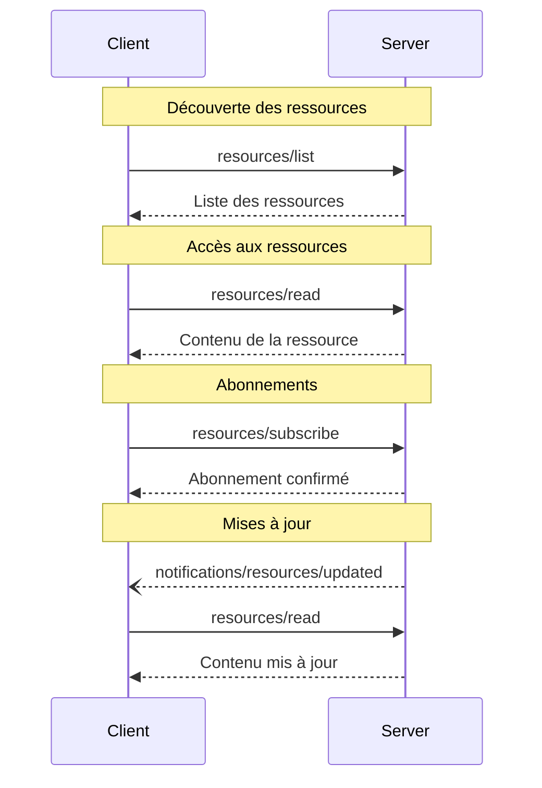

<div id="enable-section-numbers" />

<Info>**Révision du protocole** : brouillon</Info>

Le Protocole de contexte de modèle (MCP) offre une façon normalisée pour que les serveurs exposent des
ressources aux clients. Les ressources permettent aux serveurs de partager des données qui fournissent du contexte aux
modèles de langage, comme des fichiers, des schémas de base de données ou des informations propres à une application.
Chaque ressource est identifiée de manière unique par un
[URI](https://datatracker.ietf.org/doc/html/rfc3986).

<div id="user-interaction-model">
  ## Modèle d’interaction utilisateur
</div>

Les Ressources dans le MCP sont conçues pour être **pilotées par l’application**, les applications hôtes
déterminant comment intégrer le contexte selon leurs besoins.

Par exemple, les applications pourraient :

* Exposer des ressources au moyen d’éléments d’interface pour une sélection explicite, sous forme d’arborescence ou de liste
* Permettre à l’utilisateur de rechercher et de filtrer les ressources disponibles
* Mettre en place l’inclusion automatique du contexte, selon des heuristiques ou la sélection du modèle d’IA


Cependant, les implantations sont libres d’exposer des ressources au moyen de tout modèle d’interface qui
répond à leurs besoins—le protocole lui-même n’impose aucun modèle d’interaction
utilisateur spécifique.

<div id="capabilities">
  ## Capacités
</div>

Les serveurs qui prennent en charge les Ressources DOIVENT déclarer la capacité `resources` :

```json
{
  "capabilities": {
    "resources": {
      "subscribe": true,
      "listChanged": true
    }
  }
}
```

Cette capacité prend en charge deux fonctionnalités optionnelles :

* `subscribe` : indique si le client peut s’abonner pour être avisé des changements apportés à des
  ressources individuelles.
* `listChanged` : indique si le serveur émettra des notifications lorsque la liste des
  ressources disponibles change.

`subscribe` et `listChanged` sont tous deux optionnels — les serveurs peuvent ne prendre en charge ni l’un ni l’autre,
l’un ou l’autre, ou les deux :

```json
{
  "capabilities": {
    "resources": {} // Aucune des fonctionnalités n’est prise en charge
  }
}
```

```json
{
  "capabilities": {
    "resources": {
      "subscribe": true // Seules les abonnements sont pris en charge
    }
  }
}
```

```json
{
  "capabilities": {
    "resources": {
      "listChanged": true // Seules les notifications de modification de la liste sont prises en charge
    }
  }
}
```

<div id="protocol-messages">
  ## Messages du protocole
</div>

<div id="listing-resources">
  ### Lister les ressources
</div>

Pour découvrir les ressources disponibles, les clients envoient une requête `resources/list`. Cette opération
prend en charge la [pagination](/fr-CA/specification/draft/server/utilities/pagination).

**Requête :**

```json
{
  "jsonrpc": "2.0",
  "id": 1,
  "method": "resources/list",
  "params": {
    "cursor": "optional-cursor-value"
  }
}
```

**Réponse :**

```json
{
  "jsonrpc": "2.0",
  "id": 1,
  "result": {
    "resources": [
      {
        "uri": "file:///project/src/main.rs",
        "name": "main.rs",
        "title": "Fichier principal de l’application Rust",
        "description": "Point d’entrée principal de l’application",
        "mimeType": "text/x-rust",
        "icons": [
          {
            "src": "https://example.com/rust-file-icon.png",
            "mimeType": "image/png",
            "sizes": "48x48"
          }
        ]
      }
    ],
    "nextCursor": "next-page-cursor"
  }
}
```

<div id="reading-resources">
  ### Lecture des Ressources
</div>

Pour récupérer le contenu d’une ressource, les clients envoient une requête `resources/read` :

**Requête :**

```json
{
  "jsonrpc": "2.0",
  "id": 2,
  "method": "resources/read",
  "params": {
    "uri": "file:///project/src/main.rs"
  }
}
```

**Réponse :**

```json
{
  "jsonrpc": "2.0",
  "id": 2,
  "result": {
    "contents": [
      {
        "uri": "file:///project/src/main.rs",
        "name": "main.rs",
        "title": "Fichier principal de l’application Rust",
        "mimeType": "text/x-rust",
        "text": "fn main() {\n    println!(\"Hello world!\");\n}"
      }
    ]
  }
}
```

<div id="resource-templates">
  ### Modèles de ressources
</div>

Les modèles de ressources permettent aux serveurs d’exposer des ressources paramétrables à l’aide de
[modèles d’URI](https://datatracker.ietf.org/doc/html/rfc6570). Les arguments peuvent être
complétés automatiquement grâce à [l’API de saisie semi-automatique](/fr-CA/specification/draft/server/utilities/completion).

**Requête :**

```json
{
  "jsonrpc": "2.0",
  "id": 3,
  "method": "resources/templates/list"
}
```

**Réponse :**

```json
{
  "jsonrpc": "2.0",
  "id": 3,
  "result": {
    "resourceTemplates": [
      {
        "uriTemplate": "file:///{path}",
        "name": "Fichiers du projet",
        "title": "📁 Fichiers du projet",
        "description": "Accéder aux fichiers dans le répertoire du projet",
        "mimeType": "application/octet-stream"
      }
    ]
  }
}
```

<div id="list-changed-notification">
  ### Notification de modification de la liste
</div>

Lorsque la liste des ressources disponibles change, les serveurs qui ont déclaré la capacité `listChanged` **DEVRAIENT** envoyer une notification :

```json
{
  "jsonrpc": "2.0",
  "method": "notifications/resources/list_changed"
}
```

<div id="subscriptions">
  ### Abonnements
</div>

Le protocole prend en charge des abonnements optionnels aux modifications de ressources. Les clients peuvent s’abonner à des ressources spécifiques et recevoir des notifications lorsqu’elles sont modifiées :

**Demande d’abonnement :**

```json
{
  "jsonrpc": "2.0",
  "id": 4,
  "method": "resources/subscribe",
  "params": {
    "uri": "file:///project/src/main.rs"
  }
}
```

**Notification de mise à jour :**

```json
{
  "jsonrpc": "2.0",
  "method": "notifications/resources/updated",
  "params": {
    "uri": "file:///project/src/main.rs",
    "title": "Fichier principal de l’application Rust"
  }
}
```

<div id="message-flow">
  ## Flux des messages
</div>



<div id="data-types">
  ## Types de données
</div>

<div id="resource">
  ### Ressource
</div>

Une définition de ressource comprend :

* `uri`: Identifiant unique de la ressource
* `name`: Nom de la ressource
* `title`: Nom lisible par l’humain, facultatif, de la ressource à des fins d’affichage
* `description`: Description facultative
* `mimeType`: Type MIME facultatif
* `size`: Taille facultative en octets

<div id="resource-contents">
  ### Contenu des Ressources
</div>

Les Ressources peuvent contenir soit du texte, soit des données binaires :

<div id="text-content">
  #### Contenu textuel
</div>

```json
{
  "uri": "file:///example.txt",
  "name": "example.txt",
  "title": "Fichier texte d’exemple",
  "mimeType": "text/plain",
  "text": "Contenu de la ressource"
}
```

<div id="binary-content">
  #### Contenu binaire
</div>

```json
{
  "uri": "file:///example.png",
  "name": "example.png",
  "title": "Image d’exemple",
  "mimeType": "image/png",
  "blob": "données encodées en base64"
}
```

<div id="annotations">
  ### Annotations
</div>

Les Ressources, les gabarits de ressources et les blocs de contenu prennent en charge des annotations facultatives qui fournissent des indications aux clients sur la façon d’utiliser ou d’afficher la ressource :

* **`audience`** : Un tableau indiquant le ou les publics visés pour cette ressource. Les valeurs valides sont « &quot;user&quot; » et « &quot;assistant&quot; ». Par exemple, `["user", "assistant"]` indique un contenu utile pour les deux.
* **`priority`** : Un nombre de 0,0 à 1,0 indiquant l’importance de cette ressource. Une valeur de 1 signifie « le plus important » (effectivement requis), tandis que 0 signifie « le moins important » (entièrement facultatif).
* **`lastModified`** : Un horodatage au format ISO 8601 indiquant la dernière modification de la ressource (p. ex. « 2025-01-12T15:00:58Z »).

Exemple de ressource avec annotations :

```json
{
  "uri": "file:///project/README.md",
  "name": "README.md",
  "title": "Project Documentation",
  "mimeType": "text/markdown",
  "annotations": {
    "audience": ["user"],
    "priority": 0.8,
    "lastModified": "2025-01-12T15:00:58Z"
  }
}
```

Les clients peuvent utiliser ces annotations pour :

* Filtrer les ressources selon leur public cible
* Prioriser les ressources à inclure dans le contexte
* Afficher les dates de modification ou trier par date de fraîcheur

<div id="common-uri-schemes">
  ## Schémas d’URI courants
</div>

Le protocole définit plusieurs schémas d’URI standard. Cette liste n’est pas exhaustive — les implémentations sont libres d’utiliser d’autres schémas d’URI, y compris personnalisés.

<div id="https">
  ### https://
</div>

Utilisé pour représenter une ressource disponible sur le Web.

Les serveurs **DEVRAIENT** utiliser ce schéma uniquement lorsque le client peut récupérer et charger la ressource directement sur le Web de lui-même — c’est-à-dire qu’il n’a pas besoin de lire la ressource via le Serveur MCP.

Pour d’autres cas d’utilisation, les serveurs **DEVRAIENT** privilégier un autre schéma d’URI, ou en définir un personnalisé, même si le serveur téléchargera lui-même le contenu de la ressource sur Internet.

<div id="file">
  ### file://
</div>

Utilisé pour identifier des ressources qui se comportent comme un système de fichiers. Toutefois, ces ressources n’ont pas besoin de correspondre à un système de fichiers physique réel.

Les serveurs MCP **PEUVENT** identifier des ressources file:// avec un
[type MIME XDG](https://specifications.freedesktop.org/shared-mime-info-spec/0.14/ar01s02.html#id-1.3.14),
comme `inode/directory`, pour représenter des fichiers non réguliers (par exemple des répertoires) qui n’ont pas de type MIME standard.

<div id="git">
  ### git://
</div>

Intégration avec le système de contrôle de version Git.

<div id="custom-uri-schemes">
  ### Schémas d’URI personnalisés
</div>

Les schémas d’URI personnalisés **DOIVENT** être conformes à la [RFC 3986](https://datatracker.ietf.org/doc/html/rfc3986),
en tenant compte des indications ci-dessus.

<div id="error-handling">
  ## Gestion des erreurs
</div>

Les serveurs **DEVRAIENT** retourner des erreurs JSON-RPC standard pour les cas d’échec courants :

* Ressource introuvable : `-32002`
* Erreurs internes : `-32603`

Exemple d’erreur :

```json
{
  "jsonrpc": "2.0",
  "id": 5,
  "error": {
    "code": -32002,
    "message": "Resource not found",
    "data": {
      "uri": "file:///nonexistent.txt"
    }
  }
}
```

<div id="security-considerations">
  ## Considérations de sécurité
</div>

1. Les serveurs **DOIVENT** valider tous les URI de ressources
2. Des contrôles d’accès **DEVRAIENT** être mis en place pour les ressources sensibles
3. Les données binaires **DOIVENT** être correctement encodées
4. Les autorisations des ressources **DEVRAIENT** être vérifiées avant les opérations