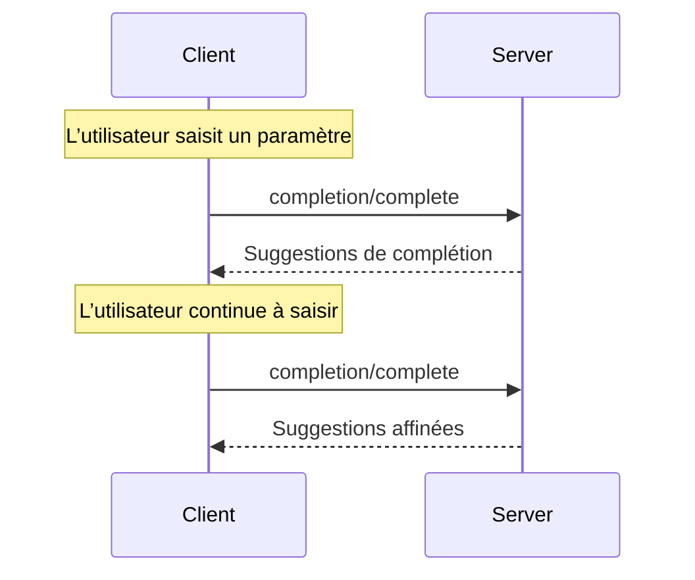

<div id="enable-section-numbers" />

<Info>**Révision du protocole** : ébauche</Info>

Le Protocole de contexte de modèle (MCP) fournit une méthode normalisée permettant aux serveurs de proposer des suggestions de saisie semi-automatique des arguments pour les invites et les URI de ressources. Cela permet des expériences riches, de type IDE, où les utilisateurs reçoivent des suggestions contextuelles pendant qu’ils saisissent des valeurs d’arguments.

<div id="user-interaction-model">
  ## Modèle d’interaction avec l’utilisateur
</div>

L’achèvement dans le MCP est conçu pour prendre en charge des expériences interactives semblables à l’achèvement de code dans un IDE.

Par exemple, les applications peuvent afficher des suggestions d’achèvement dans un menu déroulant ou une fenêtre contextuelle à mesure que l’utilisateur saisit du texte, avec la possibilité de filtrer et de sélectionner parmi les options offertes.

Cependant, les implémentations sont libres d’offrir l’achèvement selon tout modèle d’interface qui répond à leurs besoins — le protocole lui-même n’impose aucun modèle d’interaction avec l’utilisateur précis.

<div id="capabilities">
  ## Capacités
</div>

Les serveurs qui prennent en charge les complétions **DOIVENT** déclarer la capacité `completions` :

```json
{
  "capabilities": {
    "completions": {}
  }
}
```

<div id="protocol-messages">
  ## Messages du protocole
</div>

<div id="requesting-completions">
  ### Demander des complétions
</div>

Pour obtenir des suggestions de complétion, les clients envoient une requête `completion/complete` indiquant
ce qui doit être complété au moyen d’un type de référence :

**Requête :**

```json
{
  "jsonrpc": "2.0",
  "id": 1,
  "method": "completion/complete",
  "params": {
    "ref": {
      "type": "ref/prompt",
      "name": "code_review"
    },
    "argument": {
      "name": "language",
      "value": "py"
    }
  }
}
```

**Réponse :**

```json
{
  "jsonrpc": "2.0",
  "id": 1,
  "result": {
    "completion": {
      "values": ["python", "pytorch", "pyside"],
      "total": 10,
      "hasMore": true
    }
  }
}
```

Pour les invites ou les gabarits d’URI avec plusieurs arguments, les clients devraient inclure les complétions précédentes dans l’objet `context.arguments` afin de fournir du contexte pour les requêtes subséquentes.

**Requête :**

```json
{
  "jsonrpc": "2.0",
  "id": 1,
  "method": "completion/complete",
  "params": {
    "ref": {
      "type": "ref/prompt",
      "name": "code_review"
    },
    "argument": {
      "name": "framework",
      "value": "fla"
    },
    "context": {
      "arguments": {
        "language": "python"
      }
    }
  }
}
```

**Réponse :**

```json
{
  "jsonrpc": "2.0",
  "id": 1,
  "result": {
    "completion": {
      "values": ["flask"],
      "total": 1,
      "hasMore": false
    }
  }
}
```

<div id="reference-types">
  ### Types de références
</div>

Le protocole prend en charge deux types de références de complétion :

| Type           | Description                        | Exemple                                             |
| -------------- | ---------------------------------- | --------------------------------------------------- |
| `ref/prompt`   | Référence une invite par son nom   | `{"type": "ref/prompt", "name": "code_review"}`     |
| `ref/resource` | Référence un URI de ressource      | `{"type": "ref/resource", "uri": "file:///{path}"}` |

<div id="completion-results">
  ### Résultats de complétion
</div>

Les serveurs retournent un tableau de valeurs de complétion classées par pertinence, comprenant :

- Un maximum de 100 éléments par réponse
- Le nombre total de correspondances disponibles (facultatif)
- Un booléen indiquant si d’autres résultats sont disponibles

<div id="message-flow">
  ## Flux des messages
</div>



<div id="data-types">
  ## Types de données
</div>

<div id="completerequest">
  ### CompleteRequest
</div>

- `ref`: Une `PromptReference` ou `ResourceReference`
- `argument`: Objet contenant :
  - `name`: Nom de l’argument
  - `value`: Valeur actuelle
- `context`: Objet contenant :
  - `arguments`: Une correspondance entre les noms d’arguments déjà résolus et leurs valeurs.

<div id="completeresult">
  ### CompleteResult
</div>

- `completion`: Objet contenant :
  - `values`: Tableau de suggestions (max. 100)
  - `total`: Nombre total facultatif de correspondances
  - `hasMore`: Indicateur de résultats supplémentaires

<div id="error-handling">
  ## Gestion des erreurs
</div>

Les serveurs **DEVRAIENT** renvoyer des erreurs JSON-RPC standard pour les cas d’échec courants :

- Méthode introuvable : `-32601` (Fonctionnalité non prise en charge)
- Nom d’invite non valide : `-32602` (Paramètres non valides)
- Arguments requis manquants : `-32602` (Paramètres non valides)
- Erreurs internes : `-32603` (Erreur interne)

<div id="implementation-considerations">
  ## Considérations relatives à l’implémentation
</div>

1. Les serveurs **DEVRAIENT** :
   - Renvoyer des suggestions triées par pertinence
   - Mettre en œuvre une correspondance floue lorsque approprié
   - Limiter le débit des requêtes d’autocomplétion
   - Valider toutes les entrées

2. Les clients **DEVRAIENT** :
   - Déclencher un délai (debounce) pour les requêtes d’autocomplétion rapides
   - Mettre en cache les résultats d’autocomplétion lorsque approprié
   - Gérer avec souplesse les résultats manquants ou partiels

<div id="security">
  ## Sécurité
</div>

Les implémentations DOIVENT :

- Valider toutes les entrées de complétion
- Mettre en place une limitation de débit appropriée
- Contrôler l’accès aux suggestions sensibles
- Empêcher la divulgation d’informations fondée sur la complétion