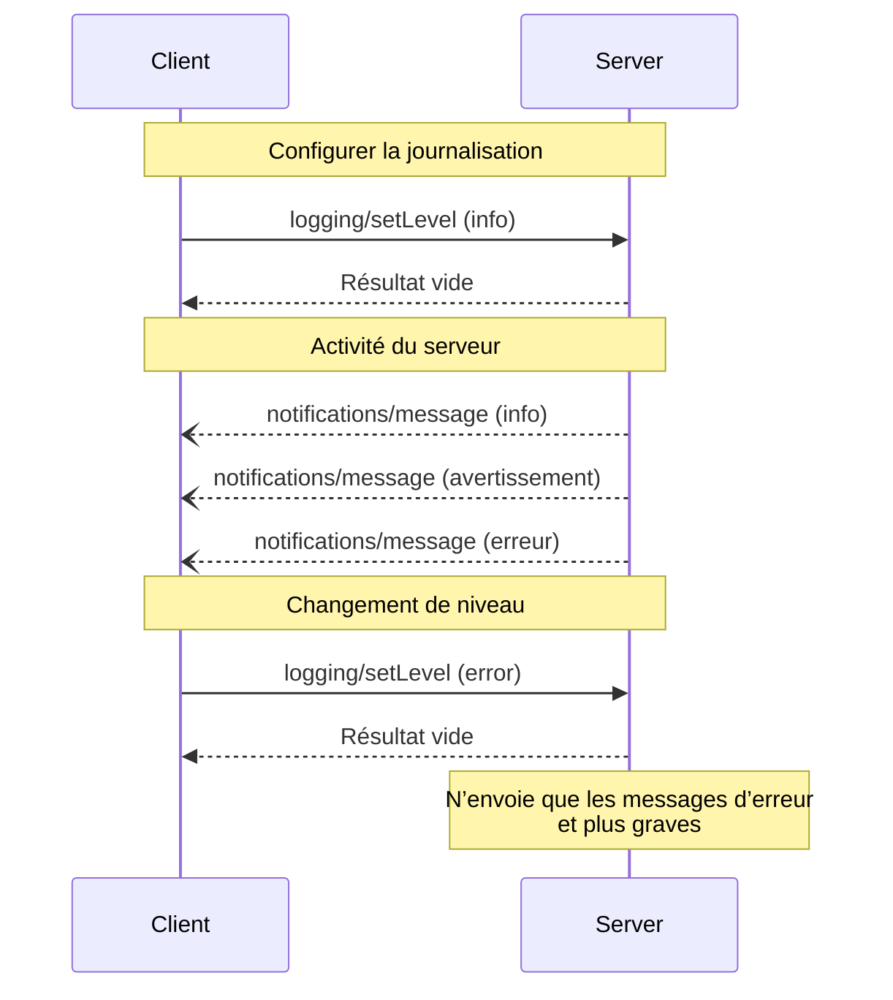

<div id="enable-section-numbers" />

<Info>**Révision du protocole** : ébauche</Info>

Le Protocole de contexte de modèle (MCP) fournit une méthode normalisée permettant aux serveurs d’envoyer
des messages de journal structurés aux clients. Les clients peuvent contrôler le niveau de détail de la journalisation en définissant
des seuils minimaux, et les serveurs envoient des notifications comprenant des niveaux de gravité,
des noms de journal facultatifs et des données arbitraires sérialisables en JSON.

<div id="user-interaction-model">
  ## Modèle d’interaction avec l’utilisateur
</div>

Les implémentations sont libres d’exposer la journalisation via tout modèle d’interface qui répond à leurs besoins&mdash;le protocole lui-même n’impose aucun modèle d’interaction avec l’utilisateur spécifique.

<div id="capabilities">
  ## Capacités
</div>

Les serveurs qui émettent des notifications de messages de journal **DOIVENT** déclarer la capacité `logging` :

```json
{
  "capabilities": {
    "logging": {}
  }
}
```

<div id="log-levels">
  ## Niveaux de journalisation
</div>

Le protocole suit les niveaux de gravité syslog standard définis dans
[RFC 5424](https://datatracker.ietf.org/doc/html/rfc5424#section-6.2.1) :

| Niveau    | Description                           | Exemple d’utilisation                 |
| --------- | ------------------------------------- | ------------------------------------- |
| debug     | Informations détaillées de débogage   | Points d’entrée/sortie d’une fonction |
| info      | Messages d’information généraux       | Mises à jour sur l’avancement d’une opération |
| notice    | Événements normaux mais importants    | Changements de configuration          |
| warning   | Conditions d’avertissement            | Utilisation de fonctionnalités désapprouvées |
| error     | Conditions d’erreur                   | Échecs d’opération                    |
| critical  | Conditions critiques                  | Pannes de composants du système       |
| alert     | Action requise immédiatement          | Corruption de données détectée        |
| emergency | Système inutilisable                  | Panne complète du système             |

<div id="protocol-messages">
  ## Messages du protocole
</div>

<div id="setting-log-level">
  ### Définir le niveau de journalisation
</div>

Pour configurer le niveau minimal de journalisation, les clients **PEUVENT** envoyer une requête `logging/setLevel` :

**Requête :**

```json
{
  "jsonrpc": "2.0",
  "id": 1,
  "method": "logging/setLevel",
  "params": {
    "level": "info"
  }
}
```

<div id="log-message-notifications">
  ### Notifications des messages de journal
</div>

Les serveurs envoient des messages de journal au moyen des notifications `notifications/message` :

```json
{
  "jsonrpc": "2.0",
  "method": "notifications/message",
  "params": {
    "level": "error",
    "logger": "database",
    "data": {
      "error": "Connection failed",
      "details": {
        "host": "localhost",
        "port": 5432
      }
    }
  }
}
```

<div id="message-flow">
  ## Flux des messages
</div>



<div id="error-handling">
  ## Gestion des erreurs
</div>

Les serveurs **DEVRAIENT** renvoyer des erreurs JSON-RPC standard pour les cas d’échec courants :

- Niveau de journalisation invalide : `-32602` (Paramètres invalides)
- Erreurs de configuration : `-32603` (Erreur interne)

<div id="implementation-considerations">
  ## Considérations de mise en œuvre
</div>

1. Les serveurs **DEVRAIENT** :
   - Limiter le débit des messages de journalisation
   - Inclure le contexte pertinent dans le champ de données
   - Utiliser des noms de journal cohérents
   - Retirer les informations sensibles

2. Les clients **PEUVENT** :
   - Afficher les messages de journal dans l’interface utilisateur
   - Mettre en œuvre le filtrage/la recherche des journaux
   - Représenter visuellement le niveau de gravité
   - Conserver les messages de journal

<div id="security">
  ## Sécurité
</div>

1. Les messages de journalisation **NE DOIVENT PAS** contenir :
   - Des identifiants ou des secrets
   - Des renseignements personnels identifiables
   - Des détails internes du système pouvant faciliter des attaques

2. Les implémentations **DEVRAIENT** :
   - Limiter le débit des messages
   - Valider tous les champs de données
   - Contrôler l’accès aux journaux
   - Surveiller la présence de contenu sensible