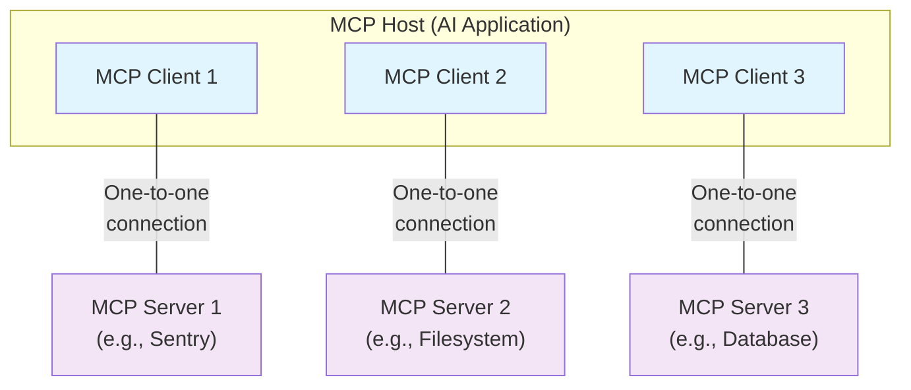

Cette vue d’ensemble du Protocole de contexte de modèle (MCP) présente sa [portée](#scope) et ses [concepts fondamentaux](#concepts-of-mcp), et propose un [exemple](#example) illustrant chacun de ces concepts.

Comme les SDK MCP abstraient de nombreux aspects, la plupart des développeurs trouveront probablement la section sur le [protocole de la couche de données](#data-layer-protocol) la plus utile. Elle explique comment les Serveurs MCP peuvent fournir du contexte à une application d’IA.

Pour des détails d’implémentation spécifiques, veuillez consulter la documentation de votre [SDK spécifique à un langage](/fr/docs/sdk).

<div id="scope">
  ## Portée
</div>

Le Protocole de contexte de modèle (MCP) comprend les projets suivants :

* [Spécification MCP](https://modelcontextprotocol.io/specification/latest) : la spécification du MCP qui décrit les exigences de mise en œuvre pour les clients et les serveurs.
* [SDK MCP](/fr/docs/sdk) : des SDK pour différents langages de programmation qui implémentent MCP.
* **Outils de développement MCP** : des outils pour développer des serveurs et des clients MCP, notamment le [MCP Inspector](https://github.com/modelcontextprotocol/inspector).
* [Implémentations de référence de serveurs MCP](https://github.com/modelcontextprotocol/servers) : des implémentations de référence de serveurs MCP.

<Note>
  MCP se concentre uniquement sur le protocole d’échange de contexte — il ne prescrit pas
  la manière dont les applications d’IA utilisent les LLM ni comment elles gèrent le contexte fourni.
</Note>

<div id="concepts-of-mcp">
  ## Concepts du Protocole de contexte de modèle (MCP)
</div>

<div id="participants">
  ### Participants
</div>

Le MCP suit une architecture client-serveur où un Hôte MCP — une application d’IA comme [Claude Code](https://www.anthropic.com/claude-code) ou [Claude Desktop](https://www.claude.ai/download) — établit des connexions avec un ou plusieurs Serveurs MCP. L’Hôte MCP y parvient en créant un Client MCP pour chaque Serveur MCP. Chaque Client MCP maintient une connexion dédiée un-à-un avec son Serveur MCP correspondant.

Les principaux participants de l’architecture MCP sont :

* **Hôte MCP** : l’application d’IA qui coordonne et gère un ou plusieurs Clients MCP
* **Client MCP** : un composant qui maintient une connexion à un Serveur MCP et obtient du contexte d’un Serveur MCP pour que l’Hôte MCP l’utilise
* **Serveur MCP** : un programme qui fournit du contexte aux Clients MCP

**Par exemple** : Visual Studio Code agit comme un Hôte MCP. Lorsque Visual Studio Code établit une connexion à un Serveur MCP, tel que le [Serveur MCP Sentry](https://docs.sentry.io/product/sentry-mcp/), le runtime de Visual Studio Code instancie un objet Client MCP qui maintient la connexion au Serveur MCP Sentry.
Lorsque Visual Studio Code se connecte ensuite à un autre Serveur MCP, tel que le [serveur de système de fichiers local](https://github.com/modelcontextprotocol/servers/tree/main/src/filesystem), le runtime de Visual Studio Code instancie un objet Client MCP supplémentaire pour maintenir cette connexion, préservant ainsi une relation un-à-un
entre Clients MCP et Serveurs MCP.



Notez que **Serveur MCP** désigne le programme qui sert des données de contexte, quel que soit l’endroit où il s’exécute. Les Serveurs MCP peuvent s’exécuter localement ou à distance. Par exemple, lorsque Claude Desktop lance le [serveur de système de fichiers](https://github.com/modelcontextprotocol/servers/tree/main/src/filesystem), le serveur s’exécute localement sur la même machine car il utilise le transport STDIO. On parle couramment d’un Serveur MCP « local ». Le [Serveur MCP officiel Sentry](https://docs.sentry.io/product/sentry-mcp/) s’exécute sur la plateforme Sentry et utilise le transport HTTP diffusé en continu. On parle couramment d’un Serveur MCP « distant ».

<div id="layers">
  ### Couches
</div>

Le MCP se compose de deux couches :

* **Couche de données** : définit le protocole basé sur JSON-RPC pour la communication client-serveur, y compris la gestion du cycle de vie et les primitives de base, telles que les Outils, les Ressources, les Invites et les notifications.
* **Couche de transport** : définit les mécanismes et canaux de communication permettant l’échange de données entre clients et serveurs, y compris l’établissement de la connexion propre au transport, l’encapsulation des messages et l’autorisation.

Conceptuellement, la couche de données est la couche interne, tandis que la couche de transport est la couche externe.

<div id="data-layer">
  #### Couche de données
</div>

La couche de données met en œuvre un protocole d’échange basé sur [JSON-RPC 2.0](https://www.jsonrpc.org/) qui définit la structure et la sémantique des messages.
Cette couche comprend :

* **Gestion du cycle de vie** : gère l’initialisation de la connexion, la négociation des capacités et la terminaison de la connexion entre clients et serveurs
* **Fonctionnalités côté serveur** : permet aux serveurs de fournir des fonctionnalités de base, notamment des Outils pour les actions d’IA, des Ressources pour les données de contexte et des Invites pour des modèles d’interaction, du client vers le serveur et inversement
* **Fonctionnalités côté client** : permet aux serveurs de demander au client d’effectuer de l’Échantillonnage via l’Hôte MCP, de solliciter des entrées auprès de l’utilisateur et consigner des messages côté client
* **Fonctionnalités utilitaires** : prend en charge des capacités supplémentaires comme les notifications pour les mises à jour en temps réel et le suivi de la progression des opérations de longue durée

<div id="transport-layer">
  #### Couche de transport
</div>

La couche de transport gère les canaux de communication et l’authentification entre les clients et les serveurs. Elle s’occupe de l’établissement de la connexion, de l’encapsulation des messages et de la communication sécurisée entre les participants MCP.

MCP prend en charge deux mécanismes de transport :

* **Transport STDIO** : utilise les flux d’entrée/sortie standard pour une communication directe entre processus locaux sur la même machine, offrant des performances optimales sans surcharge réseau.
* **Transport HTTP diffusé en continu** : utilise HTTP POST pour les messages du client vers le serveur, avec des Événements envoyés par le serveur (SSE) optionnels pour les capacités de diffusion en continu. Ce transport permet la communication avec des serveurs distants et prend en charge les méthodes d’authentification HTTP standard, notamment les jetons Bearer, les clés d’API et les en-têtes personnalisés. MCP recommande d’utiliser OAuth pour obtenir des jetons d’authentification.

La couche de transport isole les détails de communication de la couche protocolaire, permettant d’utiliser le même format de messages JSON-RPC 2.0 sur tous les mécanismes de transport.

<div id="data-layer-protocol">
  ### Protocole de couche de données
</div>

Un élément clé de MCP consiste à définir le schéma et la sémantique entre les clients MCP et les serveurs MCP. Les développeurs jugeront probablement la couche de données — en particulier l’ensemble des [primitives](#primitives) — comme la partie la plus intéressante de MCP. C’est la partie de MCP qui définit les façons dont les développeurs peuvent partager du contexte des serveurs MCP vers les clients MCP.

MCP utilise [JSON-RPC 2.0](https://www.jsonrpc.org/) comme protocole RPC sous-jacent. Les clients et les serveurs s’envoient des requêtes et y répondent en conséquence. Les notifications peuvent être utilisées lorsqu’aucune réponse n’est requise.

<div id="lifecycle-management">
  #### Gestion du cycle de vie
</div>

MCP est un <Tooltip tip="Un sous-ensemble de MCP peut être rendu sans état en utilisant le transport HTTP diffusé en continu">protocole avec état</Tooltip> qui nécessite une gestion du cycle de vie. La gestion du cycle de vie a pour objectif de négocier les <Tooltip tip="Fonctionnalités et opérations prises en charge par un client ou un serveur, telles que les Outils, Ressources ou Invites">capacités</Tooltip> prises en charge par le client et le serveur. Des informations détaillées figurent dans la [spécification](/fr/specification/2025-06-18/basic/lifecycle), et l&#39;[exemple](#example) présente la séquence d&#39;initialisation.

<div id="primitives">
  #### Primitives
</div>

Les primitives MCP sont le concept le plus important au sein de MCP. Elles définissent ce que les clients et les serveurs peuvent s’offrir mutuellement. Ces primitives spécifient les types d’informations contextuelles pouvant être partagées avec les applications d’IA et l’éventail des actions pouvant être effectuées.

MCP définit trois primitives fondamentales que les *serveurs* peuvent exposer :

* **Outils** : Fonctions exécutables que les applications d’IA peuvent invoquer pour effectuer des actions (p. ex., opérations sur les fichiers, appels d’API, requêtes de base de données)
* **Ressources** : Sources de données qui fournissent des informations contextuelles aux applications d’IA (p. ex., contenu de fichiers, enregistrements de base de données, réponses d’API)
* **Invites** : Modèles réutilisables qui aident à structurer les interactions avec les modèles de langage (p. ex., invites système, exemples few-shot)

Chaque type de primitive possède des méthodes associées pour la découverte (`*/list`), la récupération (`*/get`) et, dans certains cas, l’exécution (`tools/call`).
Les clients MCP utilisent les méthodes `*/list` pour découvrir les primitives disponibles. Par exemple, un client peut d’abord lister tous les outils disponibles (`tools/list`), puis les exécuter. Cette conception permet des listes dynamiques.

À titre d’exemple concret, considérez un serveur MCP qui fournit du contexte sur une base de données. Il peut exposer des outils pour interroger la base de données, une ressource qui contient le schéma de la base de données, et une invite qui inclut des exemples few-shot pour interagir avec les outils.

Pour plus de détails sur les primitives côté serveur, voir [server concepts](fr/./server-concepts).

MCP définit également des primitives que les *clients* peuvent exposer. Ces primitives permettent aux auteurs de serveurs MCP de créer des interactions plus riches.

* **Échantillonnage** : Permet aux serveurs de demander des complétions de modèle de langage depuis l’application d’IA du client. C’est utile lorsque les auteurs de serveurs veulent accéder à un modèle de langage tout en restant indépendants du modèle et sans inclure de SDK de modèle de langage dans leur serveur MCP. Ils peuvent utiliser la méthode `sampling/complete` pour demander une complétion de modèle de langage depuis l’application d’IA du client.
* **Élicitation** : Permet aux serveurs de demander des informations supplémentaires aux utilisateurs. C’est utile lorsque les auteurs de serveurs veulent obtenir plus d’informations de l’utilisateur ou demander la confirmation d’une action. Ils peuvent utiliser la méthode `elicitation/request` pour demander des informations supplémentaires à l’utilisateur.
* **Journalisation** : Permet aux serveurs d’envoyer des messages de journalisation aux clients à des fins de débogage et de supervision.

Pour plus de détails sur les primitives côté client, voir [client concepts](fr/./client-concepts).

<div id="notifications">
  #### Notifications
</div>

Le protocole prend en charge les notifications en temps réel pour permettre des mises à jour dynamiques entre serveurs et clients. Par exemple, lorsque les Outils disponibles d’un serveur évoluent—par l’ajout de nouvelles fonctionnalités ou la modification d’outils existants—le serveur peut envoyer des notifications de mise à jour des outils afin d’informer les clients connectés de ces changements. Les notifications sont envoyées sous forme de messages de notification JSON-RPC 2.0 (sans attendre de réponse) et permettent aux serveurs MCP de fournir des mises à jour en temps réel aux clients MCP connectés.

<div id="example">
  ## Exemple
</div>

<div id="data-layer">
  ### Couche de données
</div>

Cette section propose un guide pas à pas d’une interaction Client MCP–Serveur MCP, avec un focus sur le protocole de la couche de données. Nous présenterons la séquence du cycle de vie, les opérations des Outils et les notifications à l’aide de messages JSON-RPC 2.0.

<Steps>
  <Step title="Initialization (Lifecycle Management)">
    Le MCP commence par la gestion du cycle de vie via une négociation de capacités sous forme de handshake. Comme décrit dans la section [gestion du cycle de vie](#lifecycle-management), le client envoie une requête `initialize` pour établir la connexion et négocier les fonctionnalités prises en charge.

    <CodeGroup>
      ```json Initialize Request
      {
        "jsonrpc": "2.0",
        "id": 1,
        "method": "initialize",
        "params": {
          "protocolVersion": "2025-06-18",
          "capabilities": {
            "elicitation": {}
          },
          "clientInfo": {
            "name": "example-client",
            "version": "1.0.0"
          }
        }
      }
      ```

      ```json Initialize Response
      {
        "jsonrpc": "2.0",
        "id": 1,
        "result": {
          "protocolVersion": "2025-06-18",
          "capabilities": {
            "tools": {
              "listChanged": true
            },
            "resources": {}
          },
          "serverInfo": {
            "name": "example-server",
            "version": "1.0.0"
          }
        }
      }
      ```
    </CodeGroup>

    #### Comprendre l’échange d’initialisation

    Le processus d’initialisation est un élément clé de la gestion du cycle de vie de MCP et remplit plusieurs objectifs essentiels :

    1. Négociation de la version du protocole : le champ `protocolVersion` (par exemple « 2025-06-18 ») garantit que le client et le serveur utilisent des versions compatibles du protocole. Cela évite les erreurs de communication susceptibles de survenir lorsque des versions différentes tentent d’interagir. Si aucune version mutuellement compatible n’est négociée, la connexion doit être interrompue.

    2. Découverte des capacités : l’objet `capabilities` permet à chaque partie de déclarer les fonctionnalités qu’elle prend en charge, y compris les [primitives](#primitives) qu’elle peut gérer (Outils, Ressources, Invites) et si elle prend en charge des fonctionnalités comme les [notifications](#notifications). Cela permet une communication efficace en évitant les opérations non prises en charge.

    3. Échange d’identité : les objets `clientInfo` et `serverInfo` fournissent des informations d’identification et de version à des fins de débogage et de compatibilité.

    Dans cet exemple, la négociation des capacités montre comment les primitives MCP sont déclarées :

    Capacités du client :

    * `"elicitation": {}` - Le client déclare qu’il peut traiter des demandes d’interaction utilisateur (il peut recevoir des appels de méthode `elicitation/create`)

    Capacités du serveur :

    * `"tools": {"listChanged": true}` - Le serveur prend en charge la primitive Outils ET peut envoyer des notifications `tools/list_changed` lorsque sa liste d’outils change
    * `"resources": {}` - Le serveur prend également en charge la primitive Ressources (il peut gérer les méthodes `resources/list` et `resources/read`)

    Après une initialisation réussie, le client envoie une notification pour indiquer qu’il est prêt :

    ```json Notification
    {
      "jsonrpc": "2.0",
      "method": "notifications/initialized"
    }
    ```

    #### Fonctionnement dans les applications d’IA

    Pendant l’initialisation, le gestionnaire de Client MCP de l’application d’IA établit des connexions aux Serveurs MCP configurés et enregistre leurs capacités pour une utilisation ultérieure. L’application utilise ces informations pour déterminer quels serveurs peuvent fournir des types spécifiques de fonctionnalités (Outils, Ressources, Invites) et s’ils prennent en charge les mises à jour en temps réel.

    ```python Pseudo-code for AI application initialization
    # Pseudo Code
    async with stdio_client(server_config) as (read, write):
        async with ClientSession(read, write) as session:
            init_response = await session.initialize()
            if init_response.capabilities.tools:
                app.register_mcp_server(session, supports_tools=True)
            app.set_server_ready(session)
    ```
  </Step>

  <Step title="Tool Discovery (Primitives)">
    Maintenant que la connexion est établie, le client peut découvrir les Outils disponibles en envoyant une requête `tools/list`. Cette requête est fondamentale pour le mécanisme de découverte des Outils de MCP — elle permet aux clients de savoir quels Outils sont disponibles sur le Serveur avant d’essayer de les utiliser.

    <CodeGroup>
      ```json Tools List Request
      {
        "jsonrpc": "2.0",
        "id": 2,
        "method": "tools/list"
      }
      ```

      ```json Tools List Response
      {
        "jsonrpc": "2.0",
        "id": 2,
        "result": {
          "tools": [
            {
              "name": "calculator_arithmetic",
              "title": "Calculator",
              "description": "Perform mathematical calculations including basic arithmetic, trigonometric functions, and algebraic operations",
              "inputSchema": {
                "type": "object",
                "properties": {
                  "expression": {
                    "type": "string",
                    "description": "Mathematical expression to evaluate (e.g., '2 + 3 * 4', 'sin(30)', 'sqrt(16)')"
                  }
                },
                "required": ["expression"]
              }
            },
            {
              "name": "weather_current",
              "title": "Weather Information",
              "description": "Get current weather information for any location worldwide",
              "inputSchema": {
                "type": "object",
                "properties": {
                  "location": {
                    "type": "string",
                    "description": "City name, address, or coordinates (latitude,longitude)"
                  },
                  "units": {
                    "type": "string",
                    "enum": ["metric", "imperial", "kelvin"],
                    "description": "Temperature units to use in response",
                    "default": "metric"
                  }
                },
                "required": ["location"]
              }
            }
          ]
        }
      }
      ```
    </CodeGroup>

    #### Comprendre la requête de découverte d’Outils

    La requête `tools/list` est simple et ne contient aucun paramètre.

    #### Comprendre la réponse de découverte d’Outils

    La réponse contient un tableau `tools` qui fournit des métadonnées complètes sur chaque Outil disponible. Cette structure en tableau permet aux Serveurs d’exposer plusieurs Outils simultanément tout en maintenant des limites claires entre différentes fonctionnalités.

    Chaque objet Outil dans la réponse inclut plusieurs champs clés :

    * **`name`** : Identifiant unique de l’Outil dans l’espace de noms du Serveur. Il sert de clé primaire pour l’exécution de l’Outil et doit suivre une convention de nommage claire (par exemple, `calculator_arithmetic` plutôt que simplement `calculate`)
    * **`title`** : Nom d’affichage lisible par l’humain que les Clients peuvent présenter aux utilisateurs
    * **`description`** : Explication détaillée de ce que fait l’Outil et des cas d’usage
    * **`inputSchema`** : Un schéma JSON définissant les paramètres d’entrée attendus, permettant la validation des types et fournissant une documentation claire sur les paramètres obligatoires et optionnels

    #### Fonctionnement dans les applications d’IA

    L’application d’IA récupère les Outils disponibles depuis tous les Serveurs MCP connectés et les regroupe dans un registre unifié d’Outils accessible au modèle de langage. Cela permet au LLM de comprendre quelles actions il peut effectuer et de générer automatiquement les appels d’Outils appropriés au cours des conversations.

    ```python Pseudo-code for AI application tool discovery
    # Pseudo-code using MCP Python SDK patterns
    available_tools = []
    for session in app.mcp_server_sessions():
        tools_response = await session.list_tools()
        available_tools.extend(tools_response.tools)
    conversation.register_available_tools(available_tools)
    ```
  </Step>

  <Step title="Tool Execution (Primitives)">
    Le client peut maintenant exécuter un outil à l’aide de la méthode `tools/call`. Cela montre comment les primitives MCP sont utilisées en pratique : après avoir découvert les Outils disponibles, le client peut les invoquer avec des arguments adaptés.

    #### Comprendre la requête d’exécution d’un Outil

    La requête `tools/call` suit un format structuré qui garantit la sécurité de typage et une communication claire entre le client et le serveur. Notez que nous utilisons le nom d’Outil exact issu de la réponse de découverte (`weather_current`), plutôt qu’un nom simplifié :

    <CodeGroup>
      ```json Tool Call Request
      {
        "jsonrpc": "2.0",
        "id": 3,
        "method": "tools/call",
        "params": {
          "name": "weather_current",
          "arguments": {
            "location": "San Francisco",
            "units": "imperial"
          }
        }
      }
      ```

      ```json Tool Call Response
      {
        "jsonrpc": "2.0",
        "id": 3,
        "result": {
          "content": [
            {
              "type": "text",
              "text": "Current weather in San Francisco: 68°F, partly cloudy with light winds from the west at 8 mph. Humidity: 65%"
            }
          ]
        }
      }
      ```
    </CodeGroup>

    #### Éléments clés de l’exécution d’un Outil

    La structure de la requête comprend plusieurs composants importants :

    1. **`name`** : Doit correspondre exactement au nom de l’Outil figurant dans la réponse de découverte (`weather_current`). Cela permet au serveur d’identifier correctement quel Outil exécuter.

    2. **`arguments`** : Contient les paramètres d’entrée tels que définis par le `inputSchema` de l’Outil. Dans cet exemple :
       * `location` : &quot;San Francisco&quot; (paramètre requis)
       * `units` : &quot;imperial&quot; (paramètre facultatif, par défaut &quot;metric&quot; s’il n’est pas spécifié)

    3. **Structure JSON-RPC** : Utilise le format standard JSON-RPC 2.0 avec un `id` unique pour corréler requête et réponse.

    #### Comprendre la réponse d’exécution d’un Outil

    La réponse illustre le système de contenu flexible de MCP :

    1. **Tableau `content`** : Les réponses d’Outils renvoient un tableau d’objets de contenu, permettant des réponses riches et multi-formats (texte, images, Ressources, etc.).

    2. **Types de contenu** : Chaque objet de contenu possède un champ `type`. Dans cet exemple, `"type": "text"` indique du texte brut, mais MCP prend en charge divers types de contenu pour différents cas d’usage.

    3. **Sortie structurée** : La réponse fournit des informations exploitables que l’application d’IA peut utiliser comme contexte pour les interactions avec le modèle de langage.

    Ce modèle d’exécution permet aux applications d’IA d’invoquer dynamiquement des fonctionnalités côté serveur et de recevoir des réponses structurées pouvant être intégrées aux conversations avec des modèles de langage.

    #### Fonctionnement dans les applications d’IA

    Lorsque le modèle de langage décide d’utiliser un Outil au cours d’une conversation, l’application d’IA intercepte l’appel, le transmet au Serveur MCP approprié, l’exécute, puis renvoie les résultats au LLM dans le flux de conversation. Cela permet au LLM d’accéder à des données en temps réel et d’effectuer des actions dans le monde réel.

    ```python
    # Pseudo-code pour l’exécution d’un Outil dans une application d’IA
    async def handle_tool_call(conversation, tool_name, arguments):
        session = app.find_mcp_session_for_tool(tool_name)
        result = await session.call_tool(tool_name, arguments)
        conversation.add_tool_result(result.content)
    ```
  </Step>

  <Step title="Real-time Updates (Notifications)">
    MCP prend en charge des notifications en temps réel qui permettent aux serveurs d’informer les clients des changements sans requête explicite. Voici le système de notification, une fonctionnalité clé qui maintient les connexions MCP synchronisées et réactives.

    #### Comprendre les notifications de modification de la liste des Outils

    Lorsque les Outils disponibles du serveur changent — par exemple quand de nouvelles fonctionnalités deviennent disponibles, que des Outils existants sont modifiés ou que des Outils deviennent temporairement indisponibles — le serveur peut avertir de manière proactive les clients connectés :

    ```json Request
    {
      "jsonrpc": "2.0",
      "method": "notifications/tools/list_changed"
    }
    ```

    #### Principales caractéristiques des notifications MCP

    1. Aucune réponse requise : notez l’absence du champ `id` dans la notification. Cela suit la sémantique des notifications JSON-RPC 2.0 où aucune réponse n’est attendue ni envoyée.

    2. Basé sur les capacités : cette notification n’est envoyée que par les serveurs ayant déclaré `"listChanged": true` dans leur capacité Outils lors de l’initialisation (comme montré à l’étape 1).

    3. Piloté par les événements : le serveur décide quand envoyer des notifications en fonction de ses changements d’état internes, rendant les connexions MCP dynamiques et réactives.

    #### Réponse du Client aux notifications

    À la réception de cette notification, le Client réagit généralement en demandant la liste des Outils à jour. Cela crée un cycle de rafraîchissement qui maintient à jour la compréhension par le Client des Outils disponibles :

    ```json Request
    {
      "jsonrpc": "2.0",
      "id": 4,
      "method": "tools/list"
    }
    ```

    #### Pourquoi les notifications sont importantes

    Ce système de notification est crucial pour plusieurs raisons :

    1. Environnements dynamiques : les Outils peuvent apparaître ou disparaître selon l’état du serveur, des dépendances externes ou des permissions utilisateur
    2. Efficacité : les Clients n’ont pas besoin d’interroger périodiquement les changements ; ils sont notifiés lorsque des mises à jour surviennent
    3. Cohérence : garantit que les Clients disposent toujours d’informations exactes sur les capacités disponibles du serveur
    4. Collaboration en temps réel : permet des applications d’IA réactives capables de s’adapter à des contextes changeants

    Ce modèle de notification s’étend au-delà des Outils à d’autres primitives MCP, permettant une synchronisation complète en temps réel entre Clients et Serveurs.

    #### Fonctionnement dans les applications d’IA

    Lorsque l’application d’IA reçoit une notification concernant des Outils modifiés, elle actualise immédiatement son registre d’Outils et met à jour les capacités disponibles du LLM. Cela garantit que les conversations en cours ont toujours accès à l’ensemble le plus récent d’Outils, et que le LLM peut s’adapter dynamiquement aux nouvelles fonctionnalités dès qu’elles deviennent disponibles.

    ```python
    # Pseudo-code pour la gestion des notifications dans une application d’IA
    async def handle_tools_changed_notification(session):
        tools_response = await session.list_tools()
        app.update_available_tools(session, tools_response.tools)
        if app.conversation.is_active():
            app.conversation.notify_llm_of_new_capabilities()
    ```
  </Step>
</Steps>