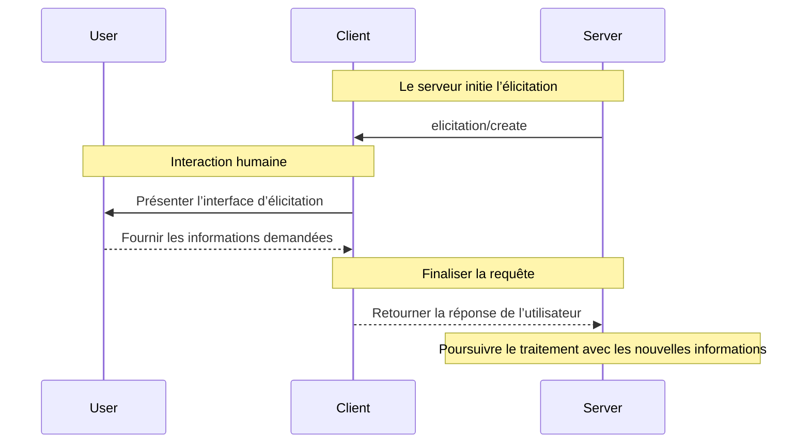
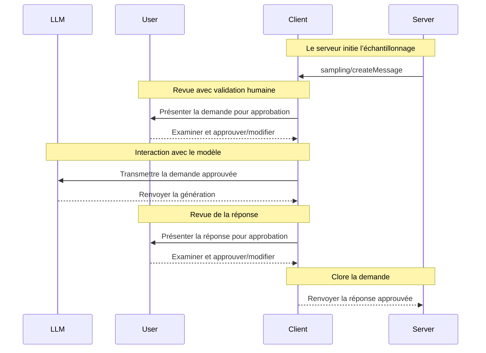

Les clients MCP sont instanciés par des applications hôtes pour communiquer avec des serveurs MCP spécifiques. L’application hôte, comme Claude.ai ou un IDE, gère l’expérience utilisateur globale et coordonne plusieurs clients. Chaque client gère une communication directe avec un serveur.

Il est important de comprendre la distinction : l’Hôte MCP est l’application avec laquelle les utilisateurs interagissent, tandis que les clients sont les composants au niveau du protocole qui permettent les connexions aux serveurs.

<div id="core-client-features">
  ## Fonctionnalités essentielles du client
</div>

En plus d’exploiter le contexte fourni par les serveurs, les clients peuvent offrir plusieurs fonctionnalités aux serveurs. Ces fonctionnalités côté client permettent aux auteurs de serveurs de créer des interactions plus riches.

| Fonctionnalité  | Explication                                                                                                                                                                                       | Exemple                                                                                                                                 |
| --------------- | ------------------------------------------------------------------------------------------------------------------------------------------------------------------------------------------------- | --------------------------------------------------------------------------------------------------------------------------------------- |
| **Échantillonnage**    | L’échantillonnage permet aux serveurs de demander des complétions LLM via le client, favorisant un flux de travail agentique. Cette approche place le client en contrôle total des autorisations utilisateur et des mesures de sécurité. | Un serveur de réservation de voyages peut envoyer une liste de vols à un LLM et lui demander de choisir le meilleur vol pour l’utilisateur. |
| **Racines**       | Les racines permettent aux clients de spécifier à quels fichiers les serveurs peuvent accéder, les guidant vers les répertoires pertinents tout en maintenant des limites de sécurité.                                                        | Un serveur de réservation de voyages peut recevoir l’accès à un répertoire spécifique, à partir duquel il peut lire l’agenda d’un utilisateur.                     |
| **Élicitation** | L’élicitation permet aux serveurs de demander des informations spécifiques aux utilisateurs pendant les interactions, offrant un moyen structuré de recueillir des informations à la demande.                               | Un serveur de réservation de voyages peut demander les préférences de l’utilisateur concernant les sièges d’avion, le type de chambre ou ses coordonnées pour finaliser une réservation. |

<div id="elicitation">
  ### Élicitation
</div>

L’élicitation permet aux serveurs de solliciter des informations précises auprès des utilisateurs au cours des interactions, afin de rendre les flux de travail plus dynamiques et réactifs.

<div id="overview">
  #### Vue d’ensemble
</div>

L’élicitation offre un moyen structuré aux serveurs de recueillir, à la demande, les informations nécessaires. Plutôt que d’exiger toutes les informations dès le départ ou d’échouer lorsqu’il en manque, les serveurs peuvent mettre leurs opérations en pause pour solliciter des saisies précises auprès des utilisateurs. Cela permet des interactions plus flexibles, où les serveurs s’adaptent aux besoins des utilisateurs au lieu de suivre des schémas rigides.

**Flux d’élicitation :**



Ce flux permet une collecte d’informations dynamique. Les serveurs peuvent demander des données spécifiques au moment opportun, les utilisateurs fournissent les informations via une interface adaptée, et les serveurs poursuivent le traitement avec le contexte nouvellement acquis.

**Exemple de composants d’élicitation :**

```typescript
{
  method: "elicitation/requestInput",
  params: {
    message: "Veuillez confirmer les détails de votre réservation de vacances à Barcelone :",
    schema: {
      type: "object",
      properties: {
        confirmBooking: {
          type: "boolean",
          description: "Confirmer la réservation (Vols + Hôtel = 3 000 $)"
        },
        seatPreference: {
          type: "string",
          enum: ["window", "aisle", "no preference"],
          description: "Type de siège préféré pour les vols"
        },
        roomType: {
          type: "string",
          enum: ["sea view", "city view", "garden view"],
          description: "Type de chambre préféré à l’hôtel"
        },
        travelInsurance: {
          type: "boolean",
          default: false,
          description: "Ajouter une assurance voyage (150 $)"
        }
      },
      required: ["confirmBooking"]
    }
  }
}
```

<div id="example-holiday-booking-approval">
  #### Exemple : Approbation d’une réservation de vacances
</div>

Un serveur de réservation de voyages illustre la puissance de l’élicitation lors de l’étape finale de confirmation. Lorsqu’un utilisateur a choisi son forfait vacances idéal pour Barcelone, le serveur doit obtenir l’approbation finale et recueillir les éventuels éléments manquants avant de poursuivre.

Le serveur sollicite la confirmation avec une demande structurée comprenant le récapitulatif du séjour (vols pour Barcelone du 15 au 22 juin, hôtel en bord de mer, total de 3 000 $) ainsi que des champs pour toute préférence supplémentaire — par exemple la sélection des sièges, le type de chambre ou les options d’assurance voyage.

Au fur et à mesure de l’avancement de la réservation, le serveur recueille les informations de contact nécessaires pour finaliser la procédure. Il peut demander les informations des voyageurs pour les billets d’avion, des demandes particulières pour l’hôtel, ou les coordonnées d’une personne à prévenir en cas d’urgence.

<div id="user-interaction-model">
  #### Modèle d’interaction utilisateur
</div>

Les interactions d’Élicitation sont conçues pour être claires, contextualisées et respectueuses de l’autonomie de l’utilisateur :

**Présentation de la demande** : Les clients affichent les demandes d’Élicitation avec un contexte clair indiquant quel serveur sollicite, pourquoi l’information est nécessaire et comment elle sera utilisée. Le message de demande expose l’objectif, tandis que le schéma définit la structure et la validation.

**Options de réponse** : Les utilisateurs peuvent fournir les informations demandées via des contrôles d’interface adaptés (champs de texte, listes déroulantes, cases à cocher), refuser de fournir des informations avec une explication facultative, ou annuler l’opération. Les clients valident les réponses par rapport au schéma fourni avant de les renvoyer aux serveurs.

**Considérations de confidentialité** : L’Élicitation ne demande jamais de mots de passe ni de clés API. Les clients signalent les demandes suspectes et permettent aux utilisateurs de revoir les données avant l’envoi.

<div id="roots">
  ### Racines
</div>

Les racines définissent des périmètres dans le système de fichiers pour les opérations du serveur, permettant aux clients d’indiquer sur quels répertoires les serveurs doivent intervenir.

<div id="overview">
  #### Vue d’ensemble
</div>

Les Racines sont un mécanisme permettant aux clients de communiquer aux serveurs les limites d’accès au système de fichiers. Elles se composent d’URI de fichiers indiquant les répertoires où les serveurs peuvent opérer, aidant ainsi ceux-ci à comprendre la portée des fichiers et dossiers disponibles. Plutôt que d’accorder aux serveurs un accès illimité au système de fichiers, les racines les guident vers des répertoires de travail pertinents tout en maintenant des limites de sécurité.

**Structure d’une racine :**

```json
{
  "uri": "file:///Users/agent/travel-planning",
  "name": "Travel Planning Workspace"
}
```

Les Racines correspondent exclusivement à des chemins du système de fichiers et utilisent toujours le schéma d’URI `file://`. Elles aident les serveurs à comprendre les limites du projet, l’organisation de l’espace de travail et les répertoires accessibles. La liste des racines peut être mise à jour dynamiquement au fil des projets ou dossiers utilisés par les utilisateurs, les serveurs recevant des notifications via `roots/list_changed` lorsque ces limites changent.

Il est important de noter que, bien que les racines indiquent aux serveurs où opérer, le client conserve toujours le contrôle total de l’accès aux fichiers. Les racines ne font que communiquer des limites prévues — l’accès effectif aux fichiers est toujours régi par les politiques de sécurité du client.

<div id="example-travel-planning-workspace">
  #### Exemple : espace de travail pour la planification de voyages
</div>

Un agent de voyages gérant plusieurs déplacements pour des clients tire parti des Racines pour organiser l’accès au système de fichiers. Imaginez un espace de travail avec différents répertoires couvrant divers aspects de la planification de voyages.

Le client fournit des Racines de système de fichiers au serveur de planification de voyages :

- `file:///Users/agent/travel-planning` - Espace de travail principal contenant tous les fichiers de voyage
- `file:///Users/agent/travel-templates` - Modèles d’itinéraires réutilisables et Ressources
- `file:///Users/agent/client-documents` - Passeports et documents de voyage des clients

Lorsque l’agent crée un itinéraire pour Barcelone, le serveur opère à l’intérieur de ces limites, en accédant aux modèles, en enregistrant le nouvel itinéraire et en référant les documents des clients. Il ne peut pas accéder à des fichiers en dehors de ces Racines. Les Serveurs accèdent généralement aux fichiers au sein des Racines en utilisant des chemins relatifs depuis les répertoires racines ou des outils de recherche de fichiers qui respectent les limites des Racines.

Si l’agent ouvre un dossier d’archives comme `file:///Users/agent/archive/2023-trips`, le client met à jour la liste des Racines via `roots/list_changed`.

<div id="user-interaction-model">
  #### Modèle d’interaction utilisateur
</div>

Les racines sont généralement gérées automatiquement par les applications hôtes en fonction des actions de l’utilisateur, bien que certaines applications puissent proposer une gestion manuelle des racines :

**Détection automatique des racines** : Lorsque les utilisateurs ouvrent des dossiers, les clients les exposent automatiquement comme racines. L’ouverture d’un espace de travail de voyage donne aux serveurs MCP accès aux itinéraires et aux documents de ce répertoire.

**Configuration manuelle des racines** : Les utilisateurs avancés peuvent spécifier des racines via la configuration. Par exemple, ajouter `/travel-templates` pour des ressources réutilisables tout en excluant les répertoires contenant des données financières.

<div id="sampling">
  ### Échantillonnage
</div>

L’échantillonnage permet aux serveurs de demander, via le client, des complétions de modèles de langage, ce qui autorise des comportements d’agent tout en préservant la sécurité et le contrôle de l’utilisateur.

<div id="overview">
  #### Aperçu
</div>

L’échantillonnage permet aux serveurs d’exécuter des tâches dépendantes de l’IA sans intégrer directement des modèles d’IA ni payer pour leur utilisation. À la place, les serveurs peuvent demander au client — qui a déjà accès aux modèles d’IA — de prendre en charge ces tâches en leur nom. Cette approche laisse au client le contrôle total des autorisations utilisateur et des mesures de sécurité. Comme les demandes d’échantillonnage interviennent dans le contexte d’autres opérations — par exemple un Outil qui analyse des données — et sont traitées comme des appels de modèle distincts, elles maintiennent des frontières claires entre les différents contextes, ce qui permet une utilisation plus efficace de la fenêtre de contexte.

Flux d’échantillonnage :



Ce flux garantit la sécurité grâce à plusieurs points de contrôle avec validation humaine. Les utilisateurs examinent et peuvent modifier à la fois la demande initiale et la réponse générée avant qu’elle ne soit renvoyée au serveur.

Exemple de paramètres de requête :

```typescript
{
  messages: [
    {
      role: "user",
      content: "Analyze these flight options and recommend the best choice:\n" +
               "[47 flights with prices, times, airlines, and layovers]\n" +
               "User preferences: morning departure, max 1 layover"
    }
  ],
  modelPreferences: {
    hints: [{
      name: "claude-3-5-sonnet"  // Suggested model
    }],
    costPriority: 0.3,      // Less concerned about API cost
    speedPriority: 0.2,     // Can wait for thorough analysis
    intelligencePriority: 0.9  // Need complex trade-off evaluation
  },
  systemPrompt: "You are a travel expert helping users find the best flights based on their preferences",
  maxTokens: 1500
}
```

<div id="example-flight-analysis-tool">
  #### Exemple : Outil d’analyse de vols
</div>

Imaginez un serveur de réservation de voyages avec un outil nommé `findBestFlight` qui utilise l’échantillonnage pour analyser les vols disponibles et recommander l’option optimale. Lorsqu’un utilisateur demande « Réserve-moi le meilleur vol pour Barcelone le mois prochain », l’outil a besoin de l’aide de l’IA pour évaluer des arbitrages complexes.

L’outil interroge des API de compagnies aériennes et réunit 47 options de vol. Il sollicite ensuite l’IA pour analyser ces options : « Analyse ces options de vol et recommande le meilleur choix : [47 vols avec prix, horaires, compagnies et escales] Préférences utilisateur : départ le matin, 1 escale max. »

Le client initie la requête d’échantillonnage, permettant à l’IA d’évaluer les arbitrages — par exemple des vols de nuit moins chers comparés à des départs matinaux plus pratiques. L’outil s’appuie sur cette analyse pour présenter les trois meilleures recommandations.

<div id="user-interaction-model">
  #### Modèle d’interaction utilisateur
</div>

Bien que non obligatoire, l’échantillonnage est conçu pour permettre un contrôle avec un humain dans la boucle. Les utilisateurs peuvent garder la main grâce à plusieurs mécanismes :

**Contrôles d’approbation** : les demandes d’échantillonnage peuvent nécessiter un consentement explicite de l’utilisateur. Les clients peuvent montrer ce que le serveur souhaite analyser et pourquoi. Les utilisateurs peuvent approuver, refuser ou modifier les demandes.

**Fonctionnalités de transparence** : les clients peuvent afficher l’invite exacte, la sélection du modèle et les limites de jetons, permettant aux utilisateurs de relire les réponses de l’IA avant leur renvoi au serveur.

**Options de configuration** : les utilisateurs peuvent définir des préférences de modèle, configurer l’approbation automatique pour les opérations de confiance ou exiger une approbation pour tout. Les clients peuvent proposer des options pour occulter les informations sensibles.

**Considérations de sécurité** : les clients et les serveurs doivent gérer correctement les données sensibles pendant l’échantillonnage. Les clients devraient mettre en œuvre une limitation de débit et valider tout le contenu des messages. La conception avec un humain dans la boucle garantit que les interactions IA initiées par le serveur ne peuvent pas compromettre la sécurité ni accéder à des données sensibles sans le consentement explicite de l’utilisateur.