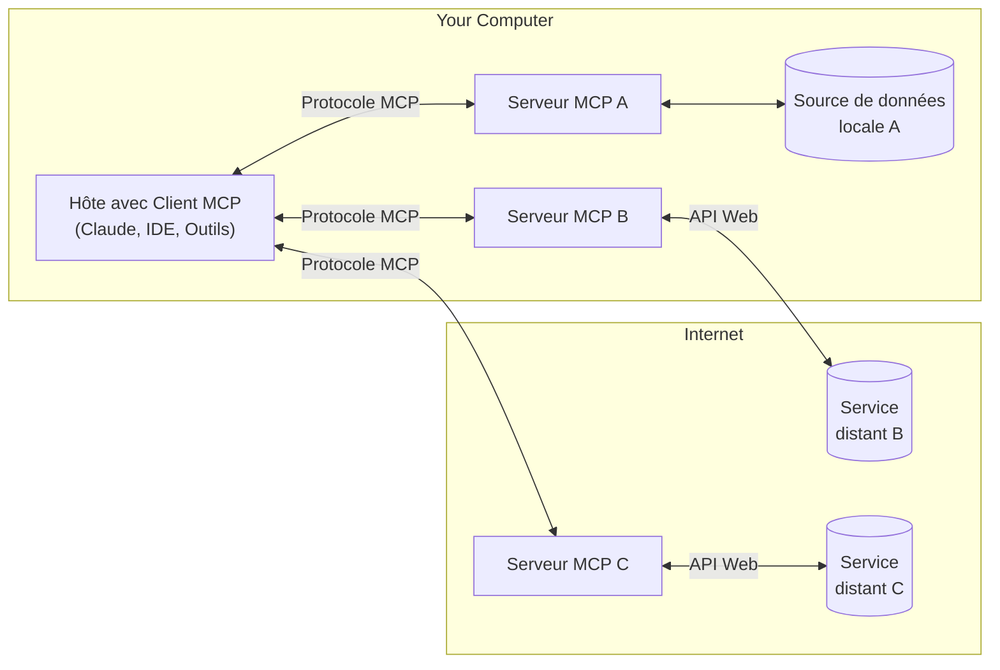

MCP est un protocole ouvert qui standardise la façon dont les applications fournissent du contexte aux LLM. Pensez à MCP comme à un port USB‑C pour les applications d’IA. De la même manière que l’USB‑C fournit un moyen standardisé de connecter vos appareils à divers périphériques et accessoires, MCP fournit un moyen standardisé de connecter les modèles d’IA à différentes sources de données et à des outils.

  ## Pourquoi MCP ?

MCP vous aide à créer des agents et des workflows complexes par-dessus des LLM. Les LLM doivent souvent s’intégrer à des données et à des Outils, et MCP offre :

* Une liste croissante d’intégrations prêtes à l’emploi auxquelles votre LLM peut se connecter directement
* La flexibilité de passer d’un fournisseur ou d’un prestataire de LLM à un autre
* Les meilleures pratiques pour sécuriser vos données au sein de votre infrastructure

  ### Architecture générale

Au cœur du système, le MCP suit une architecture client-serveur où une application hôte peut se connecter à plusieurs serveurs :

* **Hôtes MCP** : Programmes comme Claude Desktop, des IDE ou des outils d’IA qui souhaitent accéder à des données via le MCP
* **Clients MCP** : Clients de protocole qui maintiennent des connexions 1:1 avec des serveurs
* **Serveurs MCP** : Programmes légers qui exposent chacun des capacités spécifiques via le Model Context Protocol standardisé
* **Sources de données locales** : Les fichiers, bases de données et services de votre ordinateur auxquels les serveurs MCP peuvent accéder en toute sécurité
* **Services distants** : Systèmes externes disponibles sur Internet (par exemple via des API) auxquels les serveurs MCP peuvent se connecter

  ## Pour bien commencer

Choisissez le parcours qui correspond le mieux à vos besoins :

  ### Démarrages rapides

<CardGroup cols={2}>
  <Card title="Pour les développeurs de serveurs" icon="bolt" href="/fr/quickstart/server">
    Commencez à créer votre propre serveur pour l’utiliser dans Claude pour Desktop et d’autres
    clients
  </Card>

  <Card title="Pour les développeurs de clients" icon="bolt" href="/fr/quickstart/client">
    Commencez à créer votre propre client pouvant s’intégrer à tous les serveurs MCP
  </Card>

  <Card title="Pour les utilisateurs de Claude Desktop" icon="bolt" href="/fr/docs/develop/connect-local-servers">
    Commencez à utiliser des serveurs prêts à l’emploi dans Claude pour Desktop
  </Card>
</CardGroup>

  ### Exemples

<CardGroup cols={2}>
  <Card title="Serveurs d'exemples" icon="grid" href="/fr/examples">
    Découvrez notre galerie de serveurs MCP officiels et d’implémentations
  </Card>

  <Card title="Clients d'exemples" icon="cubes" href="/fr/clients">
    Consultez la liste des clients qui prennent en charge les intégrations MCP
  </Card>
</CardGroup>

  ## Tutoriels

<CardGroup cols={2}>
  <Card title="Construire MCP avec des LLM" icon="comments" href="/fr/tutorials/building-mcp-with-llms">
    Apprenez à utiliser des LLM comme Claude pour accélérer votre développement MCP
  </Card>

  <Card title="Guide de débogage" icon="bug" href="/fr/legacy/tools/debugging">
    Apprenez à déboguer efficacement les serveurs MCP et les intégrations
  </Card>

  <Card title="Inspecteur MCP" icon="magnifying-glass" href="/fr/legacy/tools/inspector">
    Testez et inspectez vos serveurs MCP avec notre outil de débogage interactif
  </Card>

  <Card title="Atelier MCP (vidéo, 2 h)" icon="person-chalkboard" href="https://www.youtube.com/watch?v=kQmXtrmQ5Zg">
    <iframe src="https://www.youtube.com/embed/kQmXtrmQ5Zg" />
  </Card>
</CardGroup>

  ## Explorer MCP

Approfondissez les concepts et capacités fondamentaux de MCP :

<CardGroup cols={2}>
  <Card title="Architecture de base" icon="sitemap" href="/fr/legacy/concepts/architecture">
    Découvrez comment MCP connecte les clients, les serveurs et les LLM
  </Card>

  <Card title="Ressources" icon="database" href="/fr/legacy/concepts/resources">
    Exposez des données et du contenu de vos serveurs aux LLM
  </Card>

  <Card title="Inviteurs" icon="message" href="/fr/legacy/concepts/prompts">
    Créez des modèles d’invite et des workflows réutilisables
  </Card>

  <Card title="Outils" icon="wrench" href="/fr/legacy/concepts/tools">
    Permettez aux LLM d’exécuter des actions via votre serveur
  </Card>

  <Card title="Échantillonnage" icon="robot" href="/fr/legacy/concepts/sampling">
    Laissez vos serveurs demander des complétions aux LLM
  </Card>

  <Card title="Transports" icon="network-wired" href="/fr/legacy/concepts/transports">
    Découvrez le mécanisme de communication de MCP
  </Card>
</CardGroup>

  ## Contribution

Vous souhaitez contribuer ? Consultez notre [guide de contribution](/fr/development/contributing) pour savoir comment vous pouvez aider à améliorer le Model Context Protocol (MCP).

  ## Support et commentaires

Voici comment obtenir de l’aide ou partager vos commentaires :

* Pour les signalements de bugs et les demandes de fonctionnalités concernant la spécification MCP, les SDK ou la documentation (open source), veuillez [créer une issue GitHub](https://github.com/modelcontextprotocol)
* Pour les discussions ou les questions/réponses au sujet de la spécification MCP, utilisez les [discussions de la spécification](https://github.com/modelcontextprotocol/specification/discussions)
* Pour les discussions ou les questions/réponses au sujet des autres composants open source de MCP, utilisez les [discussions de l’organisation](https://github.com/orgs/modelcontextprotocol/discussions)
* Pour les signalements de bugs, les demandes de fonctionnalités et les questions liées à l’intégration MCP de Claude.app et de claude.ai, veuillez consulter le guide d’Anthropic sur [Comment obtenir de l’assistance](https://support.anthropic.com/en/articles/9015913-how-to-get-support)