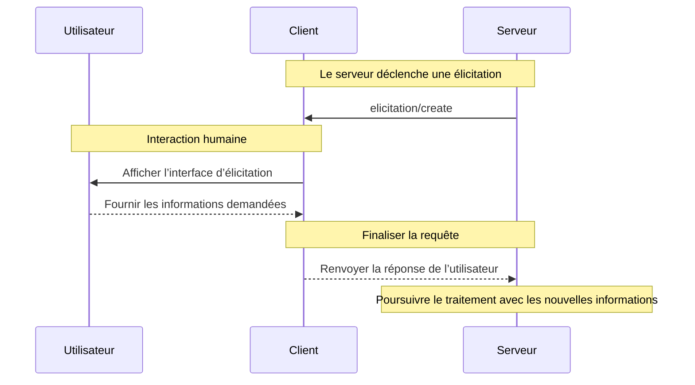

L’élicitation est une fonctionnalité puissante du MCP qui permet aux serveurs de solliciter des informations supplémentaires auprès des utilisateurs au cours des interactions. Elle permet des workflows dynamiques, où les serveurs peuvent obtenir à la demande les données nécessaires tout en préservant le contrôle et la confidentialité de l’utilisateur.

<Info>
  L’élicitation a été introduite récemment dans la spécification du MCP [révision
  2025-06-18](/fr/specification/2025-06-18/client/elicitation).
</Info>

<div id="what-is-elicitation">
  ## Qu'est-ce que l’élicitation ?
</div>

L’élicitation offre un moyen standardisé pour les serveurs MCP de demander des informations structurées aux utilisateurs via le client. Plutôt que d’exiger toutes les informations dès le départ, les serveurs peuvent solliciter des données spécifiques exactement au moment nécessaire, ce qui permet des interactions plus naturelles et plus flexibles.

Par exemple, un serveur peut :

* Demander un nom d’utilisateur lors de la connexion à un service
* Demander des préférences de configuration pendant la configuration
* Recueillir des détails sur le projet lors de la création de nouvelles ressources

<div id="how-elicitation-works">
  ## Fonctionnement de l’élicitation
</div>

Le déroulé de l’élicitation est simple :

1. Le serveur envoie une requête d’élicitation avec un message et la structure de données attendue
2. Le client présente la requête à l’utilisateur via une interface adaptée
3. L’utilisateur accepte, refuse ou annule la requête
4. Le client valide et renvoie la réponse au serveur
5. Le serveur poursuit le traitement avec les informations fournies

<div id="request-structure">
  ## Structure de la requête
</div>

Les requêtes d’Élicitation comportent deux éléments clés :

<div id="message">
  ### Message
</div>

Une explication claire et compréhensible précisant quelles informations sont nécessaires et pourquoi.

<div id="schema">
  ### Schéma
</div>

Un schéma JSON qui définit la structure attendue de la réponse. Le schéma est volontairement limité à des objets plats avec des types primitifs afin de simplifier l’implémentation du client.

Exemple de requête :

```json
{
  "message": "Please provide your GitHub username",
  "requestedSchema": {
    "type": "object",
    "properties": {
      "username": {
        "type": "string",
        "title": "Nom d’utilisateur GitHub",
        "description": "Votre nom d’utilisateur GitHub (p. ex., octocat)"
      }
    },
    "required": ["username"]
  }
}
```

<div id="supported-data-types">
  ## Types de données pris en charge
</div>

L’élicitation prend en charge les types primitifs suivants :

<div id="text-input">
  ### Saisie de texte
</div>

```json
{
  "type": "string",
  "title": "Nom du projet",
  "description": "Nom de votre nouveau projet",
  "minLength": 3,
  "maxLength": 50,
  "default": "my-project"
}
```

<div id="numbers">
  ### Nombres
</div>

```json
{
  "type": "number",
  "title": "Numéro de port",
  "description": "Port sur lequel faire tourner le serveur",
  "minimum": 1024,
  "maximum": 65535,
  "default": 3000
}
```

<div id="boolean-choices">
  ### Choix booléens
</div>

```json
{
  "type": "boolean",
  "title": "Activer les analyses",
  "description": "Envoyer des statistiques d’utilisation anonymes",
  "default": false
}
```

<div id="selection-lists">
  ### Listes de sélection
</div>

```json
{
  "type": "string",
  "title": "Environnement",
  "enum": ["development", "staging", "production"],
  "enumNames": ["Développement", "Préproduction", "Production"],
  "default": "development"
}
```

<div id="user-response-actions">
  ## Actions de réponse de l’utilisateur
</div>

Les utilisateurs peuvent répondre aux demandes d’élicitation de trois façons :

1. **Accepter** : l’utilisateur fournit les informations demandées
2. **Refuser** : l’utilisateur refuse explicitement de fournir des informations
3. **Annuler** : l’utilisateur ferme sans faire de choix (p. ex., ferme la boîte de dialogue)

Les serveurs doivent gérer chaque réponse de manière appropriée :

* Accepter → Traiter les données fournies
* Refuser → Proposer des alternatives ou ajuster le flux de travail
* Annuler → Envisager de réessayer plus tard ou d’utiliser des valeurs par défaut

<div id="best-practices">
  ## Bonnes pratiques
</div>

Lors de la mise en œuvre de l’élicitation :

<div id="for-servers">
  ### Pour les serveurs
</div>

1. **Soyez clair** : Rédigez des messages explicatifs indiquant pourquoi l’information est nécessaire
2. **Soyez minimaliste** : Ne demandez que les informations essentielles
3. **Soyez flexible** : Prévoyez des solutions de repli pour les demandes refusées ou annulées
4. **Soyez opportun** : Demandez les informations au moment où elles sont réellement nécessaires, pas de manière anticipée
5. **Soyez respectueux** : Ne demandez jamais d’informations sensibles comme des mots de passe ou des jetons

<div id="for-clients">
  ### Pour les clients
</div>

1. **Soyez transparent** : Indiquez clairement quel serveur demande des informations
2. **Soyez protecteur** : Permettez aux utilisateurs de consulter et de modifier les réponses
3. **Soyez rigoureux** : Vérifiez les réponses par rapport au schéma fourni
4. **Soyez facilitateur** : Mettez en évidence les options Refuser et Annuler
5. **Soyez restrictif** : Mettez en place une limitation du débit pour prévenir le spam

<div id="common-use-cases">
  ## Cas d’utilisation courants
</div>

L’Élicitation excelle dans des scénarios tels que :

* **Configuration initiale** : Recueillir la configuration lors de la première mise en place
* **Flux de travail dynamiques** : Demander des informations spécifiques au contexte
* **Préférences utilisateur** : Recueillir des paramètres et préférences facultatifs
* **Détails du projet** : Recueillir des métadonnées sur les Ressources en cours de création
* **Intégration de services** : Demander des noms d’utilisateur ou des identifiants pour des services externes

<div id="example-workflow">
  ## Exemple de workflow
</div>

Voici une interaction d’élicitation typique :



<div id="security-considerations">
  ## Considérations de sécurité
</div>

<Warning>
  Les serveurs ne doivent jamais utiliser l&#39;élicitation pour demander des mots de passe, des clés API, des jetons ou
  d&#39;autres identifiants sensibles. Utilisez plutôt des mécanismes d&#39;authentification appropriés.
</Warning>

Principes de sécurité clés :

1. Les serveurs ne doivent demander que des informations non sensibles
2. Les clients doivent indiquer clairement quel serveur sollicite les données
3. Les utilisateurs doivent toujours avoir la possibilité de refuser
4. Les réponses doivent être validées par rapport au schéma
5. Une limitation de débit doit empêcher l’« inondation » de requêtes

<div id="implementation-example">
  ## Exemple d’implémentation
</div>

Voici comment un serveur peut utiliser l’élicitation pour recueillir des informations sur un projet :

```typescript
// Le serveur demande les détails du projet
const response = await client.request("elicitation/create", {
  message: "Configurons votre nouveau projet",
  requestedSchema: {
    type: "object",
    properties: {
      name: {
        type: "string",
        title: "Nom du projet",
        description: "Un nom explicite pour votre projet",
      },
      framework: {
        type: "string",
        title: "Framework",
        enum: ["react", "vue", "angular", "none"],
        enumNames: ["React", "Vue", "Angular", "Aucun"],
      },
      useTypeScript: {
        type: "boolean",
        title: "Utiliser TypeScript",
        default: true,
      },
      port: {
        type: "number",
        title: "Port de développement",
        description: "Numéro de port pour le serveur de développement",
        default: 3000,
      },
    },
    required: ["name", "framework"],
  },
});

// Traiter la réponse
if (response.action === "accept") {
  // Créer le projet avec les détails fournis
  await createProject(response.content);
} else if (response.action === "decline") {
  // Utiliser les valeurs par défaut ou proposer des alternatives
  await createDefaultProject();
} else {
  // L’utilisateur a annulé — réessayez ultérieurement
  console.log("Création du projet annulée");
}
```

Cette approche offre une expérience fluide et interactive tout en respectant le contrôle et la confidentialité de l’utilisateur.