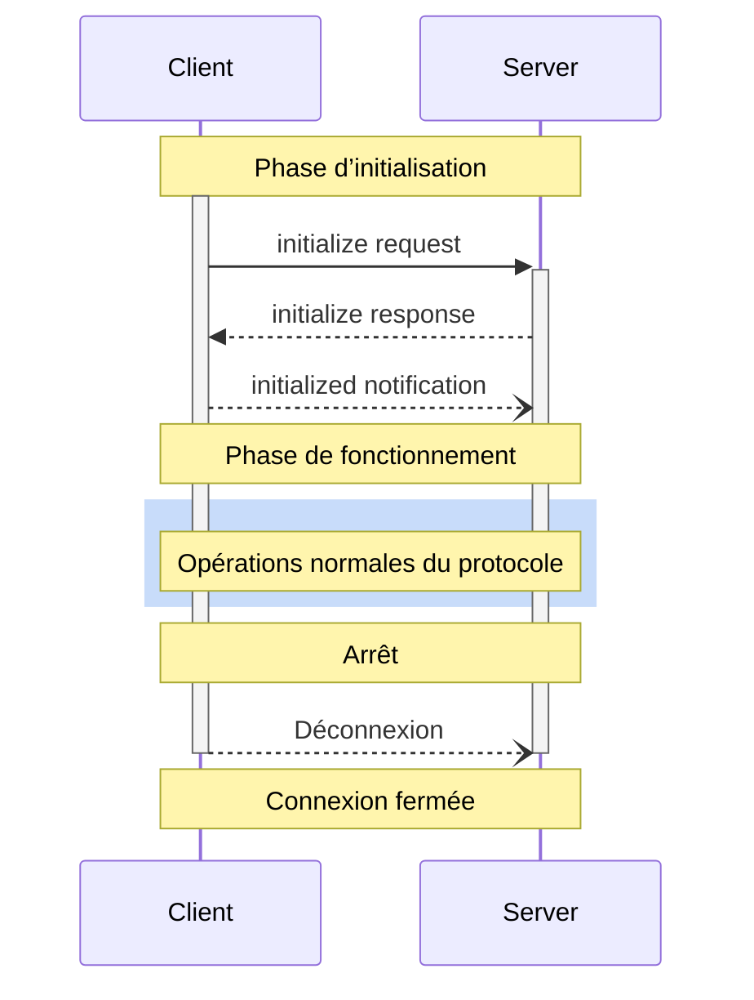

<Info>**Révision du protocole** : 2024-11-05</Info>

Le Protocole de contexte de modèle (MCP) définit un cycle de vie rigoureux pour les connexions client-serveur, garantissant une négociation correcte des capacités et une gestion appropriée de l’état.

1. **Initialisation** : Négociation des capacités et accord sur la version du protocole
2. **Fonctionnement** : Communication normale du protocole
3. **Arrêt** : Fermeture en douceur de la connexion



<div id="lifecycle-phases">
  ## Phases du cycle de vie
</div>

<div id="initialization">
  ### Initialisation
</div>

La phase d’initialisation **DOIT** être la première interaction entre le client et le serveur.
Pendant cette phase, le client et le serveur :

* Établissent la compatibilité de version du protocole
* Échangent et négocient leurs capacités
* Partagent des détails d’implémentation

Le client **DOIT** initier cette phase en envoyant une requête `initialize` contenant :

* La version du protocole prise en charge
* Les capacités du client
* Les informations sur l’implémentation du client

```json
{
  "jsonrpc": "2.0",
  "id": 1,
  "method": "initialize",
  "params": {
    "protocolVersion": "2024-11-05",
    "capabilities": {
      "roots": {
        "listChanged": true
      },
      "sampling": {}
    },
    "clientInfo": {
      "name": "ExampleClient",
      "version": "1.0.0"
    }
  }
}
```

Le serveur **DOIT** répondre avec ses propres capacités et informations :

```json
{
  "jsonrpc": "2.0",
  "id": 1,
  "result": {
    "protocolVersion": "2024-11-05",
    "capabilities": {
      "logging": {},
      "prompts": {
        "listChanged": true
      },
      "resources": {
        "subscribe": true,
        "listChanged": true
      },
      "tools": {
        "listChanged": true
      }
    },
    "serverInfo": {
      "name": "ExampleServer",
      "version": "1.0.0"
    }
  }
}
```

Après une initialisation réussie, le client **DOIT** envoyer une notification `initialized`
pour indiquer qu’il est prêt à commencer les opérations normales :

```json
{
  "jsonrpc": "2.0",
  "method": "notifications/initialized"
}
```

* Le client **NE DOIT PAS** envoyer d’autres requêtes que des
  [pings](/fr/specification/2024-11-05/basic/utilities/ping) avant que le serveur
  n’ait répondu à la requête `initialize`.
* Le serveur **NE DOIT PAS** envoyer d’autres requêtes que des
  [pings](/fr/specification/2024-11-05/basic/utilities/ping) et
  [logging](/fr/specification/2024-11-05/server/utilities/logging) avant de
  recevoir la notification `initialized`.

<div id="version-negotiation">
  #### Négociation de version
</div>

Dans la requête `initialize`, le client **DOIT** envoyer une version du protocole qu’il prend en charge.
Il **CONVIENT** que ce soit la *version la plus récente* prise en charge par le client.

Si le serveur prend en charge la version du protocole demandée, il **DOIT** répondre avec la même
version. Sinon, le serveur **DOIT** répondre avec une autre version du protocole qu’il
prend en charge. Il **CONVIENT** que ce soit la *version la plus récente* prise en charge par le serveur.

Si le client ne prend pas en charge la version figurant dans la réponse du serveur, il **DEVRAIT**
se déconnecter.

<div id="capability-negotiation">
  #### Négociation des capacités
</div>

Les capacités du client et du serveur déterminent quelles fonctionnalités optionnelles du protocole seront disponibles pendant la session.

Les principales capacités incluent :

| Catégorie | Capacité       | Description                                                                                 |
| --------- | -------------- | ------------------------------------------------------------------------------------------- |
| Client    | `roots`        | Possibilité de fournir des [Racines](/fr/specification/2024-11-05/client/roots) du système de fichiers |
| Client    | `sampling`     | Prise en charge des requêtes d’[Échantillonnage](/fr/specification/2024-11-05/client/sampling) LLM |
| Client    | `experimental` | Décrit la prise en charge de fonctionnalités expérimentales non standard                    |
| Serveur   | `prompts`      | Propose des [modèles d’Invites](/fr/specification/2024-11-05/server/prompts)                   |
| Serveur   | `resources`    | Fournit des [Ressources](/fr/specification/2024-11-05/server/resources) lisibles               |
| Serveur   | `tools`        | Expose des [Outils](/fr/specification/2024-11-05/server/tools) appelables                      |
| Serveur   | `logging`      | Émet des [messages structurés de journalisation](/fr/specification/2024-11-05/server/utilities/logging) |
| Serveur   | `experimental` | Décrit la prise en charge de fonctionnalités expérimentales non standard                    |

Les objets de capacité peuvent décrire des sous-capacités telles que :

* `listChanged` : prise en charge des notifications de modification de liste (pour les Invites, les Ressources et les Outils)
* `subscribe` : prise en charge de l’abonnement aux modifications d’éléments individuels (Ressources uniquement)

<div id="operation">
  ### Opération
</div>

Pendant la phase d’opération, le client et le serveur s’échangent des messages conformément aux
capacités négociées.

Les deux parties **DEVRAIENT** :

* Respecter la version du protocole négociée
* N’utiliser que les capacités négociées avec succès

<div id="shutdown">
  ### Arrêt
</div>

Pendant la phase d’arrêt, l’une des parties (généralement le client) met fin proprement à la connexion du protocole. Aucun message d’arrêt spécifique n’est défini ; le mécanisme de transport sous-jacent doit plutôt être utilisé pour signaler la fin de la connexion :

<div id="stdio">
  #### stdio
</div>

Pour le [transport](/fr/specification/2024-11-05/basic/transports) stdio, le
client **DEVRAIT** initier l’arrêt en :

1. Fermant d’abord le flux d’entrée vers le processus enfant (le serveur)
2. Attendant que le serveur se termine, ou en envoyant `SIGTERM` si le serveur ne se termine pas
   dans un délai raisonnable
3. Envoyant `SIGKILL` si le serveur ne se termine pas dans un délai raisonnable après `SIGTERM`

Le serveur **PEUT** initier l’arrêt en fermant son flux de sortie vers le client et en
quittant.

<div id="http">
  #### HTTP
</div>

Pour les [transports](/fr/specification/2024-11-05/basic/transports) HTTP, l’arrêt
est signalé par la fermeture de la ou des connexions HTTP associées.

<div id="error-handling">
  ## Gestion des erreurs
</div>

Les implémentations **DEVRAIENT** être prêtes à gérer les cas d’erreur suivants :

* Incompatibilité de version du protocole
* Échec de la négociation des capacités requises
* Délai d’expiration de la requête d’initialisation
* Délai d’expiration à l’arrêt

Les implémentations **DEVRAIENT** définir des délais d’expiration appropriés pour toutes les requêtes, afin d’éviter
les connexions bloquées et l’épuisement des ressources.

Exemple d’erreur d’initialisation :

```json
{
  "jsonrpc": "2.0",
  "id": 1,
  "error": {
    "code": -32602,
    "message": "Unsupported protocol version",
    "data": {
      "supported": ["2024-11-05"],
      "requested": "1.0.0"
    }
  }
}
```