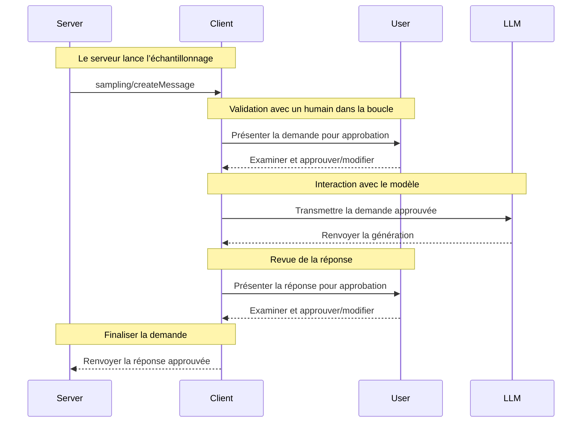

<Info>**Révision du protocole** : 2024-11-05</Info>

Le Protocole de contexte de modèle (MCP) fournit une méthode standardisée permettant aux serveurs de demander l’échantillonnage LLM (« complétions » ou « générations ») auprès de modèles de langage via des clients. Ce processus permet aux clients de garder le contrôle sur l’accès au modèle, sa sélection et les autorisations, tout en permettant aux serveurs de tirer parti des capacités de l’IA — sans qu’aucune clé d’API serveur ne soit nécessaire. Les serveurs peuvent demander des interactions textuelles ou basées sur des images et peuvent éventuellement inclure du contexte provenant des serveurs MCP dans leurs invites.

<div id="user-interaction-model">
  ## Modèle d’interaction utilisateur
</div>

L’échantillonnage dans le MCP permet aux serveurs d’implémenter des comportements agentiques, en autorisant des appels LLM à se produire de façon *imbriquée* au sein d’autres fonctionnalités de Serveur MCP.

Les implémentations sont libres d’exposer l’échantillonnage via tout modèle d’interface qui répond à leurs besoins — le protocole lui-même n’impose aucun modèle d’interaction utilisateur spécifique.

<Warning>
  Pour des raisons de confiance, de sûreté et de sécurité, il **FAUT** toujours
  qu’un humain reste dans la boucle et puisse refuser les demandes d’échantillonnage.

  Les applications **DOIVENT** :

  * Fournir une interface qui facilite et rende intuitive la revue des demandes d’échantillonnage
  * Permettre aux utilisateurs d’afficher et de modifier les invites avant l’envoi
  * Présenter les réponses générées pour relecture avant envoi
</Warning>

<div id="capabilities">
  ## Fonctionnalités
</div>

Les clients qui prennent en charge l’échantillonnage **DOIVENT** déclarer la fonctionnalité `sampling` lors de
[l’initialisation](/fr/specification/2024-11-05/basic/lifecycle#initialization) :

```json
{
  "capabilities": {
    "sampling": {}
  }
}
```

<div id="protocol-messages">
  ## Messages du protocole
</div>

<div id="creating-messages">
  ### Création de messages
</div>

Pour demander la génération par un modèle de langage, les serveurs envoient une requête `sampling/createMessage` :

**Requête :**

```json
{
  "jsonrpc": "2.0",
  "id": 1,
  "method": "sampling/createMessage",
  "params": {
    "messages": [
      {
        "role": "user",
        "content": {
          "type": "text",
          "text": "What is the capital of France?"
        }
      }
    ],
    "modelPreferences": {
      "hints": [
        {
          "name": "claude-3-sonnet"
        }
      ],
      "intelligencePriority": 0.8,
      "speedPriority": 0.5
    },
    "systemPrompt": "You are a helpful assistant.",
    "maxTokens": 100
  }
}
```

**Réponse :**

```json
{
  "jsonrpc": "2.0",
  "id": 1,
  "result": {
    "role": "assistant",
    "content": {
      "type": "text",
      "text": "The capital of France is Paris."
    },
    "model": "claude-3-sonnet-20240307",
    "stopReason": "endTurn"
  }
}
```

<div id="message-flow">
  ## Flux de messages
</div>



<div id="data-types">
  ## Types de données
</div>

<div id="messages">
  ### Messages
</div>

Les messages d’échantillonnage peuvent contenir :

<div id="text-content">
  #### Contenu textuel
</div>

```json
{
  "type": "text",
  "text": "Le contenu du message"
}
```

<div id="image-content">
  #### Contenu de l’image
</div>

```json
{
  "type": "image",
  "data": "base64-encoded-image-data",
  "mimeType": "image/jpeg"
}
```

<div id="model-preferences">
  ### Préférences de modèle
</div>

La sélection de modèles dans le MCP nécessite une abstraction soignée, car serveurs et clients peuvent utiliser
différents fournisseurs d’IA avec des offres de modèles distinctes. Un serveur ne peut pas simplement demander un
modèle précis par son nom, car le client peut ne pas avoir accès à ce modèle exact ou préférer
utiliser l’équivalent proposé par un autre fournisseur.

Pour y répondre, le MCP met en place un système de préférences qui combine des priorités de
capacités abstraites avec des suggestions de modèles facultatives :

<div id="capability-priorities">
  #### Priorités de capacités
</div>

Les serveurs expriment leurs besoins au moyen de trois valeurs de priorité normalisées (0-1) :

* `costPriority` : Quelle est l’importance de minimiser les coûts ? Des valeurs plus élevées privilégient les modèles moins coûteux.
* `speedPriority` : Quelle est l’importance d’une faible latence ? Des valeurs plus élevées privilégient les modèles plus rapides.
* `intelligencePriority` : Quelle est l’importance des capacités avancées ? Des valeurs plus élevées privilégient
  des modèles plus performants.

<div id="model-hints">
  #### Indications de modèle
</div>

Si les priorités aident à sélectionner des modèles selon leurs caractéristiques, les `hints` permettent aux serveurs de
suggérer des modèles ou des familles de modèles spécifiques :

* Les indications sont interprétées comme des sous-chaînes pouvant correspondre de manière flexible aux noms de modèles
* Plusieurs indications sont évaluées dans l’ordre de préférence
* Les clients **PEUVENT** faire correspondre des indications à des modèles équivalents proposés par d’autres fournisseurs
* Les indications sont consultatives—la sélection finale du modèle revient aux clients

Par exemple :

```json
{
  "hints": [
    { "name": "claude-3-sonnet" }, // Préférer les modèles de la classe Sonnet
    { "name": "claude" } // À défaut, utiliser n'importe quel modèle Claude
  ],
  "costPriority": 0.3, // Le coût est moins important
  "speedPriority": 0.8, // La vitesse est très importante
  "intelligencePriority": 0.5 // Capacités modérées requises
}
```

Le client traite ces préférences pour sélectionner un modèle approprié parmi les options disponibles.
Par exemple, si le client n’a pas accès aux modèles Claude mais dispose de Gemini,
il pourrait faire correspondre l’indication sonnet à `gemini-1.5-pro` sur la base de capacités similaires.

<div id="error-handling">
  ## Gestion des erreurs
</div>

Les clients **DEVRAIENT** renvoyer des erreurs pour les cas d’échec courants :

Exemple d’erreur :

```json
{
  "jsonrpc": "2.0",
  "id": 1,
  "error": {
    "code": -1,
    "message": "User rejected sampling request"
  }
}
```

<div id="security-considerations">
  ## Considérations de sécurité
</div>

1. Les clients **DEVRAIENT** mettre en place des contrôles d’approbation par l’utilisateur
2. Les deux parties **DEVRAIENT** valider le contenu des messages
3. Les clients **DEVRAIENT** tenir compte des préférences recommandées pour le modèle
4. Les clients **DEVRAIENT** appliquer une limitation du débit
5. Les deux parties **DOIVENT** gérer correctement les données sensibles