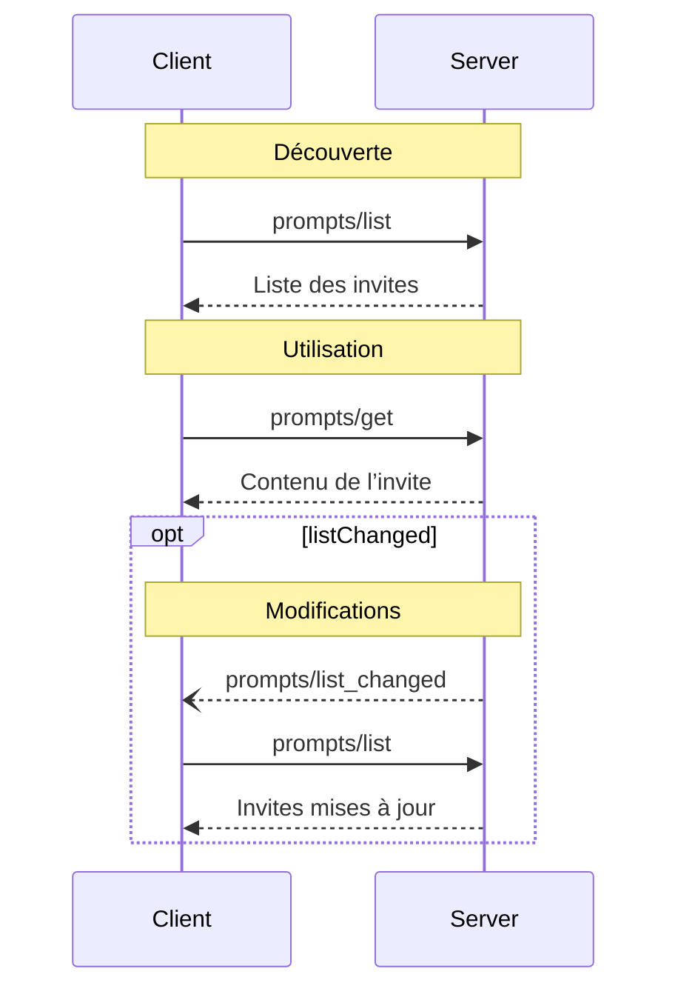

<Info>**Révision du protocole** : 2024-11-05</Info>

Le Protocole de contexte de modèle (MCP) fournit un moyen standardisé pour les serveurs d’exposer aux clients des modèles d’invite. Les invites permettent aux serveurs de fournir des messages structurés et des instructions pour interagir avec des modèles de langage. Les clients peuvent découvrir les invites disponibles, en récupérer le contenu et fournir des arguments pour les personnaliser.

<div id="user-interaction-model">
  ## Modèle d’interaction utilisateur
</div>

Les Invites sont conçues pour être **contrôlées par l’utilisateur**, c’est‑à‑dire qu’elles sont exposées par les serveurs aux clients afin que l’utilisateur puisse les sélectionner explicitement pour les utiliser.

En général, les invites sont déclenchées par des commandes initiées par l’utilisateur dans l’interface, ce qui permet aux utilisateurs de découvrir et d’invoquer naturellement les invites disponibles.

Par exemple, sous forme de commandes slash :


Cependant, les implémenteurs sont libres d’exposer des invites via tout modèle d’interface adapté à leurs besoins — le protocole lui‑même n’impose aucun modèle spécifique d’interaction avec l’utilisateur.

<div id="capabilities">
  ## Capacités
</div>

Les serveurs qui prennent en charge les Invites **DOIVENT** déclarer la capacité `prompts` lors de
l’[initialisation](/fr/specification/2024-11-05/basic/lifecycle#initialization) :

```json
{
  "capabilities": {
    "prompts": {
      "listChanged": true
    }
  }
}
```

`listChanged` indique si le serveur émettra des notifications lorsque la liste des Invites disponibles change.

<div id="protocol-messages">
  ## Messages du protocole
</div>

<div id="listing-prompts">
  ### Lister les invites
</div>

Pour obtenir la liste des invites disponibles, les clients envoient une requête `prompts/list`. Cette opération
prend en charge la
[pagination](/fr/specification/2024-11-05/server/utilities/pagination).

**Requête :**

```json
{
  "jsonrpc": "2.0",
  "id": 1,
  "method": "prompts/list",
  "params": {
    "cursor": "optional-cursor-value"
  }
}
```

**Réponse :**

```json
{
  "jsonrpc": "2.0",
  "id": 1,
  "result": {
    "prompts": [
      {
        "name": "code_review",
        "description": "Demande au LLM d’analyser la qualité du code et de proposer des améliorations",
        "arguments": [
          {
            "name": "code",
            "description": "Le code à examiner",
            "required": true
          }
        ]
      }
    ],
    "nextCursor": "next-page-cursor"
  }
}
```

<div id="getting-a-prompt">
  ### Récupérer une invite
</div>

Pour récupérer une invite spécifique, les clients envoient une requête `prompts/get`. Les arguments peuvent être
complétés automatiquement via [l’API de complétion](/fr/specification/2024-11-05/server/utilities/completion).

**Requête :**

```json
{
  "jsonrpc": "2.0",
  "id": 2,
  "method": "prompts/get",
  "params": {
    "name": "code_review",
    "arguments": {
      "code": "def hello():\n    print('world')"
    }
  }
}
```

**Réponse :**

```json
{
  "jsonrpc": "2.0",
  "id": 2,
  "result": {
    "description": "Invite d’examen de code",
    "messages": [
      {
        "role": "user",
        "content": {
          "type": "text",
          "text": "Veuillez examiner ce code Python :\ndef hello():\n    print('world')"
        }
      }
    ]
  }
}
```

<div id="list-changed-notification">
  ### Notification de modification de la liste
</div>

Lorsque la liste des invites disponibles change, les serveurs ayant déclaré la capacité `listChanged` **DEVRAIENT** envoyer une notification :

```json
{
  "jsonrpc": "2.0",
  "method": "notifications/prompts/list_changed"
}
```

<div id="message-flow">
  ## Flux de messages
</div>



<div id="data-types">
  ## Types de données
</div>

<div id="prompt">
  ### Invite
</div>

Une définition d’invite comprend :

* `name` : Identifiant unique de l’invite
* `description` : Brève description facultative
* `arguments` : Liste facultative de paramètres de personnalisation

<div id="promptmessage">
  ### PromptMessage
</div>

Les messages d’une invite peuvent contenir :

* `role` : « user » ou « assistant » pour indiquer le locuteur
* `content` : l’un des types de contenu suivants :

<div id="text-content">
  #### Contenu textuel
</div>

Le contenu textuel représente des messages en texte brut :

```json
{
  "type": "text",
  "text": "The text content of the message"
}
```

C’est le type de contenu le plus courant utilisé pour les interactions en langage naturel.

<div id="image-content">
  #### Contenu image
</div>

Le contenu image permet d’inclure des informations visuelles dans les messages :

```json
{
  "type": "image",
  "data": "base64-encoded-image-data",
  "mimeType": "image/png"
}
```

Les données d’image **DOIVENT** être encodées en base64 et inclure un type MIME valide. Cela permet des interactions multimodales lorsque le contexte visuel est important.

<div id="embedded-resources">
  #### Ressources intégrées
</div>

Les ressources intégrées permettent de référencer directement des ressources côté serveur dans les messages :

```json
{
  "type": "resource",
  "resource": {
    "uri": "resource://example",
    "mimeType": "text/plain",
    "text": "Resource content"
  }
}
```

Les ressources peuvent contenir soit du texte, soit des données binaires (blob) et **DOIVENT** inclure :

* Un URI de ressource valide
* Le type MIME approprié
* Soit du contenu textuel, soit des données blob encodées en base64

Les ressources intégrées permettent aux Invites d’intégrer en toute transparence du contenu géré par le serveur, comme
de la documentation, des exemples de code ou d’autres supports de référence, directement dans le flux
de la conversation.

<div id="error-handling">
  ## Gestion des erreurs
</div>

Les serveurs **DEVRAIENT** renvoyer des erreurs JSON-RPC standard pour les cas d’échec courants :

* Nom d’invite invalide : `-32602` (Paramètres invalides)
* Arguments requis manquants : `-32602` (Paramètres invalides)
* Erreurs internes : `-32603` (Erreur interne)

<div id="implementation-considerations">
  ## Considérations d’implémentation
</div>

1. Les serveurs **DEVRAIENT** valider les arguments d’invite avant le traitement
2. Les clients **DEVRAIENT** gérer la pagination pour les grandes listes d’invites
3. Les deux parties **DEVRAIENT** respecter la négociation des capacités

<div id="security">
  ## Sécurité
</div>

Les implémentations **DOIVENT** valider rigoureusement toutes les entrées et sorties des Invites afin de prévenir les attaques par injection et tout accès non autorisé aux ressources.