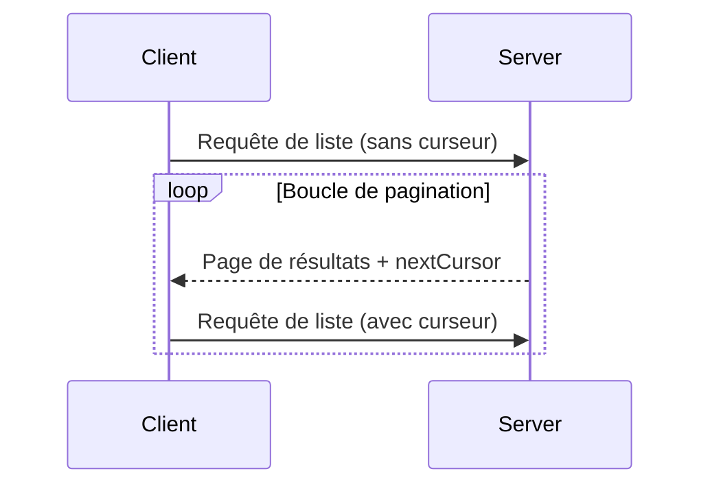

<Info>**Révision du protocole**: 2024-11-05</Info>

Le Protocole de contexte de modèle (MCP) prend en charge la pagination des opérations de liste susceptibles de renvoyer de grands volumes de résultats. La pagination permet aux serveurs de renvoyer les résultats par petits lots plutôt que tous d’un coup.

La pagination est particulièrement importante lors de la connexion à des services externes sur internet, mais elle est également utile pour les intégrations locales afin d’éviter des problèmes de performances avec de grands ensembles de données.

<div id="pagination-model">
  ## Modèle de pagination
</div>

La pagination dans MCP utilise une approche à curseur opaque, plutôt que des pages numérotées.

- Le **curseur** est un jeton de chaîne opaque représentant une position dans l’ensemble de résultats
- La **taille de page** est déterminée par le serveur et les clients **NE DOIVENT PAS** supposer une taille de page fixe

<div id="response-format">
  ## Format de réponse
</div>

La pagination commence lorsque le serveur envoie une **réponse** qui comprend :

- La page actuelle des résultats
- Un champ optionnel `nextCursor` s’il existe d’autres résultats

```json
{
  "jsonrpc": "2.0",
  "id": "123",
  "result": {
    "resources": [...],
    "nextCursor": "eyJwYWdlIjogM30="
  }
}
```

<div id="request-format">
  ## Format de la requête
</div>

Après avoir reçu un curseur, le client peut _continuer_ la pagination en envoyant une requête
qui inclut ce curseur :

```json
{
  "jsonrpc": "2.0",
  "method": "resources/list",
  "params": {
    "cursor": "eyJwYWdlIjogMn0="
  }
}
```

<div id="pagination-flow">
  ## Flux de pagination
</div>



<div id="operations-supporting-pagination">
  ## Opérations prenant en charge la pagination
</div>

Les opérations MCP suivantes prennent en charge la pagination :

- `resources/list` - Liste les ressources disponibles
- `resources/templates/list` - Liste les modèles de ressources
- `prompts/list` - Liste les invites disponibles
- `tools/list` - Liste les outils disponibles

<div id="implementation-guidelines">
  ## Directives de mise en œuvre
</div>

1. Les serveurs **DEVRAIENT** :
   - Fournir des curseurs stables
   - Gérer les curseurs invalides de manière robuste

2. Les clients **DEVRAIENT** :
   - Considérer l’absence de `nextCursor` comme la fin des résultats
   - Prendre en charge les parcours avec et sans pagination

3. Les clients **DOIVENT** traiter les curseurs comme des jetons opaques :
   - Ne faites aucune hypothèse sur le format du curseur
   - N’essayez pas d’interpréter ni de modifier les curseurs
   - Ne conservez pas les curseurs d’une session à l’autre

<div id="error-handling">
  ## Gestion des erreurs
</div>

Des curseurs invalides **DEVRAIENT** entraîner une erreur avec le code -32602 (paramètres invalides).