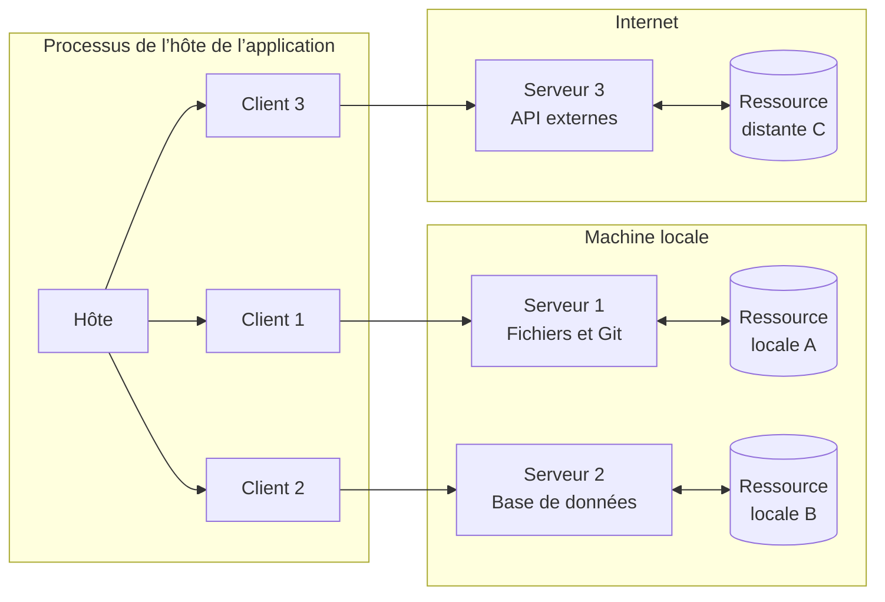
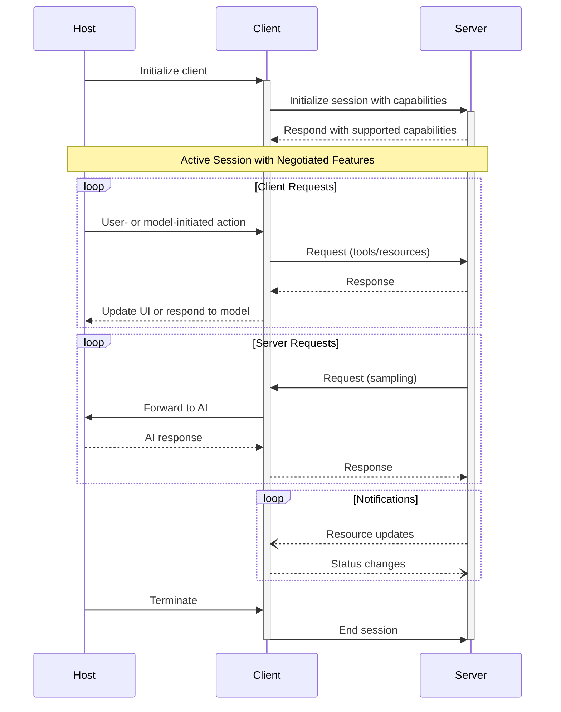

Le Protocole de contexte de modèle (MCP) adopte une architecture client-hôte-serveur dans laquelle chaque
hôte peut exécuter plusieurs instances de client. Cette architecture permet aux utilisateurs d’intégrer des
fonctionnalités d’IA à travers leurs applications tout en maintenant des périmètres de sécurité clairs et en
séparant les responsabilités. Fondé sur JSON-RPC 2.0, MCP fournit un protocole de session avec état, centré
sur l’échange de contexte et la coordination de l’échantillonnage entre clients et serveurs.

  ## Composants essentiels

  ### Hôte

Le processus hôte fait office de conteneur et de coordinateur :

* Crée et gère plusieurs instances de clients
* Contrôle les autorisations de connexion des clients et leur cycle de vie
* Fait respecter les politiques de sécurité et les exigences en matière de consentement
* Gère les décisions d’autorisation des utilisateurs
* Coordonne l’intégration IA/LLM et l’échantillonnage
* Gère l’agrégation de contexte entre clients

  ### Clients

Chaque client est créé par l’Hôte MCP et maintient une connexion à un Serveur MCP, isolée des autres :

* Établit une session avec état pour chaque serveur
* Gère la négociation du protocole et l’échange de capacités
* Achemine les messages du protocole bidirectionnellement
* Gère les abonnements et les notifications
* Maintient des frontières de sécurité entre les serveurs

Une application hôte crée et gère plusieurs clients, chacun ayant une relation 1:1
avec un serveur particulier.

  ### Serveurs

Les serveurs fournissent un contexte et des capacités spécialisés :

* Exposent des Ressources, des Outils et des Invites via les primitives MCP
* Fonctionnent de manière indépendante avec des responsabilités ciblées
* Demandent l’Échantillonnage via des interfaces client
* Doivent respecter les contraintes de sécurité
* Peuvent être des processus locaux ou des services distants

  ## Principes de conception

MCP repose sur plusieurs principes de conception clés qui guident son architecture et
son implémentation :

1. **Les serveurs doivent être extrêmement faciles à créer**
   * Les applications hôtes prennent en charge l’orchestration complexe
   * Les serveurs se concentrent sur des capacités spécifiques et bien définies
   * Des interfaces simples réduisent le coût d’implémentation
   * Une séparation claire favorise un code facile à maintenir

2. **Les serveurs doivent être hautement composables**
   * Chaque serveur fournit une fonctionnalité ciblée, de manière isolée
   * Plusieurs serveurs peuvent être combinés en toute transparence
   * Un protocole commun permet l’interopérabilité
   * Une conception modulaire facilite l’extensibilité

3. **Les serveurs ne doivent pas pouvoir lire l’intégralité de la conversation, ni “voir à l’intérieur” des autres
   serveurs**
   * Les serveurs ne reçoivent que les informations contextuelles nécessaires
   * L’historique complet de la conversation reste côté hôte
   * Chaque connexion de serveur conserve son isolation
   * Les interactions entre serveurs sont pilotées par l’hôte
   * Le processus hôte applique des frontières de sécurité

4. **Les fonctionnalités peuvent être ajoutées progressivement aux serveurs et aux clients**
   * Le protocole de base fournit le minimum fonctionnel requis
   * Des capacités supplémentaires peuvent être négociées selon les besoins
   * Les serveurs et les clients évoluent indépendamment
   * Le protocole est conçu pour être extensible à l’avenir
   * La compatibilité ascendante est préservée

  ## Négociation des capacités

Le Protocole de contexte de modèle (MCP) utilise un système de négociation basé sur les capacités, dans lequel les clients et les serveurs déclarent explicitement les fonctionnalités qu’ils prennent en charge lors de l’initialisation. Les capacités déterminent quelles fonctionnalités et primitives du protocole sont disponibles pendant une session.

* Les serveurs déclarent des capacités comme les abonnements aux ressources, la prise en charge des outils et les modèles d’invites
* Les clients déclarent des capacités comme la prise en charge de l’échantillonnage et la gestion des notifications
* Les deux parties doivent respecter les capacités déclarées tout au long de la session
* Des capacités supplémentaires peuvent être négociées via des extensions du protocole

Chaque capacité active des fonctionnalités spécifiques du protocole pour la session. Par exemple :

* Les [fonctionnalités du serveur](/fr/specification/2025-03-26/server) implémentées doivent être annoncées dans les capacités du serveur
* L’émission de notifications d’abonnement aux ressources nécessite que le serveur déclare la prise en charge des abonnements
* L’invocation d’outils nécessite que le serveur déclare des capacités relatives aux outils
* L’[échantillonnage](/fr/specification/2025-03-26/client) nécessite que le client déclare sa prise en charge dans ses capacités

Cette négociation des capacités garantit que les clients et les serveurs partagent une compréhension claire des fonctionnalités prises en charge, tout en préservant l’extensibilité du protocole.