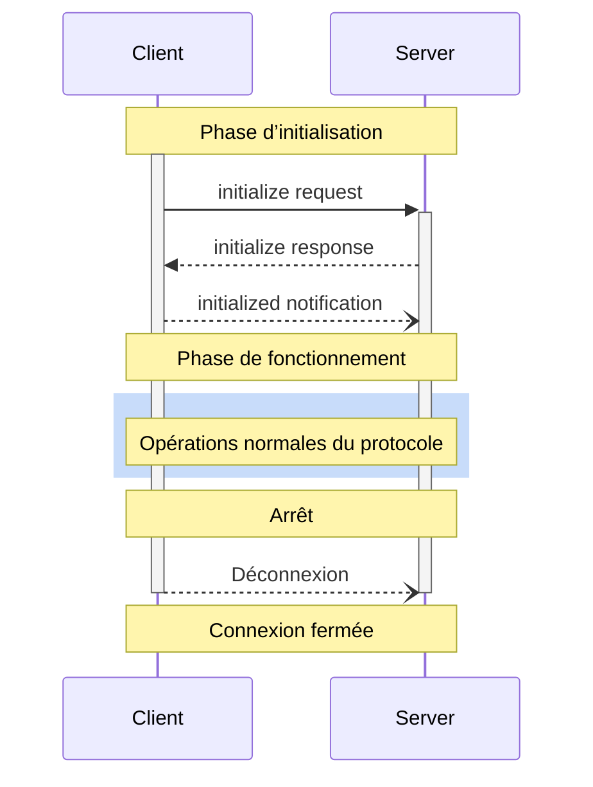

<Info>**Révision du protocole** : 2025-03-26</Info>

Le Protocole de contexte de modèle (MCP) définit un cycle de vie rigoureux pour les connexions client-serveur, garantissant une négociation des capacités et une gestion de l’état appropriées.

1. **Initialisation** : Négociation des capacités et accord sur la version du protocole
2. **Fonctionnement** : Communication normale via le protocole
3. **Arrêt** : Terminaison en douceur de la connexion



<div id="lifecycle-phases">
  ## Phases du cycle de vie
</div>

<div id="initialization">
  ### Initialisation
</div>

La phase d’initialisation **DOIT** être la première interaction entre le client et le serveur.
Pendant cette phase, le client et le serveur :

* Établissent la compatibilité de version du protocole
* Échangent et négocient les capacités
* Partagent des détails d’implémentation

Le client **DOIT** initier cette phase en envoyant une requête `initialize` contenant :

* Version du protocole prise en charge
* Capacités du client
* Informations sur l’implémentation du client

```json
{
  "jsonrpc": "2.0",
  "id": 1,
  "method": "initialize",
  "params": {
    "protocolVersion": "2025-03-26",
    "capabilities": {
      "roots": {
        "listChanged": true
      },
      "sampling": {}
    },
    "clientInfo": {
      "name": "ExampleClient",
      "version": "1.0.0"
    }
  }
}
```

La requête `initialize` **NE DOIT PAS** faire partie d’un
[lot](https://www.jsonrpc.org/specification#batch) JSON-RPC, car les autres requêtes et notifications
ne sont pas possibles tant que l’initialisation n’est pas terminée. Cela permet également une
compatibilité ascendante avec les versions antérieures du protocole qui ne prennent pas explicitement en charge les lots
JSON-RPC.

Le serveur **DOIT** répondre avec ses propres capacités et informations :

```json
{
  "jsonrpc": "2.0",
  "id": 1,
  "result": {
    "protocolVersion": "2025-03-26",
    "capabilities": {
      "logging": {},
      "prompts": {
        "listChanged": true
      },
      "resources": {
        "subscribe": true,
        "listChanged": true
      },
      "tools": {
        "listChanged": true
      }
    },
    "serverInfo": {
      "name": "ExampleServer",
      "version": "1.0.0"
    },
    "instructions": "Instructions facultatives pour le client"
  }
}
```

Après une initialisation réussie, le client **DOIT** envoyer une notification `initialized`
pour indiquer qu’il est prêt à commencer les opérations normales :

```json
{
  "jsonrpc": "2.0",
  "method": "notifications/initialized"
}
```

* Le client **NE DEVRAIT PAS** envoyer d’autres requêtes que des
  [pings](/fr/specification/2025-03-26/basic/utilities/ping) avant que le serveur ait répondu à la
  requête `initialize`.
* Le serveur **NE DEVRAIT PAS** envoyer d’autres requêtes que des
  [pings](/fr/specification/2025-03-26/basic/utilities/ping) et
  [logging](/fr/specification/2025-03-26/server/utilities/logging) avant de recevoir la notification
  `initialized`.

<div id="version-negotiation">
  #### Négociation de version
</div>

Dans la requête `initialize`, le client **DOIT** envoyer une version du protocole qu’il prend en charge.
Cela **DEVRAIT** être la *dernière* version prise en charge par le client.

Si le serveur prend en charge la version du protocole demandée, il **DOIT** répondre avec la même
version. Sinon, le serveur **DOIT** répondre avec une autre version du protocole qu’il
prend en charge. Cela **DEVRAIT** être la *dernière* version prise en charge par le serveur.

Si le client ne prend pas en charge la version indiquée dans la réponse du serveur, il **DEVRAIT**
se déconnecter.

<div id="capability-negotiation">
  #### Négociation des capacités
</div>

Les capacités du client et du serveur déterminent quelles fonctionnalités optionnelles du protocole seront disponibles pendant la session.

Capacités clés :

| Catégorie | Capacité       | Description                                                                                      |
| --------- | -------------- | ------------------------------------------------------------------------------------------------ |
| Client    | `roots`        | Possibilité de fournir des [Racines](/fr/specification/2025-03-26/client/roots) de système de fichiers |
| Client    | `sampling`     | Prise en charge des requêtes d&#39;[Échantillonnage](/fr/specification/2025-03-26/client/sampling) LLM |
| Client    | `experimental` | Décrit la prise en charge de fonctionnalités expérimentales non standard                        |
| Serveur   | `prompts`      | Propose des [modèles d&#39;Invites](/fr/specification/2025-03-26/server/prompts)                       |
| Serveur   | `resources`    | Fournit des [Ressources](/fr/specification/2025-03-26/server/resources) lisibles                   |
| Serveur   | `tools`        | Expose des [Outils](/fr/specification/2025-03-26/server/tools) appelables                          |
| Serveur   | `logging`      | Émet des [messages de journal](/fr/specification/2025-03-26/server/utilities/logging) structurés   |
| Serveur   | `completions`  | Prend en charge l&#39;[autocomplétion](/fr/specification/2025-03-26/server/utilities/completion) des arguments |
| Serveur   | `experimental` | Décrit la prise en charge de fonctionnalités expérimentales non standard                        |

Les objets de capacité peuvent décrire des sous-capacités telles que :

* `listChanged` : Prise en charge des notifications de modification de listes (pour les Invites, Ressources et Outils)
* `subscribe` : Prise en charge de l’abonnement aux changements d’éléments individuels (Ressources uniquement)

<div id="operation">
  ### Opération
</div>

Pendant la phase d’opération, le client et le serveur échangent des messages conformément aux
capacités négociées.

Les deux parties **DEVRAIENT** :

* Respecter la version du protocole négociée
* N’utiliser que les capacités ayant été négociées avec succès

<div id="shutdown">
  ### Arrêt
</div>

Pendant la phase d’arrêt, l’une des parties (généralement le client) met fin proprement à la connexion du protocole. Aucun message d’arrêt spécifique n’est défini — il convient plutôt d’utiliser le mécanisme de transport sous-jacent pour signaler la fin de la connexion :

<div id="stdio">
  #### stdio
</div>

Pour le [transport](/fr/specification/2025-03-26/basic/transports) stdio, le client **DEVRAIT** initier
l’arrêt en procédant comme suit :

1. Fermer d’abord le flux d’entrée vers le processus enfant (le serveur)
2. Attendre que le serveur se termine, ou envoyer `SIGTERM` si le serveur ne s’arrête pas
   dans un délai raisonnable
3. Envoyer `SIGKILL` si le serveur ne s’arrête pas dans un délai raisonnable après `SIGTERM`

Le serveur **PEUT** initier l’arrêt en fermant son flux de sortie vers le client et
en quittant.

<div id="http">
  #### HTTP
</div>

Pour les [transports](/fr/specification/2025-03-26/basic/transports) HTTP, l’arrêt est indiqué par la fermeture des connexions HTTP associées.

<div id="timeouts">
  ## Délais d’expiration
</div>

Les implémentations **DEVRAIENT** définir des délais d’expiration pour toutes les requêtes envoyées, afin d’éviter les connexions bloquées et l’épuisement des ressources. Lorsque la requête n’a pas reçu de réponse de succès ou d’erreur dans le délai imparti, l’expéditeur **DEVRAIT** émettre une [notification d’annulation](/fr/specification/2025-03-26/basic/utilities/cancellation) pour cette requête et cesser d’attendre une réponse.

Les SDK et autres intergiciels **DEVRAIENT** permettre de configurer ces délais d’expiration requête par requête.

Les implémentations **PEUVENT** choisir de réinitialiser le compteur du délai d’expiration à la réception d’une [notification de progression](/fr/specification/2025-03-26/basic/utilities/progress) correspondant à la requête, car cela implique qu’un travail est effectivement en cours. Cependant, les implémentations **DEVRAIENT** toujours imposer un délai d’expiration maximal, indépendamment des notifications de progression, afin de limiter l’impact d’un client ou d’un serveur défaillant.

<div id="error-handling">
  ## Gestion des erreurs
</div>

Les implémentations **DEVRAIENT** être prêtes à gérer ces cas d’erreur :

* Incompatibilité de version du protocole
* Échec de la négociation des capacités requises
* [Expiration](#timeouts) des requêtes

Exemple d’erreur lors de l’initialisation :

```json
{
  "jsonrpc": "2.0",
  "id": 1,
  "error": {
    "code": -32602,
    "message": "Unsupported protocol version",
    "data": {
      "supported": ["2024-11-05"],
      "requested": "1.0.0"
    }
  }
}
```