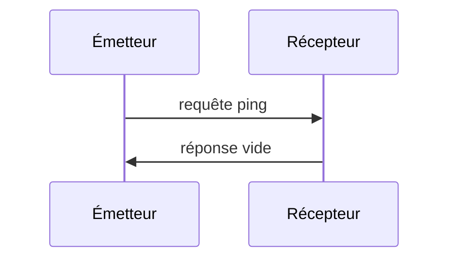

<Info>**Révision du protocole** : 2025-03-26</Info>

Le Protocole de contexte de modèle (MCP) comprend un mécanisme de ping optionnel permettant à chaque partie de vérifier que son homologue reste réactif et que la connexion est toujours active.

<div id="overview">
  ## Vue d’ensemble
</div>

La fonctionnalité de ping est implémentée selon un simple modèle requête-réponse. Le client comme le serveur peut initier un ping en envoyant une requête `ping`.

<div id="message-format">
  ## Format du message
</div>

Une requête de ping est une requête JSON-RPC standard sans paramètres :

```json
{
  "jsonrpc": "2.0",
  "id": "123",
  "method": "ping"
}
```

<div id="behavior-requirements">
  ## Exigences de comportement
</div>

1. Le récepteur **DOIT** répondre rapidement par une réponse vide :

```json
{
  "jsonrpc": "2.0",
  "id": "123",
  "result": {}
}
```

2. Si aucune réponse n’est reçue dans un délai raisonnable, l’émetteur **PEUT** :
   - Considérer la connexion comme expirée
   - Mettre fin à la connexion
   - Tenter une reconnexion

<div id="usage-patterns">
  ## Schémas d’utilisation
</div>



<div id="implementation-considerations">
  ## Considérations d’implémentation
</div>

- Les implémentations **DEVRAIENT** envoyer périodiquement des pings pour surveiller l’état de la connexion
- La fréquence des pings **DEVRAIT** être configurable
- Les délais d’expiration **DEVRAIENT** être adaptés à l’environnement réseau
- Un ping trop fréquent **DEVRAIT** être évité afin de réduire la surcharge réseau

<div id="error-handling">
  ## Gestion des erreurs
</div>

- Les délais d’expiration **DOIVENT** être traités comme des défaillances de connexion
- Plusieurs pings échoués **PEUVENT** entraîner une réinitialisation de la connexion
- Les implémentations **DEVRAIENT** consigner les échecs de ping à des fins de diagnostic