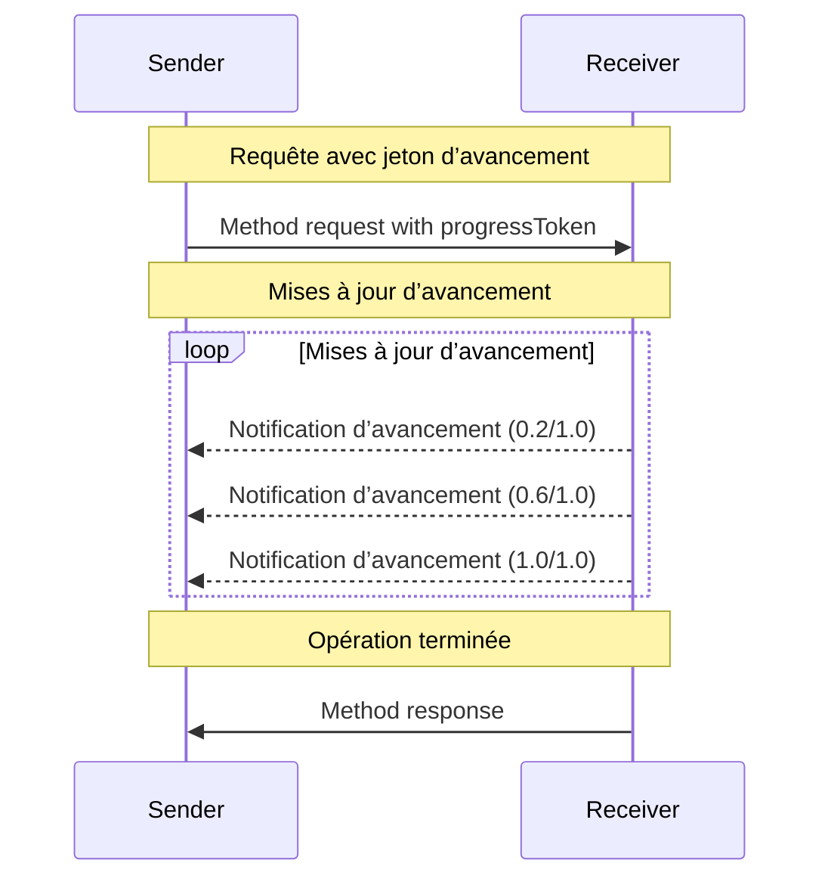

<Info>**Révision du protocole** : 2025-03-26</Info>

Le Protocole de contexte de modèle (MCP) prend en charge le suivi optionnel de la progression pour les opérations de longue durée via des messages de notification. Chaque partie peut envoyer des notifications de progression afin de fournir des mises à jour sur l’état de l’opération.

<div id="progress-flow">
  ## Flux de progression
</div>

Lorsqu’une partie souhaite _recevoir_ des mises à jour de progression pour une requête, elle inclut un
`progressToken` dans les métadonnées de la requête.

- Les jetons de progression **DOIVENT** être une valeur de type chaîne ou entier
- Les jetons de progression peuvent être choisis par l’expéditeur par n’importe quel moyen, mais **DOIVENT** être uniques
  pour l’ensemble des requêtes actives.

```json
{
  "jsonrpc": "2.0",
  "id": 1,
  "method": "some_method",
  "params": {
    "_meta": {
      "progressToken": "abc123"
    }
  }
}
```

Le destinataire **PEUT** ensuite envoyer des notifications de progression contenant :

- Le jeton de progression d’origine
- La valeur de progression actuelle
- Une valeur « total » facultative
- Une valeur « message » facultative

```json
{
  "jsonrpc": "2.0",
  "method": "notifications/progress",
  "params": {
    "progressToken": "abc123",
    "progress": 50,
    "total": 100,
    "message": "Reticulating splines..."
  }
}
```

- La valeur `progress` **DOIT** augmenter à chaque notification, même si le total est
  inconnu.
- Les valeurs `progress` et `total` **PEUVENT** être des nombres à virgule flottante.
- Le champ `message` **DEVRAIT** fournir des informations de progression pertinentes et lisibles par un humain.

<div id="behavior-requirements">
  ## Exigences de comportement
</div>

1. Les notifications d’avancement **DOIVENT** uniquement faire référence à des jetons qui :
   - Ont été fournis dans une requête active
   - Sont associés à une opération en cours

2. Les destinataires des requêtes d’avancement **PEUVENT** :
   - Choisir de ne pas envoyer de notifications d’avancement
   - Envoyer des notifications à la fréquence qu’ils jugent appropriée
   - Omettre la valeur totale si elle est inconnue



<div id="implementation-notes">
  ## Notes d’implémentation
</div>

- Les émetteurs et les récepteurs **DEVRAIENT** suivre les jetons de progression actifs
- Les deux parties **DEVRAIENT** mettre en place une limitation de débit pour éviter la surcharge
- Les notifications de progression **DOIVENT** s’arrêter une fois l’opération terminée