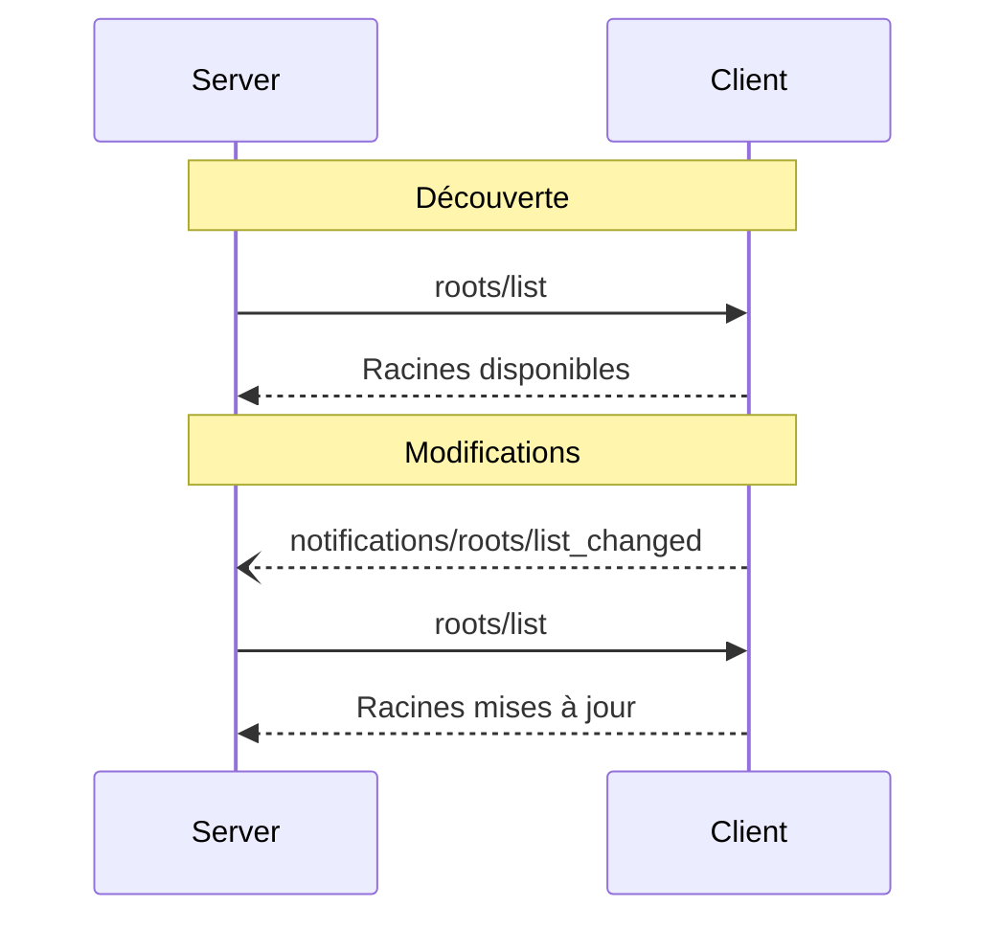

<Info>**Révision du protocole** : 2025-03-26</Info>

Le Protocole de contexte de modèle (MCP) offre un moyen standardisé pour les clients d’exposer des « racines » de système de fichiers aux serveurs. Les racines définissent les périmètres dans lesquels les serveurs peuvent intervenir dans le système de fichiers, leur indiquant les répertoires et fichiers auxquels ils ont accès. Les serveurs peuvent demander la liste des racines aux clients compatibles et recevoir des notifications lorsque cette liste est modifiée.

<div id="user-interaction-model">
  ## Modèle d’interaction utilisateur
</div>

Les Racines dans MCP sont généralement exposées via des interfaces de configuration d’espaces de travail ou de projets.

Par exemple, les implémentations peuvent proposer un sélecteur d’espace de travail/projet qui permet aux utilisateurs de
choisir les répertoires et les fichiers auxquels le serveur doit avoir accès. Cela peut être combiné à
la détection automatique de l’espace de travail à partir des systèmes de contrôle de version ou des fichiers de projet.

Cependant, les implémentations sont libres d’exposer les Racines via n’importe quel modèle d’interface qui
répond à leurs besoins — le protocole lui-même n’impose aucun modèle d’interaction
utilisateur spécifique.

<div id="capabilities">
  ## Capacités
</div>

Les clients qui prennent en charge les Racines **DOIVENT** déclarer la capacité `roots` lors de
l&#39;[initialisation](/fr/specification/2025-03-26/basic/lifecycle#initialization) :

```json
{
  "capabilities": {
    "roots": {
      "listChanged": true
    }
  }
}
```

`listChanged` indique si le client émettra des notifications lorsque la liste des Racines
évolue.

<div id="protocol-messages">
  ## Messages du protocole
</div>

<div id="listing-roots">
  ### Lister les Racines
</div>

Pour obtenir les racines, les serveurs envoient une requête `roots/list` :

**Requête :**

```json
{
  "jsonrpc": "2.0",
  "id": 1,
  "method": "roots/list"
}
```

**Réponse :**

```json
{
  "jsonrpc": "2.0",
  "id": 1,
  "result": {
    "roots": [
      {
        "uri": "file:///home/user/projects/myproject",
        "name": "My Project"
      }
    ]
  }
}
```

<div id="root-list-changes">
  ### Modifications de la liste des Racines
</div>

Lorsque les Racines changent, les clients qui prennent en charge `listChanged` **DOIVENT** envoyer une notification :

```json
{
  "jsonrpc": "2.0",
  "method": "notifications/roots/list_changed"
}
```

<div id="message-flow">
  ## Flux des messages
</div>



<div id="data-types">
  ## Types de données
</div>

<div id="root">
  ### Racine
</div>

Une définition de racine comprend :

* `uri` : Identifiant unique de la racine. Il **DOIT** s’agir d’un URI `file://` dans la
  spécification actuelle.
* `name` : Nom facultatif, lisible par l’utilisateur, à des fins d’affichage.

Exemples de racines pour différents cas d’utilisation :

<div id="project-directory">
  #### Répertoire du projet
</div>

```json
{
  "uri": "file:///home/user/projects/myproject",
  "name": "Mon projet"
}
```

<div id="multiple-repositories">
  #### Dépôts multiples
</div>

```json
[
  {
    "uri": "file:///home/user/repos/frontend",
    "name": "Dépôt Frontend"
  },
  {
    "uri": "file:///home/user/repos/backend",
    "name": "Dépôt Backend"
  }
]
```

<div id="error-handling">
  ## Gestion des erreurs
</div>

Les clients DEVRAIENT renvoyer des erreurs JSON-RPC standard pour les cas d’échec courants :

* Le client ne prend pas en charge les Racines : `-32601` (Méthode introuvable)
* Erreurs internes : `-32603`

Exemple d’erreur :

```json
{
  "jsonrpc": "2.0",
  "id": 1,
  "error": {
    "code": -32601,
    "message": "Racines non prises en charge",
    "data": {
      "reason": "Le client ne dispose pas de la fonctionnalité Racines"
    }
  }
}
```

<div id="security-considerations">
  ## Considérations de sécurité
</div>

1. Les clients **DOIVENT** :
   * N’exposer que des Racines avec des autorisations appropriées
   * Valider toutes les URI de Racine pour prévenir les traversées de chemin
   * Mettre en place des contrôles d’accès adaptés
   * Surveiller l’accessibilité des Racines

2. Les serveurs **DEVRAIENT** :
   * Gérer les cas où les Racines deviennent indisponibles
   * Respecter les limites des Racines lors des opérations
   * Valider tous les chemins par rapport aux Racines fournies

<div id="implementation-guidelines">
  ## Directives d’implémentation
</div>

1. Les clients **DEVRAIENT** :
   * Demander le consentement des utilisateurs avant d’exposer des Racines aux serveurs
   * Fournir des interfaces utilisateur claires pour la gestion des Racines
   * Valider l’accessibilité des Racines avant de les exposer
   * Surveiller les modifications des Racines

2. Les serveurs **DEVRAIENT** :
   * Vérifier la prise en charge des Racines avant utilisation
   * Gérer correctement les modifications de la liste des Racines
   * Respecter les limites des Racines lors des opérations
   * Mettre en cache les informations sur les Racines de manière appropriée