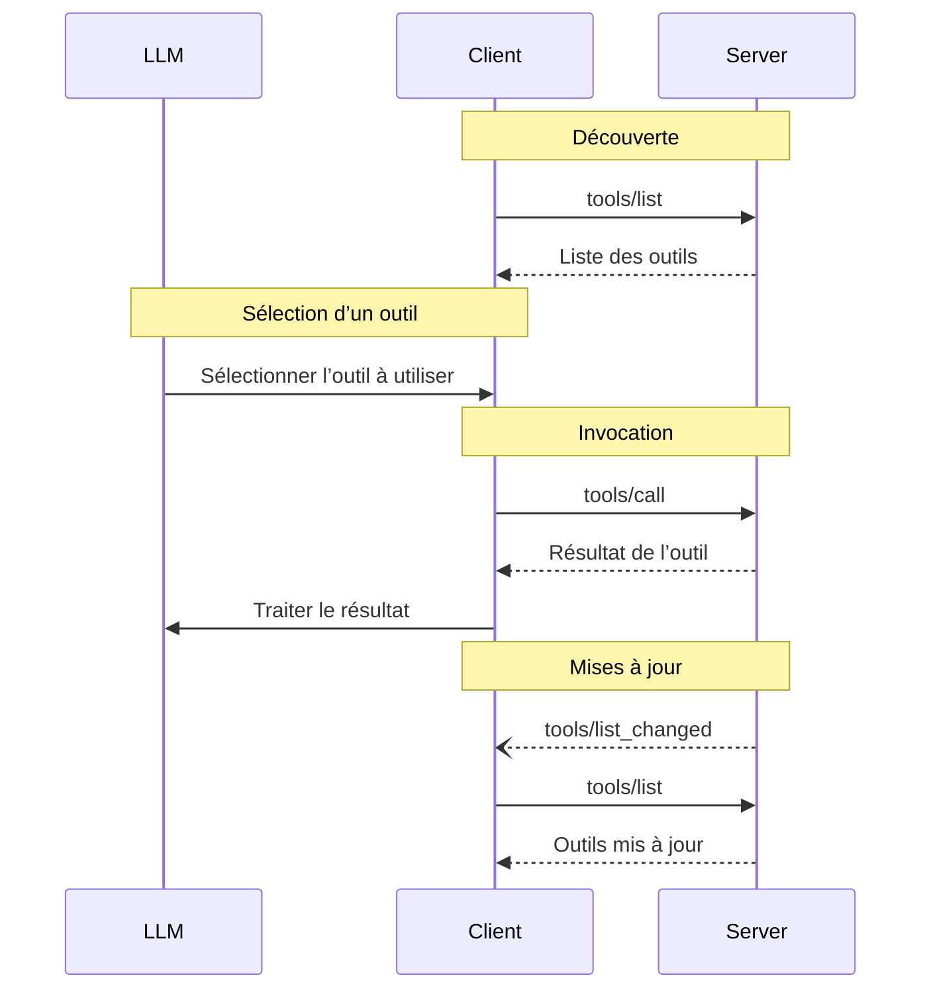

<Info>**Révision du protocole** : 2025-03-26</Info>

Le Protocole de contexte de modèle (MCP) permet aux serveurs d’exposer des outils qui peuvent être invoqués par des modèles de langage. Les outils permettent aux modèles d’interagir avec des systèmes externes, comme interroger des bases de données, appeler des API ou exécuter des calculs. Chaque outil est identifié de manière unique par un nom et inclut des métadonnées décrivant son schéma.

<div id="user-interaction-model">
  ## Modèle d’interaction utilisateur
</div>

Les Outils dans le Protocole de contexte de modèle (MCP) sont conçus pour être **contrôlés par le modèle**, ce qui signifie que le modèle de langage peut
découvrir et invoquer des outils automatiquement en fonction de sa compréhension contextuelle et des
Invites de l’utilisateur.

Cependant, les implémentations sont libres d’exposer des outils via n’importe quel modèle d’interface qui
répond à leurs besoins—le protocole lui-même n’impose aucun modèle d’interaction
utilisateur spécifique.

<Warning>
  Pour la confiance, la sûreté et la sécurité, il **DEVRAIT** toujours
  y avoir un humain dans la boucle, avec la possibilité de refuser des invocations d’outils.

  Les applications **DEVRAIENT** :

  * Fournir une interface utilisateur qui indique clairement quels outils sont exposés au modèle d’IA
  * Afficher des indicateurs visuels clairs lorsque des outils sont invoqués
  * Présenter des invites de confirmation à l’utilisateur pour les opérations, afin de s’assurer qu’un humain reste dans la
    boucle
</Warning>

<div id="capabilities">
  ## Capacités
</div>

Les serveurs qui prennent en charge les Outils **DOIVENT** déclarer la capacité `tools` :

```json
{
  "capabilities": {
    "tools": {
      "listChanged": true
    }
  }
}
```

`listChanged` indique si le serveur émettra des notifications lorsque la liste des Outils disponibles change.

<div id="protocol-messages">
  ## Messages du protocole
</div>

<div id="listing-tools">
  ### Répertorier les outils
</div>

Pour découvrir les outils disponibles, les clients envoient une requête `tools/list`. Cette opération prend en charge la
[pagination](/fr/specification/2025-03-26/server/utilities/pagination).

**Requête :**

```json
{
  "jsonrpc": "2.0",
  "id": 1,
  "method": "tools/list",
  "params": {
    "cursor": "optional-cursor-value"
  }
}
```

**Réponse :**

```json
{
  "jsonrpc": "2.0",
  "id": 1,
  "result": {
    "tools": [
      {
        "name": "get_weather",
        "description": "Obtenir les informations météorologiques actuelles pour un lieu",
        "inputSchema": {
          "type": "object",
          "properties": {
            "location": {
              "type": "string",
              "description": "Nom de la ville ou code postal"
            }
          },
          "required": ["location"]
        }
      }
    ],
    "nextCursor": "next-page-cursor"
  }
}
```

<div id="calling-tools">
  ### Appeler des outils
</div>

Pour invoquer un outil, les clients envoient une requête `tools/call` :

**Requête :**

```json
{
  "jsonrpc": "2.0",
  "id": 2,
  "method": "tools/call",
  "params": {
    "name": "get_weather",
    "arguments": {
      "location": "New York"
    }
  }
}
```

**Réponse :**

```json
{
  "jsonrpc": "2.0",
  "id": 2,
  "result": {
    "content": [
      {
        "type": "text",
        "text": "Météo actuelle à New York :\nTempérature : 72 °F\nConditions : partiellement nuageux"
      }
    ],
    "isError": false
  }
}
```

<div id="list-changed-notification">
  ### Notification de modification de la liste
</div>

Lorsque la liste des outils disponibles change, les serveurs MCP qui ont déclaré la fonctionnalité `listChanged`
DEVRAIENT envoyer une notification :

```json
{
  "jsonrpc": "2.0",
  "method": "notifications/tools/list_changed"
}
```

<div id="message-flow">
  ## Flux des messages
</div>



<div id="data-types">
  ## Types de données
</div>

<div id="tool">
  ### Outil
</div>

Une définition d’outil comprend :

* `name` : Identifiant unique de l’outil
* `description` : Description compréhensible par l’humain de la fonctionnalité
* `inputSchema` : Schéma JSON définissant les paramètres attendus
* `annotations` : Propriétés optionnelles décrivant le comportement de l’outil

<Warning>
  Pour des raisons de confiance, de sûreté et de sécurité, les clients **DOIVENT** considérer
  les annotations d’outil comme non fiables, sauf si elles proviennent de serveurs de confiance.
</Warning>

<div id="tool-result">
  ### Résultat de l’outil
</div>

Les résultats de l’outil peuvent contenir plusieurs éléments de contenu de différents types :

<div id="text-content">
  #### Contenu textuel
</div>

```json
{
  "type": "text",
  "text": "Texte du résultat de l'outil"
}
```

<div id="image-content">
  #### Contenu de l’image
</div>

```json
{
  "type": "image",
  "data": "base64-encoded-data",
  "mimeType": "image/png"
}
```

<div id="audio-content">
  #### Contenu audio
</div>

```json
{
  "type": "audio",
  "data": "base64-encoded-audio-data",
  "mimeType": "audio/wav"
}
```

<div id="embedded-resources">
  #### Ressources intégrées
</div>

Les [Ressources](/fr/specification/2025-03-26/server/resources) **PEUVENT** être intégrées afin de fournir un contexte
ou des données supplémentaires, derrière un URI auquel le client peut s’abonner ou qu’il peut récupérer de nouveau ultérieurement :

```json
{
  "type": "resource",
  "resource": {
    "uri": "resource://example",
    "mimeType": "text/plain",
    "text": "Resource content"
  }
}
```

<div id="error-handling">
  ## Gestion des erreurs
</div>

Les Outils utilisent deux mécanismes de signalement des erreurs :

1. **Erreurs de protocole** : erreurs JSON-RPC standard pour des problèmes tels que :
   * Outils inconnus
   * Arguments invalides
   * Erreurs serveur

2. **Erreurs d’exécution d’outil** : signalées dans les résultats d’outil avec `isError: true` :
   * Échecs d’API
   * Données d’entrée invalides
   * Erreurs de logique métier

Exemple d’erreur de protocole :

```json
{
  "jsonrpc": "2.0",
  "id": 3,
  "error": {
    "code": -32602,
    "message": "Unknown tool: invalid_tool_name"
  }
}
```

Exemple d’erreur d’exécution d’outil :

```json
{
  "jsonrpc": "2.0",
  "id": 4,
  "result": {
    "content": [
      {
        "type": "text",
        "text": "Failed to fetch weather data: API rate limit exceeded"
      }
    ],
    "isError": true
  }
}
```

<div id="security-considerations">
  ## Considérations de sécurité
</div>

1. Les serveurs **DOIVENT** :
   * Valider toutes les entrées des outils
   * Mettre en place des contrôles d’accès adaptés
   * Limiter le taux d’invocation des outils
   * Assainir les sorties des outils

2. Les clients **DEVRAIENT** :
   * Demander la confirmation de l’utilisateur pour les opérations sensibles
   * Afficher les entrées des outils à l’utilisateur avant d’appeler le serveur, afin d’éviter toute exfiltration de données malveillante ou
     accidentelle
   * Valider les résultats des outils avant de les transmettre au LLM
   * Mettre en place des délais d’expiration pour les appels d’outils
   * Consigner l’utilisation des outils à des fins d’audit