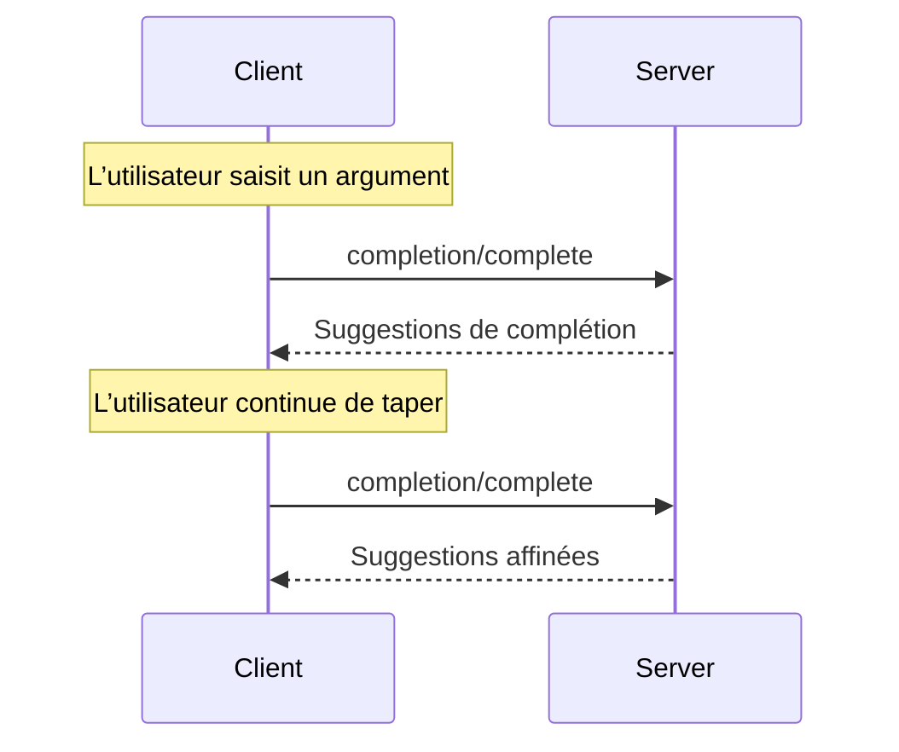

<Info>**Révision du protocole** : 2025-03-26</Info>

Le Protocole de contexte de modèle (MCP) fournit une méthode standardisée permettant aux serveurs de proposer
des suggestions de complétion d’arguments pour les invites et les URI de ressources. Cela permet des expériences
riches, de type IDE, où les utilisateurs reçoivent des suggestions contextuelles lors de la saisie des valeurs d’arguments.

<div id="user-interaction-model">
  ## Modèle d’interaction utilisateur
</div>

La complétion dans le MCP est conçue pour prendre en charge des expériences utilisateur interactives similaires à l’auto-complétion de code dans les IDE.

Par exemple, les applications peuvent afficher des suggestions de complétion dans un menu déroulant ou une fenêtre contextuelle au fur et à mesure que l’utilisateur saisit du texte, avec la possibilité de filtrer et de sélectionner parmi les options disponibles.

Cependant, les implémentations sont libres d’exposer la complétion via n’importe quel modèle d’interface qui répond à leurs besoins — le protocole lui-même n’impose aucun modèle d’interaction utilisateur spécifique.

<div id="capabilities">
  ## Capacités
</div>

Les serveurs qui prennent en charge les complétions **DOIVENT** déclarer la capacité `completions` :

```json
{
  "capabilities": {
    "completions": {}
  }
}
```

<div id="protocol-messages">
  ## Messages du protocole
</div>

<div id="requesting-completions">
  ### Demander des suggestions de complétion
</div>

Pour obtenir des suggestions de complétion, les clients envoient une requête `completion/complete` précisant
l’élément à compléter via un type de référence :

**Requête :**

```json
{
  "jsonrpc": "2.0",
  "id": 1,
  "method": "completion/complete",
  "params": {
    "ref": {
      "type": "ref/prompt",
      "name": "code_review"
    },
    "argument": {
      "name": "language",
      "value": "py"
    }
  }
}
```

**Réponse :**

```json
{
  "jsonrpc": "2.0",
  "id": 1,
  "result": {
    "completion": {
      "values": ["python", "pytorch", "pyside"],
      "total": 10,
      "hasMore": true
    }
  }
}
```

<div id="reference-types">
  ### Types de références
</div>

Le protocole prend en charge deux types de références de complétion :

| Type           | Description                          | Exemple                                             |
| -------------- | ------------------------------------ | --------------------------------------------------- |
| `ref/prompt`   | Référence une Invite par son nom     | `{"type": "ref/prompt", "name": "code_review"}`     |
| `ref/resource` | Référence l’URI d’une Ressource      | `{"type": "ref/resource", "uri": "file:///{path}"}` |

<div id="completion-results">
  ### Résultats de complétion
</div>

Les serveurs renvoient un tableau de valeurs de complétion classées par pertinence, comprenant :

- Jusqu’à 100 éléments par réponse
- Nombre total facultatif de correspondances disponibles
- Booléen indiquant la présence de résultats supplémentaires

<div id="message-flow">
  ## Flux de messages
</div>



<div id="data-types">
  ## Types de données
</div>

<div id="completerequest">
  ### CompleteRequest
</div>

- `ref`: Un `PromptReference` ou un `ResourceReference`
- `argument`: Objet contenant :
  - `name`: Nom de l’argument
  - `value`: Valeur actuelle

<div id="completeresult">
  ### CompleteResult
</div>

- `completion`: Objet contenant :
  - `values`: Tableau de suggestions (max. 100)
  - `total`: Nombre total de correspondances (facultatif)
  - `hasMore`: Indicateur de résultats supplémentaires

<div id="error-handling">
  ## Gestion des erreurs
</div>

Les serveurs **DEVRAIENT** renvoyer des erreurs JSON-RPC standard pour les cas d’échec courants :

- Méthode introuvable : `-32601` (Fonctionnalité non prise en charge)
- Nom d’invite invalide : `-32602` (Paramètres invalides)
- Arguments requis manquants : `-32602` (Paramètres invalides)
- Erreurs internes : `-32603` (Erreur interne)

<div id="implementation-considerations">
  ## Considérations d’implémentation
</div>

1. Les serveurs **DEVRAIENT** :
   - Renvoyer des suggestions triées par pertinence
   - Mettre en œuvre une correspondance floue lorsque cela est approprié
   - Limiter le débit des requêtes de complétion
   - Valider toutes les entrées

2. Les clients **DEVRAIENT** :
   - Déclencher un anti-rebond (debounce) pour les requêtes de complétion rapides
   - Mettre en cache les résultats de complétion lorsque cela est approprié
   - Gérer élégamment les résultats manquants ou partiels

<div id="security">
  ## Sécurité
</div>

Les implémentations **DOIVENT** :

- Valider toutes les entrées de complétion
- Mettre en œuvre une limitation de débit appropriée
- Contrôler l’accès aux suggestions sensibles
- Empêcher les fuites d’informations liées aux complétions