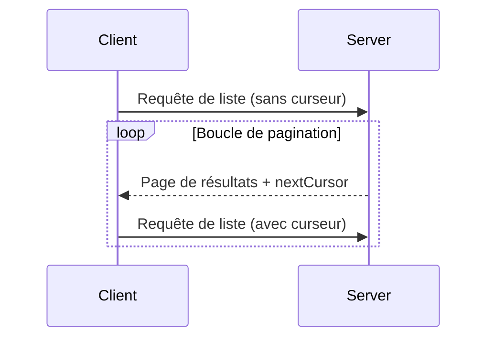

<Info>**Révision du protocole**: 2025-03-26</Info>

Le Protocole de contexte de modèle (MCP) prend en charge la pagination des opérations de liste susceptibles de renvoyer de grands volumes de résultats. La pagination permet aux serveurs de fournir les résultats par petits lots plutôt que tous d’un coup.

Elle est particulièrement importante lors de la connexion à des services externes via internet, et utile également pour les intégrations locales afin d’éviter des problèmes de performance avec de grands jeux de données.

<div id="pagination-model">
  ## Modèle de pagination
</div>

Dans le Protocole de contexte de modèle (MCP), la pagination utilise une approche à base de curseur opaque, plutôt que des pages numérotées.

- Le **curseur** est un jeton de chaîne opaque qui représente une position dans l’ensemble de résultats
- La **taille de page** est déterminée par le serveur, et les clients **NE DOIVENT PAS** présumer d’une taille de page fixe

<div id="response-format">
  ## Format de réponse
</div>

La pagination commence lorsque le serveur envoie une **réponse** qui inclut :

- La page de résultats en cours
- Un champ optionnel `nextCursor` s’il reste d’autres résultats

```json
{
  "jsonrpc": "2.0",
  "id": "123",
  "result": {
    "resources": [...],
    "nextCursor": "eyJwYWdlIjogM30="
  }
}
```

<div id="request-format">
  ## Format de requête
</div>

Après avoir reçu un curseur, le client peut _continuer_ la pagination en envoyant une requête
qui inclut ce curseur :

```json
{
  "jsonrpc": "2.0",
  "method": "resources/list",
  "params": {
    "cursor": "eyJwYWdlIjogMn0="
  }
}
```

<div id="pagination-flow">
  ## Flux de pagination
</div>



<div id="operations-supporting-pagination">
  ## Opérations prenant en charge la pagination
</div>

Les opérations MCP suivantes prennent en charge la pagination :

- `resources/list` - Lister les ressources disponibles
- `resources/templates/list` - Lister les modèles de ressources
- `prompts/list` - Lister les invites disponibles
- `tools/list` - Lister les outils disponibles

<div id="implementation-guidelines">
  ## Directives d’implémentation
</div>

1. Les serveurs **DEVRAIENT** :
   - Fournir des curseurs stables
   - Gérer correctement les curseurs invalides

2. Les clients **DEVRAIENT** :
   - Considérer l’absence de `nextCursor` comme la fin des résultats
   - Prendre en charge les flux avec ou sans pagination

3. Les clients **DOIVENT** traiter les curseurs comme des jetons opaques :
   - Ne faites aucune hypothèse sur le format des curseurs
   - N’essayez pas d’interpréter ni de modifier les curseurs
   - Ne conservez pas les curseurs entre les sessions

<div id="error-handling">
  ## Gestion des erreurs
</div>

Des curseurs invalides **DEVRAIENT** entraîner une erreur avec le code -32602 (Paramètres invalides).