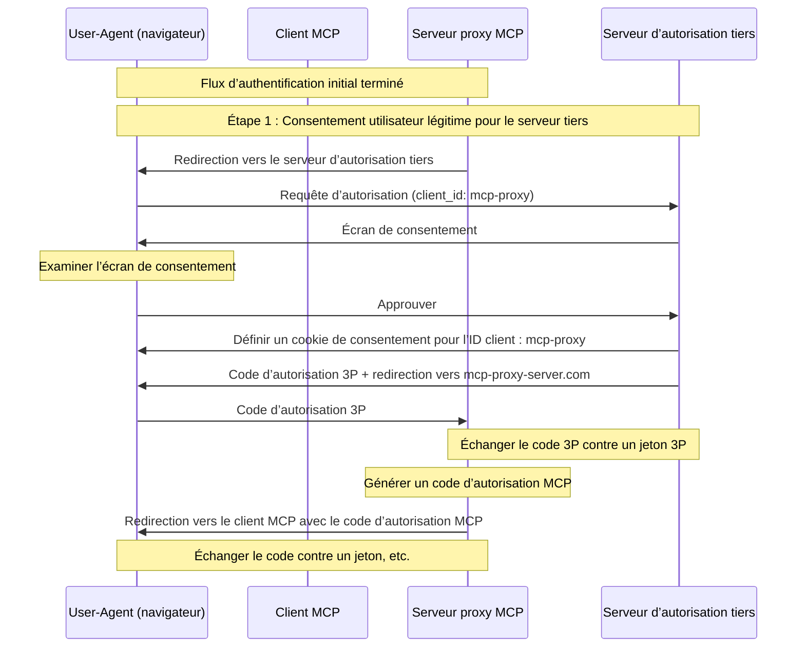
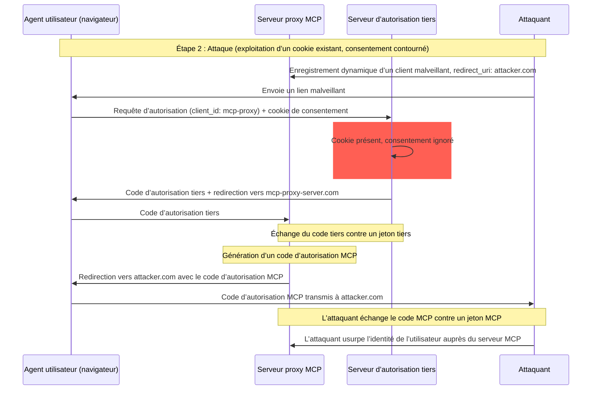
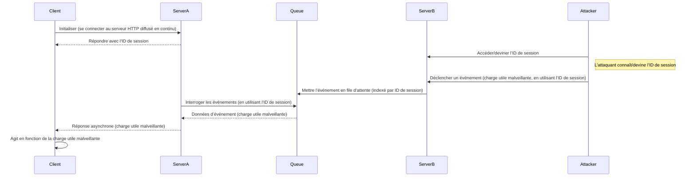
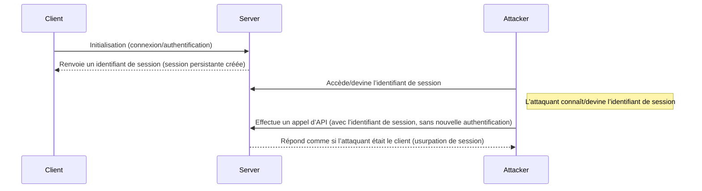

  ## Introduction

  ### Objectif et portée

Ce document présente des considérations de sécurité pour le Protocole de contexte de modèle (MCP), en complément de la spécification d’autorisation MCP. Il identifie les risques de sécurité, les vecteurs d’attaque et les bonnes pratiques propres aux implémentations MCP.

Le public principal de ce document comprend les développeurs implémentant des flux d’autorisation MCP, les exploitants de Serveurs MCP et les professionnels de la sécurité évaluant des systèmes basés sur MCP. Ce document doit être lu conjointement avec la spécification d’autorisation MCP et les [bonnes pratiques de sécurité OAuth 2.0](https://datatracker.ietf.org/doc/html/rfc9700).

  ## Attaques et mesures d’atténuation

Cette section présente une description détaillée des attaques contre les implémentations du Protocole de contexte de modèle (MCP), ainsi que des contre-mesures possibles.

  ### Problème du « deputy confus »

Des attaquants peuvent exploiter des serveurs MCP jouant le rôle de proxy pour d’autres serveurs de ressources, créant des vulnérabilités de type [« deputy confus »](https://en.wikipedia.org/wiki/Confused_deputy_problem).

  #### Terminologie

**Serveur mandataire MCP**
: Un serveur MCP qui connecte des clients MCP à des API tierces, offrant des fonctionnalités MCP tout en déléguant les opérations et en agissant comme un client OAuth unique auprès du serveur d’API tiers.

**Serveur d’autorisation tiers**
: Serveur d’autorisation qui protège l’API tierce. Il peut ne pas prendre en charge l’enregistrement dynamique de clients, obligeant le proxy MCP à utiliser un identifiant client statique pour toutes les requêtes.

**API tierce**
: Le serveur de ressources protégé qui fournit la fonctionnalité réelle de l’API. L’accès à cette
API nécessite des jetons émis par le serveur d’autorisation tiers.

**Identifiant client statique**
: Un identifiant de client OAuth 2.0 fixe, utilisé par le serveur mandataire MCP lors de la communication avec
le serveur d’autorisation tiers. Cet identifiant client se réfère au serveur MCP qui agit en tant que client
de l’API tierce. Il s’agit de la même valeur pour toutes les interactions du serveur MCP avec l’API tierce, quel que soit
le client MCP qui a initié la requête.

  #### Architecture et vecteurs d’attaque

  ##### Utilisation normale d’un proxy OAuth (préserve le consentement de l’utilisateur)

  ##### Utilisation malveillante d’un proxy OAuth (contourne le consentement de l’utilisateur)

  #### Description de l’attaque

Lorsqu’un serveur proxy MCP utilise un identifiant client statique pour s’authentifier auprès d’un serveur d’autorisation tiers qui ne prend pas en charge l’enregistrement dynamique de clients, l’attaque suivante devient possible :

1. Un utilisateur s’authentifie normalement via le serveur proxy MCP pour accéder à l’API tierce
2. Au cours de ce processus, le serveur d’autorisation tiers place un cookie sur l’agent utilisateur indiquant le consentement pour l’identifiant client statique
3. Un attaquant envoie ensuite à l’utilisateur un lien malveillant contenant une requête d’autorisation forgée qui inclut un URI de redirection malveillant ainsi qu’un nouvel identifiant client enregistré dynamiquement
4. Lorsque l’utilisateur clique sur le lien, son navigateur possède toujours le cookie de consentement issu de la précédente requête légitime
5. Le serveur d’autorisation tiers détecte le cookie et passe l’écran de consentement
6. Le code d’autorisation MCP est redirigé vers le serveur de l’attaquant (spécifié dans le redirect_uri forgé lors de l’enregistrement dynamique du client)
7. L’attaquant échange le code d’autorisation volé contre des jetons d’accès pour le serveur MCP sans l’approbation explicite de l’utilisateur
8. L’attaquant a désormais accès à l’API tierce en tant qu’utilisateur compromis

  #### Atténuation

Les serveurs proxy MCP utilisant des identifiants client statiques **DOIVENT** obtenir le consentement de l’utilisateur pour chaque client enregistré dynamiquement avant de transférer la demande vers des serveurs d’autorisation tiers (qui peuvent nécessiter un consentement supplémentaire).

  ### Transmission transparente de jetons

La « transmission transparente de jetons » est un anti‑pattern où un Serveur MCP accepte des jetons d’un Client MCP sans vérifier qu’ils ont bien été émis *pour le Serveur MCP* et les « transmet » à l’API en aval.

  #### Risques

Le passage de jetons est explicitement interdit dans la [spécification d’autorisation](/fr/specification/2025-06-18/basic/authorization), car il introduit un certain nombre de risques de sécurité, notamment :

* **Contournement des contrôles de sécurité**
  * Le Serveur MCP ou les API en aval peuvent appliquer des contrôles de sécurité importants comme la limitation de débit, la validation des requêtes ou la surveillance du trafic, qui dépendent de l’audience du jeton ou d’autres contraintes d’identification. Si les clients peuvent obtenir et utiliser des jetons directement auprès des API en aval sans que le Serveur MCP ne les valide correctement ni ne s’assure qu’ils sont émis pour le bon service, ces contrôles sont contournés.
* **Problèmes de responsabilisation et de traçabilité**
  * Le Serveur MCP ne pourra pas identifier ni distinguer les Clients MCP lorsque ceux-ci appellent avec un jeton d’accès émis en amont, potentiellement opaque pour le Serveur MCP.
  * Les journaux du Serveur de Ressources en aval peuvent afficher des requêtes semblant provenir d’une source différente, avec une identité différente, plutôt que du Serveur MCP qui transmet effectivement les jetons.
  * Ces facteurs compliquent les investigations d’incident, la mise en place de contrôles et les audits.
  * Si le Serveur MCP transmet des jetons sans valider leurs assertions (p. ex. rôles, privilèges ou audience) ou d’autres métadonnées, un acteur malveillant en possession d’un jeton volé peut utiliser le serveur comme proxy pour l’exfiltration de données.
* **Problèmes de frontière de confiance**
  * Le Serveur de Ressources en aval accorde sa confiance à des entités spécifiques. Cette confiance peut inclure des hypothèses sur l’origine ou des schémas de comportement des clients. Rompre cette frontière de confiance peut entraîner des effets inattendus.
  * Si le jeton est accepté par plusieurs services sans validation adéquate, un attaquant compromettant un service peut utiliser ce jeton pour accéder à d’autres services connectés.
* **Risque de compatibilité future**
  * Même si un Serveur MCP commence aujourd’hui comme un « proxy pur », il pourrait devoir ajouter des contrôles de sécurité ultérieurement. Commencer avec une séparation correcte de l’audience des jetons facilite l’évolution du modèle de sécurité.

  #### Atténuation

Les serveurs MCP **NE DOIVENT PAS** accepter de jetons qui n’ont pas été explicitement émis pour le serveur MCP.

  ### Détournement de session

Le détournement de session est un vecteur d’attaque dans lequel un client reçoit un identifiant de session de la part du serveur, et un tiers non autorisé parvient à obtenir et à utiliser ce même identifiant pour usurper l’identité du client d’origine et effectuer des actions non autorisées en son nom.

  #### Injection d’invite par détournement de session

  #### Usurpation de session par prise d’identité

  #### Description de l’attaque

Lorsque plusieurs serveurs HTTP avec état traitent des requêtes MCP, les vecteurs d’attaque suivants sont possibles :

**Injection d’invite par détournement de session**

1. Le client se connecte au **Serveur A** et reçoit un identifiant de session.

2. L’attaquant obtient un identifiant de session existant et envoie un événement malveillant au **Serveur B** avec ledit identifiant.
   * Lorsqu’un serveur prend en charge la [réémission/flux reprisables](/fr/specification/2025-06-18/basic/transports#resumability-and-redelivery), mettre fin délibérément à la requête avant de recevoir la réponse peut conduire à sa reprise par le client d’origine via une requête GET d’événements envoyés par le serveur.
   * Si un serveur déclenche des événements envoyés par le serveur à la suite d’un appel d’outil tel que `notifications/tools/list_changed`, où il est possible d’influer sur les Outils proposés par le serveur, un client pourrait se retrouver avec des outils dont il ignorait qu’ils étaient activés.

3. Le **Serveur B** place l’événement (associé à l’identifiant de session) dans une file partagée.

4. Le **Serveur A** interroge la file pour récupérer les événements à l’aide de l’identifiant de session et extrait la charge utile malveillante.

5. Le **Serveur A** envoie la charge utile malveillante au client sous forme de réponse asynchrone ou reprise.

6. Le client reçoit et exécute la charge utile malveillante, entraînant une compromission potentielle.

**Usurpation par détournement de session**

1. Le Client MCP s’authentifie auprès du Serveur MCP, créant un identifiant de session persistant.
2. L’attaquant obtient l’identifiant de session.
3. L’attaquant effectue des appels au Serveur MCP en utilisant cet identifiant.
4. Le Serveur MCP ne vérifie pas d’autorisations supplémentaires et traite l’attaquant comme un utilisateur légitime, permettant un accès ou des actions non autorisés.

  #### Atténuation

Pour prévenir le détournement de session et les attaques par injection d’événements, les mesures suivantes doivent être mises en œuvre :

Les serveurs MCP qui implémentent une autorisation **DOIVENT** vérifier toutes les requêtes entrantes.
Les serveurs MCP **NE DOIVENT PAS** utiliser des sessions pour l’authentification.

Les serveurs MCP **DOIVENT** utiliser des identifiants de session sécurisés et non déterministes.
Les identifiants de session générés (par exemple, des UUID) **DEVRAIENT** utiliser des générateurs de nombres aléatoires sécurisés. Évitez les identifiants de session prévisibles ou séquentiels qui pourraient être devinés par un attaquant. La rotation ou l’expiration des identifiants de session peut également réduire le risque.

Les serveurs MCP **DEVRAIENT** lier les identifiants de session à des informations propres à l’utilisateur.
Lors du stockage ou de la transmission de données liées à la session (par exemple, dans une file d’attente), combinez l’identifiant de session avec des informations uniques à l’utilisateur autorisé, telles que son identifiant utilisateur interne. Utilisez un format de clé tel que `<user_id>:<session_id>`. Cela garantit que même si un attaquant devine un identifiant de session, il ne peut pas usurper l’identité d’un autre utilisateur, car l’identifiant utilisateur est dérivé du jeton utilisateur et n’est pas fourni par le client.

Les serveurs MCP peuvent, en option, tirer parti d’identifiants uniques supplémentaires.