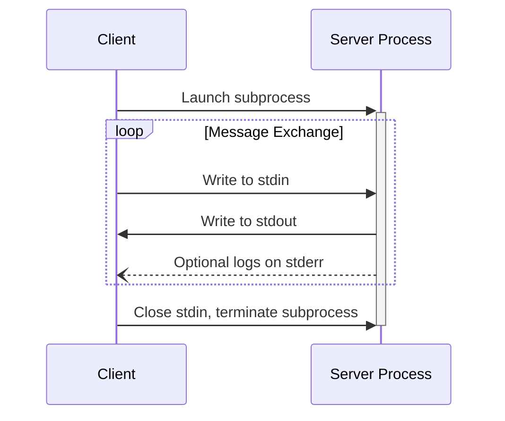
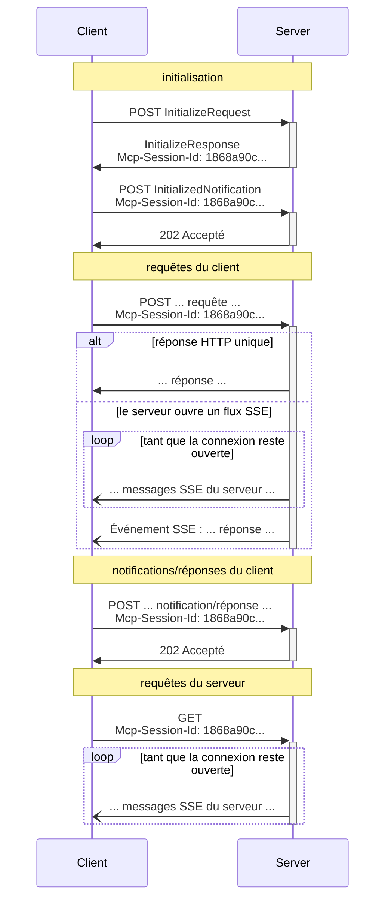

<Info>**Révision du protocole** : 2025-06-18</Info>

Le MCP utilise JSON-RPC pour encoder les messages. Les messages JSON-RPC **DOIVENT** être encodés en UTF-8.

Le protocole définit actuellement deux mécanismes de transport standard pour la communication client-serveur :

1. [stdio](#stdio), communication via l’entrée standard et la sortie standard
2. [HTTP diffusé en continu](#streamable-http)

Les clients **DEVRAIENT** prendre en charge stdio autant que possible.

Il est également possible pour les clients et les serveurs d’implémenter des [transports personnalisés](#custom-transports) de manière modulaire.

  ## stdio

Dans le transport **stdio** :

* Le client lance le serveur MCP en tant que sous-processus.
* Le serveur lit les messages JSON-RPC depuis son entrée standard (`stdin`) et envoie des messages
  vers sa sortie standard (`stdout`).
* Les messages sont des requêtes, notifications ou réponses JSON-RPC individuelles.
* Les messages sont délimités par des sauts de ligne et ne doivent en aucun cas contenir de sauts de ligne intégrés.
* Le serveur peut écrire des chaînes UTF-8 sur sa sortie d&#39;erreur (`stderr`) à des fins de journalisation.
  Les clients peuvent capturer, relayer ou ignorer ces journaux.
* Le serveur ne doit rien écrire sur son `stdout` qui ne soit pas un message MCP valide.
* Le client ne doit rien écrire dans le `stdin` du serveur qui ne soit pas un message MCP
  valide.

  ## HTTP diffusé en continu

<Info>
  Ceci remplace le [transport HTTP+SSE](/fr/specification/2024-11-05/basic/transports#http-with-sse) de la version de protocole 2024-11-05. Voir le guide de [compatibilité descendante](#backwards-compatibility) ci-dessous.
</Info>

Dans le transport **HTTP diffusé en continu**, le serveur fonctionne comme un processus indépendant capable de gérer plusieurs connexions clientes. Ce transport utilise des requêtes HTTP POST et GET. Le serveur peut, de manière optionnelle, utiliser les [événements envoyés par le serveur](https://en.wikipedia.org/wiki/Server-sent_events) (SSE) pour diffuser plusieurs messages émis par le serveur. Cela permet aussi bien des Serveurs MCP basiques que des serveurs plus riches en fonctionnalités prenant en charge la diffusion en continu, ainsi que les notifications et requêtes du serveur vers le client.

Le serveur **DOIT** fournir un unique chemin d’endpoint HTTP (ci-après appelé **endpoint MCP**) prenant en charge à la fois les méthodes POST et GET. Par exemple, il peut s’agir d’une URL telle que `https://example.com/mcp`.

  #### Avertissement de sécurité

Lors de la mise en œuvre du transport HTTP diffusé en continu :

1. Les serveurs **DOIVENT** valider l’en-tête `Origin` sur toutes les connexions entrantes afin d’empêcher les attaques de réaffectation DNS (DNS rebinding)
2. En local, les serveurs **DEVRAIENT** n’écouter que sur localhost (127.0.0.1) plutôt que sur toutes les interfaces réseau (0.0.0.0)
3. Les serveurs **DEVRAIENT** mettre en place une authentification appropriée pour toutes les connexions

Sans ces protections, des attaquants pourraient utiliser la réaffectation DNS (DNS rebinding) pour interagir avec des serveurs MCP locaux depuis des sites web distants.

  ### Envoi de messages au serveur

Chaque message JSON-RPC envoyé par le client **DOIT** être une nouvelle requête HTTP POST adressée au point de terminaison MCP.

1. Le client **DOIT** utiliser HTTP POST pour envoyer des messages JSON-RPC au point de terminaison MCP.
2. Le client **DOIT** inclure un en-tête `Accept`, indiquant `application/json` et
   `text/event-stream` comme types de contenu pris en charge.
3. Le corps de la requête POST **DOIT** être une unique *requête*, *notification* ou *réponse* JSON-RPC.
4. Si l’entrée est une *réponse* ou une *notification* JSON-RPC :
   * Si le serveur accepte l’entrée, il **DOIT** renvoyer le code d’état HTTP 202
     Accepted sans corps.
   * Si le serveur ne peut pas accepter l’entrée, il **DOIT** renvoyer un code d’état d’erreur HTTP
     (p. ex., 400 Bad Request). Le corps de la réponse HTTP **PEUT** contenir une *réponse d’erreur*
     JSON-RPC sans `id`.
5. Si l’entrée est une *requête* JSON-RPC, le serveur **DOIT** soit
   renvoyer `Content-Type: text/event-stream` pour initier un flux SSE, soit
   `Content-Type: application/json` pour renvoyer un objet JSON unique. Le client **DOIT**
   prendre en charge ces deux cas.
6. Si le serveur initie un flux SSE :
   * Le flux SSE **DEVRAIT** inclure, à terme, une *réponse* JSON-RPC à la
     *requête* JSON-RPC envoyée dans le corps du POST.
   * Le serveur **PEUT** envoyer des *requêtes* et des *notifications* JSON-RPC avant d’envoyer la
     *réponse* JSON-RPC. Ces messages **DEVRAIENT** être liés à la *requête*
     d’origine du client.
   * Le serveur **NE DEVRAIT PAS** fermer le flux SSE avant d’envoyer la *réponse* JSON-RPC
     à la *requête* JSON-RPC reçue, sauf si la [session](#session-management)
     expire.
   * Après l’envoi de la *réponse* JSON-RPC, le serveur **DEVRAIT** fermer le flux SSE.
   * Une déconnexion **PEUT** survenir à tout moment (p. ex., en raison des conditions réseau).
     Par conséquent :
     * La déconnexion **NE DEVRAIT PAS** être interprétée comme l’annulation de la requête par le client.
     * Pour annuler, le client **DEVRAIT** envoyer explicitement une `CancelledNotification` MCP.
     * Pour éviter la perte de messages due à une déconnexion, le serveur **PEUT** rendre le flux
       [reprise](#resumability-and-redelivery).

  ### Écoute des messages du serveur

1. Le client **PEUT** effectuer une requête HTTP GET vers l’endpoint MCP. Cela peut servir à ouvrir un flux SSE, permettant au serveur de communiquer avec le client sans que celui-ci n’envoie d’abord des données via HTTP POST.
2. Le client **DOIT** inclure un en-tête `Accept` listant `text/event-stream` comme type de contenu pris en charge.
3. Le serveur **DOIT** soit renvoyer `Content-Type: text/event-stream` en réponse à ce HTTP GET, soit renvoyer HTTP 405 Method Not Allowed, indiquant qu’il ne propose pas de flux SSE à cet endpoint.
4. Si le serveur initie un flux SSE :
   * Le serveur **PEUT** envoyer des *requêtes* et des *notifications* JSON-RPC sur le flux.
   * Ces messages **DEVRAIENT** être sans lien avec toute *requête* JSON-RPC en cours côté client.
   * Le serveur **NE DOIT PAS** envoyer de *réponse* JSON-RPC sur le flux **sauf** en cas de [reprise](#resumability-and-redelivery) d’un flux associé à une requête précédente du client.
   * Le serveur **PEUT** fermer le flux SSE à tout moment.
   * Le client **PEUT** fermer le flux SSE à tout moment.

  ### Connexions multiples

1. Le client **PEUT** rester connecté à plusieurs flux SSE simultanément.
2. Le serveur **DOIT** envoyer chacun de ses messages JSON-RPC sur un seul des flux connectés ; autrement dit, il **NE DOIT PAS** diffuser le même message sur plusieurs flux.
   * Le risque de perte de messages **PEUT** être atténué en rendant le flux
     [reprise possible](#resumability-and-redelivery).

  ### Reprise et nouvelle livraison

Pour permettre la reprise des connexions interrompues et la nouvelle livraison des messages qui pourraient sinon être
perdus :

1. Les serveurs **PEUVENT** ajouter un champ `id` à leurs événements SSE, comme décrit dans la
   [spécification SSE](https://html.spec.whatwg.org/multipage/server-sent-events.html#event-stream-interpretation).
   * Le cas échéant, cet ID **DOIT** être globalement unique sur tous les flux au sein de cette
     [session](#session-management) — ou sur tous les flux avec ce client spécifique si la gestion de session
     n’est pas utilisée.
2. Si le client souhaite reprendre après une connexion interrompue, il **DEVRAIT** effectuer une requête HTTP
   GET vers le point de terminaison MCP et inclure l’en-tête
   [`Last-Event-ID`](https://html.spec.whatwg.org/multipage/server-sent-events.html#the-last-event-id-header)
   pour indiquer l’ID du dernier événement reçu.
   * Le serveur **PEUT** utiliser cet en-tête pour rejouer les messages qui auraient été envoyés
     après le dernier ID d’événement, *sur le flux qui a été déconnecté*, et reprendre le
     flux à partir de ce point.
   * Le serveur **NE DOIT PAS** rejouer les messages qui auraient été délivrés sur un
     flux différent.

En d’autres termes, ces ID d’événement doivent être attribués par les serveurs *par flux*, afin de
servir de curseur au sein de ce flux particulier.

  ### Gestion des sessions

Une « session » MCP correspond à des interactions logiquement liées entre un client et un
serveur, commençant par la [phase d’initialisation](/fr/specification/2025-06-18/basic/lifecycle). Pour prendre en charge
les serveurs qui souhaitent établir des sessions avec état :

1. Un serveur utilisant le transport HTTP diffusé en continu **PEUT** attribuer un identifiant de session
   au moment de l’initialisation, en l’incluant dans un en-tête `Mcp-Session-Id` de la réponse HTTP
   contenant le `InitializeResult`.
   * L’identifiant de session **DEVRAIT** être globalement unique et cryptographiquement sécurisé (p. ex., un
     UUID généré de manière sécurisée, un JWT ou un hachage cryptographique).
   * L’identifiant de session **DOIT** uniquement contenir des caractères ASCII visibles (de 0x21 à
     0x7E).
2. Si un `Mcp-Session-Id` est renvoyé par le serveur pendant l’initialisation, les clients utilisant
   le transport HTTP diffusé en continu **DOIVENT** l’inclure dans l’en-tête `Mcp-Session-Id` sur
   toutes leurs requêtes HTTP ultérieures.
   * Les serveurs qui exigent un identifiant de session **DEVRAIENT** répondre aux requêtes dépourvues de l’en-tête
     `Mcp-Session-Id` (autres que l’initialisation) par un HTTP 400 Bad Request.
3. Le serveur **PEUT** mettre fin à la session à tout moment, après quoi il **DOIT** répondre
   aux requêtes contenant cet identifiant de session par un HTTP 404 Not Found.
4. Lorsqu’un client reçoit un HTTP 404 en réponse à une requête contenant un
   `Mcp-Session-Id`, il **DOIT** démarrer une nouvelle session en envoyant un nouveau `InitializeRequest`
   sans identifiant de session.
5. Les clients qui n’ont plus besoin d’une session particulière (p. ex., parce que l’utilisateur quitte
   l’application cliente) **DEVRAIENT** envoyer une requête HTTP DELETE vers le point de terminaison MCP avec l’en-tête
   `Mcp-Session-Id`, afin de mettre explicitement fin à la session.
   * Le serveur **PEUT** répondre à cette requête par un HTTP 405 Method Not Allowed,
     indiquant qu’il n’autorise pas les clients à mettre fin aux sessions.

  ### Diagramme de séquence

  ### En-tête de version du protocole

Si vous utilisez HTTP, le client **DOIT** inclure l’en-tête HTTP `MCP-Protocol-Version: <protocol-version>` dans toutes les requêtes suivantes adressées au serveur MCP, afin de permettre au serveur MCP de répondre en fonction de la version du protocole MCP.

Par exemple : `MCP-Protocol-Version: 2025-06-18`

La version du protocole envoyée par le client **DEVRAIT** être celle [négociée lors de
l’initialisation](/fr/specification/2025-06-18/basic/lifecycle#version-negotiation).

Pour assurer la rétrocompatibilité, si le serveur ne reçoit *pas* d’en-tête `MCP-Protocol-Version`
et n’a aucun autre moyen d’identifier la version — par exemple, en se fiant à la
version du protocole négociée lors de l’initialisation — le serveur **DEVRAIT** supposer la version
du protocole `2025-03-26`.

Si le serveur reçoit une requête avec une valeur `MCP-Protocol-Version` invalide ou non prise en charge,
il **DOIT** répondre avec `400 Bad Request`.

  ### Rétrocompatibilité

Les clients et les serveurs peuvent conserver la rétrocompatibilité avec l’ancien [transport HTTP+SSE](/fr/specification/2024-11-05/basic/transports#http-with-sse) (à partir de la version du protocole 2024-11-05) comme suit :

**Serveurs** souhaitant prendre en charge d’anciens clients :

* Continuer à exposer à la fois les points de terminaison SSE et POST de l’ancien transport, aux côtés du nouveau « point de terminaison MCP » défini pour le transport HTTP diffusé en continu.
  * Il est également possible de combiner l’ancien point de terminaison POST et le nouveau point de terminaison MCP, mais cela peut introduire une complexité inutile.

**Clients** souhaitant prendre en charge d’anciens serveurs :

1. Accepter de l’utilisateur une URL de serveur MCP, qui peut pointer soit vers un serveur utilisant l’ancien transport, soit le nouveau.
2. Tenter d’envoyer à l’URL du serveur une requête POST contenant un `InitializeRequest`, avec un en-tête `Accept` tel que défini ci-dessus :
   * En cas de succès, le client peut supposer qu’il s’agit d’un serveur prenant en charge le nouveau transport HTTP diffusé en continu.
   * En cas d’échec avec un code d’état HTTP 4xx (par exemple, 405 Method Not Allowed ou 404 Not Found) :
     * Émettre une requête GET vers l’URL du serveur, en s’attendant à l’ouverture d’un flux SSE et à la réception d’un événement `endpoint` en premier.
     * À la réception de l’événement `endpoint`, le client peut supposer qu’il s’agit d’un serveur utilisant l’ancien transport HTTP+SSE et doit employer ce transport pour toute la communication ultérieure.

  ## Transports personnalisés

Les clients et les serveurs **PEUVENT** implémenter des mécanismes de transport personnalisés supplémentaires pour répondre à leurs besoins spécifiques. Le protocole est indépendant du transport et peut être implémenté sur tout canal de communication prenant en charge l’échange bidirectionnel de messages.

Les implémenteurs qui choisissent de prendre en charge des transports personnalisés **DOIVENT** veiller à préserver le format de message et les exigences de cycle de vie JSON-RPC 2.0 définis par le Protocole de contexte de modèle (MCP). Les transports personnalisés **DEVRAIENT** documenter leurs modalités spécifiques d’établissement de connexion et leurs modèles d’échange de messages afin de faciliter l’interopérabilité.