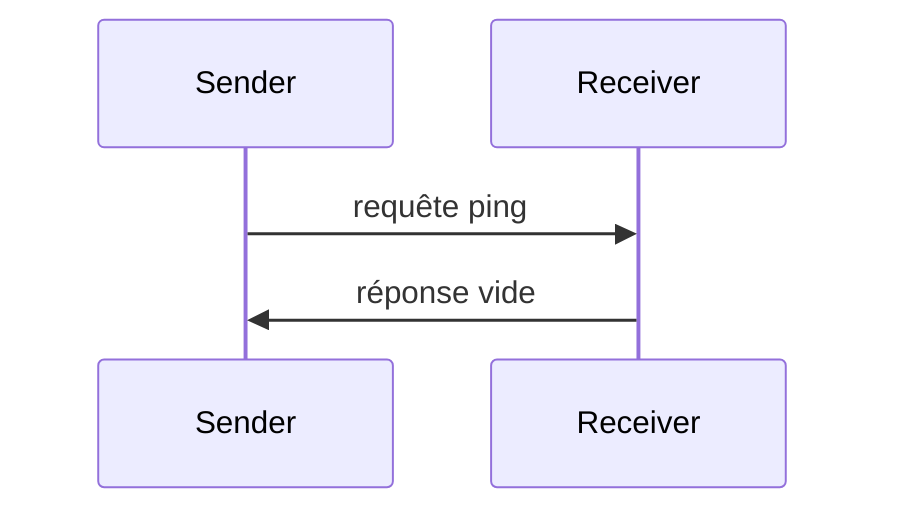

<div id="enable-section-numbers" />

<Info>**Révision du protocole** : 2025-06-18</Info>

Le Protocole de contexte de modèle (MCP) inclut un mécanisme de ping optionnel qui permet à chacune des parties de vérifier que son homologue est toujours réactif et que la connexion est active.

<div id="overview">
  ## Vue d’ensemble
</div>

La fonctionnalité de ping est mise en œuvre selon un simple schéma requête/réponse. Le client comme le serveur peuvent initier un ping en envoyant une requête `ping`.

<div id="message-format">
  ## Format du message
</div>

Une requête ping est une requête JSON-RPC standard sans paramètres :

```json
{
  "jsonrpc": "2.0",
  "id": "123",
  "method": "ping"
}
```

<div id="behavior-requirements">
  ## Exigences de comportement
</div>

1. Le récepteur DOIT répondre rapidement par une réponse vide :

```json
{
  "jsonrpc": "2.0",
  "id": "123",
  "result": {}
}
```

2. Si aucune réponse n’est reçue dans un délai raisonnable, l’expéditeur PEUT :
   - Considérer que la connexion est périmée
   - Mettre fin à la connexion
   - Tenter une procédure de reconnexion

<div id="usage-patterns">
  ## Schémas d’utilisation
</div>



<div id="implementation-considerations">
  ## Considérations d’implémentation
</div>

- Il **CONVIENT** que les implémentations envoient périodiquement des pings pour vérifier l’état de la connexion
- La fréquence des pings **DEVRAIT** être configurable
- Les délais d’expiration **DEVRAIENT** être adaptés à l’environnement réseau
- Les sollicitations de ping excessives **DEVRAIENT** être évitées afin de réduire la surcharge réseau

<div id="error-handling">
  ## Gestion des erreurs
</div>

- Les délais d’attente **DEVRAIENT** être traités comme des échecs de connexion
- Plusieurs pings infructueux **PEUVENT** entraîner une réinitialisation de la connexion
- Les implémentations **DEVRAIENT** consigner les échecs de ping à des fins de diagnostic