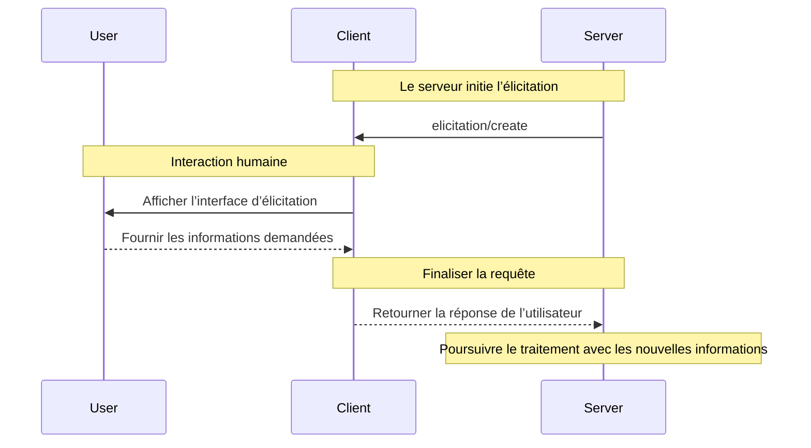

<div id="enable-section-numbers" />

<Info>**Révision du protocole** : 2025-06-18</Info>

<Note>
  L’élicitation est introduite dans cette version de la spécification du Protocole de contexte de modèle (MCP) et sa conception pourra évoluer dans de futures versions du protocole.
</Note>

Le Protocole de contexte de modèle (MCP) fournit un moyen standardisé pour les serveurs de demander des informations supplémentaires aux utilisateurs via le client lors des interactions. Ce flux permet aux clients de garder la maîtrise des interactions avec l’utilisateur et du partage de données, tout en permettant aux serveurs de recueillir dynamiquement les informations nécessaires.
Les serveurs sollicitent des données structurées auprès des utilisateurs à l’aide de schémas JSON afin de valider les réponses.

<div id="user-interaction-model">
  ## Modèle d’interaction utilisateur
</div>

L’élicitation dans MCP permet aux serveurs de mettre en œuvre des workflows interactifs en autorisant des demandes de saisie utilisateur à se produire de manière *imbriquée* au sein d’autres fonctionnalités du serveur MCP.

Les implémentations sont libres d’exposer l’élicitation via tout modèle d’interface qui leur convient—le protocole lui-même n’impose aucun modèle d’interaction utilisateur spécifique.

<Warning>
  Pour la confiance, la sûreté et la sécurité :

  * Les serveurs **NE DOIVENT PAS** utiliser l’élicitation pour demander des informations sensibles.

  Les applications **DEVRAIENT** :

  * Fournir une interface indiquant clairement quel serveur demande des informations
  * Permettre aux utilisateurs de relire et de modifier leurs réponses avant l’envoi
  * Respecter la vie privée des utilisateurs et fournir des options claires pour refuser et annuler
</Warning>

<div id="capabilities">
  ## Capacités
</div>

Les clients qui prennent en charge l’élicitation **DOIVENT** déclarer la capacité `elicitation` lors de
l’[initialisation](/fr/specification/2025-06-18/basic/lifecycle#initialization) :

```json
{
  "capabilities": {
    "elicitation": {}
  }
}
```

<div id="protocol-messages">
  ## Messages du protocole
</div>

<div id="creating-elicitation-requests">
  ### Création de demandes d’élicitation
</div>

Pour solliciter des informations auprès d’un utilisateur, les serveurs envoient une requête `elicitation/create` :

<div id="simple-text-request">
  #### Requête de texte simple
</div>

**Requête :**

```json
{
  "jsonrpc": "2.0",
  "id": 1,
  "method": "elicitation/create",
  "params": {
    "message": "Veuillez indiquer votre nom d’utilisateur GitHub",
    "requestedSchema": {
      "type": "object",
      "properties": {
        "name": {
          "type": "string"
        }
      },
      "required": ["name"]
    }
  }
}
```

**Réponse :**

```json
{
  "jsonrpc": "2.0",
  "id": 1,
  "result": {
    "action": "accept",
    "content": {
      "name": "octocat"
    }
  }
}
```

<div id="structured-data-request">
  #### Demande de données structurées
</div>

**Requête :**

```json
{
  "jsonrpc": "2.0",
  "id": 2,
  "method": "elicitation/create",
  "params": {
    "message": "Veuillez fournir vos coordonnées",
    "requestedSchema": {
      "type": "object",
      "properties": {
        "name": {
          "type": "string",
          "description": "Votre nom complet"
        },
        "email": {
          "type": "string",
          "format": "email",
          "description": "Votre adresse e-mail"
        },
        "age": {
          "type": "number",
          "minimum": 18,
          "description": "Votre âge"
        }
      },
      "required": ["name", "email"]
    }
  }
}
```

**Réponse :**

```json
{
  "jsonrpc": "2.0",
  "id": 2,
  "result": {
    "action": "accept",
    "content": {
      "name": "Monalisa Octocat",
      "email": "octocat@github.com",
      "age": 30
    }
  }
}
```

**Exemple de réponse de refus :**

```json
{
  "jsonrpc": "2.0",
  "id": 2,
  "result": {
    "action": "decline"
  }
}
```

**Exemple de réponse d’annulation :**

```json
{
  "jsonrpc": "2.0",
  "id": 2,
  "result": {
    "action": "cancel"
  }
}
```

<div id="message-flow">
  ## Flux de messages
</div>



<div id="request-schema">
  ## Schéma de requête
</div>

Le champ `requestedSchema` permet aux serveurs de définir la structure de la réponse attendue à l’aide d’un sous-ensemble restreint de JSON Schema. Pour simplifier l’implémentation côté client, les schémas d’élicitation sont limités à des objets plats ne contenant que des propriétés primitives :

```json
"requestedSchema": {
  "type": "object",
  "properties": {
    "propertyName": {
      "type": "string",
      "title": "Nom d’affichage",
      "description": "Description de la propriété"
    },
    "anotherProperty": {
      "type": "number",
      "minimum": 0,
      "maximum": 100
    }
  },
  "required": ["propertyName"]
}
```

<div id="supported-schema-types">
  ### Types de schémas pris en charge
</div>

Le schéma est limité aux types primitifs suivants :

1. **Schéma de chaîne (string)**

   ```json
   {
     "type": "string",
     "title": "Display Name",
     "description": "Description text",
     "minLength": 3,
     "maxLength": 50,
     "format": "email" // Pris en charge : "email", "uri", "date", "date-time"
   }
   ```

   Formats pris en charge : `email`, `uri`, `date`, `date-time`

2. **Schéma numérique (number)**

   ```json
   {
     "type": "number", // ou "integer"
     "title": "Display Name",
     "description": "Description text",
     "minimum": 0,
     "maximum": 100
   }
   ```

3. **Schéma booléen (boolean)**

   ```json
   {
     "type": "boolean",
     "title": "Display Name",
     "description": "Description text",
     "default": false
   }
   ```

4. **Schéma énumération (enum)**
   ```json
   {
     "type": "string",
     "title": "Display Name",
     "description": "Description text",
     "enum": ["option1", "option2", "option3"],
     "enumNames": ["Option 1", "Option 2", "Option 3"]
   }
   ```

Les clients peuvent utiliser ce schéma pour :

1. Générer des formulaires de saisie adaptés
2. Valider la saisie des utilisateurs avant l’envoi
3. Fournir de meilleures indications aux utilisateurs

Notez que les structures imbriquées complexes, les tableaux d’objets et d’autres fonctionnalités avancées de JSON Schema ne sont délibérément pas pris en charge afin de simplifier l’implémentation côté client.

<div id="response-actions">
  ## Actions de réponse
</div>

Les réponses d’Élicitation suivent un modèle à trois actions pour distinguer clairement les différentes actions de l’utilisateur :

```json
{
  "jsonrpc": "2.0",
  "id": 1,
  "result": {
    "action": "accept", // or "decline" or "cancel"
    "content": {
      "propertyName": "value",
      "anotherProperty": 42
    }
  }
}
```

Les trois actions de réponse sont :

1. **Accept** (`action: "accept"`): L’utilisateur a explicitement approuvé et soumis des données
   * Le champ `content` contient les données soumises conformes au schéma demandé
   * Exemple : l’utilisateur a cliqué sur « Submit », « OK », « Confirm », etc.

2. **Decline** (`action: "decline"`): L’utilisateur a explicitement refusé la demande
   * Le champ `content` est généralement omis
   * Exemple : l’utilisateur a cliqué sur « Reject », « Decline », « No », etc.

3. **Cancel** (`action: "cancel"`): L’utilisateur a quitté sans faire de choix explicite
   * Le champ `content` est généralement omis
   * Exemple : l’utilisateur a fermé la boîte de dialogue, a cliqué à l’extérieur, a appuyé sur Échap, etc.

Les serveurs doivent gérer chaque état de manière appropriée :

* **Accept** : traiter les données soumises
* **Decline** : gérer le refus explicite (p. ex., proposer des alternatives)
* **Cancel** : gérer l’annulation (p. ex., relancer plus tard)

<div id="security-considerations">
  ## Considérations de sécurité
</div>

1. Les serveurs **NE DOIVENT PAS** demander d’informations sensibles via l’élicitation
2. Les clients **DEVRAIENT** mettre en place des contrôles d’approbation par l’utilisateur
3. Les deux parties **DEVRAIENT** valider le contenu de l’élicitation par rapport au schéma fourni
4. Les clients **DEVRAIENT** indiquer clairement quel serveur demande des informations
5. Les clients **DEVRAIENT** permettre aux utilisateurs de refuser les demandes d’élicitation à tout moment
6. Les clients **DEVRAIENT** mettre en place une limitation de débit
7. Les clients **DEVRAIENT** présenter les demandes d’élicitation de manière à rendre clair quelles informations sont demandées et pourquoi