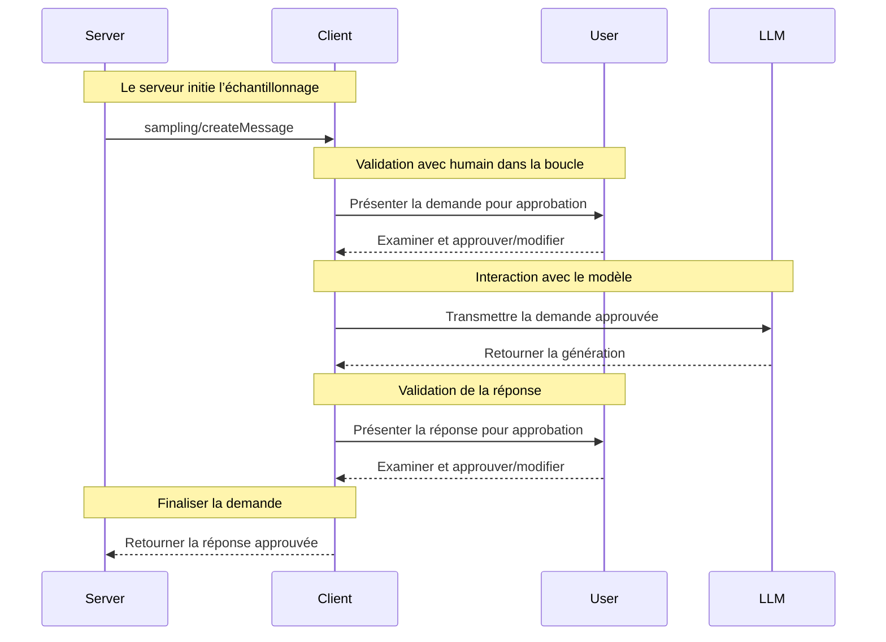

<div id="enable-section-numbers" />

<Info>**Révision du protocole** : 2025-06-18</Info>

Le Protocole de contexte de modèle (MCP) fournit un moyen standardisé pour les serveurs de demander l’échantillonnage (« complétions » ou « générations ») auprès de modèles de langage via des clients. Ce mécanisme permet aux clients de garder la main sur l’accès aux modèles, leur sélection et les autorisations, tout en permettant aux serveurs de tirer parti des capacités de l’IA — sans clés d’API côté serveur. Les serveurs peuvent demander des interactions textuelles, audio ou image, et inclure, si nécessaire, du contexte provenant de Serveurs MCP dans leurs Invites.

<div id="user-interaction-model">
  ## Modèle d’interaction utilisateur
</div>

L’échantillonnage dans le MCP permet aux serveurs de mettre en œuvre des comportements agentiques, en autorisant des appels LLM *imbriqués* au sein d’autres fonctionnalités du serveur MCP.

Les implémentations sont libres d’exposer l’échantillonnage via n’importe quel modèle d’interface adapté à leurs besoins — le protocole lui-même n’impose aucun modèle d’interaction utilisateur spécifique.

<Warning>
  Pour des raisons de confiance, de sûreté et de sécurité, il **FAUT** toujours
  qu’un humain reste dans la boucle, avec la possibilité de refuser les demandes d’échantillonnage.

  Les applications **DOIVENT** :

  * Proposer une interface qui facilite et rend intuitive l’examen des demandes d’échantillonnage
  * Permettre aux utilisateurs d’afficher et de modifier les invites avant envoi
  * Présenter les réponses générées pour examen avant leur livraison
</Warning>

<div id="capabilities">
  ## Capacités
</div>

Les clients qui prennent en charge l’Échantillonnage **DOIVENT** déclarer la capacité `sampling` lors de
l’[initialisation](/fr/specification/2025-06-18/basic/lifecycle#initialization) :

```json
{
  "capabilities": {
    "sampling": {}
  }
}
```

<div id="protocol-messages">
  ## Messages du protocole
</div>

<div id="creating-messages">
  ### Création de messages
</div>

Pour demander une génération par un modèle de langage, les serveurs envoient une requête `sampling/createMessage` :

**Requête :**

```json
{
  "jsonrpc": "2.0",
  "id": 1,
  "method": "sampling/createMessage",
  "params": {
    "messages": [
      {
        "role": "user",
        "content": {
          "type": "text",
          "text": "What is the capital of France?"
        }
      }
    ],
    "modelPreferences": {
      "hints": [
        {
          "name": "claude-3-sonnet"
        }
      ],
      "intelligencePriority": 0.8,
      "speedPriority": 0.5
    },
    "systemPrompt": "You are a helpful assistant.",
    "maxTokens": 100
  }
}
```

**Réponse :**

```json
{
  "jsonrpc": "2.0",
  "id": 1,
  "result": {
    "role": "assistant",
    "content": {
      "type": "text",
      "text": "The capital of France is Paris."
    },
    "model": "claude-3-sonnet-20240307",
    "stopReason": "endTurn"
  }
}
```

<div id="message-flow">
  ## Flux des messages
</div>



<div id="data-types">
  ## Types de données
</div>

<div id="messages">
  ### Messages
</div>

Les messages d’échantillonnage peuvent contenir :

<div id="text-content">
  #### Contenu textuel
</div>

```json
{
  "type": "text",
  "text": "Contenu du message"
}
```

<div id="image-content">
  #### Contenu de l’image
</div>

```json
{
  "type": "image",
  "data": "base64-encoded-image-data",
  "mimeType": "image/jpeg"
}
```

<div id="audio-content">
  #### Contenu audio
</div>

```json
{
  "type": "audio",
  "data": "base64-encoded-audio-data",
  "mimeType": "audio/wav"
}
```

<div id="model-preferences">
  ### Préférences de modèle
</div>

La sélection de modèles dans le MCP nécessite une abstraction soignée, car serveurs et clients peuvent utiliser
différents fournisseurs d’IA avec des offres de modèles distinctes. Un serveur ne peut pas simplement demander un
modèle précis par son nom, car le client peut ne pas avoir accès à ce modèle exact ou préférer
utiliser l’équivalent proposé par un autre fournisseur.

Pour y répondre, le MCP implémente un système de préférences qui combine des priorités de
capacités abstraites avec des indications de modèle facultatives :

<div id="capability-priorities">
  #### Priorités de capacités
</div>

Les serveurs expriment leurs besoins au moyen de trois valeurs de priorité normalisées (0-1) :

* `costPriority` : Quelle importance accorder à la minimisation des coûts ? Des valeurs plus élevées privilégient les modèles moins coûteux.
* `speedPriority` : Quelle importance accorder à une faible latence ? Des valeurs plus élevées privilégient les modèles plus rapides.
* `intelligencePriority` : Quelle importance accorder aux capacités avancées ? Des valeurs plus élevées privilégient les modèles plus performants.

<div id="model-hints">
  #### Indications de modèle
</div>

Alors que les priorités aident à sélectionner des modèles en fonction de leurs caractéristiques, les `hints` permettent aux serveurs de
suggérer des modèles ou des familles de modèles spécifiques :

* Les indications sont traitées comme des sous-chaînes, permettant une correspondance flexible avec les noms de modèles
* Plusieurs indications sont évaluées selon l’ordre de préférence
* Les clients **PEUVENT** faire correspondre des indications à des modèles équivalents provenant de différents fournisseurs
* Les indications sont de nature consultative — la sélection finale du modèle revient aux clients

Par exemple :

```json
{
  "hints": [
    { "name": "claude-3-sonnet" }, // Préférer les modèles de la classe Sonnet
    { "name": "claude" } // À défaut, choisir n'importe quel modèle Claude
  ],
  "costPriority": 0.3, // Le coût est moins important
  "speedPriority": 0.8, // La vitesse est très importante
  "intelligencePriority": 0.5 // Besoins de capacités modérés
}
```

Le client traite ces préférences pour sélectionner un modèle approprié parmi les options disponibles.
Par exemple, si le client n’a pas accès aux modèles Claude mais dispose de Gemini,
il peut faire correspondre l’indication « sonnet » à `gemini-1.5-pro` en fonction de capacités similaires.

<div id="error-handling">
  ## Gestion des erreurs
</div>

Les clients **DEVRAIENT** renvoyer des erreurs pour les cas d’échec courants :

Exemple d’erreur :

```json
{
  "jsonrpc": "2.0",
  "id": 1,
  "error": {
    "code": -1,
    "message": "User rejected sampling request"
  }
}
```

<div id="security-considerations">
  ## Considérations de sécurité
</div>

1. Les clients **DEVRAIENT** mettre en place des contrôles d’approbation par l’utilisateur
2. Les deux parties **DEVRAIENT** valider le contenu des messages
3. Les clients **DEVRAIENT** respecter les préférences suggérées pour le modèle
4. Les clients **DEVRAIENT** mettre en place une limitation de débit
5. Les deux parties **DOIVENT** traiter les données sensibles de manière appropriée