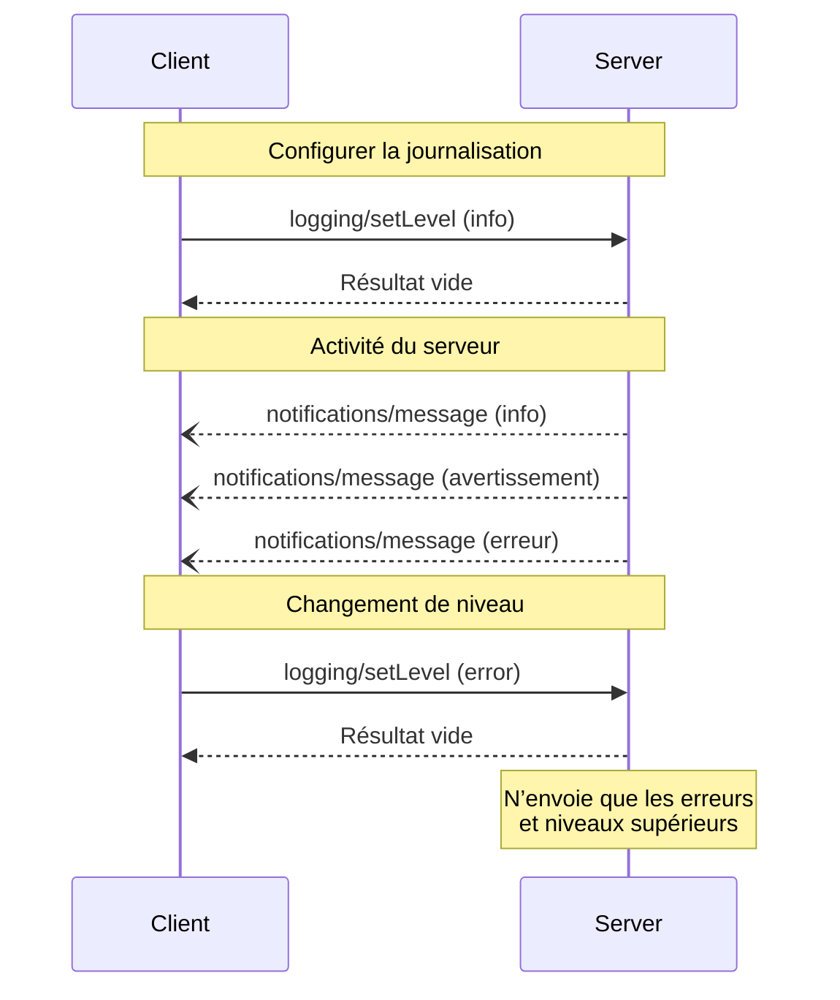

<div id="enable-section-numbers" />

<Info>**Révision du protocole** : 2025-06-18</Info>

Le Protocole de contexte de modèle (MCP) offre un moyen standardisé pour les serveurs d’envoyer
aux clients des messages de journal structurés. Les clients peuvent contrôler la verbosité des journaux en définissant
des niveaux de journalisation minimum, les serveurs envoyant des notifications incluant des niveaux de gravité,
d’éventuels noms de journal (logger) et des données arbitraires sérialisables en JSON.

<div id="user-interaction-model">
  ## Modèle d’interaction utilisateur
</div>

Les implémentations sont libres d’exposer la journalisation via n’importe quel modèle d’interface qui répond à leurs besoins&mdash;le protocole lui-même n’impose aucun modèle d’interaction utilisateur spécifique.

<div id="capabilities">
  ## Capacités
</div>

Les serveurs qui émettent des notifications de journaux **DOIVENT** déclarer la capacité `logging` :

```json
{
  "capabilities": {
    "logging": {}
  }
}
```

<div id="log-levels">
  ## Niveaux de journalisation
</div>

Le protocole suit les niveaux de gravité syslog standard spécifiés dans
[RFC 5424](https://datatracker.ietf.org/doc/html/rfc5424#section-6.2.1) :

| Niveau    | Description                           | Exemple d’utilisation            |
| --------- | ------------------------------------- | -------------------------------- |
| debug     | Informations de débogage détaillées   | Points d’entrée/sortie de fonction |
| info      | Messages d’information généraux       | Mises à jour de l’avancement de l’opération |
| notice    | Événements normaux mais significatifs | Modifications de configuration   |
| warning   | Conditions d’avertissement            | Utilisation d’une fonctionnalité obsolète |
| error     | Conditions d’erreur                   | Échecs d’opération               |
| critical  | Conditions critiques                  | Pannes de composants système     |
| alert     | Action immédiate requise              | Corruption de données détectée   |
| emergency | Système inutilisable                  | Panne complète du système        |

<div id="protocol-messages">
  ## Messages du protocole
</div>

<div id="setting-log-level">
  ### Définir le niveau de journalisation
</div>

Pour configurer le niveau minimal de journalisation, les clients **PEUVENT** envoyer une requête `logging/setLevel` :

**Requête :**

```json
{
  "jsonrpc": "2.0",
  "id": 1,
  "method": "logging/setLevel",
  "params": {
    "level": "info"
  }
}
```

<div id="log-message-notifications">
  ### Notifications de messages de journal
</div>

Les serveurs envoient des messages de journal au moyen des notifications `notifications/message` :

```json
{
  "jsonrpc": "2.0",
  "method": "notifications/message",
  "params": {
    "level": "error",
    "logger": "database",
    "data": {
      "error": "Connection failed",
      "details": {
        "host": "localhost",
        "port": 5432
      }
    }
  }
}
```

<div id="message-flow">
  ## Flux des messages
</div>



<div id="error-handling">
  ## Gestion des erreurs
</div>

Les serveurs **DEVRAIENT** renvoyer des erreurs JSON-RPC standard pour les cas d’échec courants :

- Niveau de journalisation non valide : `-32602` (Paramètres non valides)
- Erreurs de configuration : `-32603` (Erreur interne)

<div id="implementation-considerations">
  ## Considérations d’implémentation
</div>

1. Les serveurs **DEVRAIENT** :
   - Limiter le débit des messages de journalisation
   - Inclure le contexte pertinent dans le champ de données
   - Utiliser des noms de journal cohérents
   - Supprimer les informations sensibles

2. Les clients **PEUVENT** :
   - Afficher les messages de journal dans l’interface
   - Implémenter le filtrage/la recherche des journaux
   - Représenter visuellement le niveau de gravité
   - Conserver les messages de journal

<div id="security">
  ## Sécurité
</div>

1. Les messages de journalisation **NE DOIVENT PAS** contenir :
   - Identifiants ou secrets
   - Informations permettant d’identifier une personne (PII)
   - Détails internes du système susceptibles de faciliter des attaques

2. Les implémentations **DEVRAIENT** :
   - Limiter le débit des messages
   - Valider tous les champs de données
   - Contrôler l’accès aux journaux
   - Surveiller la présence de contenu sensible