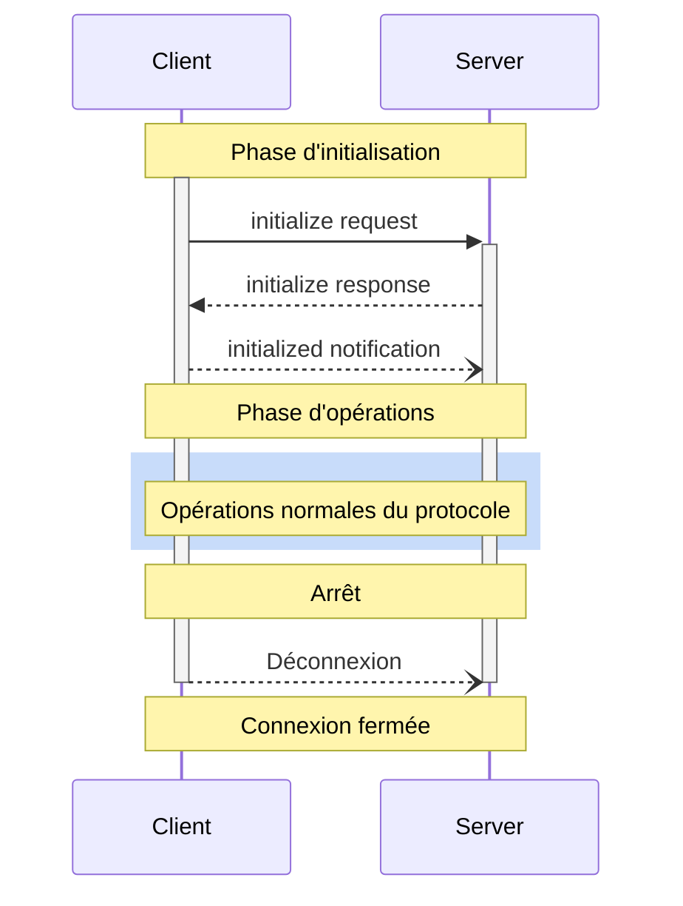

<div id="enable-section-numbers" />

<Info>**Révision du protocole** : brouillon</Info>

Le Protocole de contexte de modèle (MCP) définit un cycle de vie rigoureux pour les connexions client-serveur, garantissant une négociation correcte des capacités et une gestion appropriée de l’état.

1. **Initialisation** : Négociation des capacités et accord sur la version du protocole
2. **Opérations** : Communication normale via le protocole
3. **Arrêt** : Fin de connexion en douceur



<div id="lifecycle-phases">
  ## Phases du cycle de vie
</div>

<div id="initialization">
  ### Initialisation
</div>

La phase d’initialisation **DOIT** être la première interaction entre le client et le serveur.
Au cours de cette phase, le client et le serveur :

* Établissent la compatibilité de version du protocole
* Échangent et négocient leurs capacités
* Partagent des détails d’implémentation

Le client **DOIT** initier cette phase en envoyant une requête `initialize` contenant :

* La version du protocole prise en charge
* Les capacités du client
* Les informations sur l’implémentation du client

```json
{
  "jsonrpc": "2.0",
  "id": 1,
  "method": "initialize",
  "params": {
    "protocolVersion": "2024-11-05",
    "capabilities": {
      "roots": {
        "listChanged": true
      },
      "sampling": {},
      "elicitation": {}
    },
    "clientInfo": {
      "name": "ExampleClient",
      "title": "Example Client Display Name",
      "version": "1.0.0",
      "icons": [
        {
          "src": "https://example.com/icon.png",
          "mimeType": "image/png",
          "sizes": "48x48"
        }
      ],
      "websiteUrl": "https://example.com"
    }
  }
}
```

Le serveur **DOIT** répondre avec ses propres capacités et informations :

```json
{
  "jsonrpc": "2.0",
  "id": 1,
  "result": {
    "protocolVersion": "2024-11-05",
    "capabilities": {
      "logging": {},
      "prompts": {
        "listChanged": true
      },
      "resources": {
        "subscribe": true,
        "listChanged": true
      },
      "tools": {
        "listChanged": true
      }
    },
    "serverInfo": {
      "name": "ExampleServer",
      "title": "Example Server Display Name",
      "version": "1.0.0",
      "icons": [
        {
          "src": "https://example.com/server-icon.svg",
          "mimeType": "image/svg+xml",
          "sizes": "any"
        }
      ],
      "websiteUrl": "https://example.com/server"
    },
    "instructions": "Optional instructions for the client"
  }
}
```

Après une initialisation réussie, le client **DOIT** envoyer une notification `initialized`
pour indiquer qu’il est prêt à commencer les opérations normales :

```json
{
  "jsonrpc": "2.0",
  "method": "notifications/initialized"
}
```

* Le client **NE DEVRAIT PAS** envoyer de requêtes autres que
  [pings](/fr/specification/draft/basic/utilities/ping) avant que le serveur ait répondu à la requête
  `initialize`.
* Le serveur **NE DEVRAIT PAS** envoyer de requêtes autres que
  [pings](/fr/specification/draft/basic/utilities/ping) et
  [logging](/fr/specification/draft/server/utilities/logging) avant de recevoir la notification
  `initialized`.

<div id="version-negotiation">
  #### Négociation de version
</div>

Dans la requête `initialize`, le client **DOIT** envoyer une version du protocole qu’il prend en charge.
Il **DEVRAIT** s’agir de la *dernière* version prise en charge par le client.

Si le serveur prend en charge la version de protocole demandée, il **DOIT** répondre avec la même
version. Sinon, le serveur **DOIT** répondre avec une autre version de protocole qu’il
prend en charge. Il **DEVRAIT** s’agir de la *dernière* version prise en charge par le serveur.

Si le client ne prend pas en charge la version indiquée dans la réponse du serveur, il **DEVRAIT**
se déconnecter.

<Note>
  Si vous utilisez HTTP, le client **DOIT** inclure l’en-tête HTTP « MCP-Protocol-Version:
  &lt;protocol-version&gt; » dans toutes les requêtes suivantes adressées au serveur MCP.
  Pour plus de détails, voir [la section En-tête de version du protocole dans Transports](/fr/specification/draft/basic/transports#protocol-version-header).
</Note>

<div id="capability-negotiation">
  #### Négociation des capacités
</div>

Les capacités du client et du serveur déterminent quelles fonctionnalités optionnelles du protocole seront disponibles pendant la session.

Les capacités clés incluent :

| Catégorie | Capacité      | Description                                                                                  |
| --------- | -------------- | -------------------------------------------------------------------------------------------- |
| Client    | `roots`        | Possibilité de fournir des [Racines](/fr/specification/draft/client/roots) de système de fichiers |
| Client    | `sampling`     | Prise en charge des requêtes d’[Échantillonnage](/fr/specification/draft/client/sampling) par le LLM |
| Client    | `elicitation`  | Prise en charge des requêtes d’[Élicitation](/fr/specification/draft/client/elicitation) par le serveur |
| Client    | `experimental` | Indique la prise en charge de fonctionnalités expérimentales non standard                   |
| Serveur   | `prompts`      | Propose des [Invites](/fr/specification/draft/server/prompts)                                   |
| Serveur   | `resources`    | Fournit des [Ressources](/fr/specification/draft/server/resources) lisibles                     |
| Serveur   | `tools`        | Expose des [Outils](/fr/specification/draft/server/tools) appelables                            |
| Serveur   | `logging`      | Émet des [messages de journal](/fr/specification/draft/server/utilities/logging) structurés     |
| Serveur   | `completions`  | Prend en charge l’[autocomplétion](/fr/specification/draft/server/utilities/completion) des arguments |
| Serveur   | `experimental` | Indique la prise en charge de fonctionnalités expérimentales non standard                   |

Les objets de capacité peuvent décrire des sous-capacités telles que :

* `listChanged` : prise en charge des notifications de modification de liste (pour les Invites, les Ressources et les Outils)
* `subscribe` : prise en charge de l’abonnement aux modifications d’éléments individuels (Ressources uniquement)

<div id="operation">
  ### Opération
</div>

Pendant la phase d’opération, le client et le serveur échangent des messages conformément aux
capacités négociées.

Les deux parties DOIVENT :

* Respecter la version négociée du protocole
* N’utiliser que les capacités effectivement négociées

<div id="shutdown">
  ### Arrêt
</div>

Pendant la phase d’arrêt, une des parties (généralement le client) met fin proprement à la connexion
du protocole. Aucun message d’arrêt spécifique n’est défini — à la place, il faut utiliser le mécanisme
de transport sous-jacent pour signaler la fin de la connexion :

<div id="stdio">
  #### stdio
</div>

Pour le [transport](/fr/specification/draft/basic/transports) stdio, le client **DEVRAIT** initier
l’arrêt en :

1. Fermant d’abord le flux d’entrée vers le processus enfant (le serveur)
2. Attendant que le serveur se termine, ou en envoyant `SIGTERM` si le serveur ne se termine pas
   dans un délai raisonnable
3. Envoyant `SIGKILL` si le serveur ne se termine pas dans un délai raisonnable après `SIGTERM`

Le serveur **PEUT** initier l’arrêt en fermant son flux de sortie vers le client et en
quittant.

<div id="http">
  #### HTTP
</div>

Pour les [transports](/fr/specification/draft/basic/transports) HTTP, l’arrêt est signalé par la fermeture de la ou des connexions HTTP associées.

<div id="timeouts">
  ## Délais d’expiration
</div>

Les implémentations **DEVRAIENT** définir des délais d’expiration pour toutes les requêtes envoyées, afin d’éviter les connexions bloquées et l’épuisement des ressources. Lorsque la requête n’a pas reçu de réponse de succès ou d’erreur dans le délai imparti, l’expéditeur **DEVRAIT** émettre une [notification d’annulation](/fr/specification/draft/basic/utilities/cancellation) pour cette requête et cesser d’attendre une réponse.

Les SDK et autres intergiciels **DEVRAIENT** permettre de configurer ces délais d’expiration au cas par cas, requête par requête.

Les implémentations **PEUVENT** choisir de réinitialiser le compteur du délai d’expiration à la réception d’une [notification de progression](/fr/specification/draft/basic/utilities/progress) correspondant à la requête, car cela indique qu’un traitement est effectivement en cours. Toutefois, les implémentations **DEVRAIENT** toujours appliquer un délai d’expiration maximal, indépendamment des notifications de progression, afin de limiter l’impact d’un client ou d’un serveur défaillant.

<div id="error-handling">
  ## Gestion des erreurs
</div>

Les implémentations **DEVRAIENT** être prêtes à gérer les cas d’erreur suivants :

* Incompatibilité de version du protocole
* Échec de la négociation des capacités requises
* Expiration [des délais](#timeouts) de requête

Exemple d’erreur d’initialisation :

```json
{
  "jsonrpc": "2.0",
  "id": 1,
  "error": {
    "code": -32602,
    "message": "Unsupported protocol version",
    "data": {
      "supported": ["2024-11-05"],
      "requested": "1.0.0"
    }
  }
}
```