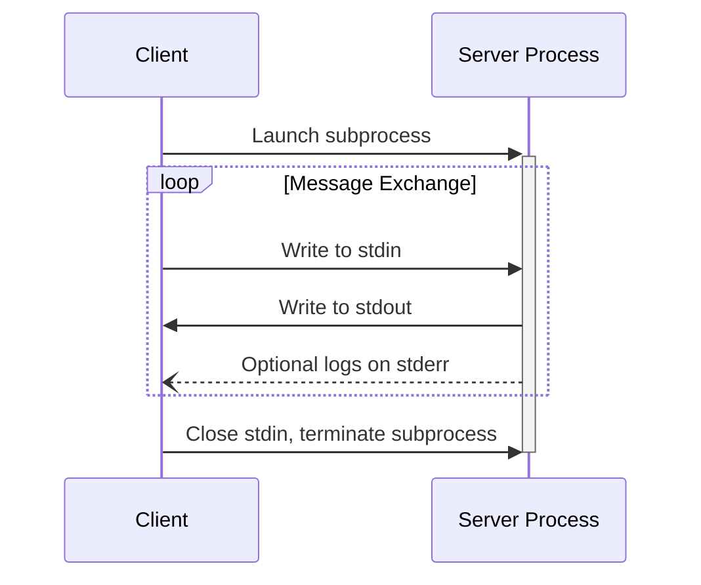
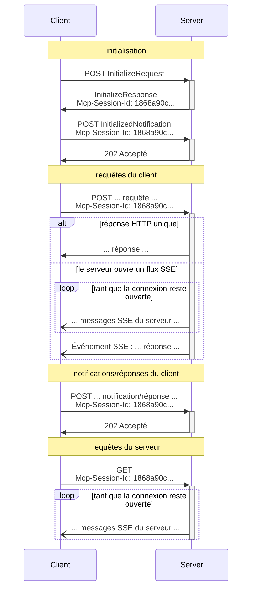

<Info>**Révision du protocole** : brouillon</Info>

MCP utilise JSON-RPC pour encoder les messages. Les messages JSON-RPC **DOIVENT** être encodés en UTF-8.

Le protocole définit actuellement deux mécanismes de transport standard pour la communication
client-serveur :

1. [stdio](#stdio), communication via l’entrée standard et la sortie standard
2. [HTTP diffusé en continu](#streamable-http)

Les clients **DEVRAIENT** prendre en charge stdio lorsque cela est possible.

Il est également possible pour les clients et les serveurs d’implémenter
[des transports personnalisés](#custom-transports) de manière extensible.

  ## stdio

Dans le transport **stdio** :

* Le client lance le serveur MCP en tant que sous-processus.
* Le serveur lit les messages JSON-RPC depuis son entrée standard (`stdin`) et envoie des messages
  vers sa sortie standard (`stdout`).
* Les messages sont des requêtes, des notifications ou des réponses JSON-RPC individuelles.
* Les messages sont délimités par des sauts de ligne et ne DOIVENT PAS contenir de sauts de ligne intégrés.
* Le serveur PEUT écrire des chaînes UTF-8 sur sa sortie d’erreur (`stderr`) à des fins de journalisation. Les clients PEUVENT capturer, relayer ou ignorer ces journaux.
* Le serveur NE DOIT PAS écrire sur son `stdout` quoi que ce soit qui ne soit pas un message MCP valide.
* Le client NE DOIT PAS écrire sur le `stdin` du serveur quoi que ce soit qui ne soit pas un message MCP valide.

  ## HTTP diffusé en continu

<Info>
  Cela remplace le [transport HTTP+SSE](/fr/specification/2024-11-05/basic/transports#http-with-sse) de la version 2024-11-05 du protocole. Voir le guide sur la [rétrocompatibilité](#backwards-compatibility) ci-dessous.
</Info>

Avec le transport **HTTP diffusé en continu**, le serveur s’exécute comme un processus indépendant capable de gérer plusieurs connexions de clients. Ce transport utilise des requêtes HTTP POST et GET. Le serveur peut, en option, utiliser des [événements envoyés par le serveur](https://en.wikipedia.org/wiki/Server-sent_events) (SSE) pour diffuser plusieurs messages émis par le serveur. Cela permet aussi bien à des serveurs MCP basiques qu’à des serveurs plus riches en fonctionnalités de prendre en charge la diffusion en continu ainsi que les notifications et requêtes du serveur vers le client.

Le serveur **DOIT** fournir un unique chemin d’accès d’endpoint HTTP (ci-après appelé **endpoint MCP**) qui prend en charge les méthodes POST et GET. Par exemple, cela peut être une URL comme `https://example.com/mcp`.

  #### Avertissement de sécurité

Lors de la mise en œuvre du transport HTTP diffusé en continu :

1. Les serveurs **DOIVENT** valider l’en-tête `Origin` sur toutes les connexions entrantes pour prévenir les attaques de rebinding DNS
2. En local, les serveurs **DEVRAIENT** n’écouter que sur localhost (127.0.0.1) plutôt que sur toutes les interfaces réseau (0.0.0.0)
3. Les serveurs **DEVRAIENT** mettre en place une authentification adéquate pour toutes les connexions

Sans ces protections, des attaquants pourraient utiliser le rebinding DNS pour interagir avec des serveurs MCP locaux depuis des sites web distants.

  ### Envoi de messages au serveur

Chaque message JSON-RPC envoyé par le client DOIT être une nouvelle requête HTTP POST vers le point de terminaison MCP.

1. Le client DOIT utiliser HTTP POST pour envoyer des messages JSON-RPC vers le point de terminaison MCP.
2. Le client DOIT inclure un en-tête `Accept`, référençant à la fois `application/json` et `text/event-stream` comme types de contenu pris en charge.
3. Le corps de la requête POST DOIT être une unique *requête*, *notification* ou *réponse* JSON-RPC.
4. Si l’entrée est une *réponse* ou une *notification* JSON-RPC :
   * Si le serveur accepte l’entrée, il DOIT renvoyer le code d’état HTTP 202 Accepted sans corps.
   * Si le serveur ne peut pas accepter l’entrée, il DOIT renvoyer un code d’erreur HTTP
     (p. ex., 400 Bad Request). Le corps de la réponse HTTP PEUT contenir une *réponse d’erreur*
     JSON-RPC sans `id`.
5. Si l’entrée est une *requête* JSON-RPC, le serveur DOIT soit
   renvoyer `Content-Type: text/event-stream`, pour initier un flux SSE, soit
   `Content-Type: application/json`, pour renvoyer un objet JSON unique. Le client DOIT
   prendre en charge ces deux cas.
6. Si le serveur initie un flux SSE :
   * Le flux SSE DEVRAIT à terme inclure une *réponse* JSON-RPC à la
     *requête* JSON-RPC envoyée dans le corps du POST.
   * Le serveur PEUT envoyer des *requêtes* et des *notifications* JSON-RPC avant d’envoyer la
     *réponse* JSON-RPC. Ces messages DEVRAIENT être liés à la *requête*
     d’origine du client.
   * Le serveur NE DEVRAIT PAS fermer le flux SSE avant d’envoyer la *réponse* JSON-RPC
     à la *requête* JSON-RPC reçue, sauf si la [session](#session-management)
     expire.
   * Après l’envoi de la *réponse* JSON-RPC, le serveur DEVRAIT fermer le flux SSE.
   * Une déconnexion PEUT survenir à tout moment (p. ex., en raison des conditions réseau).
     Par conséquent :
     * La déconnexion NE DEVRAIT PAS être interprétée comme l’annulation de la requête par le client.
     * Pour annuler, le client DEVRAIT envoyer explicitement une `CancelledNotification` MCP.
     * Pour éviter toute perte de messages due à une déconnexion, le serveur PEUT rendre le flux
       [reprise possible](#resumability-and-redelivery).

  ### Écoute des messages provenant du serveur

1. Le client **PEUT** effectuer une requête HTTP GET vers l’endpoint MCP. Cela peut servir à ouvrir un flux SSE, permettant au serveur de communiquer avec le client sans que celui-ci n’envoie d’abord des données via HTTP POST.
2. Le client **DOIT** inclure un en-tête `Accept`, référençant `text/event-stream` comme type de contenu pris en charge.
3. Le serveur **DOIT** soit renvoyer `Content-Type: text/event-stream` en réponse à ce HTTP GET, soit renvoyer HTTP 405 Method Not Allowed, indiquant que le serveur n’offre pas de flux SSE sur cet endpoint.
4. Si le serveur initie un flux SSE :
   * Le serveur **PEUT** envoyer des *requêtes* et des *notifications* JSON-RPC sur le flux.
   * Ces messages **DEVRAIENT** être indépendants de toute *requête* JSON-RPC en cours émise par le client.
   * Le serveur **NE DOIT PAS** envoyer une *réponse* JSON-RPC sur le flux **sauf si** [reprise](#resumability-and-redelivery) d’un flux associé à une requête précédente du client.
   * Le serveur **PEUT** fermer le flux SSE à tout moment.
   * Le client **PEUT** fermer le flux SSE à tout moment.

  ### Connexions multiples

1. Le client **PEUT** rester connecté simultanément à plusieurs flux SSE.
2. Le serveur **DOIT** envoyer chacun de ses messages JSON-RPC sur un seul des flux connectés ; autrement dit, il **NE DOIT PAS** diffuser le même message sur plusieurs flux.
   * Le risque de perte de messages **PEUT** être atténué en rendant le flux
     [reprise possible](#resumability-and-redelivery).

  ### Reprise et nouvelle livraison

Pour permettre la reprise des connexions interrompues et la retransmission des messages qui pourraient autrement être
perdus :

1. Les serveurs **PEUVENT** ajouter un champ `id` à leurs événements SSE, comme décrit dans la
   [spécification SSE](https://html.spec.whatwg.org/multipage/server-sent-events.html#event-stream-interpretation).
   * S’il est présent, cet identifiant **DOIT** être globalement unique sur tous les flux au sein de cette
     [session](#session-management)—ou sur tous les flux avec ce client spécifique, si la gestion de session
     n’est pas utilisée.
2. Si le client souhaite reprendre après une connexion interrompue, il **DEVRAIT** effectuer une requête HTTP
   GET vers l’endpoint MCP et inclure l’en-tête
   [`Last-Event-ID`](https://html.spec.whatwg.org/multipage/server-sent-events.html#the-last-event-id-header)
   pour indiquer l’identifiant du dernier événement qu’il a reçu.
   * Le serveur **PEUT** utiliser cet en-tête pour rejouer les messages qui auraient été envoyés
     après le dernier identifiant d’événement, *sur le flux qui a été déconnecté*, et pour reprendre le
     flux à partir de ce point.
   * Le serveur **NE DOIT PAS** rejouer les messages qui auraient été livrés sur un
     flux différent.

En d’autres termes, ces identifiants d’événement doivent être attribués par les serveurs *par flux*, afin de
servir de curseur au sein de ce flux particulier.

  ### Gestion des sessions

Une « session » MCP correspond à des interactions logiquement liées entre un client et un
serveur, commençant par la [phase d&#39;initialisation](/fr/specification/draft/basic/lifecycle). Pour prendre en charge
les serveurs qui souhaitent établir des sessions avec état :

1. Un serveur utilisant le transport HTTP diffusé en continu **PEUT** attribuer un ID de session au
   moment de l&#39;initialisation, en l’incluant dans un en-tête `Mcp-Session-Id` sur la réponse HTTP
   contenant le `InitializeResult`.
   * L’ID de session **DEVRAIT** être globalement unique et cryptographiquement sécurisé (par exemple, un
     UUID généré de manière sécurisée, un JWT ou un hachage cryptographique).
   * L’ID de session **DOIT** uniquement contenir des caractères ASCII visibles (de 0x21 à
     0x7E).
2. Si un `Mcp-Session-Id` est renvoyé par le serveur lors de l’initialisation, les clients utilisant
   le transport HTTP diffusé en continu **DOIVENT** l’inclure dans l’en-tête `Mcp-Session-Id` sur
   toutes leurs requêtes HTTP ultérieures.
   * Les serveurs qui exigent un ID de session **DEVRAIENT** répondre aux requêtes sans
     en-tête `Mcp-Session-Id` (autres que l’initialisation) par HTTP 400 Bad Request.
3. Le serveur **PEUT** mettre fin à la session à tout moment, après quoi il **DOIT** répondre
   aux requêtes contenant cet ID de session par HTTP 404 Not Found.
4. Lorsqu’un client reçoit un HTTP 404 en réponse à une requête contenant un
   `Mcp-Session-Id`, il **DOIT** démarrer une nouvelle session en envoyant un nouveau `InitializeRequest`
   sans ID de session.
5. Les clients qui n’ont plus besoin d’une session particulière (par exemple, parce que l’utilisateur quitte
   l’application cliente) **DEVRAIENT** envoyer une requête HTTP DELETE au point de terminaison MCP avec l’en-tête
   `Mcp-Session-Id`, afin de mettre explicitement fin à la session.
   * Le serveur **PEUT** répondre à cette requête par HTTP 405 Method Not Allowed,
     indiquant qu’il n’autorise pas les clients à mettre fin aux sessions.

  ### Diagramme de séquence

  ### En-tête de version du protocole

En cas d’utilisation de HTTP, le client **DOIT** inclure l’en-tête HTTP `MCP-Protocol-Version: <protocol-version>` dans toutes les requêtes suivantes au serveur MCP, afin de permettre au serveur MCP de répondre en fonction de la version du Protocole de contexte de modèle (MCP).

Par exemple : `MCP-Protocol-Version: 2025-06-18`

La version du protocole envoyée par le client **DEVRAIT** être celle [négociée lors de
l’initialisation](/fr/specification/draft/basic/lifecycle#version-negotiation).

Pour assurer la rétrocompatibilité, si le serveur ne reçoit pas d’en-tête `MCP-Protocol-Version`,
et n’a aucun autre moyen d’identifier la version — par exemple, en se fiant à la
version du protocole négociée lors de l’initialisation — le serveur **DEVRAIT** supposer la version du protocole
`2025-03-26`.

Si le serveur reçoit une requête avec un `MCP-Protocol-Version` invalide ou non pris en charge,
il **DOIT** répondre avec `400 Bad Request`.

  ### Rétrocompatibilité

Les clients et les serveurs peuvent conserver la rétrocompatibilité avec le [transport HTTP+SSE](/fr/specification/2024-11-05/basic/transports#http-with-sse) (déprécié depuis
la version du protocole 2024-11-05) comme suit :

**Serveurs** souhaitant prendre en charge d’anciens clients :

* Continuer d’héberger à la fois les points de terminaison SSE et POST de l’ancien transport, en plus du
  nouveau « point de terminaison MCP » défini pour le transport HTTP diffusé en continu.
  * Il est également possible de combiner l’ancien point de terminaison POST et le nouveau point de terminaison MCP, mais
    cela peut introduire une complexité inutile.

**Clients** souhaitant prendre en charge d’anciens serveurs :

1. Accepter une URL de serveur MCP fournie par l’utilisateur, qui peut pointer soit vers un serveur utilisant
   l’ancien transport, soit le nouveau.
2. Tenter d’envoyer une requête POST `InitializeRequest` à l’URL du serveur, avec un en-tête `Accept` tel que
   défini ci‑dessus :
   * En cas de réussite, le client peut supposer qu’il s’agit d’un serveur prenant en charge le nouveau transport HTTP
     diffusé en continu.
   * En cas d’échec avec un code d’état HTTP 4xx (p. ex. 405 Method Not Allowed ou 404 Not
     Found) :
     * Émettre une requête GET vers l’URL du serveur, en s’attendant à l’ouverture d’un flux SSE
       et à la réception d’un événement `endpoint` comme premier événement.
     * Lorsque l’événement `endpoint` arrive, le client peut supposer qu’il s’agit d’un serveur fonctionnant avec
       l’ancien transport HTTP+SSE et doit utiliser ce transport pour toute la communication
       ultérieure.

  ## Transports personnalisés

Les clients et les serveurs **PEUVENT** implémenter des mécanismes de transport personnalisés supplémentaires pour répondre à leurs besoins spécifiques. Le protocole est agnostique au transport et peut être mis en œuvre sur tout canal de communication prenant en charge l’échange bidirectionnel de messages.

Les implémenteurs qui choisissent de prendre en charge des transports personnalisés **DOIVENT** veiller à préserver le format des messages JSON-RPC et les exigences de cycle de vie définies par le MCP. Les transports personnalisés **DEVRAIENT** documenter leurs modes spécifiques d’établissement de connexion et d’échange de messages afin de faciliter l’interopérabilité.