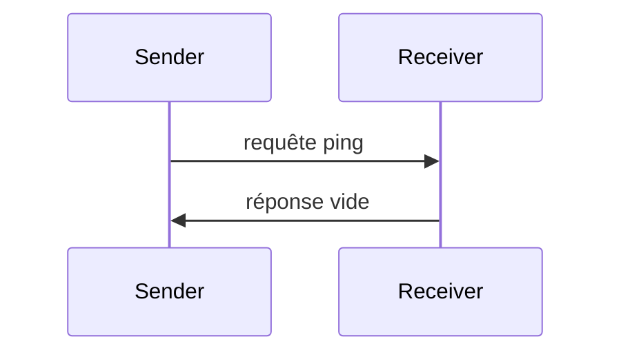

<div id="enable-section-numbers" />

<Info>**Révision du protocole** : brouillon</Info>

Le Protocole de contexte de modèle (MCP) inclut un mécanisme de ping optionnel qui permet à l’une ou l’autre des parties de vérifier que son homologue est toujours réactif et que la connexion est active.

<div id="overview">
  ## Présentation
</div>

La fonctionnalité de ping est mise en œuvre selon un simple modèle requête-réponse. Le client comme le serveur peuvent initier un ping en envoyant une requête `ping`.

<div id="message-format">
  ## Format du message
</div>

Une requête « ping » est une requête JSON-RPC 2.0 standard sans paramètres :

```json
{
  "jsonrpc": "2.0",
  "id": "123",
  "method": "ping"
}
```

<div id="behavior-requirements">
  ## Exigences de comportement
</div>

1. Le récepteur **DOIT** répondre rapidement avec une réponse vide :

```json
{
  "jsonrpc": "2.0",
  "id": "123",
  "result": {}
}
```

2. Si aucune réponse n’est reçue dans un délai raisonnable, l’expéditeur **PEUT** :
   - Considérer la connexion comme inactive
   - Mettre fin à la connexion
   - Tenter une reconnexion

<div id="usage-patterns">
  ## Modèles d’utilisation
</div>



<div id="implementation-considerations">
  ## Considérations d’implémentation
</div>

- Les implémentations **DEVRAIENT** envoyer périodiquement des pings pour vérifier l’état de la connexion
- La fréquence des pings **DEVRAIT** être configurable
- Les délais d’expiration **DEVRAIENT** être adaptés à l’environnement réseau
- Les pings excessifs **DEVRAIENT** être évités afin de réduire la surcharge du réseau

<div id="error-handling">
  ## Gestion des erreurs
</div>

- Les délais d’expiration **DEVRAIENT** être traités comme des échecs de connexion
- Plusieurs pings échoués **PEUVENT** déclencher une réinitialisation de la connexion
- Les implémentations **DEVRAIENT** journaliser les échecs de ping à des fins de diagnostic