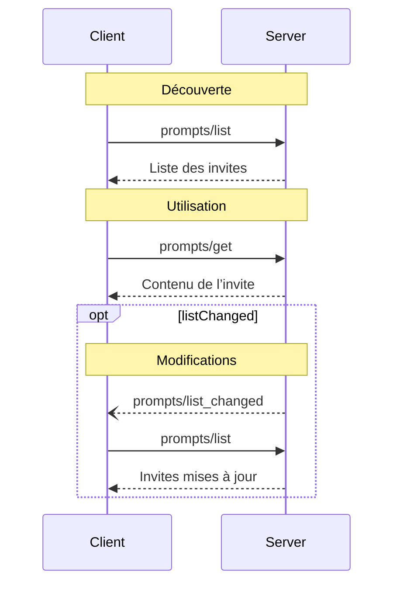

<div id="enable-section-numbers" />

<Info>**Révision du protocole** : draft</Info>

Le Protocole de contexte de modèle (MCP) fournit un moyen standardisé pour les serveurs d’exposer des modèles d’invite aux clients. Les invites permettent aux serveurs de proposer des messages structurés et des instructions pour interagir avec des modèles de langage. Les clients peuvent découvrir les invites disponibles, en récupérer le contenu et fournir des arguments pour les personnaliser.

<div id="user-interaction-model">
  ## Modèle d’interaction utilisateur
</div>

Les Invites sont conçues pour être **contrôlées par l’utilisateur**, c’est-à-dire qu’elles sont exposées par les serveurs aux clients afin que l’utilisateur puisse les sélectionner explicitement pour les utiliser.

En général, les Invites sont déclenchées via des commandes initiées par l’utilisateur dans l’interface, ce qui permet aux utilisateurs de découvrir et d’invoquer naturellement les Invites disponibles.

Par exemple, sous forme de commandes « slash » :


Cependant, les implémenteurs sont libres d’exposer des Invites via tout modèle d’interface qui convient à leurs besoins — le protocole lui-même n’impose aucun modèle d’interaction utilisateur spécifique.

<div id="capabilities">
  ## Capacités
</div>

Les serveurs qui prennent en charge les Invites **DOIVENT** déclarer la capacité `prompts` lors de
[l’initialisation](/fr/specification/draft/basic/lifecycle#initialization) :

```json
{
  "capabilities": {
    "prompts": {
      "listChanged": true
    }
  }
}
```

`listChanged` indique si le serveur émettra des notifications lorsque la liste des
Invites disponibles change.

<div id="protocol-messages">
  ## Messages du protocole
</div>

<div id="listing-prompts">
  ### Lister les Invites
</div>

Pour récupérer les invites disponibles, les clients envoient une requête `prompts/list`. Cette opération
prend en charge la [pagination](/fr/specification/draft/server/utilities/pagination).

**Requête :**

```json
{
  "jsonrpc": "2.0",
  "id": 1,
  "method": "prompts/list",
  "params": {
    "cursor": "optional-cursor-value"
  }
}
```

**Réponse :**

```json
{
  "jsonrpc": "2.0",
  "id": 1,
  "result": {
    "prompts": [
      {
        "name": "code_review",
        "title": "Demander une relecture de code",
        "description": "Demande au LLM d’analyser la qualité du code et de proposer des améliorations",
        "arguments": [
          {
            "name": "code",
            "description": "Le code à relire",
            "required": true
          }
        ],
        "icons": [
          {
            "src": "https://example.com/review-icon.svg",
            "mimeType": "image/svg+xml",
            "sizes": "any"
          }
        ]
      }
    ],
    "nextCursor": "next-page-cursor"
  }
}
```

<div id="getting-a-prompt">
  ### Récupérer une invite
</div>

Pour obtenir une invite spécifique, les clients envoient une requête `prompts/get`. Les arguments peuvent être
complétés automatiquement via [l’API de complétion](/fr/specification/draft/server/utilities/completion).

**Requête :**

```json
{
  "jsonrpc": "2.0",
  "id": 2,
  "method": "prompts/get",
  "params": {
    "name": "code_review",
    "arguments": {
      "code": "def hello():\n    print('world')"
    }
  }
}
```

**Réponse :**

```json
{
  "jsonrpc": "2.0",
  "id": 2,
  "result": {
    "description": "Invite d’examen de code",
    "messages": [
      {
        "role": "user",
        "content": {
          "type": "text",
          "text": "Veuillez examiner ce code Python :\ndef hello():\n    print('world')"
        }
      }
    ]
  }
}
```

<div id="list-changed-notification">
  ### Notification de modification de la liste
</div>

Lorsque la liste des Invites disponibles change, les serveurs qui ont déclaré la
capacité `listChanged` **DEVRAIENT** envoyer une notification :

```json
{
  "jsonrpc": "2.0",
  "method": "notifications/prompts/list_changed"
}
```

<div id="message-flow">
  ## Flux des messages
</div>



<div id="data-types">
  ## Types de données
</div>

<div id="prompt">
  ### Invite
</div>

Une définition d’invite inclut :

* `name`: Identifiant unique de l’invite
* `title`: Nom convivial de l’invite, facultatif, à des fins d’affichage
* `description`: Description lisible par l’humain, facultative
* `arguments`: Liste facultative d’arguments pour la personnalisation

<div id="promptmessage">
  ### PromptMessage
</div>

Les messages d’une invite peuvent contenir :

* `role` : « user » ou « assistant » pour indiquer l’interlocuteur
* `content` : l’un des types de contenu suivants :

<Note>
  Tous les types de contenu des messages d’invite prennent en charge des
  [annotations](/fr/specification/2025-06-18/server/resources#annotations) facultatives pour
  des métadonnées concernant le public, la priorité et les dates de modification.
</Note>

<div id="text-content">
  #### Contenu textuel
</div>

Le contenu textuel représente des messages en texte brut :

```json
{
  "type": "text",
  "text": "The text content of the message"
}
```

C&#39;est le type de contenu le plus courant pour les interactions en langage naturel.

<div id="image-content">
  #### Contenu d’image
</div>

Le contenu d’image permet d’inclure des informations visuelles dans les messages :

```json
{
  "type": "image",
  "data": "base64-encoded-image-data",
  "mimeType": "image/png"
}
```

Les données d’image **DOIVENT** être encodées en base64 et inclure un type MIME valide. Cela permet des interactions multimodales lorsque le contexte visuel est important.

<div id="audio-content">
  #### Contenu audio
</div>

Le contenu audio permet d’inclure des informations audio dans les messages :

```json
{
  "type": "audio",
  "data": "base64-encoded-audio-data",
  "mimeType": "audio/wav"
}
```

Les données audio DOIVENT être encodées en base64 et inclure un type MIME valide. Cela permet des interactions multimodales lorsque le contexte audio est important.

<div id="embedded-resources">
  #### Ressources intégrées
</div>

Les ressources intégrées permettent de référencer directement des ressources côté serveur dans les messages :

```json
{
  "type": "resource",
  "resource": {
    "uri": "resource://example",
    "name": "example",
    "title": "My Example Resource",
    "mimeType": "text/plain",
    "text": "Resource content"
  }
}
```

Les ressources peuvent contenir du texte ou des données binaires (blob) et **DOIVENT** inclure :

* Un URI de ressource valide
* Le type MIME approprié
* Du contenu texte ou des données blob encodées en base64

Les ressources intégrées permettent aux Invites d’incorporer de manière transparente du contenu géré côté serveur, comme
de la documentation, des exemples de code ou d’autres supports de référence, directement dans le flux
de conversation.

<div id="error-handling">
  ## Gestion des erreurs
</div>

Les serveurs **DEVRAIENT** renvoyer des erreurs JSON-RPC standard pour les cas d’échec courants :

* Nom d’invite invalide : `-32602` (Paramètres invalides)
* Arguments requis manquants : `-32602` (Paramètres invalides)
* Erreurs internes : `-32603` (Erreur interne)

<div id="implementation-considerations">
  ## Considérations de mise en œuvre
</div>

1. Les serveurs **DEVRAIENT** valider les arguments d’invite avant le traitement
2. Les clients **DEVRAIENT** gérer la pagination pour les grandes listes d’invites
3. Les deux parties **DEVRAIENT** respecter la négociation des capacités

<div id="security">
  ## Sécurité
</div>

Les implémentations DOIVENT valider avec soin toutes les entrées et sorties d’Invites afin de prévenir les attaques par injection ou tout accès non autorisé aux Ressources.