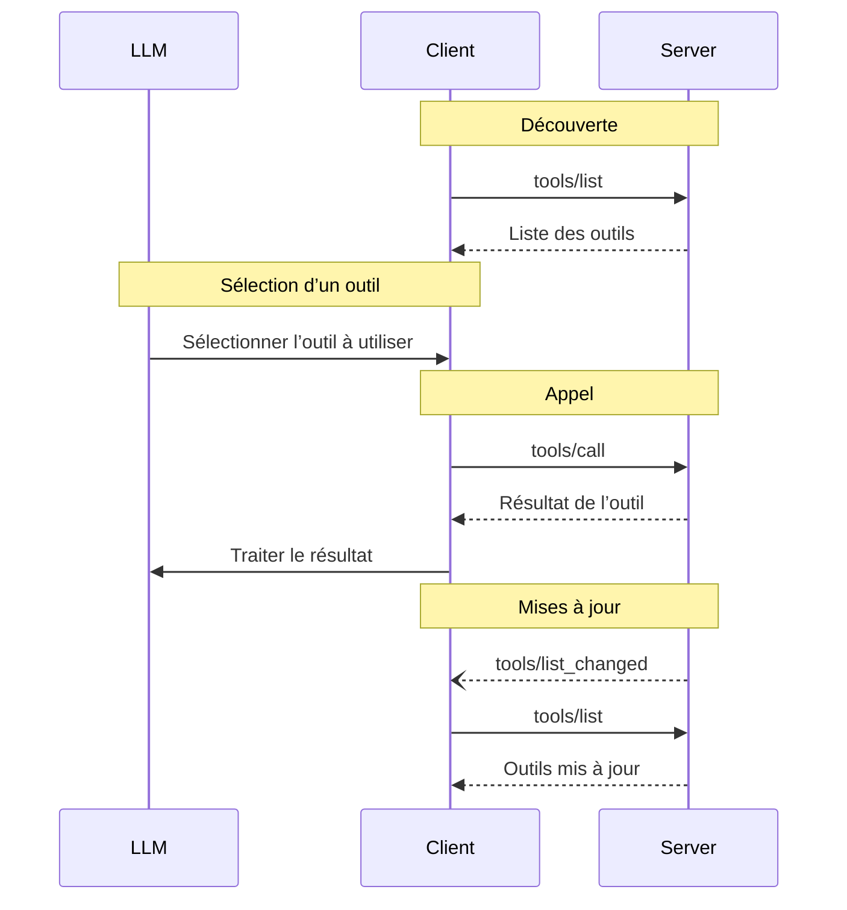

<div id="enable-section-numbers" />

<Info>**Révision du protocole** : ébauche</Info>

Le Protocole de contexte de modèle (MCP) permet aux serveurs d’exposer des outils que les modèles de langage peuvent invoquer. Les outils permettent aux modèles d’interagir avec des systèmes externes, par exemple interroger des bases de données, appeler des API ou effectuer des calculs. Chaque outil est identifié de manière unique par un nom et inclut des métadonnées décrivant son schéma.

<div id="user-interaction-model">
  ## Modèle d’interaction utilisateur
</div>

Les Outils dans le MCP sont conçus pour être **contrôlés par le modèle**, ce qui signifie que le modèle de langage peut
découvrir et invoquer des outils automatiquement en fonction de sa compréhension contextuelle et des
invites de l’utilisateur.

Cependant, les implémentations sont libres d’exposer des outils via n’importe quel schéma d’interface qui
répond à leurs besoins—le protocole lui-même n’impose aucun modèle d’interaction utilisateur
spécifique.

<Warning>
  Pour des raisons de confiance, de sûreté et de sécurité, il **FAUT** toujours
  qu’un humain soit dans la boucle, avec la possibilité de refuser l’invocation d’outils.

  Les applications **DOIVENT** :

  * Fournir une interface utilisateur qui indique clairement quels outils sont exposés au modèle d’IA
  * Afficher des indicateurs visuels clairs lorsque des outils sont invoqués
  * Présenter des invites de confirmation à l’utilisateur pour les opérations, afin de garantir la présence d’un humain dans la
    boucle
</Warning>

<div id="capabilities">
  ## Capacités
</div>

Les serveurs qui prennent en charge les Outils **DOIVENT** déclarer la capacité `tools` :

```json
{
  "capabilities": {
    "tools": {
      "listChanged": true
    }
  }
}
```

`listChanged` indique si le serveur enverra des notifications lorsque la liste des Outils disponibles change.

<div id="protocol-messages">
  ## Messages du protocole
</div>

<div id="listing-tools">
  ### Liste des Outils
</div>

Pour découvrir les Outils disponibles, les Clients MCP envoient une requête `tools/list`. Cette opération prend en charge la
[pagination](/fr/specification/draft/server/utilities/pagination).

**Requête :**

```json
{
  "jsonrpc": "2.0",
  "id": 1,
  "method": "tools/list",
  "params": {
    "cursor": "optional-cursor-value"
  }
}
```

**Réponse :**

```json
{
  "jsonrpc": "2.0",
  "id": 1,
  "result": {
    "tools": [
      {
        "name": "get_weather",
        "title": "Fournisseur d’informations météo",
        "description": "Obtenir les informations météo actuelles pour un lieu",
        "inputSchema": {
          "type": "object",
          "properties": {
            "location": {
              "type": "string",
              "description": "Nom de la ville ou code postal"
            }
          },
          "required": ["location"]
        },
        "icons": [
          {
            "src": "https://example.com/weather-icon.png",
            "mimeType": "image/png",
            "sizes": "48x48"
          }
        ]
      }
    ],
    "nextCursor": "next-page-cursor"
  }
}
```

<div id="calling-tools">
  ### Appeler des Outils
</div>

Pour appeler un outil, les clients envoient une requête `tools/call` :

**Requête :**

```json
{
  "jsonrpc": "2.0",
  "id": 2,
  "method": "tools/call",
  "params": {
    "name": "get_weather",
    "arguments": {
      "location": "New York"
    }
  }
}
```

**Réponse :**

```json
{
  "jsonrpc": "2.0",
  "id": 2,
  "result": {
    "content": [
      {
        "type": "text",
        "text": "Météo actuelle à New York :\nTempérature : 72 °F\nConditions : Partiellement nuageux"
      }
    ],
    "isError": false
  }
}
```

<div id="list-changed-notification">
  ### Notification de changement de liste
</div>

Lorsque la liste des Outils disponibles change, les Serveurs MCP ayant déclaré la capacité `listChanged` **DEVRAIENT** envoyer une notification :

```json
{
  "jsonrpc": "2.0",
  "method": "notifications/tools/list_changed"
}
```

<div id="message-flow">
  ## Flux des messages
</div>



<div id="data-types">
  ## Types de données
</div>

<div id="tool">
  ### Outil
</div>

Une définition d’outil comprend :

* `name` : Identifiant unique de l’outil
* `title` : Nom lisible par un humain de l’outil, facultatif, à des fins d’affichage
* `description` : Description lisible par un humain de la fonctionnalité
* `inputSchema` : Schéma JSON définissant les paramètres attendus
* `outputSchema` : Schéma JSON facultatif définissant la structure de sortie attendue
* `annotations` : Propriétés facultatives décrivant le comportement de l’outil

<Warning>
  Pour des raisons de confiance et de sécurité, les clients **DOIVENT** considérer
  les annotations d’outil comme non fiables, sauf si elles proviennent de serveurs de confiance.
</Warning>

<div id="tool-result">
  ### Résultat d’outil
</div>

Les résultats d’outil peuvent contenir du contenu [**structuré**](#structured-content) ou **non structuré**.

Le contenu **non structuré** est renvoyé dans le champ `content` d’un résultat et peut contenir plusieurs éléments de contenu de types différents :

<Note>
  Tous les types de contenu (texte, image, audio, liens vers des ressources et ressources intégrées)
  prennent en charge des
  [annotations](/fr/specification/draft/server/resources#annotations) facultatives qui fournissent
  des métadonnées sur la cible, la priorité et les dates de modification. Il s’agit du même
  format d’annotation utilisé par les Ressources et les Invites.
</Note>

<div id="text-content">
  #### Contenu textuel
</div>

```json
{
  "type": "text",
  "text": "Texte du résultat de l’outil"
}
```

<div id="image-content">
  #### Contenu de l’image
</div>

```json
{
  "type": "image",
  "data": "base64-encoded-data",
  "mimeType": "image/png",
  "annotations": {
    "audience": ["user"],
    "priority": 0.9
  }
}
```

<div id="audio-content">
  #### Contenu audio
</div>

```json
{
  "type": "audio",
  "data": "données-audio-encodées-en-base64",
  "mimeType": "audio/wav"
}
```

<div id="resource-links">
  #### Liens vers des ressources
</div>

Un outil **PEUT** renvoyer des liens vers des [Ressources](/fr/specification/draft/server/resources) afin de fournir un contexte
ou des données supplémentaires. Dans ce cas, l’outil renverra un URI auquel le client peut s’abonner ou qu’il peut récupérer :

```json
{
  "type": "resource_link",
  "uri": "file:///project/src/main.rs",
  "name": "main.rs",
  "description": "Point d’entrée principal de l’application",
  "mimeType": "text/x-rust"
}
```

Les liens vers des ressources prennent en charge les mêmes [annotations de ressource](/fr/specification/draft/server/resources#annotations) que les ressources classiques, afin d’aider les clients à comprendre comment les utiliser.

<Info>
  Les liens vers des ressources renvoyés par des outils ne sont pas garantis d’apparaître dans les résultats
  d’une requête `resources/list`.
</Info>

<div id="embedded-resources">
  #### Ressources intégrées
</div>

Les [Ressources](/fr/specification/draft/server/resources) **PEUVENT** être intégrées pour fournir un contexte supplémentaire
ou des données à l’aide d’un [schéma d’URI](fr/./resources#common-uri-schemes) approprié. Les serveurs qui utilisent des ressources intégrées **DEVRAIENT** implémenter la capacité `resources` :

```json
{
  "type": "resource",
  "resource": {
    "uri": "file:///project/src/main.rs",
    "title": "Project Rust Main File",
    "mimeType": "text/x-rust",
    "text": "fn main() {\n    println!(\"Hello world!\");\n}",
    "annotations": {
      "audience": ["user", "assistant"],
      "priority": 0.7,
      "lastModified": "2025-05-03T14:30:00Z"
    }
  }
}
```

Les ressources intégrées prennent en charge les mêmes [annotations de ressource](/fr/specification/draft/server/resources#annotations) que les ressources classiques pour aider les clients à comprendre comment les utiliser.

<div id="structured-content">
  #### Contenu structuré
</div>

Le contenu **structuré** est renvoyé sous forme d’objet JSON dans le champ `structuredContent` d’un résultat.

Pour assurer la rétrocompatibilité, un outil qui renvoie du contenu structuré DEVRAIT également renvoyer le JSON sérialisé dans un bloc TextContent.

<div id="output-schema">
  #### Schéma de sortie
</div>

Les Outils peuvent également fournir un schéma de sortie pour la validation des résultats structurés.
Si un schéma de sortie est fourni :

* Les Serveurs **DOIVENT** fournir des résultats structurés conformes à ce schéma.
* Les Clients **DEVRAIENT** valider les résultats structurés par rapport à ce schéma.

Exemple d’outil avec schéma de sortie :

```json
{
  "name": "get_weather_data",
  "title": "Weather Data Retriever",
  "description": "Get current weather data for a location",
  "inputSchema": {
    "type": "object",
    "properties": {
      "location": {
        "type": "string",
        "description": "City name or zip code"
      }
    },
    "required": ["location"]
  },
  "outputSchema": {
    "type": "object",
    "properties": {
      "temperature": {
        "type": "number",
        "description": "Temperature in celsius"
      },
      "conditions": {
        "type": "string",
        "description": "Weather conditions description"
      },
      "humidity": {
        "type": "number",
        "description": "Humidity percentage"
      }
    },
    "required": ["temperature", "conditions", "humidity"]
  }
}
```

Exemple de réponse valide pour cet outil :

```json
{
  "jsonrpc": "2.0",
  "id": 5,
  "result": {
    "content": [
      {
        "type": "text",
        "text": "{\"temperature\": 22.5, \"conditions\": \"Partly cloudy\", \"humidity\": 65}"
      }
    ],
    "structuredContent": {
      "temperature": 22.5,
      "conditions": "Partly cloudy",
      "humidity": 65
    }
  }
}
```

Fournir un schéma de sortie aide les Clients et les LLM à comprendre et à traiter correctement les sorties d’Outils structurées en :

* Permettant une validation stricte des réponses par rapport au schéma
* Fournissant des informations de typage pour une meilleure intégration avec les langages de programmation
* Guidant les Clients et les LLM pour analyser et utiliser correctement les données renvoyées
* Améliorant la documentation et l’expérience développeur

<div id="error-handling">
  ## Gestion des erreurs
</div>

Les Outils utilisent deux mécanismes de rapport d’erreurs :

1. **Erreurs de protocole** : erreurs JSON-RPC standard pour des problèmes tels que :
   * Outils inconnus
   * Arguments non valides
   * Erreurs serveur

2. **Erreurs d’exécution d’outil** : signalées dans les résultats d’outil avec `isError: true` :
   * Échecs d’API
   * Données d’entrée non valides
   * Erreurs de logique métier

Exemple d’erreur de protocole :

```json
{
  "jsonrpc": "2.0",
  "id": 3,
  "error": {
    "code": -32602,
    "message": "Unknown tool: invalid_tool_name"
  }
}
```

Exemple d’erreur d’exécution d’outil :

```json
{
  "jsonrpc": "2.0",
  "id": 4,
  "result": {
    "content": [
      {
        "type": "text",
        "text": "Failed to fetch weather data: API rate limit exceeded"
      }
    ],
    "isError": true
  }
}
```

<div id="security-considerations">
  ## Considérations de sécurité
</div>

1. Les serveurs **DOIVENT** :
   * Valider toutes les entrées des Outils
   * Mettre en œuvre des contrôles d’accès appropriés
   * Limiter le débit des invocations d’Outils
   * Assainir les sorties des Outils

2. Les Clients **DEVRAIENT** :
   * Demander la confirmation de l’utilisateur pour les opérations sensibles
   * Afficher les entrées des Outils à l’utilisateur avant d’appeler le Serveur, afin d’éviter toute exfiltration
     de données malveillante ou accidentelle
   * Valider les résultats des Outils avant de les transmettre au LLM
   * Mettre en place des délais d’expiration pour les appels aux Outils
   * Consigner l’utilisation des Outils à des fins d’audit