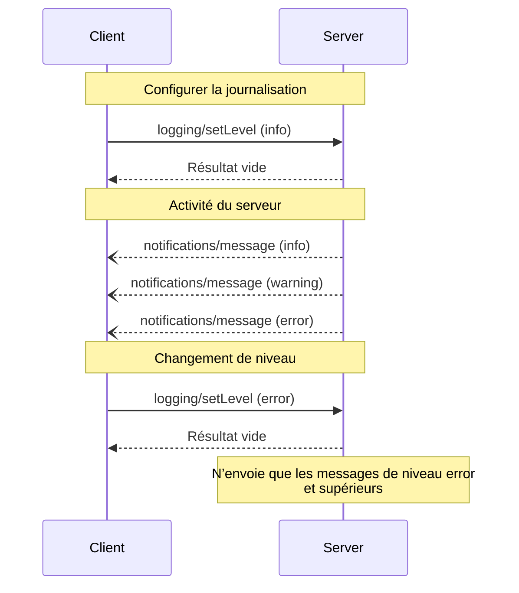

<div id="enable-section-numbers" />

<Info>**Révision du protocole** : ébauche</Info>

Le Protocole de contexte de modèle (MCP) propose un moyen standardisé pour les serveurs d’envoyer
des messages de log structurés aux clients. Les clients peuvent contrôler le niveau de détail des logs en définissant
des niveaux minimum, les serveurs envoyant des notifications avec un niveau de gravité,
un nom de logger facultatif et des données arbitraires sérialisables en JSON.

<div id="user-interaction-model">
  ## Modèle d'interaction utilisateur
</div>

Les implémentations sont libres d’exposer la journalisation via tout modèle d’interface adapté à leurs besoins&mdash;le protocole en lui-même n’impose aucun modèle d’interaction utilisateur spécifique.

<div id="capabilities">
  ## Capacités
</div>

Les serveurs qui émettent des notifications de journaux **DOIVENT** déclarer la capacité `logging` :

```json
{
  "capabilities": {
    "logging": {}
  }
}
```

<div id="log-levels">
  ## Niveaux de journalisation
</div>

Le protocole suit les niveaux de gravité syslog standard définis dans
[RFC 5424](https://datatracker.ietf.org/doc/html/rfc5424#section-6.2.1) :

| Niveau    | Description                          | Exemple d'utilisation      |
| --------- | ------------------------------------ | -------------------------- |
| debug     | Informations détaillées de débogage  | Points d'entrée/sortie de fonctions |
| info      | Messages d'information généraux      | Mises à jour de l'avancement d'une opération |
| notice    | Événements normaux mais importants   | Modifications de configuration |
| warning   | Conditions d'avertissement           | Utilisation de fonctionnalités obsolètes |
| error     | Conditions d'erreur                  | Échecs d'opérations        |
| critical  | Conditions critiques                 | Pannes de composants système |
| alert     | Action à entreprendre immédiatement  | Corruption de données détectée |
| emergency | Système inutilisable                 | Panne système complète     |

<div id="protocol-messages">
  ## Messages de protocole
</div>

<div id="setting-log-level">
  ### Définir le niveau de journalisation
</div>

Pour configurer le niveau de journalisation minimal, les clients **PEUVENT** envoyer une requête `logging/setLevel` :

**Requête :**

```json
{
  "jsonrpc": "2.0",
  "id": 1,
  "method": "logging/setLevel",
  "params": {
    "level": "info"
  }
}
```

<div id="log-message-notifications">
  ### Notifications de messages de journal
</div>

Les serveurs envoient des messages de journal au moyen des notifications `notifications/message` :

```json
{
  "jsonrpc": "2.0",
  "method": "notifications/message",
  "params": {
    "level": "error",
    "logger": "database",
    "data": {
      "error": "Connection failed",
      "details": {
        "host": "localhost",
        "port": 5432
      }
    }
  }
}
```

<div id="message-flow">
  ## Flux de messages
</div>



<div id="error-handling">
  ## Gestion des erreurs
</div>

Les serveurs **DEVRAIENT** renvoyer des erreurs JSON-RPC standard pour les cas d’échec courants :

- Niveau de journalisation invalide : `-32602` (Paramètres invalides)
- Erreurs de configuration : `-32603` (Erreur interne)

<div id="implementation-considerations">
  ## Considérations d’implémentation
</div>

1. Les serveurs **DEVRAIENT** :
   - Limiter le débit des messages de journalisation
   - Inclure le contexte pertinent dans le champ data
   - Utiliser des noms de logger cohérents
   - Supprimer les informations sensibles

2. Les clients **PEUVENT** :
   - Présenter les messages de journalisation dans l’interface utilisateur
   - Mettre en place le filtrage et la recherche des journaux
   - Afficher visuellement le niveau de gravité
   - Conserver les messages de journalisation

<div id="security">
  ## Sécurité
</div>

1. Les messages de journalisation **NE DOIVENT PAS** contenir :
   - Des identifiants ou des secrets
   - Des informations personnelles identifiables
   - Des détails internes du système pouvant faciliter des attaques

2. Les implémentations **DEVRAIENT** :
   - Limiter le débit des messages
   - Valider tous les champs de données
   - Contrôler l’accès aux journaux
   - Surveiller la présence de contenu sensible