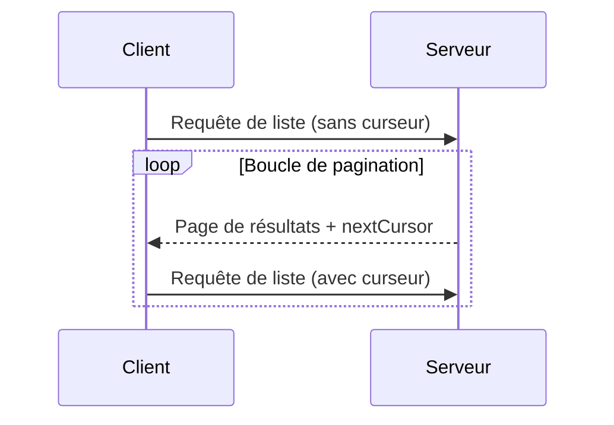

<div id="enable-section-numbers" />

<Info>**Révision du protocole** : brouillon</Info>

Le Protocole de contexte de modèle (MCP) prend en charge la pagination des opérations de liste susceptibles de renvoyer de volumineux ensembles de résultats. La pagination permet aux serveurs de fournir les résultats en plus petits lots plutôt que tous d’un coup.

La pagination est particulièrement importante lors de la connexion à des services externes sur Internet, mais elle est aussi utile pour les intégrations locales afin d’éviter des problèmes de performances avec de grands ensembles de données.

<div id="pagination-model">
  ## Modèle de pagination
</div>

La pagination dans le Protocole de contexte de modèle (MCP) utilise une approche opaque basée sur un curseur, plutôt que sur des pages numérotées.

- Le **curseur** est un jeton de chaîne opaque représentant une position dans l’ensemble de résultats
- La **taille de page** est déterminée par le serveur, et les clients **NE DOIVENT PAS** présumer une taille de page fixe

<div id="response-format">
  ## Format de réponse
</div>

La pagination commence lorsque le serveur envoie une **réponse** contenant :

- La page de résultats actuelle
- Un champ optionnel `nextCursor` s’il existe d’autres résultats

```json
{
  "jsonrpc": "2.0",
  "id": "123",
  "result": {
    "resources": [...],
    "nextCursor": "eyJwYWdlIjogM30="
  }
}
```

<div id="request-format">
  ## Format de requête
</div>

Après avoir reçu un curseur, le client peut _continuer_ la pagination en envoyant une requête
incluant ce curseur :

```json
{
  "jsonrpc": "2.0",
  "method": "resources/list",
  "params": {
    "cursor": "eyJwYWdlIjogMn0="
  }
}
```

<div id="pagination-flow">
  ## Flux de pagination
</div>



<div id="operations-supporting-pagination">
  ## Opérations compatibles avec la pagination
</div>

Les opérations MCP suivantes sont compatibles avec la pagination :

- `resources/list` - Répertorier les ressources disponibles
- `resources/templates/list` - Répertorier les modèles de ressources
- `prompts/list` - Répertorier les invites disponibles
- `tools/list` - Répertorier les outils disponibles

<div id="implementation-guidelines">
  ## Directives d’implémentation
</div>

1. Les serveurs **DEVRAIENT** :
   - Fournir des curseurs stables
   - Gérer correctement les curseurs invalides

2. Les clients **DEVRAIENT** :
   - Considérer l’absence de `nextCursor` comme la fin des résultats
   - Prendre en charge les parcours avec et sans pagination

3. Les clients **DOIVENT** traiter les curseurs comme des jetons opaques :
   - Ne faites aucune hypothèse sur le format des curseurs
   - N’essayez pas d’interpréter ni de modifier les curseurs
   - Ne conservez pas les curseurs d’une session à l’autre

<div id="error-handling">
  ## Gestion des erreurs
</div>

Les curseurs non valides **DEVRAIENT** entraîner une erreur avec le code -32602 (paramètres invalides).