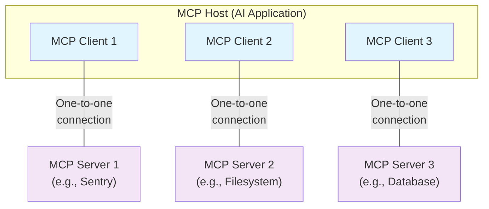

このModel Context Protocol（MCP）の概要では、その[スコープ](#scope)と[MCPのコア概念](#concepts-of-mcp)を説明し、各コア概念を示す[例](#example)を提供します。

MCP SDKは多くの課題を抽象化しているため、ほとんどの開発者にとっては[データ層プロトコル](#data-layer-protocol)のセクションが最も参考になるでしょう。ここでは、MCPサーバーがAIアプリケーションにコンテキストを提供する方法を説明します。

具体的な実装の詳細は、[言語別SDK](/ja/docs/sdk)のドキュメントを参照してください。

<div id="scope">
  ## スコープ
</div>

Model Context Protocol（MCP）には次のプロジェクトが含まれます：

* [MCP Specification](https://modelcontextprotocol.io/specification/latest)：クライアントとサーバーの実装要件を示したMCPの仕様。
* [MCP SDKs](/ja/docs/sdk)：各種プログラミング言語向けのMCP実装用SDK。
* **MCP Development Tools**：[MCP Inspector](https://github.com/modelcontextprotocol/inspector) を含む、MCPサーバーおよびクライアントの開発ツール。
* [MCP Reference Server Implementations](https://github.com/modelcontextprotocol/servers)：MCPサーバーのリファレンス実装。

<Note>
  MCPはコンテキスト交換のためのプロトコルにのみ焦点を当てており、AIアプリケーションがLLMをどう利用するかや、提供されたコンテキストをどう管理するかは規定しません。
</Note>

<div id="concepts-of-mcp">
  ## MCPの概念
</div>

<div id="participants">
  ### 参加者
</div>

Model Context Protocol（MCP）はクライアント-サーバー型アーキテクチャに従います。ここでMCPホスト — [Claude Code](https://www.anthropic.com/claude-code) や [Claude Desktop](https://www.claude.ai/download) のようなAIアプリケーション — は、1つ以上のMCPサーバーへの接続を確立します。MCPホストは、各MCPサーバーごとに1つのMCPクライアントを作成することでこれを実現します。各MCPクライアントは、対応するMCPサーバーとの専用の1対1接続を維持します。

MCPアーキテクチャの主要な参加者は次のとおりです。

* **MCPホスト**: 1つまたは複数のMCPクライアントを調整・管理するAIアプリケーション
* **MCPクライアント**: MCPサーバーへの接続を維持し、MCPホストが利用するためのコンテキストをMCPサーバーから取得するコンポーネント
* **MCPサーバー**: MCPクライアントにコンテキストを提供するプログラム

**例**: Visual Studio CodeはMCPホストとして機能します。Visual Studio Codeが [Sentry MCP server](https://docs.sentry.io/product/sentry-mcp/) のようなMCPサーバーへの接続を確立すると、Visual Studio CodeのランタイムはSentry MCPサーバーへの接続を維持するMCPクライアントオブジェクトをインスタンス化します。
その後、Visual Studio Codeが [local filesystem server](https://github.com/modelcontextprotocol/servers/tree/main/src/filesystem) のような別のMCPサーバーに接続すると、Visual Studio Codeのランタイムはこの接続を維持するために追加のMCPクライアントオブジェクトをインスタンス化し、MCPクライアントとMCPサーバーの1対1の関係を保ちます。



**MCPサーバー**は、その実行場所に関わらずコンテキストデータを提供するプログラムを指すことに注意してください。MCPサーバーはローカルでもリモートでも実行できます。たとえば、Claude Desktopが [filesystem
server](https://github.com/modelcontextprotocol/servers/tree/main/src/filesystem) を起動する場合、STDIO
トランスポートを使用するため、サーバーは同一マシン上でローカルに実行されます。これは一般に「ローカル」MCPサーバーと呼ばれます。公式の
[Sentry MCP server](https://docs.sentry.io/product/sentry-mcp/) はSentryプラットフォーム上で実行され、ストリーム対応HTTPのトランスポートを使用します。これは一般に「リモート」MCPサーバーと呼ばれます。

<div id="layers">
  ### レイヤー
</div>

MCPは2つのレイヤーで構成されています:

* **データレイヤー**: クライアントとサーバー間の通信に関するJSON-RPC 2.0ベースのプロトコルを定義し、ライフサイクル管理や、ツール、リソース、プロンプト、通知といったコアのプリミティブを含みます。
* **トランスポートレイヤー**: クライアントとサーバー間のデータ交換を可能にする通信メカニズムおよびチャネルを定義し、トランスポート固有の接続確立、メッセージのフレーミング、認可を含みます。

概念的には、データレイヤーが内側のレイヤーで、トランスポートレイヤーが外側のレイヤーです。

<div id="data-layer">
  #### データレイヤー
</div>

データレイヤーは、メッセージの構造と意味論を定義する [JSON-RPC 2.0](https://www.jsonrpc.org/) ベースの交換プロトコルを実装します。
このレイヤーには以下が含まれます:

* **ライフサイクル管理**: クライアントとサーバー間の接続初期化、機能のネゴシエーション、接続終了を処理
* **サーバー機能**: AIアクション向けのツール、コンテキストデータ向けのリソース、クライアントとのやり取りに用いるテンプレートとしてのプロンプトなど、サーバーが中核機能を提供できるようにする
* **クライアント機能**: サーバーがクライアントに対し、ホストのLLM経由でのサンプリングを依頼し、ユーザー入力をエリシテーションし、メッセージをクライアントへログ出力できるようにする
* **ユーティリティ機能**: リアルタイム更新の通知や、長時間実行タスクの進捗追跡といった追加機能をサポート

<div id="transport-layer">
  #### トランスポート層
</div>

トランスポート層は、クライアントとサーバー間の通信チャネルおよび認証を管理します。接続の確立、メッセージのフレーミング、MCP参加者間のセキュアな通信を扱います。

MCPは2つのトランスポート方式をサポートします:

* **Stdioトランスポート**: 同一マシン上のローカルプロセス間の直接通信に標準入力/出力ストリームを用い、ネットワークのオーバーヘッドなしに最適なパフォーマンスを提供します。
* **ストリーム対応HTTPトランスポート**: クライアントからサーバーへのメッセージにHTTP POSTを使用し、ストリーミングにはオプションでサーバー送信イベント（SSE）を用います。このトランスポートはリモートサーバーとの通信を可能にし、ベアラートークン、APIキー、カスタムヘッダーなどの標準的なHTTP認証方式をサポートします。MCPは認証トークンの取得にOAuthの利用を推奨します。

トランスポート層はプロトコル層から通信の詳細を抽象化し、すべてのトランスポート方式で同一のJSON-RPC 2.0メッセージ形式を利用できるようにします。

<div id="data-layer-protocol">
  ### データレイヤープロトコル
</div>

MCPの中核は、MCPクライアントとMCPサーバー間のスキーマとセマンティクスを定義することにあります。開発者にとっては、データレイヤー、特に[プリミティブ](#primitives)の集合が、MCPで最も興味深い部分になるでしょう。ここは、MCPサーバーからMCPクライアントへコンテキストを共有する方法を定義する領域です。

MCPは基盤となるRPCプロトコルとして[JSON-RPC 2.0](https://www.jsonrpc.org/)を使用します。クライアントとサーバーは互いにリクエストを送受信し、それに応じて応答します。応答が不要な場合は通知を使用できます。

<div id="lifecycle-management">
  #### ライフサイクル管理
</div>

MCP はライフサイクル管理を要する<Tooltip tip="Streamable HTTP トランスポートを使用すると、MCP の一部をステートレスにできます">ステートフルなプロトコル</Tooltip>です。ライフサイクル管理の目的は、クライアントとサーバーの双方がサポートする<Tooltip tip="ツール、リソース、プロンプトなど、クライアントまたはサーバーがサポートする機能や操作">機能</Tooltip>を取り決めることです。詳細は[仕様](/ja/specification/2025-06-18/basic/lifecycle)を参照してください。[例](#example)では初期化シーケンスを紹介しています。

<div id="primitives">
  #### プリミティブ
</div>

MCPのプリミティブは、MCPにおける最重要の概念です。クライアントとサーバーが相互に提供できる機能を定義します。これらのプリミティブは、AIアプリケーションと共有できるコンテキスト情報の種類と、実行可能なアクションの範囲を規定します。

MCPは、*サーバー* が公開できる3つの中核プリミティブを定義しています。

* **ツール**: AIアプリケーションがアクションを実行するために呼び出せる実行可能な関数（例: ファイル操作、API呼び出し、データベースクエリ）
* **リソース**: AIアプリケーションにコンテキスト情報を提供するデータソース（例: ファイル内容、データベースレコード、APIレスポンス）
* **プロンプト**: 言語モデルとのやり取りを構造化するのに役立つ再利用可能なテンプレート（例: システムプロンプト、few-shotの例）

各プリミティブタイプには、ディスカバリ（`*/list`）、取得（`*/get`）、場合によっては実行（`tools/call`）のためのメソッドが用意されています。
MCPクライアントは `*/list` メソッドを使って利用可能なプリミティブを発見します。たとえば、クライアントはまず利用可能なツール（`tools/list`）を列挙し、その後に実行できます。この設計により、一覧は動的に変化させられます。

具体例として、データベースに関するコンテキストを提供するMCPサーバーを考えてみましょう。これは、データベースをクエリするためのツール、データベースのスキーマを含むリソース、そしてツールとのやり取りにfew-shotの例を含むプロンプトを公開できます。

サーバーのプリミティブの詳細については [server concepts](ja/./server-concepts) を参照してください。

MCPは、*クライアント* が公開できるプリミティブも定義しています。これらにより、MCPサーバーの作者はより豊かなインタラクションを構築できます。

* **サンプリング**: サーバーがクライアントのAIアプリケーションを介して言語モデルの補完を依頼できるようにします。サーバー作者が言語モデルへアクセスしたい一方で、モデル非依存を保ち、MCPサーバーに言語モデルのSDKを組み込みたくない場合に有用です。`sampling/complete` メソッドでクライアントのAIアプリケーションに補完を依頼できます。
* **エリシテーション**: サーバーがユーザーへ追加情報を求められるようにします。ユーザーからより多くの情報を得たい場合や、アクションの確認を取りたい場合に有用です。`elicitation/request` メソッドでユーザーに追加情報を依頼できます。
* **ロギング**: デバッグや監視の目的で、サーバーがクライアントにログメッセージを送信できるようにします。

クライアントのプリミティブの詳細については [client concepts](ja/./client-concepts) を参照してください。

<div id="notifications">
  #### 通知
</div>

このプロトコルは、サーバーとクライアント間での動的な更新を可能にするリアルタイム通知をサポートします。たとえば、サーバーで利用可能なツールが変化した場合（新機能が追加されたり、既存のツールが変更されたりしたときなど）、サーバーは接続中のクライアントに変更を知らせるため、ツールの更新通知を送信できます。通知は応答を必要としない JSON-RPC 2.0 の通知メッセージとして送信され、MCPサーバーが接続中のクライアントへリアルタイムに更新を提供できるようにします。

<div id="example">
  ## 例
</div>

<div id="data-layer">
  ### データレイヤー
</div>

このセクションでは、データレイヤーのプロトコルに焦点を当て、MCPクライアントとMCPサーバーのやり取りを段階的に解説します。ライフサイクルのシーケンス、ツールの操作、通知を、JSON-RPC 2.0メッセージで示します。

<Steps>
  <Step title="Initialization (Lifecycle Management)">
    MCPは、機能交渉のハンドシェイクによるライフサイクル管理から始まります。[ライフサイクル管理](#lifecycle-management)セクションで説明されているとおり、クライアントは接続を確立し、サポート機能を協議するために `initialize` リクエストを送信します。

    <CodeGroup>
      ```json Initialize Request
      {
        "jsonrpc": "2.0",
        "id": 1,
        "method": "initialize",
        "params": {
          "protocolVersion": "2025-06-18",
          "capabilities": {
            "elicitation": {}
          },
          "clientInfo": {
            "name": "example-client",
            "version": "1.0.0"
          }
        }
      }
      ```

      ```json Initialize Response
      {
        "jsonrpc": "2.0",
        "id": 1,
        "result": {
          "protocolVersion": "2025-06-18",
          "capabilities": {
            "tools": {
              "listChanged": true
            },
            "resources": {}
          },
          "serverInfo": {
            "name": "example-server",
            "version": "1.0.0"
          }
        }
      }
      ```
    </CodeGroup>

    #### 初期化のやり取りを理解する

    初期化プロセスはMCPのライフサイクル管理における重要な工程で、次の目的を果たします。

    1. プロトコルバージョンの交渉: `protocolVersion` フィールド（例: &quot;2025-06-18&quot;）により、クライアントとサーバーの双方が互換性のあるプロトコルバージョンを使用していることを保証します。これにより、異なるバージョン同士がやり取りしようとした際に起こりうる通信エラーを防ぎます。相互に互換なバージョンを合意できない場合は、接続を終了すべきです。

    2. 機能ディスカバリ: `capabilities` オブジェクトによって、各当事者はサポートする機能を宣言できます。どの[プリミティブ](#primitives)（ツール、リソース、プロンプト）を扱えるか、また[通知](#notifications)のような機能をサポートするかを含みます。これにより、未サポートの操作を避け、効率的な通信が可能になります。

    3. 身元情報の交換: `clientInfo` と `serverInfo` オブジェクトは、デバッグや互換性確認のための識別子とバージョン情報を提供します。

    この例では、機能交渉によりMCPのプリミティブがどのように宣言されるかを示しています。

    クライアントの機能:

    * `"elicitation": {}` - クライアントはユーザーからの構造化入力要求に対応できることを宣言しています（`elicitation/create` メソッド呼び出しを受け取れる）

    サーバーの機能:

    * `"tools": {"listChanged": true}` - サーバーはツールのプリミティブをサポートし、さらにツール一覧が変更されたときに `tools/list_changed` 通知を送信できます
    * `"resources": {}` - サーバーはリソースのプリミティブもサポートします（`resources/list` および `resources/read` メソッドを扱える）

    初期化が成功すると、クライアントは準備完了を示す通知を送信します。

    ```json Notification
    {
      "jsonrpc": "2.0",
      "method": "notifications/initialized"
    }
    ```

    #### AIアプリケーションにおける動作

    初期化時、AIアプリケーションのMCPクライアントマネージャは、設定済みサーバーへの接続を確立し、その機能を後で使用するために保持します。アプリケーションはこの情報を用いて、どのサーバーが特定の機能（ツール、リソース、プロンプト）を提供できるか、またリアルタイム更新をサポートしているかを判断します。

    ```python Pseudo-code for AI application initialization
    # Pseudo Code
    async with stdio_client(server_config) as (read, write):
        async with ClientSession(read, write) as session:
            init_response = await session.initialize()
            if init_response.capabilities.tools:
                app.register_mcp_server(session, supports_tools=True)
            app.set_server_ready(session)
    ```
  </Step>

  <Step title="Tool Discovery (Primitives)">
    接続が確立されたら、クライアントは `tools/list` リクエストを送信して利用可能なツールを一覧できます。このリクエストはMCPのツール発見メカニズムの根幹であり、クライアントが実際に使用する前に、サーバーで利用可能なツールを把握できるようにします。

    <CodeGroup>
      ```json Tools List Request
      {
        "jsonrpc": "2.0",
        "id": 2,
        "method": "tools/list"
      }
      ```

      ```json Tools List Response
      {
        "jsonrpc": "2.0",
        "id": 2,
        "result": {
          "tools": [
            {
              "name": "calculator_arithmetic",
              "title": "Calculator",
              "description": "Perform mathematical calculations including basic arithmetic, trigonometric functions, and algebraic operations",
              "inputSchema": {
                "type": "object",
                "properties": {
                  "expression": {
                    "type": "string",
                    "description": "Mathematical expression to evaluate (e.g., '2 + 3 * 4', 'sin(30)', 'sqrt(16)')"
                  }
                },
                "required": ["expression"]
              }
            },
            {
              "name": "weather_current",
              "title": "Weather Information",
              "description": "Get current weather information for any location worldwide",
              "inputSchema": {
                "type": "object",
                "properties": {
                  "location": {
                    "type": "string",
                    "description": "City name, address, or coordinates (latitude,longitude)"
                  },
                  "units": {
                    "type": "string",
                    "enum": ["metric", "imperial", "kelvin"],
                    "description": "Temperature units to use in response",
                    "default": "metric"
                  }
                },
                "required": ["location"]
              }
            }
          ]
        }
      }
      ```
    </CodeGroup>

    #### ツール発見リクエストについて

    `tools/list` リクエストはシンプルで、パラメータを持ちません。

    #### ツール発見レスポンスについて

    レスポンスには、各ツールに関する包括的なメタデータを提供する `tools` 配列が含まれます。この配列構造により、サーバーは複数のツールを同時に公開しつつ、機能ごとの明確な境界を保てます。

    レスポンス内の各ツールオブジェクトには、次の主要フィールドが含まれます:

    * **`name`**: サーバーの名前空間内でツールを一意に識別するID。ツール実行時の主キーとなり、明確な命名規則に従うべきです（例: 単なる `calculate` ではなく `calculator_arithmetic`）
    * **`title`**: クライアントがユーザーに表示する、人間が読める表示名
    * **`description`**: ツールの機能と使用タイミングの詳細な説明
    * **`inputSchema`**: 期待される入力パラメータを定義するJSON Schema。型検証を可能にし、必須/任意パラメータに関する明確なドキュメントを提供します

    #### AIアプリケーションでの動作

    AIアプリケーションは、接続されたすべてのMCPサーバーから利用可能なツールを取得し、言語モデルが参照できる統合ツールレジストリに集約します。これにより、LLMは実行可能なアクションを把握し、会話中に適切なツール呼び出しを自動生成できます。

    ```python Pseudo-code for AI application tool discovery
    # MCP Python SDKのパターンを用いた疑似コード
    available_tools = []
    for session in app.mcp_server_sessions():
        tools_response = await session.list_tools()
        available_tools.extend(tools_response.tools)
    conversation.register_available_tools(available_tools)
    ```
  </Step>

  <Step title="Tool Execution (Primitives)">
    クライアントは `tools/call` メソッドを使ってツールを実行できます。これは、MCPの基本要素が実際にどう使われるかを示すものです。利用可能なツールをディスカバリーで把握した後、クライアントは適切な引数を渡して呼び出せます。

    #### ツール実行リクエストの理解

    `tools/call` リクエストは、型安全性とクライアント／サーバー間の明確な通信を担保する定型の構造に従います。ここでは、簡略名ではなく、ディスカバリーのレスポンスで返された正確なツール名（`weather_current`）を使用している点に注意してください：

    <CodeGroup>
      ```json Tool Call Request
      {
        "jsonrpc": "2.0",
        "id": 3,
        "method": "tools/call",
        "params": {
          "name": "weather_current",
          "arguments": {
            "location": "San Francisco",
            "units": "imperial"
          }
        }
      }
      ```

      ```json Tool Call Response
      {
        "jsonrpc": "2.0",
        "id": 3,
        "result": {
          "content": [
            {
              "type": "text",
              "text": "Current weather in San Francisco: 68°F, partly cloudy with light winds from the west at 8 mph. Humidity: 65%"
            }
          ]
        }
      }
      ```
    </CodeGroup>

    #### ツール実行の主要要素

    リクエストの構造には、次の重要な要素が含まれます:

    1. **`name`**: ディスカバリーのレスポンスにあるツール名（`weather_current`）と完全に一致している必要があります。これにより、サーバーは実行すべきツールを正しく特定できます。

    2. **`arguments`**: ツールの `inputSchema` で定義された入力パラメータを含みます。今回の例では:
       * `location`: &quot;San Francisco&quot;（必須）
       * `units`: &quot;imperial&quot;（任意。指定がない場合は &quot;metric&quot; がデフォルト）

    3. **JSON-RPC の構造**: 一意の `id` によるリクエスト—レスポンスの対応付けを備えた標準の JSON-RPC 2.0 形式を使用します。

    #### ツール実行レスポンスの理解

    レスポンスはMCPの柔軟なコンテンツシステムを示しています:

    1. **`content` 配列**: ツールのレスポンスはコンテンツオブジェクトの配列を返し、リッチでマルチフォーマットなレスポンス（テキスト、画像、リソースなど）を可能にします。

    2. **コンテンツタイプ**: 各コンテンツオブジェクトには `type` フィールドがあります。この例では `"type": "text"` がプレーンテキストのコンテンツを示しますが、MCPは用途に応じてさまざまなコンテンツタイプをサポートします。

    3. **構造化出力**: レスポンスは、AIアプリケーションが言語モデルとのやり取りの文脈として活用できる実行可能な情報を提供します。

    この実行パターンにより、AIアプリケーションはサーバーの機能を動的に呼び出し、言語モデルとの会話に統合可能な構造化されたレスポンスを受け取ることができます。

    #### AIアプリケーションにおける動作

    言語モデルが会話中にツールの使用を判断すると、AIアプリケーションはツール呼び出しを受け取り、適切なMCPサーバーへルーティングして実行し、その結果を会話フローの一部としてLLMに返します。これにより、LLMはリアルタイムのデータにアクセスし、外部の世界でアクションを実行できるようになります。

    ```python
    # AIアプリケーションにおけるツール実行の疑似コード
    async def handle_tool_call(conversation, tool_name, arguments):
        session = app.find_mcp_session_for_tool(tool_name)
        result = await session.call_tool(tool_name, arguments)
        conversation.add_tool_result(result.content)
    ```
  </Step>

  <Step title="Real-time Updates (Notifications)">
    MCP は、サーバーが明示的なリクエストなしにクライアントへ変更を知らせるリアルタイム通知をサポートします。これは通知システムを示すもので、MCP 接続を同期的かつ応答性の高い状態に保つ重要な機能です。

    #### ツール一覧変更通知を理解する

    サーバーで利用可能なツールが変化した場合—新機能の追加、既存ツールの変更、一時的な利用不可など—サーバーは接続中のクライアントに能動的に通知できます:

    ```json Request
    {
      "jsonrpc": "2.0",
      "method": "notifications/tools/list_changed"
    }
    ```

    #### MCP 通知の主な特徴

    1. **レスポンス不要**: 通知には `id` フィールドがありません。これは、レスポンスが期待されず送信もしないという JSON-RPC 2.0 の通知セマンティクスに従います。

    2. **ケイパビリティに基づく**: この通知は、初期化時にツールのケイパビリティで `"listChanged": true` を宣言したサーバーのみが送信します（ステップ 1 参照）。

    3. **イベント駆動**: サーバーは内部状態の変化に応じて通知の送信タイミングを決定し、MCP 接続を動的かつ高応答に保ちます。

    #### 通知に対するクライアントの反応

    この通知を受け取ると、クライアントは通常、更新されたツール一覧を要求して応答します。これにより、利用可能なツールに関するクライアントの認識を最新に保つ更新サイクルが形成されます:

    ```json Request
    {
      "jsonrpc": "2.0",
      "id": 4,
      "method": "tools/list"
    }
    ```

    #### 通知が重要な理由

    この通知システムが重要である理由はいくつかあります:

    1. **動的な環境**: ツールはサーバーの状態、外部依存関係、ユーザー権限に応じて出入りしうる
    2. **効率**: クライアントは変更をポーリングする必要がなく、更新時に通知される
    3. **一貫性**: クライアントが常に利用可能なサーバーのケイパビリティに関する正確な情報を保てる
    4. **リアルタイムなコラボレーション**: 変化するコンテキストに適応できる応答性の高い AI アプリケーションを可能にする

    この通知パターンはツールにとどまらず、他の MCP のプリミティブにも拡張され、クライアントとサーバー間の包括的なリアルタイム同期を実現します。

    #### AI アプリケーションでの動作

    AI アプリケーションがツール変更の通知を受け取ると、即座にツールレジストリを更新し、LLM の利用可能なケイパビリティも更新します。これにより、進行中の会話は常に最新のツールセットへアクセスでき、LLM は新機能が利用可能になり次第、動的に適応できます。

    ```python
    # AI アプリケーションの通知処理の擬似コード
    async def handle_tools_changed_notification(session):
        tools_response = await session.list_tools()
        app.update_available_tools(session, tools_response.tools)
        if app.conversation.is_active():
            app.conversation.notify_llm_of_new_capabilities()
    ```
  </Step>
</Steps>