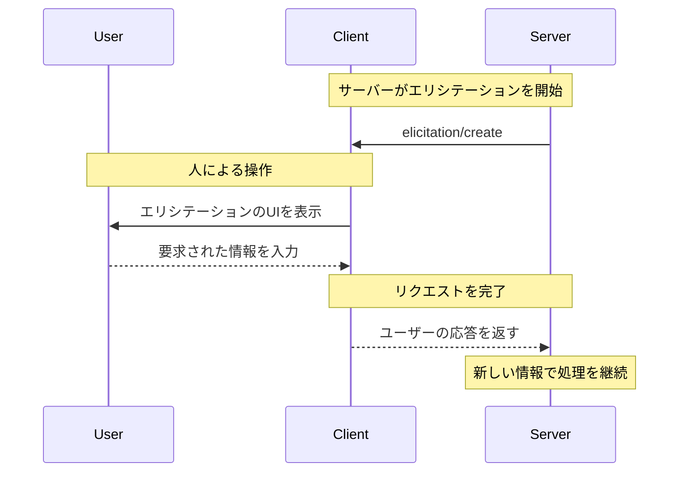
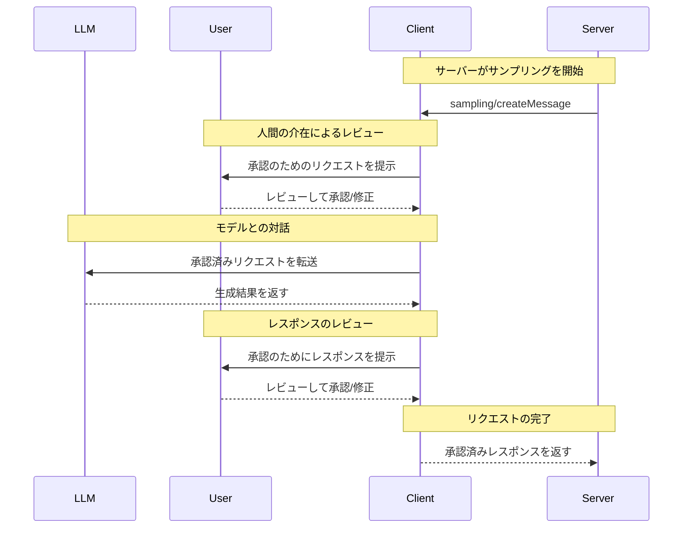

MCPクライアントは、特定のMCPサーバーと通信するためにMCPホストとなるアプリケーションによって生成されます。Claude.aiやIDEといったホストアプリケーションは、全体のユーザー体験を管理し、複数のクライアントを調整します。各クライアントは1つのサーバーとの1対1の直接通信を担当します。

この区別を理解することは重要です。_ホスト_はユーザーが操作するアプリケーションであり、_クライアント_はサーバーへの接続を可能にするプロトコル層のコンポーネントです。

<div id="core-client-features">
  ## コアクライアント機能
</div>

サーバーが提供するコンテキストを活用するだけでなく、クライアントはサーバー向けにいくつかの機能も提供できます。これらのクライアント機能により、サーバー作者はより豊かなやり取りを実装できます。

| 機能            | 説明                                                                                                                                                                                         | 例                                                                                                                                |
| --------------- | -------------------------------------------------------------------------------------------------------------------------------------------------------------------------------------------- | --------------------------------------------------------------------------------------------------------------------------------- |
| **サンプリング** | サンプリングにより、サーバーはクライアント経由でLLMの補完をリクエストでき、エージェント的なワークフローを実現します。この方式では、ユーザー権限とセキュリティ対策をクライアントが一元的に管理します。 | 旅行予約サーバーがフライト一覧をLLMに渡し、ユーザーに最適なフライトを選ぶようLLMに指示できます。                                    |
| **ルーツ**      | ルーツにより、クライアントはサーバーがアクセス可能なファイル範囲を指定でき、セキュリティ境界を保ちながら関連ディレクトリへ誘導できます。                                                        | 旅行予約サーバーに特定ディレクトリへのアクセス権を与え、そこからユーザーのカレンダーを読み取れるようにします。                      |
| **エリシテーション** | エリシテーションにより、サーバーは対話の途中でユーザーに特定情報を求めることができ、必要時に情報を収集するための構造化された手段を提供します。                                                 | 旅行予約サーバーが、座席や部屋タイプの希望、予約確定のための連絡先などをユーザーに尋ねることがあります。                           |

<div id="elicitation">
  ### エリシテーション
</div>

エリシテーションは、サーバーがユーザーとの対話中に特定の情報をリクエストできるようにし、より動的で即応性の高いワークフローを可能にします。

<div id="overview">
  #### 概要
</div>

エリシテーションは、必要な情報をオンデマンドで収集するための体系的な手段を提供します。すべての情報を最初に揃える必要も、データ不足で即座に失敗する必要もなく、サーバーは処理を一時停止してユーザーに特定の入力を求めることができます。これにより、サーバーが硬直した手順に従うのではなく、ユーザーのニーズに合わせて適応する、より柔軟な対話が可能になります。

**エリシテーションのフロー:**



このフローにより、動的な情報収集が可能になります。サーバーは必要なときに特定のデータを要求し、ユーザーは適切なUIから情報を提供し、サーバーは得られた新たなコンテキストを用いて処理を続行します。

**エリシテーションのコンポーネント例:**

```typescript
{
  method: "elicitation/requestInput",
  params: {
    message: "Please confirm your Barcelona vacation booking details:",
    schema: {
      type: "object",
      properties: {
        confirmBooking: {
          type: "boolean",
          description: "予約を確定（フライト＋ホテル＝$3,000）"
        },
        seatPreference: {
          type: "string",
          enum: ["window", "aisle", "no preference"],
          description: "フライトの座席希望"
        },
        roomType: {
          type: "string",
          enum: ["sea view", "city view", "garden view"],
          description: "ホテルの部屋タイプの希望"
        },
        travelInsurance: {
          type: "boolean",
          default: false,
          description: "旅行保険を追加（$150）"
        }
      },
      required: ["confirmBooking"]
    }
  }
}
```

<div id="example-holiday-booking-approval">
  #### 例: 休暇予約の承認
</div>

旅行予約サーバーは、最終的な予約確認のプロセスを通じてエリシテーションの有用性を示します。ユーザーがバルセロナ行きの理想的なバケーションパッケージを選んだら、サーバーは進める前に最終承認と不足している詳細を収集する必要があります。

サーバーは、旅行の要約（バルセロナ行きフライト：6月15〜22日、ビーチフロントのホテル、合計$3,000）と、座席指定・部屋タイプ・旅行保険の選択肢など追加の希望を入力する項目を含む構造化リクエストで、予約確認をエリシテーションします。

予約が進むにつれて、サーバーは予約完了に必要な連絡先情報をエリシテーションします。航空券手配に必要な旅行者情報、ホテルへの特別リクエスト、緊急連絡先などを求める場合があります。

<div id="user-interaction-model">
  #### ユーザーインタラクションモデル
</div>

エリシテーションのやり取りは、明確で文脈に即し、ユーザーの自律性を尊重するよう設計されています。

**リクエストの提示**: クライアントは、どのサーバーが要求しているのか、なぜ情報が必要なのか、そしてどのように利用されるのかを明確に示したうえで、エリシテーションのリクエストを表示します。リクエストメッセージが目的を説明し、スキーマが構造と検証を担います。

**応答オプション**: ユーザーは適切なUIコントロール（テキストフィールド、ドロップダウン、チェックボックス）を使って要求された情報を提供できます。任意で理由を添えて提供を拒否することも、操作全体をキャンセルすることも可能です。クライアントは、サーバーへ返す前に、提示されたスキーマに基づいて応答を検証します。

**プライバシーへの配慮**: エリシテーションでパスワードやAPIキーを求めることはありません。クライアントは不審なリクエストに警告を出し、送信前にユーザーがデータを確認できるようにします。

<div id="roots">
  ### ルーツ
</div>

ルーツはサーバーの操作対象となるファイルシステム上の境界を定義し、クライアントがサーバーに対象とすべきディレクトリを指定できるようにします。

<div id="overview">
  #### 概要
</div>

ルーツは、クライアントがファイルシステムのアクセス境界をサーバーに伝えるための仕組みです。サーバーが操作できるディレクトリを示すファイルURIで構成され、サーバーが利用可能なファイルやフォルダの範囲を把握するのに役立ちます。サーバーに無制限のファイルシステムアクセスを与えるのではなく、セキュリティ境界を維持しつつ、関連する作業ディレクトリへとルーツで誘導します。

**ルーツの構造:**

```json
{
  "uri": "file:///Users/agent/travel-planning",
  "name": "Travel Planning Workspace"
}
```

ルーツはファイルシステムのパスに限定され、常に `file://` URIスキームを使用します。これにより、サーバーはプロジェクトの境界、ワークスペースの構成、アクセス可能なディレクトリを理解できます。ユーザーが異なるプロジェクトやフォルダで作業するにつれて、ルーツの一覧は動的に更新でき、境界が変わった際にはサーバーは `roots/list_changed` による通知を受け取ります。

ルーツはサーバーに対して操作可能な場所の指針を提供しますが、ファイルアクセスの最終的な制御は常にクライアント側にある点に注意してください。ルーツは意図された境界を伝えるに過ぎず、実際のファイルアクセスは常にクライアントのセキュリティポリシーによって仲介されます。

<div id="example-travel-planning-workspace">
  #### 例: 旅行計画ワークスペース
</div>

複数のクライアントの旅行を担当する旅行代理店は、ファイルシステムへのアクセスを整理するためにルーツを活用すると有益です。旅行計画の各側面ごとに異なるディレクトリを持つワークスペースを考えてみましょう。

クライアントは旅行計画サーバーにファイルシステムのルーツを提供します:

- `file:///Users/agent/travel-planning` - すべての旅行関連ファイルを含むメインのワークスペース
- `file:///Users/agent/travel-templates` - 再利用可能な旅程テンプレートとリソース
- `file:///Users/agent/client-documents` - クライアントのパスポートや渡航書類

エージェントがバルセロナの旅程を作成する際、サーバーはこれらの範囲内で動作し、テンプレートへのアクセス、新しい旅程の保存、クライアント書類の参照を行います。これらのルーツ外にあるファイルにはアクセスできません。サーバーは通常、ルートディレクトリからの相対パスを用いるか、ルーツの範囲を尊重するファイル検索ツールを利用して、ルーツ内のファイルにアクセスします。

エージェントが `file:///Users/agent/archive/2023-trips` のようなアーカイブフォルダを開くと、クライアントは `roots/list_changed` を通じてルーツ一覧を更新します。

<div id="user-interaction-model">
  #### ユーザーインタラクションモデル
</div>

ルーツは通常、ユーザーの操作に基づいてホストアプリケーションが自動的に管理しますが、アプリケーションによっては手動管理を提供する場合もあります。

**ルーツの自動検出**: ユーザーがフォルダを開くと、クライアントはそれらを自動的にルーツとして公開します。旅行用ワークスペースを開くと、そのディレクトリ内の旅程やドキュメントにサーバーがアクセスできるようになります。

**ルーツの手動設定**: 上級ユーザーは設定でルーツを指定できます。たとえば、再利用可能なリソース用に `/travel-templates` を追加しつつ、財務記録を含むディレクトリを除外できます。

<div id="sampling">
  ### サンプリング
</div>

サンプリングにより、サーバーはクライアント経由で言語モデルの補完をリクエストでき、セキュリティとユーザーのコントロールを保ちながらエージェント的な挙動を実現します。

<div id="overview">
  #### 概要
</div>

サンプリングは、サーバーがAIモデルを直接統合したり費用を負担したりせずに、AIに依存するタスクを実行できるようにします。代わりに、サーバーはAIモデルへのアクセスをすでに持つクライアントに、これらのタスクの処理を依頼できます。このアプローチにより、ユーザーの権限管理とセキュリティ対策はクライアント側で完全に制御されます。サンプリングのリクエストは、データ分析を行うツールなど、他の操作の文脈内で発生し、個別のモデル呼び出しとして処理されるため、異なるコンテキスト間の明確な境界を維持しつつ、コンテキストウィンドウをより効率的に活用できます。

**サンプリングのフロー:**



このフローは、複数の人間介在のチェックポイントによってセキュリティを確保します。ユーザーは初期リクエストと生成されたレスポンスの両方を、サーバーへ返送される前にレビューし、必要に応じて修正できます。

**リクエストパラメータの例:**

```typescript
{
  messages: [
    {
      role: "user",
      content: "Analyze these flight options and recommend the best choice:\n" +
               "[47 flights with prices, times, airlines, and layovers]\n" +
               "User preferences: morning departure, max 1 layover"
    }
  ],
  modelPreferences: {
    hints: [{
      name: "claude-3-5-sonnet"  // 推奨モデル
    }],
    costPriority: 0.3,      // APIコストはあまり重視しない
    speedPriority: 0.2,     // 丁寧な分析のため待てる
    intelligencePriority: 0.9  // 複雑なトレードオフ評価が必要
  },
  systemPrompt: "You are a travel expert helping users find the best flights based on their preferences",
  maxTokens: 1500
}
```

<div id="example-flight-analysis-tool">
  #### 例: フライト分析ツール
</div>

旅行予約用のサーバーに、利用可能なフライトをサンプリングで分析して最適な選択肢を提案する `findBestFlight` というツールがあるとします。ユーザーが「来月バルセロナ行きの最適なフライトを予約して」と依頼したとき、このツールは複雑なトレードオフを評価するためにAIの支援を必要とします。

このツールは航空会社のAPIを照会し、47件のフライト候補を収集します。続いて、それらを分析するためにAIの支援をリクエストします: 「これらのフライト候補を分析し、最適な選択肢を提案してください: [価格、時刻、航空会社、乗り継ぎを含む47件のフライト] ユーザーの希望: 朝の出発、乗り継ぎは最大1回。」

クライアントはサンプリングのリクエストを開始し、AIがトレードオフ—たとえば、より安価な深夜便と利便性の高い朝出発—を評価できるようにします。ツールはこの分析を基に、上位3件の推奨を提示します。

<div id="user-interaction-model">
  #### ユーザーインタラクションモデル
</div>

必須ではありませんが、サンプリングは人間の介在による制御を可能にするよう設計されています。ユーザーは次のいくつかの仕組みによって監督を維持できます。

**承認コントロール**: サンプリング要求には明示的なユーザー同意が必要となる場合があります。クライアントは、サーバーが何を分析したいのか、その理由とともに表示できます。ユーザーは要求を承認、拒否、または修正できます。

**透明性機能**: クライアントは正確なプロンプト、モデルの選択、トークン上限を表示でき、ユーザーはサーバーに返送される前にAIの応答を確認できます。

**構成オプション**: ユーザーはモデルの優先設定を行い、信頼できる操作の自動承認を有効化したり、すべてに承認を要求するように設定したりできます。クライアントは機微情報をマスキング（秘匿化）するオプションを提供する場合があります。

**セキュリティ上の考慮事項**: クライアントとサーバーの双方は、サンプリング中に機微データを適切に取り扱う必要があります。クライアントはレート制限を実装し、すべてのメッセージ内容を検証すべきです。人間が介在する設計により、サーバー主導のAIインタラクションが、明示的なユーザー同意なしにセキュリティを損なったり機微データにアクセスしたりすることはできません。