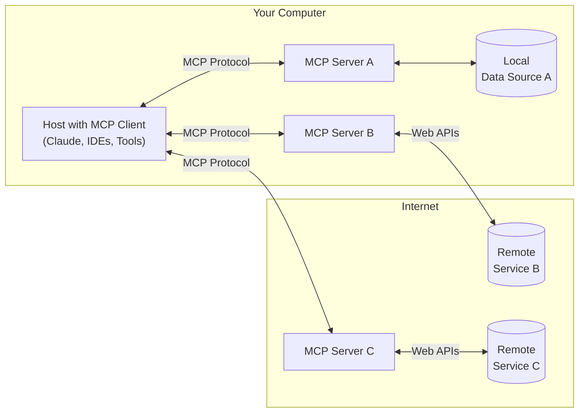

MCPは、アプリケーションがLLMにコンテキストを提供する方法を標準化するオープンなプロトコルです。AIアプリケーション向けのUSB-Cポートのようなものだと考えてください。USB-Cがデバイスと各種周辺機器・アクセサリをつなぐ標準化された手段を提供するのと同様に、MCPはAIモデルを多様なデータソースやツールに接続するための標準化された手段を提供します。

  ## なぜMCPなのか？

MCPは、LLMの上にエージェントや複雑なワークフローを構築するのに役立ちます。LLMはしばしばデータやツールとの統合を必要とし、MCPは次のことを提供します。

* LLMが直接接続できる、拡充し続ける事前構築済み統合の一覧
* LLMプロバイダーやベンダーを切り替えられる柔軟性
* 自社インフラ内でデータを保護するためのベストプラクティス

  ### 全体アーキテクチャ

MCP は本質的に、ホストアプリケーションが複数のサーバーに接続できるクライアント／サーバー型アーキテクチャに従います:

* **MCPホスト**: Claude Desktop、IDE、AIツールなど、MCP を介してデータへアクセスするプログラム
* **MCPクライアント**: サーバーとの 1:1 接続を維持するプロトコルクライアント
* **MCPサーバー**: 標準化された Model Context Protocol（MCP）を通じて特定の機能を公開する軽量プログラム
* **ローカルデータソース**: MCPサーバーが安全にアクセスできる、コンピューター上のファイル、データベース、サービス
* **リモートサービス**: MCPサーバーが接続できる、インターネット経由（例: API）で利用可能な外部システム

  ## はじめに

ニーズに最も合った方法を選択してください：

  ### クイックスタート

<CardGroup cols={2}>
  <Card title="サーバー開発者向け" icon="bolt" href="/ja/quickstart/server">
    Claude for Desktop などのクライアントで使える独自サーバーの開発を始めましょう
  </Card>

  <Card title="クライアント開発者向け" icon="bolt" href="/ja/quickstart/client">
    すべてのMCPサーバーと連携できる独自クライアントの開発を始めましょう
  </Card>

  <Card title="Claude Desktop ユーザー向け" icon="bolt" href="/ja/docs/develop/connect-local-servers">
    Claude for Desktop で用意されたサーバーの利用を始めましょう
  </Card>
</CardGroup>

  ### 例

<CardGroup cols={2}>
  <Card title="Example Servers" icon="grid" href="/ja/examples">
    公式のMCPサーバーと実装のギャラリーをご覧ください
  </Card>

  <Card title="Example Clients" icon="cubes" href="/ja/clients">
    MCP連携に対応したクライアントの一覧を見る
  </Card>
</CardGroup>

  ## チュートリアル

<CardGroup cols={2}>
  <Card title="LLMでMCPを構築する" icon="comments" href="/ja/tutorials/building-mcp-with-llms">
    ClaudeなどのLLMを活用してMCP開発を高速化する方法を学びましょう
  </Card>

  <Card title="デバッグガイド" icon="bug" href="/ja/legacy/tools/debugging">
    MCPサーバーや連携の効果的なデバッグ手法を学びましょう
  </Card>

  <Card title="MCP Inspector" icon="magnifying-glass" href="/ja/legacy/tools/inspector">
    対話型デバッグツールでMCPサーバーをテストし、検証しましょう
  </Card>

  <Card title="MCPワークショップ（動画・2時間）" icon="person-chalkboard" href="https://www.youtube.com/watch?v=kQmXtrmQ5Zg">
    <iframe src="https://www.youtube.com/embed/kQmXtrmQ5Zg" />
  </Card>
</CardGroup>

  ## MCPを探索する

MCPの中核概念と機能をさらに深く掘り下げましょう:

<CardGroup cols={2}>
  <Card title="Core architecture" icon="sitemap" href="/ja/legacy/concepts/architecture">
    MCPがクライアント、サーバー、LLMをどのように接続するかを理解する
  </Card>

  <Card title="Resources" icon="database" href="/ja/legacy/concepts/resources">
    サーバーのデータやコンテンツをLLMに提供する
  </Card>

  <Card title="Prompts" icon="message" href="/ja/legacy/concepts/prompts">
    再利用可能なプロンプトのテンプレートやワークフローを作成する
  </Card>

  <Card title="Tools" icon="wrench" href="/ja/legacy/concepts/tools">
    サーバー経由でLLMにアクションを実行させる
  </Card>

  <Card title="Sampling" icon="robot" href="/ja/legacy/concepts/sampling">
    サーバーからLLMに補完をリクエストできるようにする
  </Card>

  <Card title="Transports" icon="network-wired" href="/ja/legacy/concepts/transports">
    MCPの通信方式について学ぶ
  </Card>
</CardGroup>

  ## コントリビュート

参加してみませんか？MCPの改善にどのように貢献できるかは、[貢献ガイド](/ja/development/contributing)をご覧ください。

  ## サポートとフィードバック

サポートの受け方やフィードバックの送り方は次のとおりです：

* MCP仕様、SDK、またはドキュメント（オープンソース）に関するバグ報告や機能リクエストは、[GitHubのIssueを作成](https://github.com/modelcontextprotocol)してください
* MCP仕様に関するディスカッションやQ&amp;Aは、[specification discussions](https://github.com/modelcontextprotocol/specification/discussions)をご利用ください
* その他のMCPオープンソースコンポーネントに関するディスカッションやQ&amp;Aは、[organization discussions](https://github.com/orgs/modelcontextprotocol/discussions)をご利用ください
* Claude.appおよびclaude.aiのMCP統合に関するバグ報告、機能リクエスト、質問については、Anthropicの[How to Get Support](https://support.anthropic.com/en/articles/9015913-how-to-get-support)ガイドをご参照ください