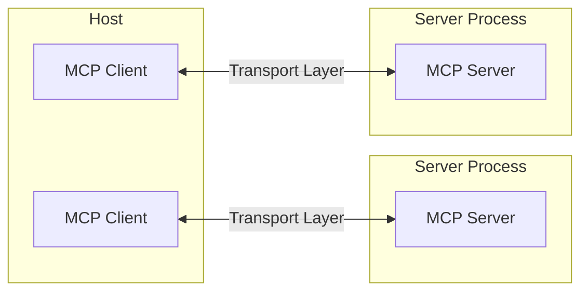
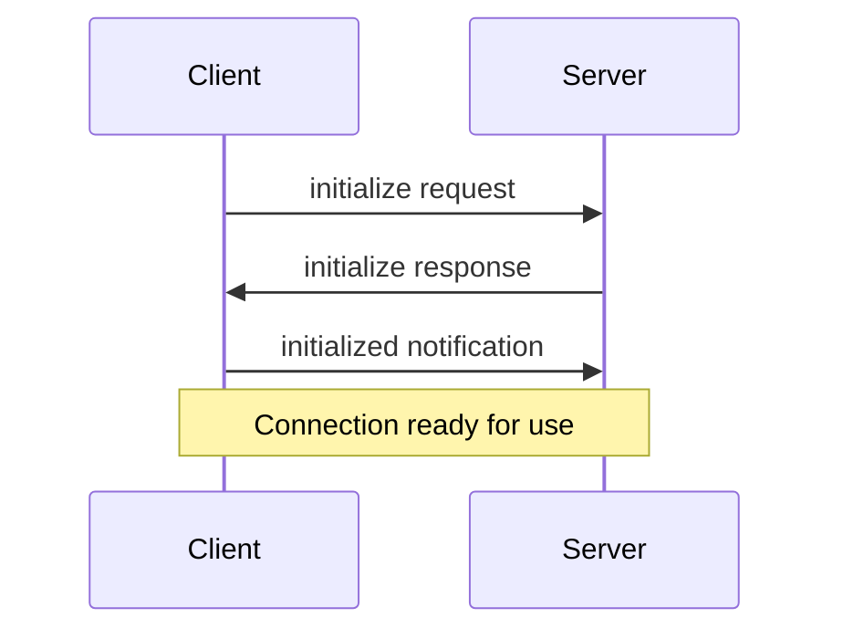

Model Context Protocol（MCP）は、LLMアプリケーションや各種統合とシームレスにやり取りできる、柔軟で拡張性の高いアーキテクチャに基づいています。本書では、アーキテクチャの中核となるコンポーネントと概念を解説します。

<div id="overview">
  ## 概要
</div>

MCPは次のようなクライアント-サーバーアーキテクチャに従います：

* **ホスト**は接続を開始するLLMアプリケーション（Claude DesktopやIDEなど）
* **クライアント**はホストアプリケーション内でサーバーと1:1の接続を維持する
* **サーバー**はクライアントにコンテキスト、ツール、プロンプトを提供する



<div id="core-components">
  ## コア コンポーネント
</div>

<div id="protocol-layer">
  ### プロトコル層
</div>

プロトコル層は、メッセージのフレーミング、リクエストとレスポンスの関連付け、そして高レベルな通信パターンを扱います。

<CodeGroup>
  ```typescript TypeScript
  class Protocol<Request, Notification, Result> {
    // 受信したリクエストを処理
    setRequestHandler<T>(
      schema: T,
      handler: (request: T, extra: RequestHandlerExtra) => Promise<Result>,
    ): void;

    // 受信した通知を処理
    setNotificationHandler<T>(
      schema: T,
      handler: (notification: T) => Promise<void>,
    ): void;

    // リクエストを送信してレスポンスを待つ
    request<T>(request: Request, schema: T, options?: RequestOptions): Promise<T>;

    // 片方向の通知を送信
    notification(notification: Notification): Promise<void>;
  }
  ```

  ```python Python
  class Session(BaseSession[RequestT, NotificationT, ResultT]):
      async def send_request(
          self,
          request: RequestT,
          result_type: type[Result]
      ) -> Result:
          """リクエストを送信してレスポンスを待機します。レスポンスにエラーが含まれている場合は McpError を送出します。"""
          # リクエスト処理の実装

      async def send_notification(
          self,
          notification: NotificationT
      ) -> None:
          """レスポンスを期待しない片方向の通知を送信します。"""
          # 通知処理の実装

      async def _received_request(
          self,
          responder: RequestResponder[ReceiveRequestT, ResultT]
      ) -> None:
          """相手側からのリクエストを処理します。"""
          # リクエスト処理の実装

      async def _received_notification(
          self,
          notification: ReceiveNotificationT
      ) -> None:
          """相手側からの通知を処理します。"""
          # 通知処理の実装
  ```
</CodeGroup>

主なクラスは次のとおりです:

* `Protocol`
* `Client`
* `Server`

<div id="transport-layer">
  ### トランスポート層
</div>

トランスポート層は、クライアントとサーバー間の実際の通信を担います。MCPは複数のトランスポート方式をサポートしています:

1. **STDIOトランスポート**
   * 通信に標準入力/出力を使用
   * ローカルプロセスに最適

2. **ストリーム対応HTTPトランスポート**
   * ストリーミングのためにオプションでサーバー送信イベント（SSE）を利用
   * クライアントからサーバーへのメッセージはHTTP POSTを使用

すべてのトランスポートは、メッセージ交換に [JSON-RPC](https://www.jsonrpc.org/) 2.0 を使用します。Model Context Protocol（MCP）のメッセージ形式の詳細は、[仕様](/ja/specification/)を参照してください。

<div id="message-types">
  ### メッセージの種類
</div>

MCP には次の主要なメッセージの種類があります:

1. **リクエスト** は相手側からのレスポンスを期待します:

   ```typescript
   interface Request {
     method: string;
     params?: { ... };
   }
   ```

2. **結果** はリクエストに対する成功レスポンスです:

   ```typescript
   interface Result {
     [key: string]: unknown;
   }
   ```

3. **エラー** はリクエストが失敗したことを示します:

   ```typescript
   interface Error {
     code: number;
     message: string;
     data?: unknown;
   }
   ```

4. **通知** はレスポンスを必要としない片方向のメッセージです:
   ```typescript
   interface Notification {
     method: string;
     params?: { ... };
   }
   ```

<div id="connection-lifecycle">
  ## 接続ライフサイクル
</div>

<div id="1-initialization">
  ### 1. 初期化
</div>



1. Client がプロトコルバージョンと対応機能を含む `initialize` リクエストを送信する
2. Server が自身のプロトコルバージョンと対応機能を返す
3. Client が確認として `initialized` 通知を送信する
4. 通常のメッセージ交換が開始される

<div id="2-message-exchange">
  ### 2. メッセージ交換
</div>

初期化後は、次のパターンがサポートされます:

* **リクエスト／レスポンス**: クライアントまたはサーバーがリクエストを送り、相手側が応答する
* **通知**: いずれかが一方向のメッセージを送信する

<div id="3-termination">
  ### 3. 終了
</div>

いずれの当事者も接続を終了できます:

* `close()` によるクリーンシャットダウン
* トランスポートの切断
* エラー発生時

<div id="error-handling">
  ## エラー処理
</div>

Model Context Protocol（MCP）は、次の標準エラーコードを定義しています:

```typescript
enum ErrorCode {
  // Standard JSON-RPC error codes
  ParseError = -32700,
  InvalidRequest = -32600,
  MethodNotFound = -32601,
  InvalidParams = -32602,
  InternalError = -32603,
}
```

SDKやアプリケーションは、-32000 より大きい（または等しい）値の範囲で独自のエラーコードを定義できます。

エラーは次の経路で伝搬します:

* リクエストに対するエラーレスポンス
* トランスポート上のエラーイベント
* プロトコルレベルのエラーハンドラー

<div id="implementation-example">
  ## 実装例
</div>

以下は、MCPサーバーを実装する基本的な例です。

<CodeGroup>
  ```typescript TypeScript
  import { Server } from "@modelcontextprotocol/sdk/server/index.js";
  import { StdioServerTransport } from "@modelcontextprotocol/sdk/server/stdio.js";

  const server = new Server(
    {
      name: "example-server",
      version: "1.0.0",
    },
    {
      capabilities: {
        resources: {},
      },
    },
  );

  // リクエストを処理
  server.setRequestHandler(ListResourcesRequestSchema, async () => {
    return {
      resources: [
        {
          uri: "example://resource",
          name: "Example Resource",
        },
      ],
    };
  });

  // トランスポートに接続
  const transport = new StdioServerTransport();
  await server.connect(transport);
  ```

  ```python Python
  import asyncio
  import mcp.types as types
  from mcp.server import Server
  from mcp.server.stdio import stdio_server

  app = Server("example-server")

  @app.list_resources()
  async def list_resources() -> list[types.Resource]:
      return [
          types.Resource(
              uri="example://resource",
              name="Example Resource"
          )
      ]

  async def main():
      async with stdio_server() as streams:
          await app.run(
              streams[0],
              streams[1],
              app.create_initialization_options()
          )

  if __name__ == "__main__":
      asyncio.run(main())
  ```
</CodeGroup>

<div id="best-practices">
  ## ベストプラクティス
</div>

<div id="transport-selection">
  ### トランスポートの選択
</div>

1. **ローカル通信**
   * ローカルプロセスには STDIO トランスポートを使用する
   * 同一マシン内の通信に効率的
   * プロセス管理が簡単

2. **リモート通信**
   * HTTP 互換性が必要なシナリオでは ストリーム対応HTTP を使用する
   * 認証や認可を含むセキュリティ面の考慮事項を検討する

<div id="message-handling">
  ### メッセージ処理
</div>

1. **リクエスト処理**
   * 入力を厳密に検証する
   * 型安全なスキーマを用いる
   * エラーを適切にハンドリングする
   * タイムアウトを実装する

2. **進捗報告**
   * 長時間の処理には進捗トークンを用いる
   * 進捗を段階的に報告する
   * 可能な場合は全体の進捗も含める

3. **エラー管理**
   * 適切なエラーコードを用いる
   * 有用なエラーメッセージを含める
   * エラー時はリソースを確実に解放する

<div id="security-considerations">
  ## セキュリティに関する考慮事項
</div>

1. **トランスポートのセキュリティ**
   * リモート接続には TLS を使用する
   * 接続元のオリジンを検証する
   * 必要に応じて認証を実装する

2. **メッセージの検証**
   * 受信したすべてのメッセージを検証する
   * 入力をサニタイズする
   * メッセージサイズの上限を確認する
   * JSON-RPC 形式を検証する

3. **リソースの保護**
   * アクセス制御を実装する
   * リソースパスを検証する
   * リソースの使用状況を監視する
   * リクエストにレート制限を設ける

4. **エラー処理**
   * 機密情報を漏えいさせない
   * セキュリティ関連のエラーを記録する
   * 適切なクリーンアップを実装する
   * DoS シナリオに対処する

<div id="debugging-and-monitoring">
  ## デバッグとモニタリング
</div>

1. **ロギング**
   * プロトコルイベントをログに記録する
   * メッセージの流れを追跡する
   * パフォーマンスを監視する
   * エラーを記録する

2. **診断**
   * ヘルスチェックを実装する
   * 接続状態を監視する
   * リソース使用状況を追跡する
   * パフォーマンスをプロファイル計測する

3. **テスト**
   * 異なるトランスポートをテストする
   * エラー処理を検証する
   * エッジケースを確認する
   * サーバーに対して負荷テストを行う