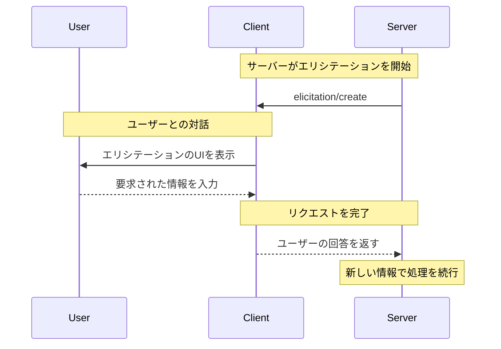

エリシテーションは強力な Model Context Protocol（MCP）の機能で、やり取りの途中でサーバーがユーザーに追加情報をリクエストできるようにします。これにより、ユーザーの制御とプライバシーを保ちつつ、サーバーが必要なデータをオンデマンドで収集できる動的なワークフローが可能になります。

<Info>
  エリシテーションは MCP 仕様の新機能で、[revision
  2025-06-18](/ja/specification/2025-06-18/client/elicitation) で導入されました。
</Info>

<div id="what-is-elicitation">
  ## エリシテーションとは？
</div>

エリシテーションは、MCPサーバーがMCPクライアントを通じてユーザーから構造化された情報を求めるための標準的な方法を提供します。すべての情報を最初に揃えるのではなく、必要なときに必要な特定のデータを求めることで、より自然で柔軟なやり取りを実現します。

たとえば、サーバーは次のようなことを行う場合があります：

* サービスに接続する際にユーザー名を求める
* セットアップ中に設定の好みを尋ねる
* 新しいリソースを作成する際にプロジェクトの詳細を収集する

<div id="how-elicitation-works">
  ## エリシテーションの仕組み
</div>

エリシテーションのフローはシンプルです：

1. サーバーがメッセージと想定するデータ構造を含むエリシテーション要求を送信する
2. クライアントが適切なUIでユーザーにその要求を提示する
3. ユーザーが要求を承諾、拒否、またはキャンセルする
4. クライアントが検証し、応答をサーバーに返す
5. サーバーが提供された情報をもとに処理を継続する

<div id="request-structure">
  ## リクエスト構造
</div>

エリシテーションのリクエストは、次の2つの主要コンポーネントで構成されます。

<div id="message">
  ### メッセージ
</div>

必要な情報とその理由を、明確で人間に読みやすい形で説明します。

<div id="schema">
  ### スキーマ
</div>

レスポンスの想定される構造を定義する JSON Schema。クライアント実装を簡素化するため、スキーマは意図的にプリミティブ型のみを用いたフラットなオブジェクトに限定されています。

リクエスト例:

```json
{
  "message": "Please provide your GitHub username",
  "requestedSchema": {
    "type": "object",
    "properties": {
      "username": {
        "type": "string",
        "title": "GitHub Username",
        "description": "Your GitHub username (e.g., octocat)"
      }
    },
    "required": ["username"]
  }
}
```

<div id="supported-data-types">
  ## サポートされているデータ型
</div>

エリシテーションは次のプリミティブ型をサポートします。

<div id="text-input">
  ### テキスト入力
</div>

```json
{
  "type": "string",
  "title": "プロジェクト名",
  "description": "新規プロジェクトの名称",
  "minLength": 3,
  "maxLength": 50,
  "default": "my-project"
}
```

<div id="numbers">
  ### 数値
</div>

```json
{
  "type": "number",
  "title": "ポート番号",
  "description": "サーバーを起動するポート",
  "minimum": 1024,
  "maximum": 65535,
  "default": 3000
}
```

<div id="boolean-choices">
  ### 真偽値の選択肢
</div>

```json
{
  "type": "boolean",
  "title": "アナリティクスを有効にする",
  "description": "匿名の利用状況データを送信する",
  "default": false
}
```

<div id="selection-lists">
  ### 選択リスト
</div>

```json
{
  "type": "string",
  "title": "Environment",
  "enum": ["development", "staging", "production"],
  "enumNames": ["Development", "Staging", "Production"],
  "default": "development"
}
```

<div id="user-response-actions">
  ## ユーザーの応答アクション
</div>

ユーザーはエリシテーション要求に対して次の3つの方法で応答できます:

1. **承諾**: ユーザーが要求された情報を提供する
2. **拒否**: ユーザーが情報の提供を明確に拒否する
3. **キャンセル**: ユーザーが選択せずに閉じる（例: ダイアログを閉じる）

サーバーは各応答を適切に処理する必要があります:

* 承諾 → 提供されたデータを処理する
* 拒否 → 代替案を提示するかワークフローを調整する
* キャンセル → 後で再試行するかデフォルトを使用することを検討する

<div id="best-practices">
  ## ベストプラクティス
</div>

エリシテーションを実装する際は、次の点に留意してください:

<div id="for-servers">
  ### サーバー向け
</div>

1. **明確に**: なぜ情報が必要かを分かりやすく説明するメッセージを書く
2. **最小限に**: 必要不可欠な情報だけを求める
3. **柔軟に**: 辞退やキャンセルされたリクエストに備えた代替手段を用意する
4. **適切なタイミングで**: 先走らず、実際に必要になった時点で情報をリクエストする
5. **敬意を持って**: パスワードやトークンなどの機密情報は決して要求しない

<div id="for-clients">
  ### クライアント向け
</div>

1. **透明性を確保する**: どのサーバーが情報を要求しているかを明確に表示する
2. **保護する**: ユーザーが応答を確認・編集できるようにする
3. **検証する**: 提供されたスキーマに対して応答を検証する
4. **ユーザーを尊重する**: 辞退・キャンセルの選択肢を目立つように提示する
5. **制限する**: スパム防止のためにレート制限を実装する

<div id="common-use-cases">
  ## 一般的なユースケース
</div>

エリシテーションが特に有効な場面:

* **初期セットアップ**: 初回セットアップ時に設定を収集する
* **動的ワークフロー**: コンテキストに応じた情報を求める
* **ユーザー設定**: 任意の設定や好みを収集する
* **プロジェクト詳細**: 作成するリソースに関するメタデータを収集する
* **サービス連携**: 外部サービスのユーザー名やIDを求める

<div id="example-workflow">
  ## 例示的なワークフロー
</div>

以下は典型的なエリシテーションのやり取りです：



<div id="security-considerations">
  ## セキュリティ上の考慮事項
</div>

<Warning>
  サーバーは、パスワード、APIキー、トークン、その他の機微な認証情報を要求する目的でエリシテーションを絶対に使用しないでください。代わりに適切な認証フローを用いてください。
</Warning>

主なセキュリティガイドライン:

1. サーバーは機微でない情報のみを要求すること
2. クライアントは、どのサーバーがデータを要求しているかを明確に示すこと
3. ユーザーは常に拒否できる選択肢を持つこと
4. レスポンスはスキーマに基づいて検証すること
5. レート制限によりリクエストの氾濫を防止すること

<div id="implementation-example">
  ## 実装例
</div>

サーバーがエリシテーションを使ってプロジェクト情報を収集する例です:

```typescript
// サーバーがプロジェクトの詳細をリクエスト
const response = await client.request("elicitation/create", {
  message: "新しいプロジェクトをセットアップしましょう",
  requestedSchema: {
    type: "object",
    properties: {
      name: {
        type: "string",
        title: "プロジェクト名",
        description: "プロジェクトを端的に表す名前",
      },
      framework: {
        type: "string",
        title: "フレームワーク",
        enum: ["react", "vue", "angular", "none"],
        enumNames: ["React", "Vue", "Angular", "None"],
      },
      useTypeScript: {
        type: "boolean",
        title: "TypeScript を使用する",
        default: true,
      },
      port: {
        type: "number",
        title: "開発ポート",
        description: "開発サーバーのポート番号",
        default: 3000,
      },
    },
    required: ["name", "framework"],
  },
});

// レスポンスを処理
if (response.action === "accept") {
  // 提供された内容でプロジェクトを作成
  await createProject(response.content);
} else if (response.action === "decline") {
  // 既定値を使うか、代替案を提示
  await createDefaultProject();
} else {
  // ユーザーがキャンセル — 後で再試行してもよいでしょう
  console.log("プロジェクト作成はキャンセルされました");
}
```

このアプローチは、ユーザーのコントロールとプライバシーを尊重しながら、スムーズでインタラクティブな体験を提供します。