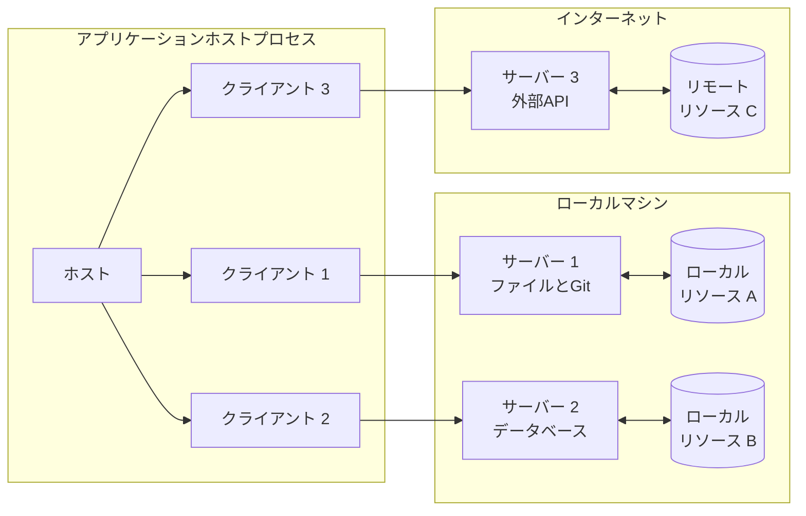
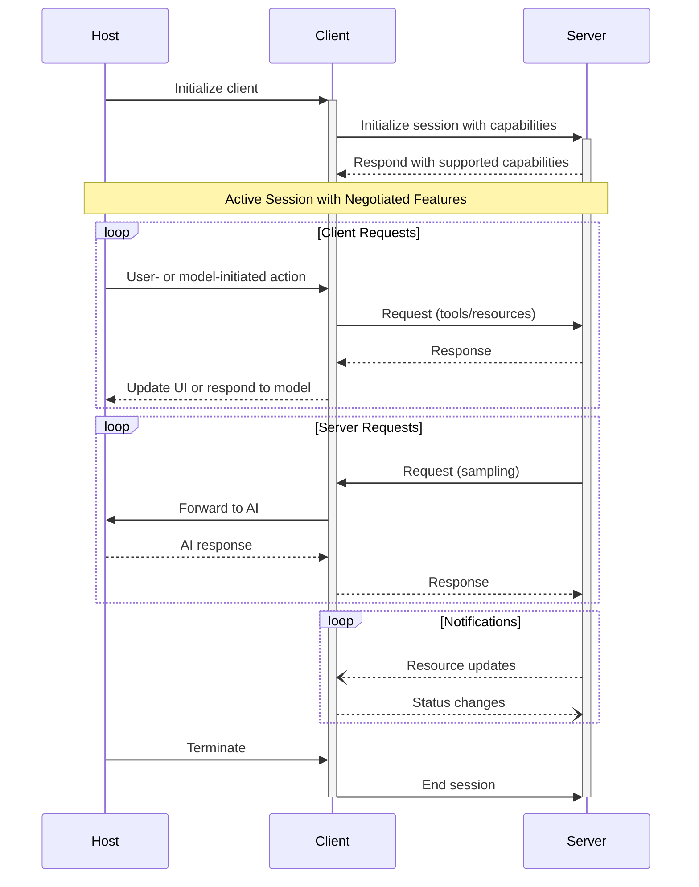

Model Context Protocol（MCP）は、各ホストが複数のクライアントインスタンスを実行できるクライアント—ホスト—サーバー型のアーキテクチャに従います。このアーキテクチャにより、ユーザーは明確なセキュリティ境界を保ち、関心の分離を維持しながら、アプリケーション横断でAI機能を統合できます。JSON-RPC 2.0を基盤とするMCPは、クライアントとサーバー間のコンテキスト交換とサンプリングの調整に特化した、ステートフルなセッションプロトコルを提供します。

  ## コアコンポーネント

  ### ホスト

ホストプロセスはコンテナ兼コーディネーターとして機能します:

* 複数のクライアントインスタンスを作成・管理
* クライアントの接続許可とライフサイクルを制御
* セキュリティポリシーと同意要件を適用
* ユーザーの認可判断を処理
* AI/LLM の統合およびサンプリングを調整
* クライアント間のコンテキスト集約を管理

  ### クライアント

各クライアントはホストによって作成され、サーバーごとに分離された接続を維持します:

* サーバーごとに状態を持つセッションを1つ確立
* プロトコルのネゴシエーションと機能のやり取りを処理
* プロトコルメッセージを双方向にルーティング
* サブスクリプションと通知を管理
* サーバー間のセキュリティ境界を維持

ホストアプリケーションは複数のクライアントを作成・管理し、各クライアントは特定のサーバーと1対1の関係を持ちます。

  ### サーバー

サーバーは特化したコンテキストと機能を提供します:

* MCPのプリミティブを通じてリソース、ツール、プロンプトを公開する
* 明確に分担された責務で独立して動作する
* クライアントインターフェース経由でサンプリングを要求する
* セキュリティ制約を順守する必要がある
* ローカルプロセスまたはリモートサービスとして動作できる

  ## 設計原則

MCPは、そのアーキテクチャと実装に影響するいくつかの重要な設計原則に基づいて構築されています。

1. **サーバーは非常に簡単に構築できるべき**
   * ホストアプリケーションが複雑なオーケストレーションを担う
   * サーバーは明確に定義された特定の機能に専念する
   * シンプルなインターフェースで実装コストを最小化する
   * 明確な分離により保守性の高いコードを実現する

2. **サーバーは高い合成可能性を備えるべき**
   * 各サーバーは独立してフォーカスした機能を提供する
   * 複数のサーバーをシームレスに組み合わせられる
   * 共有プロトコルにより相互運用性を確保する
   * モジュール型設計が拡張性を支える

3. **サーバーは会話全体を読めず、他のサーバーを「覗き見る」こともできないべき**
   * サーバーは必要最小限のコンテキスト情報のみを受け取る
   * 会話履歴全体はホスト側に保持される
   * 各サーバー接続は分離を維持する
   * サーバー間のやり取りはホストが制御する
   * ホストプロセスがセキュリティ境界を強制する

4. **機能はサーバーとクライアントに段階的に追加できる**
   * コアプロトコルは必要最小限の機能を提供する
   * 追加の能力は必要に応じて合意の上で有効化できる
   * サーバーとクライアントは独立して進化する
   * 将来の拡張性を見据えた設計
   * 下位互換性が維持される

  ## メッセージタイプ

MCPは
[JSON-RPC 2.0](https://www.jsonrpc.org/specification) に基づき、3つの基本的なメッセージタイプを定義します:

* **Requests**: メソッドとパラメータを伴い、応答を期待する双方向メッセージ
* **Responses**: 特定のリクエストIDに対応する成功結果またはエラー
* **Notifications**: 応答を必要としない一方向メッセージ

各メッセージタイプは、構造や配送のセマンティクスに関してJSON-RPC 2.0仕様に準拠します。

  ## 機能ネゴシエーション

Model Context Protocol（MCP）は、初期化時にクライアントとサーバーがサポート機能を明示的に宣言する、機能ベースのネゴシエーション方式を採用しています。宣言された機能は、セッション中に利用可能なプロトコルの機能やプリミティブを決定します。

* サーバーは、リソースのサブスクリプション、ツールのサポート、プロンプトのテンプレートなどの機能を宣言します
* クライアントは、サンプリングのサポートや通知処理などの機能を宣言します
* 両者はセッション全体を通して、宣言された機能を遵守する必要があります
* 追加の機能は、プロトコル拡張を通じて交渉できます

各機能は、セッション中に使用できる特定のプロトコル機能を有効化します。例えば:

* 実装された[サーバー機能](/ja/specification/2024-11-05/server)は、サーバーの機能セットとして宣言されていなければなりません
* リソースのサブスクリプション通知を送出するには、サーバーがサブスクリプションのサポートを宣言している必要があります
* ツールの呼び出しには、サーバーがツール機能を宣言している必要があります
* [サンプリング](/ja/specification/2024-11-05/client)を行うには、クライアントが機能としてのサポートを宣言している必要があります

この機能ネゴシエーションにより、プロトコルの拡張性を維持しつつ、クライアントとサーバーはサポートされる機能について明確に共有できます。