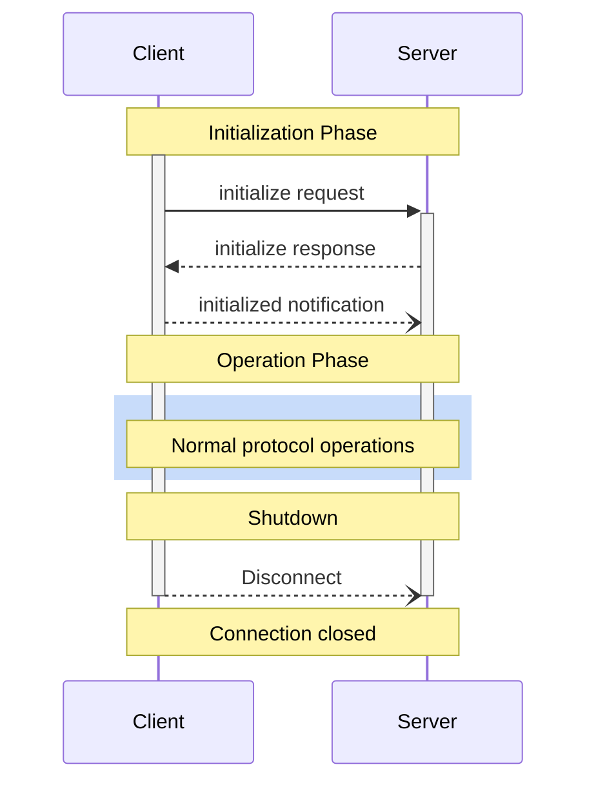

<Info>**プロトコル改訂**: 2024-11-05</Info>

Model Context Protocol（MCP）は、クライアントとサーバーの接続における厳密なライフサイクルを定義し、適切な機能交渉と状態管理を確実にします。

1. **初期化**: 機能の交渉とプロトコルバージョンの合意
2. **運用**: 通常のプロトコル通信
3. **シャットダウン**: 接続のグレースフルな終了



<div id="lifecycle-phases">
  ## ライフサイクルの段階
</div>

<div id="initialization">
  ### 初期化
</div>

初期化フェーズは、クライアントとサーバー間の最初のやり取りでなければなりません（MUST）。
このフェーズでは、クライアントとサーバーは次を行います:

* プロトコルのバージョン互換性の確立
* 機能の交換とネゴシエーション
* 実装詳細の共有

クライアントは、このフェーズを開始するために、次を含む `initialize` リクエストを送信しなければなりません（MUST）:

* サポートするプロトコルバージョン
* クライアントの機能
* クライアント実装情報

```json
{
  "jsonrpc": "2.0",
  "id": 1,
  "method": "initialize",
  "params": {
    "protocolVersion": "2024-11-05",
    "capabilities": {
      "roots": {
        "listChanged": true
      },
      "sampling": {}
    },
    "clientInfo": {
      "name": "ExampleClient",
      "version": "1.0.0"
    }
  }
}
```

サーバーは、自身の機能と情報で応答しなければなりません（MUST）:

```json
{
  "jsonrpc": "2.0",
  "id": 1,
  "result": {
    "protocolVersion": "2024-11-05",
    "capabilities": {
      "logging": {},
      "prompts": {
        "listChanged": true
      },
      "resources": {
        "subscribe": true,
        "listChanged": true
      },
      "tools": {
        "listChanged": true
      }
    },
    "serverInfo": {
      "name": "ExampleServer",
      "version": "1.0.0"
    }
  }
}
```

初期化が成功した後、クライアントは通常の運用を開始する準備が整ったことを示すために
`initialized` 通知を送信しなければなりません（MUST）:

```json
{
  "jsonrpc": "2.0",
  "method": "notifications/initialized"
}
```

* サーバーが `initialize` リクエストに応答する前に、クライアントは
  [pings](/ja/specification/2024-11-05/basic/utilities/ping) 以外のリクエストを送信すべきではありません（SHOULD NOT）。
* サーバーは `initialized` 通知を受信する前に、
  [pings](/ja/specification/2024-11-05/basic/utilities/ping) および
  [logging](/ja/specification/2024-11-05/server/utilities/logging) 以外のリクエストを送信すべきではありません（SHOULD NOT）。

<div id="version-negotiation">
  #### バージョンネゴシエーション
</div>

`initialize` リクエストでは、クライアントは自分がサポートするプロトコルバージョンを送信することが**必須**です。
これはクライアントがサポートする&#95;最新&#95;バージョンであることが**望ましい**です。

サーバーが要求されたプロトコルバージョンをサポートしている場合は、同じバージョンで応答することが**必須**です。
それ以外の場合は、サーバーがサポートする別のプロトコルバージョンで応答することが**必須**です。
このとき、そのバージョンはサーバーがサポートする&#95;最新&#95;バージョンであることが**望ましい**です。

クライアントがサーバーの応答に含まれるバージョンをサポートしていない場合は、切断することが**望ましい**です。

<div id="capability-negotiation">
  #### 機能ネゴシエーション
</div>

クライアントとサーバーの機能により、セッション中にどの任意のプロトコル機能が
利用可能になるかが決まります。

主要な機能は次のとおりです:

| Category | Capability     | Description                                                                         |
| -------- | -------------- | ----------------------------------------------------------------------------------- |
| Client   | `roots`        | ファイルシステムの[ルーツ](/ja/specification/2024-11-05/client/roots)を提供する機能       |
| Client   | `sampling`     | LLMの[サンプリング](/ja/specification/2024-11-05/client/sampling)要求のサポート      |
| Client   | `experimental` | 非標準の実験的機能に対するサポート内容の記述                            |
| Server   | `prompts`      | [プロンプト](/ja/specification/2024-11-05/server/prompts)テンプレートを提供                 |
| Server   | `resources`    | 読み取り可能な[リソース](/ja/specification/2024-11-05/server/resources)を提供           |
| Server   | `tools`        | 呼び出し可能な[ツール](/ja/specification/2024-11-05/server/tools)を公開                    |
| Server   | `logging`      | 構造化された[ログメッセージ](/ja/specification/2024-11-05/server/utilities/logging)を出力 |
| Server   | `experimental` | 非標準の実験的機能に対するサポート内容の記述                            |

機能オブジェクトは次のようなサブ機能を記述できます:

* `listChanged`: 一覧の変更通知（プロンプト、リソース、ツール）をサポート
* `subscribe`: 個々のアイテムの変更への購読をサポート（リソースのみ）

<div id="operation">
  ### 運用
</div>

運用フェーズでは、クライアントとサーバーは
合意済みの機能に従ってメッセージを交換します。

両者は次の点を満たすことが望まれます（SHOULD）:

* 合意済みのプロトコルバージョンを順守する
* 正常に合意された機能のみを使用する

<div id="shutdown">
  ### シャットダウン
</div>

シャットダウン段階では、一方（通常はクライアント）がプロトコル接続を正常に終了します。特定のシャットダウン用メッセージは定義されていません。代わりに、基盤となるトランスポート機構を用いて接続終了を示してください。

<div id="stdio">
  #### stdio
</div>

stdio の[トランスポート](/ja/specification/2024-11-05/basic/transports)では、
クライアントは次の手順でシャットダウンを開始することが**望ましい（SHOULD）**:

1. まず、子プロセス（サーバー）への入力ストリームを閉じる
2. サーバーが終了するのを待つ。合理的な時間内に終了しない場合は `SIGTERM` を送信する
3. `SIGTERM` 後も合理的な時間内に終了しない場合は `SIGKILL` を送信する

サーバーは、クライアントへの出力ストリームを閉じて終了することで、
シャットダウンを開始しても**よい（MAY）**。

<div id="http">
  #### HTTP
</div>

HTTPの[トランスポート](/ja/specification/2024-11-05/basic/transports)では、シャットダウンは関連するHTTP接続を閉じることで示されます。

<div id="error-handling">
  ## エラー処理
</div>

実装は、次のエラーケースに対処できるようにしておくべきです（SHOULD）:

* プロトコルバージョンの不一致
* 必須機能のネゴシエーション失敗
* initialize リクエストのタイムアウト
* shutdown のタイムアウト

また、ハングした接続やリソース枯渇を防ぐため、すべてのリクエストに適切なタイムアウトを実装しておくべきです（SHOULD）。

初期化エラーの例:

```json
{
  "jsonrpc": "2.0",
  "id": 1,
  "error": {
    "code": -32602,
    "message": "Unsupported protocol version",
    "data": {
      "supported": ["2024-11-05"],
      "requested": "1.0.0"
    }
  }
}
```