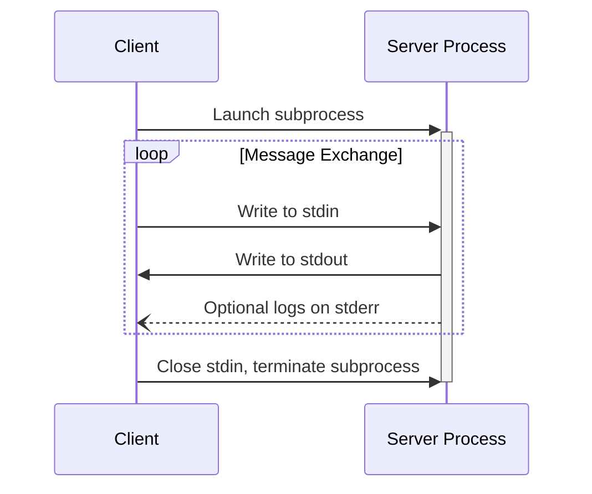
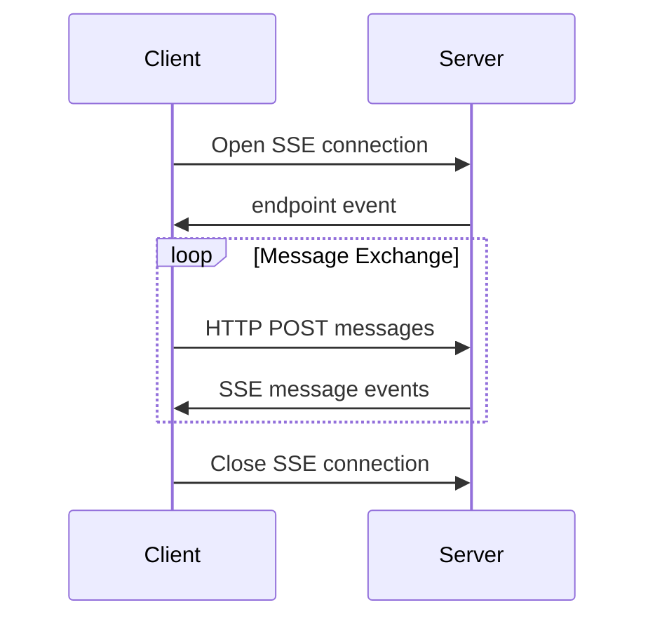

<Info>**プロトコル改訂**: 2024-11-05</Info>

MCPは現在、クライアントとサーバー間の通信のために2つの標準的なトランスポート方式を定義しています:

1. [stdio](#stdio)：標準入力および標準出力を用いた通信
2. [HTTP with Server-Sent Events](#http-with-sse)（SSE）

クライアントは、可能な限りstdioのサポートを行うことが**推奨されます**。

また、クライアントとサーバーが
[カスタムトランスポート](#custom-transports)をプラグイン可能な形で実装することもできます。

  ## stdio

「**stdio**」トランスポートでは:

- クライアントは MCPサーバー をサブプロセスとして起動します。
- サーバーは標準入力（`stdin`）で JSON-RPC メッセージを受け取り、標準出力（`stdout`）に
  応答を書き込みます。
- メッセージは改行で区切られ、埋め込みの改行を含めてはなりません（**MUST NOT**）。
- サーバーはログ目的で標準エラー（`stderr`）に UTF-8 文字列を書き込んでもかまいません（**MAY**）。
  クライアントはこのログを取得、転送、または無視してもかまいません（**MAY**）。
- サーバーは有効な MCP メッセージ以外を `stdout` に書き込んではなりません（**MUST NOT**）。
- クライアントは有効な MCP メッセージ以外をサーバーの `stdin` に書き込んではなりません（**MUST NOT**）。

  ## HTTP と SSE

**SSE** トランスポートでは、サーバーは独立したプロセスとして動作し、複数のクライアント接続を同時に処理できます。

  #### セキュリティ警告

SSEを用いたHTTPを実装する場合:

1. すべての受信接続について、DNSリバインディング攻撃を防ぐためにサーバーは`Origin`ヘッダーを**必ず**検証すること
2. ローカルで稼働させる場合、すべてのネットワークインターフェイス（0.0.0.0）ではなくlocalhost（127.0.0.1）のみにバインドすることが**推奨**されます
3. すべての接続に対して適切な認証を実装することが**推奨**されます

これらの対策がないと、攻撃者はDNSリバインディングを悪用して、リモートのウェブサイト経由でローカルのMCPサーバーとやり取りできてしまいます。

サーバーは**必ず**2つのエンドポイントを提供しなければなりません:

1. クライアントが接続を確立し、サーバーからメッセージを受信するためのSSEエンドポイント
2. クライアントがサーバーにメッセージを送信するための通常のHTTP POSTエンドポイント

クライアントが接続すると、サーバーはメッセージ送信用のURIを含む`endpoint`イベントを**必ず**送信しなければなりません。以降のクライアントからのメッセージは、すべてこのエンドポイントへのHTTP POSTリクエストとして**送信しなければなりません**。

サーバーからのメッセージは、イベントデータ内にJSONでエンコードされたメッセージ内容を含む、SSEの`message`イベントとして送信されます。

  ## カスタムトランスポート

クライアントとサーバーは、特定のニーズに合わせて追加のカスタムトランスポート機構を実装してもかまいません（MAY）。このプロトコルはトランスポートに依存せず、双方向のメッセージ交換をサポートするあらゆる通信チャネル上で実装できます。

カスタムトランスポートをサポートする実装者は、MCPで定義されたJSON-RPCのメッセージ形式およびライフサイクル要件を保持することを必ず保証しなければなりません（MUST）。相互運用性を高めるため、カスタムトランスポートは、接続確立手順やメッセージ交換パターンの詳細を文書化することが望まれます（SHOULD）。