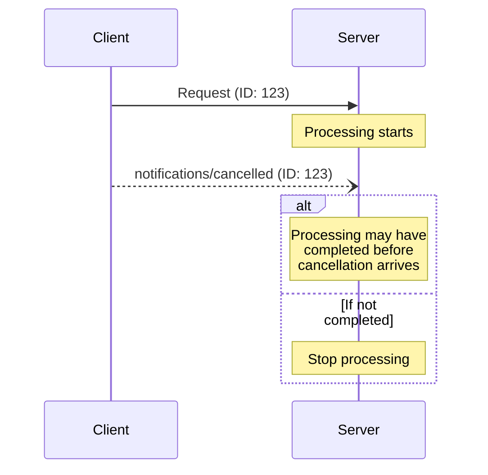

<Info>**プロトコル改訂**: 2024-11-05</Info>

Model Context Protocol（MCP）は、通知メッセージによって進行中のリクエストを任意でキャンセルできる機能をサポートします。
いずれの当事者からも、以前に発行されたリクエストの中止を指示するキャンセル通知を送信できます。

<div id="cancellation-flow">
  ## キャンセルフロー
</div>

いずれかの当事者が進行中のリクエストをキャンセルする場合は、`notifications/cancelled`
通知を送信し、次を含めます：

- キャンセル対象のリクエストID
- ログ出力や画面表示に利用できる任意の理由文字列

```json
{
  "jsonrpc": "2.0",
  "method": "notifications/cancelled",
  "params": {
    "requestId": "123",
    "reason": "User requested cancellation"
  }
}
```

<div id="behavior-requirements">
  ## 動作要件
</div>

1. 取消通知は、次の条件を満たすリクエストのみを参照しなければならない（MUST）:
   - 同じ方向で以前に発行された
   - まだ進行中であると見なされる
2. `initialize` リクエストは、クライアントが取り消してはならない（MUST NOT）
3. 取消通知の受信者は、次を行うべきである（SHOULD）:
   - 取り消されたリクエストの処理を停止する
   - 関連するリソースを解放する
   - 取り消されたリクエストに対して応答を送信しない
4. 受信者は、次の場合には取消通知を無視してもよい（MAY）:
   - 参照されたリクエストが不明である
   - 処理がすでに完了している
   - リクエストを取り消せない
5. 取消通知の送信者は、その後に到着した当該リクエストへのいかなる応答も無視すべきである（SHOULD）

<div id="timing-considerations">
  ## タイミングに関する考慮事項
</div>

ネットワークのレイテンシにより、キャンセル通知はリクエストの処理完了後、場合によってはすでにレスポンス送信後に到着することがあります。

双方は、これらのレースコンディションを適切に扱うことが**必須**です:



<div id="implementation-notes">
  ## 実装に関する注意
</div>

- 両者はデバッグのためにキャンセル理由を記録することが望ましい（SHOULD）
- アプリケーションのUIは、キャンセルが要求されたことを示すことが望ましい（SHOULD）

<div id="error-handling">
  ## エラーハンドリング
</div>

無効なキャンセル通知は無視するべきです（SHOULD）:

- 不明なリクエストID
- 既に完了したリクエスト
- 形式不正の通知

これにより、非同期通信でのレースコンディションを許容しつつ、通知の「送信して終わり（fire and forget）」という性質を維持できます。