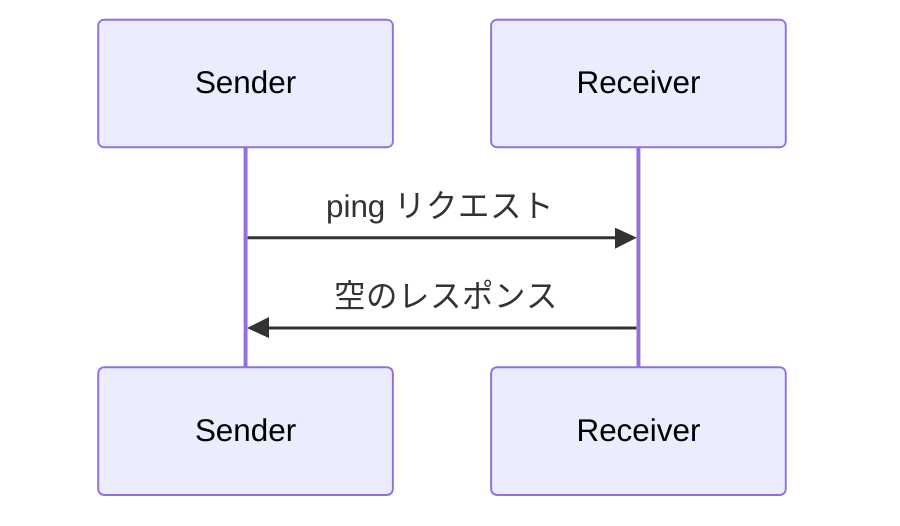

<Info>**プロトコル改訂**: 2024-11-05</Info>

Model Context Protocol（MCP）には、任意で利用できる ping メカニズムが含まれており、双方のいずれからでも、
相手が引き続き応答しており接続が維持されているかを確認できます。

<div id="overview">
  ## 概要
</div>

ping 機能はシンプルなリクエスト／レスポンスのパターンで実装されています。クライアントまたはサーバーのどちらからでも、`ping` リクエストを送信して ping を開始できます。

<div id="message-format">
  ## メッセージ形式
</div>

ping リクエストは、パラメータを持たない標準的な JSON-RPC リクエストです：

```json
{
  "jsonrpc": "2.0",
  "id": "123",
  "method": "ping"
}
```

<div id="behavior-requirements">
  ## 動作要件
</div>

1. 受信側は、空のレスポンスで速やかに応答しなければなりません（必須）:

```json
{
  "jsonrpc": "2.0",
  "id": "123",
  "result": {}
}
```

2. 合理的なタイムアウト期間内にレスポンスが得られない場合、送信側は（任意で）次を実施できます:
   - 接続が失効したと見なす
   - 接続を終了する
   - 再接続手順を試みる

<div id="usage-patterns">
  ## 利用パターン
</div>



<div id="implementation-considerations">
  ## 実装に関する考慮事項
</div>

- 実装は接続の健全性を確認するため、定期的に ping を送信することが推奨されます（SHOULD）
- ping の送信頻度は設定可能であることが推奨されます（SHOULD）
- タイムアウトはネットワーク環境に適した値とすることが推奨されます（SHOULD）
- ネットワークのオーバーヘッドを抑えるため、過度な ping の送信は避けることが推奨されます（SHOULD）

<div id="error-handling">
  ## エラーハンドリング
</div>

- タイムアウトは接続失敗として扱うべきです（SHOULD）
- 複数回の ping 失敗で接続をリセットしてもかまいません（MAY）
- 実装は診断のために ping 失敗をログ記録するべきです（SHOULD）