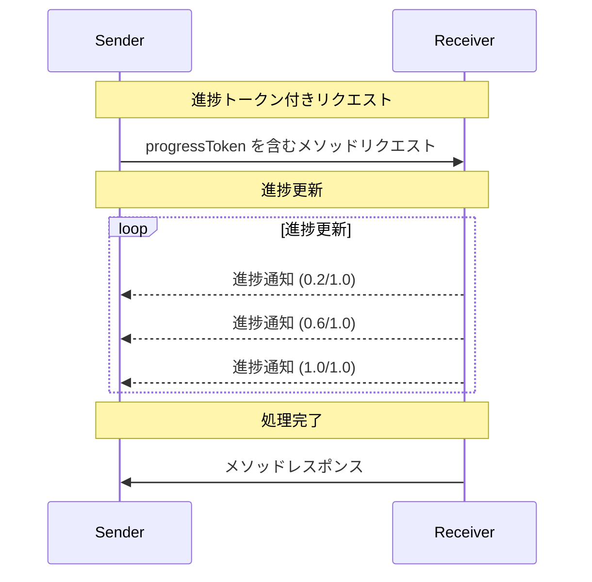

<Info>**プロトコル改訂**: 2024-11-05</Info>

Model Context Protocol（MCP）は、長時間実行される操作において、通知メッセージによる任意の進捗トラッキングをサポートします。どちらの側からでも、操作の状況に関する更新を提供するために進捗通知を送信できます。

<div id="progress-flow">
  ## 進捗フロー
</div>

ある当事者がリクエストの進捗更新を「受け取り」たい場合、リクエストのメタデータに
`progressToken` を含めます。

- 進捗トークンは文字列または整数値であることが**必須**です
- 進捗トークンは送信者が任意の方法で選択できますが、すべてのアクティブなリクエスト間で一意であることが**必須**です。

```json
{
  "jsonrpc": "2.0",
  "id": 1,
  "method": "some_method",
  "params": {
    "_meta": {
      "progressToken": "abc123"
    }
  }
}
```

受信者は、次を含む進捗通知を送信しても**よい**ものとします:

- 元の進捗トークン
- 現在までの進捗値
- 任意の「total」値

```json
{
  "jsonrpc": "2.0",
  "method": "notifications/progress",
  "params": {
    "progressToken": "abc123",
    "progress": 50,
    "total": 100
  }
}
```

- `progress` の値は、合計が不明であっても、通知のたびに増加することが**必須**です。
- `progress` および `total` の値は浮動小数点でも**可**です。

<div id="behavior-requirements">
  ## 動作要件
</div>

1. 進捗通知は、次の条件を満たすトークンのみを参照することが**必須**（MUST）です:
   - アクティブなリクエストで提供されたもの
   - 進行中の処理に関連付けられているもの

2. 進捗リクエストの受信側は**任意**（MAY）で次のようにできます:
   - 進捗通知を送信しない選択をしてよい
   - 適切と判断する任意の頻度で通知を送信してよい
   - 合計値が不明な場合は省略してよい



<div id="implementation-notes">
  ## 実装に関する注意事項
</div>

- 送信側と受信側は、アクティブな進捗トークンを追跡するべきです（SHOULD）
- 両者はフラッディングを防ぐため、レート制限を実装するべきです（SHOULD）
- 完了後は進捗通知を停止しなければなりません（MUST）