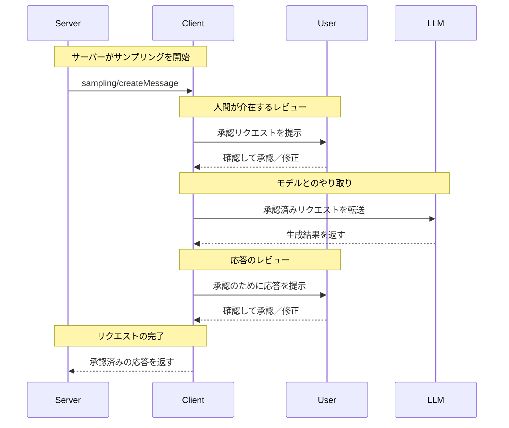

<Info>**プロトコル改訂**: 2024-11-05</Info>

Model Context Protocol（MCP）は、サーバーがクライアント経由で言語モデルに対して
サンプリング（「completions」や「generations」）を要求できるようにする標準化された方法を提供します。このフローにより、
クライアントはモデルへのアクセス、選択、権限を管理しつつ、サーバーはAI機能を活用できます（サーバー側のAPIキーは不要）。
サーバーはテキストまたは画像ベースのやり取りを要求でき、必要に応じて
プロンプトにMCPサーバー由来のコンテキストを含めることができます。

<div id="user-interaction-model">
  ## ユーザーインタラクションモデル
</div>

MCPにおけるサンプリングは、他のMCPサーバー機能の内部でLLM呼び出しを_ネスト_させることで、サーバーがエージェント的な振る舞いを実装できるようにします。

実装はニーズに合った任意のインターフェースパターンでサンプリングを提供して構いません。プロトコル自体は特定のユーザーインタラクションモデルを要求しません。

<Warning>
  トラスト＆セーフティおよびセキュリティの観点から、サンプリング要求を拒否できる権限を持つ人間が常に関与している**べき**です。

  アプリケーションは**次を満たすべきです**:

  * サンプリング要求を容易かつ直感的に確認できるUIを提供する
  * 送信前にプロンプトを閲覧・編集できるようにする
  * 生成された応答を配信前に確認用として提示する
</Warning>

<div id="capabilities">
  ## 機能
</div>

サンプリングをサポートするクライアントは、[初期化](/ja/specification/2024-11-05/basic/lifecycle#initialization)時に `sampling` 機能を宣言しなければなりません（MUST）:

```json
{
  "capabilities": {
    "sampling": {}
  }
}
```

<div id="protocol-messages">
  ## プロトコルメッセージ
</div>

<div id="creating-messages">
  ### メッセージの作成
</div>

言語モデルによる生成を要求するには、サーバーは `sampling/createMessage` リクエストを送信します。

**リクエスト:**

```json
{
  "jsonrpc": "2.0",
  "id": 1,
  "method": "sampling/createMessage",
  "params": {
    "messages": [
      {
        "role": "user",
        "content": {
          "type": "text",
          "text": "What is the capital of France?"
        }
      }
    ],
    "modelPreferences": {
      "hints": [
        {
          "name": "claude-3-sonnet"
        }
      ],
      "intelligencePriority": 0.8,
      "speedPriority": 0.5
    },
    "systemPrompt": "You are a helpful assistant.",
    "maxTokens": 100
  }
}
```

**レスポンス:**

```json
{
  "jsonrpc": "2.0",
  "id": 1,
  "result": {
    "role": "assistant",
    "content": {
      "type": "text",
      "text": "The capital of France is Paris."
    },
    "model": "claude-3-sonnet-20240307",
    "stopReason": "endTurn"
  }
}
```

<div id="message-flow">
  ## メッセージフロー
</div>



<div id="data-types">
  ## データ型
</div>

<div id="messages">
  ### メッセージ
</div>

サンプリングのメッセージには、次の内容を含められます:

<div id="text-content">
  #### テキスト内容
</div>

```json
{
  "type": "text",
  "text": "メッセージ本文"
}
```

<div id="image-content">
  #### 画像コンテンツ
</div>

```json
{
  "type": "image",
  "data": "base64-encoded-image-data",
  "mimeType": "image/jpeg"
}
```

<div id="model-preferences">
  ### モデルの優先設定
</div>

MCP におけるモデル選択は、サーバーとクライアントがそれぞれ異なる AI プロバイダーを利用し、提供モデルも異なりうるため、慎重な抽象化が必要です。クライアントがそのモデルにアクセスできない場合や、別のプロバイダーの同等モデルを使いたい場合があるため、サーバーは単にモデル名で特定のモデルを要求することはできません。

この課題に対処するために、MCP は抽象的な機能の優先度に、任意のモデルヒントを組み合わせる優先設定システムを実装しています。

<div id="capability-priorities">
  #### 機能優先度
</div>

サーバーは、正規化済みの3つの優先度（0〜1）で要件を表します:

* `costPriority`: コスト削減の重要度。値が高いほど安価なモデルを優先します。
* `speedPriority`: 低レイテンシの重要度。値が高いほど高速なモデルを優先します。
* `intelligencePriority`: 高度な能力の重要度。値が高いほど
  より高性能なモデルを優先します。

<div id="model-hints">
  #### モデルヒント
</div>

優先度は特性に基づくモデル選択に役立ちますが、`hints` はサーバーが
特定のモデルやモデルファミリーを提案するための仕組みです:

* ヒントは部分文字列として扱われ、モデル名に柔軟にマッチします
* 複数のヒントは優先順に評価されます
* クライアントは、異なるプロバイダーの同等モデルへヒントをマッピングしてもよい（MAY）
* ヒントは助言的情報であり、最終的なモデル選択はクライアントが行います

例:

```json
{
  "hints": [
    { "name": "claude-3-sonnet" }, // Sonnetクラスのモデルを優先
    { "name": "claude" } // 任意のClaudeモデルにフォールバック
  ],
  "costPriority": 0.3, // コストの重要度は低い
  "speedPriority": 0.8, // 速度の重要度は非常に高い
  "intelligencePriority": 0.5 // 要求能力は中程度
}
```

クライアントはこれらの優先設定を考慮して、利用可能な選択肢から適切なモデルを
選定します。例えば、クライアントがClaudeモデルにアクセスできず、Geminiにはアクセスできる場合、
類似する能力に基づいて sonnet のヒントを `gemini-1.5-pro` にマッピングすることがあります。

<div id="error-handling">
  ## エラー処理
</div>

クライアントは一般的な失敗ケースに対してエラーを返すことが望ましい（SHOULD）。

エラー例:

```json
{
  "jsonrpc": "2.0",
  "id": 1,
  "error": {
    "code": -1,
    "message": "User rejected sampling request"
  }
}
```

<div id="security-considerations">
  ## セキュリティ上の考慮事項
</div>

1. クライアントはユーザー承認の制御を実装することが望ましい（SHOULD）
2. 双方はメッセージ内容を検証することが望ましい（SHOULD）
3. クライアントはモデルの嗜好に関するヒントを尊重することが望ましい（SHOULD）
4. クライアントはレート制限を実装することが望ましい（SHOULD）
5. 双方は機微なデータを適切に取り扱うことが必須（MUST）