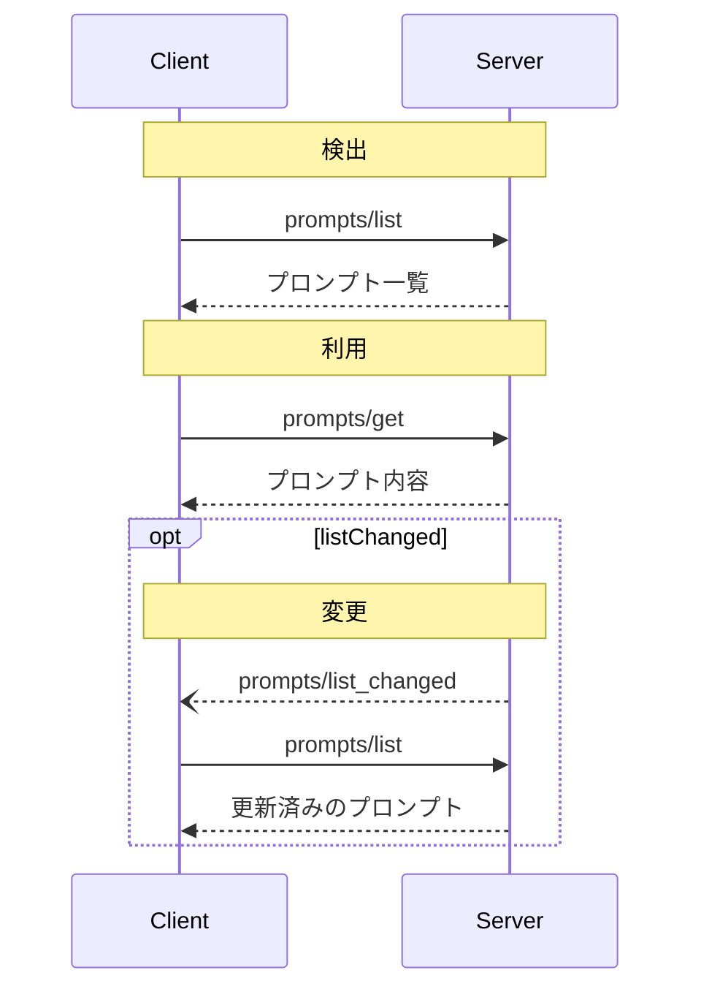

<Info>**プロトコル改訂日**: 2024-11-05</Info>

Model Context Protocol（MCP）は、サーバーがクライアントに対してプロンプト
テンプレートを公開できる標準化された方法を提供します。プロンプトにより、サーバーは言語モデルとのやり取りに必要な構造化メッセージや
指示を提供できます。クライアントは利用可能な
プロンプトを発見し、その内容を取得し、引数を渡してカスタマイズできます。

<div id="user-interaction-model">
  ## ユーザーインタラクションモデル
</div>

プロンプトはユーザー主導で制御されるように設計されています。つまり、サーバーからクライアントへ公開され、ユーザーが明示的に選んで利用できることを意図しています。

一般に、プロンプトはユーザーインターフェース上でユーザーが実行するコマンドによって起動され、これによりユーザーは利用可能なプロンプトを自然に見つけて呼び出せます。

たとえば、スラッシュコマンドとして:


ただし、実装者はニーズに合った任意のインターフェースパターンでプロンプトを公開して構いません。プロトコル自体は特定のユーザーインタラクションモデルを要求していません。

<div id="capabilities">
  ## 機能
</div>

プロンプトをサポートするサーバーは、[初期化](/ja/specification/2024-11-05/basic/lifecycle#initialization)時に `prompts` 機能を宣言する**必要があります**:

```json
{
  "capabilities": {
    "prompts": {
      "listChanged": true
    }
  }
}
```

`listChanged` は、利用可能なプロンプトの一覧が変更された際にサーバーが通知を発行するかどうかを示します。

<div id="protocol-messages">
  ## プロトコルメッセージ
</div>

<div id="listing-prompts">
  ### プロンプトの一覧取得
</div>

利用可能なプロンプトを取得するには、クライアントは `prompts/list` リクエストを送信します。この操作は
[ページネーション](/ja/specification/2024-11-05/server/utilities/pagination)
をサポートします。

**リクエスト:**

```json
{
  "jsonrpc": "2.0",
  "id": 1,
  "method": "prompts/list",
  "params": {
    "cursor": "optional-cursor-value"
  }
}
```

**レスポンス:**

```json
{
  "jsonrpc": "2.0",
  "id": 1,
  "result": {
    "prompts": [
      {
        "name": "code_review",
        "description": "LLM にコードの品質を分析し、改善案の提案を求めます",
        "arguments": [
          {
            "name": "code",
            "description": "レビュー対象のコード",
            "required": true
          }
        ]
      }
    ],
    "nextCursor": "next-page-cursor"
  }
}
```

<div id="getting-a-prompt">
  ### プロンプトの取得
</div>

特定のプロンプトを取得するには、クライアントは `prompts/get` リクエストを送信します。引数は[Completion API](/ja/specification/2024-11-05/server/utilities/completion)で自動補完できます。

**リクエスト:**

```json
{
  "jsonrpc": "2.0",
  "id": 2,
  "method": "prompts/get",
  "params": {
    "name": "code_review",
    "arguments": {
      "code": "def hello():\n    print('world')"
    }
  }
}
```

**レスポンス:**

```json
{
  "jsonrpc": "2.0",
  "id": 2,
  "result": {
    "description": "コードレビュー用プロンプト",
    "messages": [
      {
        "role": "user",
        "content": {
          "type": "text",
          "text": "次のPythonコードをレビューしてください:\ndef hello():\n    print('world')"
        }
      }
    ]
  }
}
```

<div id="list-changed-notification">
  ### リスト変更通知
</div>

利用可能なプロンプトのリストが変更された場合、`listChanged`
機能を宣言しているサーバーは通知を送信することが**推奨されます**:

```json
{
  "jsonrpc": "2.0",
  "method": "notifications/prompts/list_changed"
}
```

<div id="message-flow">
  ## メッセージフロー
</div>



<div id="data-types">
  ## データ型
</div>

<div id="prompt">
  ### プロンプト
</div>

プロンプト定義には次が含まれます:

* `name`: プロンプトの一意の識別子
* `description`: 任意の人間可読な説明
* `arguments`: カスタマイズ用の任意の引数リスト

<div id="promptmessage">
  ### プロンプトメッセージ
</div>

プロンプト内のメッセージには、次の項目を含められます:

* `role`: 話者を示す &quot;user&quot; または &quot;assistant&quot; のいずれか
* `content`: 次のいずれかのコンテンツタイプ

<div id="text-content">
  #### テキストコンテンツ
</div>

テキストコンテンツはプレーンテキストのメッセージを表します。

```json
{
  "type": "text",
  "text": "The text content of the message"
}
```

これは自然言語でのやり取りで最も一般的に使われるコンテンツタイプです。

<div id="image-content">
  #### 画像コンテンツ
</div>

画像コンテンツを使うと、メッセージに視覚情報を含められます：

```json
{
  "type": "image",
  "data": "base64-encoded-image-data",
  "mimeType": "image/png"
}
```

画像データは必ずbase64でエンコードし、有効なMIMEタイプを指定する必要があります。これにより、視覚的な文脈が重要なマルチモーダルなやり取りが可能になります。

<div id="embedded-resources">
  #### 埋め込みリソース
</div>

埋め込みリソースを使用すると、メッセージ内でサーバー側のリソースを直接参照できます。

```json
{
  "type": "resource",
  "resource": {
    "uri": "resource://example",
    "mimeType": "text/plain",
    "text": "Resource content"
  }
}
```

リソースにはテキストまたはバイナリ（ブロブ）データのいずれかを含めることができ、以下を**必ず**含める必要があります。

* 有効なリソースURI
* 適切なMIMEタイプ
* テキストコンテンツまたは base64 エンコードのブロブデータのいずれか

埋め込みリソースにより、プロンプトはサーバー管理のコンテンツ（ドキュメント、コードサンプル、その他の参照資料など）を、会話フローにシームレスに直接取り込めます。

<div id="error-handling">
  ## エラー処理
</div>

サーバーは、一般的な失敗ケースに対して標準のJSON-RPCエラーを返すべきです（SHOULD）:

* 無効なプロンプト名: `-32602`（無効なパラメータ）
* 必須引数の不足: `-32602`（無効なパラメータ）
* 内部エラー: `-32603`（内部エラー）

<div id="implementation-considerations">
  ## 実装に関する考慮事項
</div>

1. サーバーは処理前にプロンプトの引数を検証することが望ましい
2. クライアントは大規模なプロンプト一覧に対してページネーションを適切に処理することが望ましい
3. 双方は機能ネゴシエーションを尊重することが望ましい

<div id="security">
  ## セキュリティ
</div>

インジェクション攻撃やリソースへの不正アクセスを防ぐため、実装はすべてのプロンプトの入力と出力を厳密に検証しなければなりません。