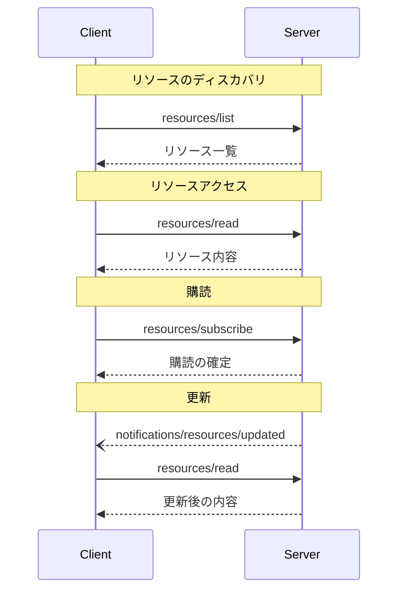

<Info>**プロトコル改訂**: 2024-11-05</Info>

Model Context Protocol（MCP）は、サーバーがクライアントに
リソースを公開するための標準化された手段を提供します。リソースにより、サーバーは
ファイル、データベースのスキーマ、アプリケーション固有の情報など、言語モデルに文脈を与えるデータを共有できます。
各リソースは固有の
[URI](https://datatracker.ietf.org/doc/html/rfc3986) によって識別されます。

<div id="user-interaction-model">
  ## ユーザーインタラクションモデル
</div>

MCPのリソースは、ホストアプリケーションがニーズに応じてコンテキストの取り込み方を決める、いわば**アプリケーション主導**の設計になっています。

例えば、アプリケーションは次のようなことができます:

* ツリー表示やリスト表示などのUI要素でリソースを提示し、明示的に選択できるようにする
* 利用可能なリソースをユーザーが検索・フィルターできるようにする
* ヒューリスティックやAIモデルの選択に基づいてコンテキストを自動的に取り込む


ただし、実装はニーズに合った任意のインターフェースパターンでリソースを公開できます。プロトコル自体は特定のユーザーインタラクションモデルを規定しません。

<div id="capabilities">
  ## 機能
</div>

リソースをサポートするサーバーは、`resources` 機能を宣言することが必須です（MUST）:

```json
{
  "capabilities": {
    "resources": {
      "subscribe": true,
      "listChanged": true
    }
  }
}
```

この機能は次の2つの任意機能をサポートします:

* `subscribe`: クライアントが個々のリソースの変更に関する通知を購読できるかどうか。
* `listChanged`: 利用可能なリソース一覧が変更された際に、サーバーが通知を送信するかどうか。

`subscribe` と `listChanged` はどちらも任意です—サーバーはどちらもサポートしない、片方のみ、または両方をサポートできます:

```json
{
  "capabilities": {
    "resources": {} // Neither feature supported
  }
}
```

```json
{
  "capabilities": {
    "resources": {
      "subscribe": true // Only subscriptions supported
    }
  }
}
```

```json
{
  "capabilities": {
    "resources": {
      "listChanged": true // Only list change notifications supported
    }
  }
}
```

<div id="protocol-messages">
  ## プロトコルメッセージ
</div>

<div id="listing-resources">
  ### リソースの一覧表示
</div>

利用可能なリソースを取得するには、クライアントは `resources/list` リクエストを送信します。この操作は
[ページネーション](/ja/specification/2024-11-05/server/utilities/pagination)
に対応しています。

**リクエスト:**

```json
{
  "jsonrpc": "2.0",
  "id": 1,
  "method": "resources/list",
  "params": {
    "cursor": "optional-cursor-value"
  }
}
```

**レスポンス:**

```json
{
  "jsonrpc": "2.0",
  "id": 1,
  "result": {
    "resources": [
      {
        "uri": "file:///project/src/main.rs",
        "name": "main.rs",
        "description": "Primary application entry point",
        "mimeType": "text/x-rust"
      }
    ],
    "nextCursor": "next-page-cursor"
  }
}
```

<div id="reading-resources">
  ### リソースの読み取り
</div>

リソースの内容を取得するには、クライアントは `resources/read` リクエストを送信します。

**リクエスト:**

```json
{
  "jsonrpc": "2.0",
  "id": 2,
  "method": "resources/read",
  "params": {
    "uri": "file:///project/src/main.rs"
  }
}
```

**レスポンス:**

```json
{
  "jsonrpc": "2.0",
  "id": 2,
  "result": {
    "contents": [
      {
        "uri": "file:///project/src/main.rs",
        "mimeType": "text/x-rust",
        "text": "fn main() {\n    println!(\"Hello world!\");\n}"
      }
    ]
  }
}
```

<div id="resource-templates">
  ### リソーステンプレート
</div>

リソーステンプレートを使うと、サーバーは[URIテンプレート](https://datatracker.ietf.org/doc/html/rfc6570)に基づくパラメータ化されたリソースを公開できます。引数は[補完API](/ja/specification/2024-11-05/server/utilities/completion)によって自動補完される場合があります。

**リクエスト:**

```json
{
  "jsonrpc": "2.0",
  "id": 3,
  "method": "resources/templates/list"
}
```

**レスポンス:**

```json
{
  "jsonrpc": "2.0",
  "id": 3,
  "result": {
    "resourceTemplates": [
      {
        "uriTemplate": "file:///{path}",
        "name": "Project Files",
        "description": "プロジェクトディレクトリ内のファイルにアクセス",
        "mimeType": "application/octet-stream"
      }
    ]
  }
}
```

<div id="list-changed-notification">
  ### リスト変更通知
</div>

利用可能なリソースの一覧が変更された場合、`listChanged`
ケイパビリティを宣言しているサーバーは通知を送信する**べきです**。

```json
{
  "jsonrpc": "2.0",
  "method": "notifications/resources/list_changed"
}
```

<div id="subscriptions">
  ### サブスクリプション
</div>

このプロトコルは、リソースの変更に対する任意のサブスクリプションをサポートします。クライアントは特定のリソースを購読し、変更があった際に通知を受け取れます:

**購読リクエスト:**

```json
{
  "jsonrpc": "2.0",
  "id": 4,
  "method": "resources/subscribe",
  "params": {
    "uri": "file:///project/src/main.rs"
  }
}
```

**更新通知:**

```json
{
  "jsonrpc": "2.0",
  "method": "notifications/resources/updated",
  "params": {
    "uri": "file:///project/src/main.rs"
  }
}
```

<div id="message-flow">
  ## メッセージフロー
</div>



<div id="data-types">
  ## データタイプ
</div>

<div id="resource">
  ### リソース
</div>

リソース定義には次が含まれます:

* `uri`: リソースの一意識別子
* `name`: 人間が読める名称
* `description`: 任意の説明
* `mimeType`: 任意のMIMEタイプ

<div id="resource-contents">
  ### リソースの内容
</div>

リソースにはテキストまたはバイナリのいずれかのデータを含められます。

<div id="text-content">
  #### テキスト内容
</div>

```json
{
  "uri": "file:///example.txt",
  "mimeType": "text/plain",
  "text": "Resource content"
}
```

<div id="binary-content">
  #### バイナリコンテンツ
</div>

```json
{
  "uri": "file:///example.png",
  "mimeType": "image/png",
  "blob": "base64-encoded-data"
}
```

<div id="common-uri-schemes">
  ## 一般的なURIスキーム
</div>

このプロトコルはいくつかの標準的なURIスキームを定義しています。この一覧は網羅的ではありません。実装では、必要に応じて追加のカスタムURIスキームを自由に使用できます。

<div id="https">
  ### https://
</div>

ウェブ上で利用可能なリソースを表すために使用します。

クライアントがそのリソースをウェブから直接取得して読み込める場合にのみ、サーバーはこのスキームを使用するべきです（SHOULD）。つまり、MCPサーバー経由でリソースを読む必要がない場合に限ります。

それ以外の用途では、たとえサーバー自身がインターネット経由でリソース内容をダウンロードする場合でも、サーバーは別のURIスキームを使用するか、カスタムスキームを定義することを優先すべきです（SHOULD）。

<div id="file">
  ### file://
</div>

ファイルシステムのように振る舞うリソースを識別するために使用します。ただし、リソースが実際の物理的なファイルシステムに対応している必要はありません。

MCPサーバーは、標準的なMIMEタイプが存在しない非正規ファイル（ディレクトリなど）を表すために、`inode/directory` のような
[XDG MIME type](https://specifications.freedesktop.org/shared-mime-info-spec/0.14/ar01s02.html#id-1.3.14)
で file:// リソースを識別してもかまいません（MAY）。

<div id="git">
  ### git://
</div>

Git バージョン管理との統合。

<div id="error-handling">
  ## エラー処理
</div>

サーバーは一般的な失敗ケースに対して、標準のJSON-RPCエラーを返すべきです（SHOULD）:

* リソースが見つからない: `-32002`
* 内部エラー: `-32603`

エラー例:

```json
{
  "jsonrpc": "2.0",
  "id": 5,
  "error": {
    "code": -32002,
    "message": "Resource not found",
    "data": {
      "uri": "file:///nonexistent.txt"
    }
  }
}
```

<div id="security-considerations">
  ## セキュリティ上の考慮事項
</div>

1. サーバーはすべてのリソースURIを必ず検証すること
2. 機微なリソースにはアクセス制御を実装することが望ましい
3. バイナリデータは適切にエンコードすることを必須とする
4. 操作の前にリソースの権限を確認することが望ましい